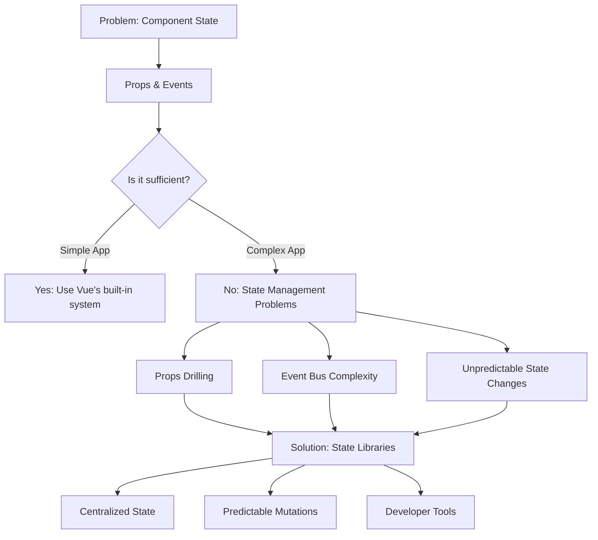
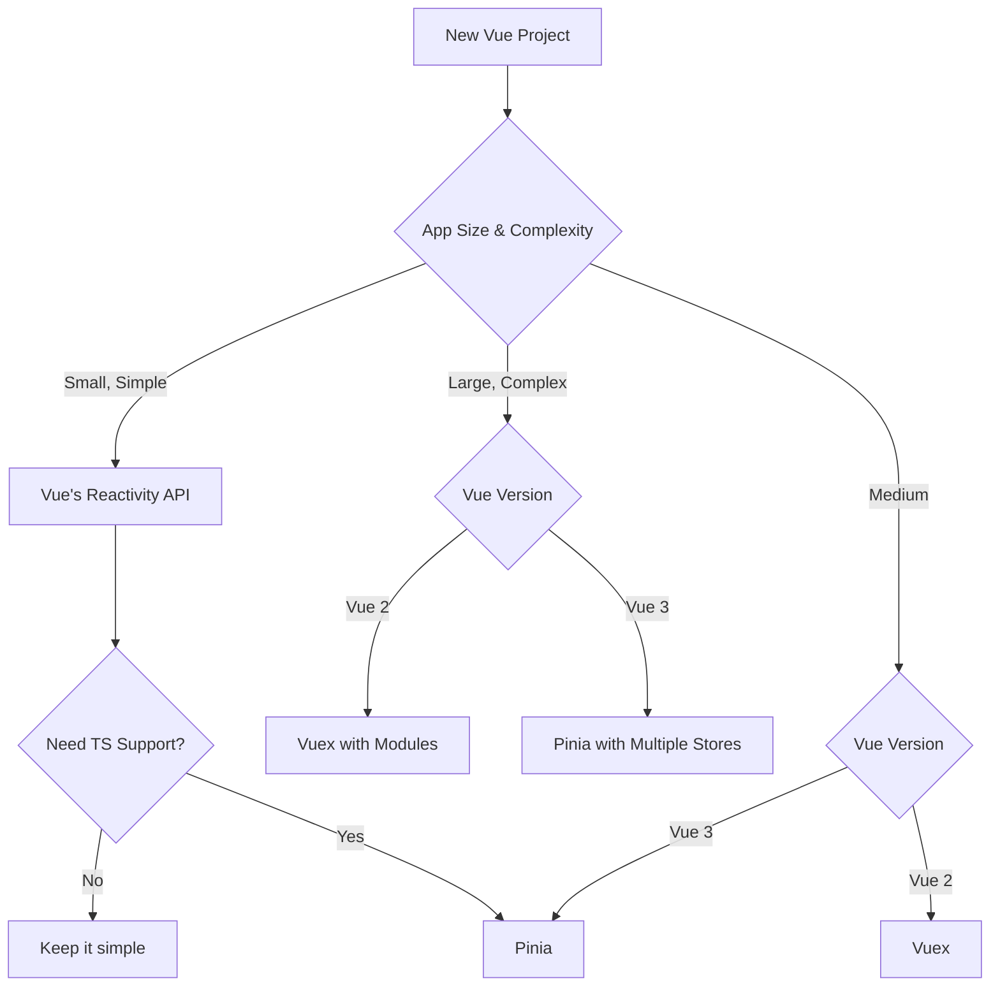

# Vue.js State Libraries

## Introduction

In the world of Vue.js applications, managing state effectively becomes increasingly important as your application grows. State management refers to how we handle the data that needs to be shared across multiple components in our application.

While Vue's built-in reactivity system works well for simple applications, larger applications with complex state interactions often benefit from dedicated state management solutions. These libraries provide a more structured approach to handling state, making your application more maintainable and easier to debug.

In this guide, we'll explore the most popular state management libraries in the Vue.js ecosystem:

- **Vuex**: The official state management library for Vue 2
- **Pinia**: The new recommended state management library for Vue 3
- **Other alternatives**: Lighter options for simpler applications

## Why Use a State Management Library?

Before diving into specific libraries, let's understand why you might need a dedicated state management solution:



As your application grows, passing props and events between components becomes cumbersome. You might encounter:

1. **Props drilling**: Passing props through multiple levels of components
2. **Complex event handling**: Difficulty tracking events between distant components
3. **Inconsistent state**: Different components having different versions of the same data

State management libraries solve these problems by providing a centralized store for your data that any component can access directly.

## Vuex: The Classic State Management Solution

Vuex was the official state management library for Vue.js applications for years, particularly in the Vue 2 era. It provides a centralized store for all components in an application, with rules ensuring that state mutations are predictable and traceable.

### Key Concepts in Vuex

- **State**: The central source of truth (your data)
- **Getters**: Computed properties for the store
- **Mutations**: The only way to change state (synchronous)
- **Actions**: Similar to mutations but can be asynchronous
- **Modules**: Way to split the store into manageable chunks

### Basic Vuex Implementation

Let's look at a simple counter example with Vuex:

```javascript
import Vue from 'vue'
import Vuex from 'vuex'

Vue.use(Vuex)

// Create store
const store = new Vuex.Store({
  state: {
    count: 0
  },
  mutations: {
    increment(state) {
      state.count++
    },
    decrement(state) {
      state.count--
    }
  },
  actions: {
    incrementAsync({ commit }) {
      setTimeout(() => {
        commit('increment')
      }, 1000)
    }
  },
  getters: {
    doubleCount(state) {
      return state.count * 2
    }
  }
})

// Usage in component
export default {
  computed: {
    count() {
      return this.$store.state.count
    },
    doubleCount() {
      return this.$store.getters.doubleCount
    }
  },
  methods: {
    increment() {
      this.$store.commit('increment')
    },
    incrementAsync() {
      this.$store.dispatch('incrementAsync')
    }
  }
}
```

### Practical Example: Todo List with Vuex

Here's a more practical example implementing a Todo List application with Vuex:

```javascript
// store/index.js
import Vue from 'vue'
import Vuex from 'vuex'

Vue.use(Vuex)

export default new Vuex.Store({
  state: {
    todos: []
  },
  mutations: {
    ADD_TODO(state, todo) {
      state.todos.push(todo)
    },
    TOGGLE_TODO(state, todoId) {
      const todo = state.todos.find(todo => todo.id === todoId)
      if (todo) {
        todo.completed = !todo.completed
      }
    },
    DELETE_TODO(state, todoId) {
      state.todos = state.todos.filter(todo => todo.id !== todoId)
    }
  },
  actions: {
    addTodo({ commit }, todoText) {
      const todo = {
        id: Date.now(),
        text: todoText,
        completed: false
      }
      commit('ADD_TODO', todo)
    },
    toggleTodo({ commit }, todoId) {
      commit('TOGGLE_TODO', todoId)
    },
    deleteTodo({ commit }, todoId) {
      commit('DELETE_TODO', todoId)
    }
  },
  getters: {
    completedTodos(state) {
      return state.todos.filter(todo => todo.completed)
    },
    pendingTodos(state) {
      return state.todos.filter(todo => !todo.completed)
    }
  }
})
```

Todo list component using this store:

```html
<template>
  <div>
    <h1>Todo List</h1>
    
    <form @submit.prevent="addTodo">
      <input v-model="newTodo" placeholder="Add a new task" />
      <button type="submit">Add</button>
    </form>
    
    <h2>Tasks ({{ todos.length }})</h2>
    <ul>
      <li v-for="todo in todos" :key="todo.id" :class="{ completed: todo.completed }">
        <input type="checkbox" :checked="todo.completed" @change="toggleTodo(todo.id)" />
        {{ todo.text }}
        <button @click="deleteTodo(todo.id)">Delete</button>
      </li>
    </ul>
    
    <div class="summary">
      <p>Completed: {{ completedTodos.length }}</p>
      <p>Pending: {{ pendingTodos.length }}</p>
    </div>
  </div>
</template>

<script>
export default {
  data() {
    return {
      newTodo: ''
    }
  },
  computed: {
    todos() {
      return this.$store.state.todos
    },
    completedTodos() {
      return this.$store.getters.completedTodos
    },
    pendingTodos() {
      return this.$store.getters.pendingTodos
    }
  },
  methods: {
    addTodo() {
      if (this.newTodo.trim()) {
        this.$store.dispatch('addTodo', this.newTodo)
        this.newTodo = ''
      }
    },
    toggleTodo(id) {
      this.$store.dispatch('toggleTodo', id)
    },
    deleteTodo(id) {
      this.$store.dispatch('deleteTodo', id)
    }
  }
}
</script>

<style scoped>
.completed {
  text-decoration: line-through;
  color: #888;
}
</style>
```

## Pinia: The Modern State Management Library

Pinia is the new recommended state management library for Vue applications, especially for Vue 3. It was created by a member of the Vue core team and is designed to be more intuitive and devtools-friendly than Vuex.

Key advantages of Pinia include:

- More straightforward API with less boilerplate
- Better TypeScript support
- No mutations concept - simplified to actions only
- No modules configuration - stores are naturally modular
- Lighter bundle size

### Basic Pinia Implementation

Let's recreate our counter example with Pinia:

```javascript
// store.js
import { defineStore } from 'pinia'

// Define a store
export const useCounterStore = defineStore('counter', {
  // state is like data in a component
  state: () => ({
    count: 0
  }),
  // getters are like computed properties
  getters: {
    doubleCount: (state) => state.count * 2
  },
  // actions are like methods
  actions: {
    increment() {
      this.count++
    },
    decrement() {
      this.count--
    },
    incrementAsync() {
      setTimeout(() => {
        this.increment()
      }, 1000)
    }
  }
})
```

Using it in a component is straightforward:

```html
<template>
  <div>
    <p>Count: {{ counter.count }}</p>
    <p>Double: {{ counter.doubleCount }}</p>
    <button @click="counter.increment()">Increment</button>
    <button @click="counter.decrement()">Decrement</button>
    <button @click="counter.incrementAsync()">Increment Async</button>
  </div>
</template>

<script>
import { useCounterStore } from './store'

export default {
  setup() {
    const counter = useCounterStore()
    
    return {
      counter
    }
  }
}
</script>
```

With Vue 3's Composition API, you can also destructure the store:

```html
<script setup>
import { useCounterStore } from './store'
import { storeToRefs } from 'pinia'

const counter = useCounterStore()
// Use storeToRefs to maintain reactivity when destructuring state or getters
const { count, doubleCount } = storeToRefs(counter)
// Actions can be destructured directly
const { increment, incrementAsync } = counter
</script>

<template>
  <div>
    <p>Count: {{ count }}</p>
    <p>Double: {{ doubleCount }}</p>
    <button @click="increment()">Increment</button>
    <button @click="incrementAsync()">Increment Async</button>
  </div>
</template>
```

### Practical Example: Todo List with Pinia

Here's how you might implement the same Todo List application with Pinia:

```javascript
// stores/todoStore.js
import { defineStore } from 'pinia'

export const useTodoStore = defineStore('todos', {
  state: () => ({
    todos: []
  }),
  getters: {
    completedTodos: (state) => state.todos.filter(todo => todo.completed),
    pendingTodos: (state) => state.todos.filter(todo => !todo.completed)
  },
  actions: {
    addTodo(text) {
      const todo = {
        id: Date.now(),
        text,
        completed: false
      }
      this.todos.push(todo)
    },
    toggleTodo(id) {
      const todo = this.todos.find(todo => todo.id === id)
      if (todo) {
        todo.completed = !todo.completed
      }
    },
    deleteTodo(id) {
      this.todos = this.todos.filter(todo => todo.id !== id)
    }
  }
})
```

Todo list component using Pinia:

```html
<script setup>
import { ref } from 'vue'
import { useTodoStore } from '../stores/todoStore'
import { storeToRefs } from 'pinia'

const todoStore = useTodoStore()
const { todos, completedTodos, pendingTodos } = storeToRefs(todoStore)
const { addTodo, toggleTodo, deleteTodo } = todoStore

const newTodo = ref('')

function handleAddTodo() {
  if (newTodo.value.trim()) {
    addTodo(newTodo.value)
    newTodo.value = ''
  }
}
</script>

<template>
  <div>
    <h1>Todo List</h1>
    
    <form @submit.prevent="handleAddTodo">
      <input v-model="newTodo" placeholder="Add a new task" />
      <button type="submit">Add</button>
    </form>
    
    <h2>Tasks ({{ todos.length }})</h2>
    <ul>
      <li v-for="todo in todos" :key="todo.id" :class="{ completed: todo.completed }">
        <input type="checkbox" :checked="todo.completed" @change="toggleTodo(todo.id)" />
        {{ todo.text }}
        <button @click="deleteTodo(todo.id)">Delete</button>
      </li>
    </ul>
    
    <div class="summary">
      <p>Completed: {{ completedTodos.length }}</p>
      <p>Pending: {{ pendingTodos.length }}</p>
    </div>
  </div>
</template>

<style scoped>
.completed {
  text-decoration: line-through;
  color: #888;
}
</style>
```

## Alternative State Management Approaches

While Vuex and Pinia are the most popular choices, there are other approaches for state management in Vue applications:

### 1. Vue's Built-in Reactivity API

For smaller applications or specific components, Vue's built-in reactivity system might be sufficient:

```javascript
// store.js
import { reactive, computed } from 'vue'

const state = reactive({
  count: 0,
  todos: []
})

const getters = {
  doubleCount: computed(() => state.count * 2),
  completedTodos: computed(() => state.todos.filter(todo => todo.completed))
}

const actions = {
  incrementCount() {
    state.count++
  },
  addTodo(text) {
    state.todos.push({
      id: Date.now(),
      text,
      completed: false
    })
  }
}

export default { state, getters, actions }
```

Usage in component:

```html
<script setup>
import store from './store'

const { state, getters, actions } = store
</script>

<template>
  <div>
    <p>Count: {{ state.count }}</p>
    <p>Double count: {{ getters.doubleCount }}</p>
    <button @click="actions.incrementCount">Increment</button>
  </div>
</template>
```

### 2. Provide/Inject

Vue's dependency injection system can be used for simpler state management:

```html
<!-- Parent.vue -->
<script setup>
import { provide, reactive } from 'vue'

const state = reactive({
  user: {
    name: 'John Doe',
    role: 'Admin'
  }
})

provide('userState', state)
</script>

<!-- Child.vue (can be nested deeply) -->
<script setup>
import { inject } from 'vue'

const userState = inject('userState')
</script>

<template>
  <div>
    <p>User: {{ userState.user.name }}</p>
    <p>Role: {{ userState.user.role }}</p>
  </div>
</template>
```

### 3. Vuex ORM

For applications with complex relational data, Vuex ORM provides an object-relational mapping access to your Vuex store:

```javascript
import Vue from 'vue'
import Vuex from 'vuex'
import VuexORM from '@vuex-orm/core'
import User from './models/User'
import Post from './models/Post'

Vue.use(Vuex)

// Create a new database instance
const database = new VuexORM.Database()

// Register Models
database.register(User)
database.register(Post)

// Create Vuex Store and register database through Vuex ORM
const store = new Vuex.Store({
  plugins: [VuexORM.install(database)]
})

export default store
```

## Choosing the Right State Management Solution

Here's a guide to help you choose the right state management solution for your Vue.js application:



- **Small Applications**: Vue's built-in reactivity system or provide/inject
- **Medium Applications**: Pinia for Vue 3, Vuex for Vue 2
- **Large Applications**: Pinia with multiple stores for Vue 3, Vuex with modules for Vue 2
- **Applications with Complex Relations**: Consider Vuex ORM

## Summary

State management is a crucial aspect of building maintainable Vue.js applications. In this guide, we've explored:

- **Vuex**: The traditional state management library with state, getters, mutations, and actions
- **Pinia**: The modern, more intuitive alternative with simplified concepts and better TypeScript support
- **Alternative approaches**: Using Vue's reactivity API, provide/inject, or specialized tools like Vuex ORM

When choosing a state management solution:
1. Consider your application's size and complexity
2. Evaluate your team's familiarity with the options
3. Think about future scalability needs
4. Consider TypeScript support if relevant

For new Vue 3 projects, Pinia is generally the recommended choice due to its simpler API, better TypeScript support, and official endorsement from the Vue team.

## Additional Resources

To deepen your understanding of state management in Vue.js, consider exploring these resources:

- [Official Pinia Documentation](https://pinia.vuejs.org/)
- [Official Vuex Documentation](https://vuex.vuejs.org/)
- [Vue 3 Composition API Documentation](https://v3.vuejs.org/guide/composition-api-introduction.html)
- [Vue Mastery Pinia Course](https://www.vuemastery.com/courses/pinia-fundamentals/)

## Exercises

1. Convert a simple Vue application that uses `data()` properties to use Pinia for state management.
2. Create a shopping cart using Pinia with the following features:
   - Add/remove items
   - Update quantities
   - Calculate total price
3. Implement persistent state by saving your Pinia store to localStorage.
4. Create an authentication system using Pinia that manages user login state.
5. Compare the bundle size and performance between a Vuex implementation and a Pinia implementation of the same feature.