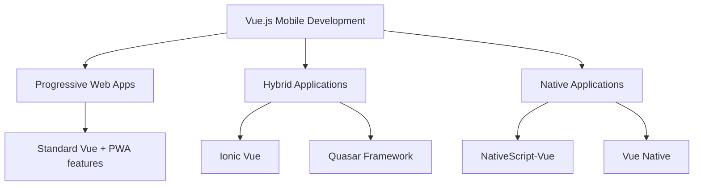

# Vue.js Mobile Development

## Introduction

Mobile development with Vue.js has evolved significantly, allowing developers to leverage their Vue knowledge to build mobile applications. Whether you're looking to create native-like experiences or truly native apps, the Vue.js ecosystem offers several frameworks and tools to support mobile development.

In this guide, we'll explore the various approaches to mobile development using Vue.js, compare popular frameworks, and provide practical examples to get you started on your mobile development journey.

## Understanding Vue.js Mobile Development Approaches

Vue.js mobile development generally falls into three categories:



Let's explore each approach in detail:

### 1. Progressive Web Apps (PWAs)

PWAs are web applications that use modern web capabilities to provide a mobile app-like experience. With Vue.js, creating PWAs is straightforward.

#### Setting up a Vue.js PWA

You can set up a PWA with Vue CLI:

```bash
vue create my-pwa-app
cd my-pwa-app
vue add pwa
```

This adds PWA capabilities to your Vue application. The generated service worker provides features like caching, offline support, and push notifications.

#### Key files in a Vue PWA

`manifest.json` is a crucial file that defines how your app appears to users:

```json
{
  "name": "My Vue PWA",
  "short_name": "Vue PWA",
  "theme_color": "#4DBA87",
  "icons": [
    {
      "src": "./img/icons/android-chrome-192x192.png",
      "sizes": "192x192",
      "type": "image/png"
    },
    {
      "src": "./img/icons/android-chrome-512x512.png",
      "sizes": "512x512",
      "type": "image/png"
    }
  ],
  "start_url": ".",
  "display": "standalone",
  "background_color": "#000000"
}
```

### 2. Hybrid Applications

Hybrid apps use web technologies wrapped in a native container, allowing a single codebase to run on different platforms.

#### Ionic Vue

Ionic Vue combines the UI components of Ionic with Vue.js, offering a rich set of pre-designed mobile components.

Installation:

```bash
npm install -g @ionic/cli
ionic start my-ionic-vue-app blank --type vue
cd my-ionic-vue-app
ionic serve
```

A simple Ionic Vue component:

```jsx
<template>
  <ion-page>
    <ion-header>
      <ion-toolbar>
        <ion-title>My Ionic Vue App</ion-title>
      </ion-toolbar>
    </ion-header>
    <ion-content class="ion-padding">
      <h1>Hello Ionic Vue</h1>
      <ion-button @click="increment">
        Count: {{ count }}
      </ion-button>
    </ion-content>
  </ion-page>
</template>

<script>
import { IonPage, IonHeader, IonToolbar, IonTitle, IonContent, IonButton } from '@ionic/vue';
import { defineComponent, ref } from 'vue';

export default defineComponent({
  components: { IonPage, IonHeader, IonToolbar, IonTitle, IonContent, IonButton },
  setup() {
    const count = ref(0);
    const increment = () => {
      count.value++;
    };

    return {
      count,
      increment
    };
  }
});
</script>
```

#### Quasar Framework

Quasar is a Vue.js framework that allows you to build responsive websites, PWAs, mobile apps, and desktop apps from the same codebase.

Installation:

```bash
npm install -g @quasar/cli
npm init quasar
```

A simple Quasar component:

```jsx
<template>
  <q-page class="flex flex-center">
    <div class="column items-center">
      <h5>Welcome to Quasar</h5>
      <q-btn
        color="primary"
        @click="counter++"
        label="Clicked {{ counter }} times"
      />
    </div>
  </q-page>
</template>

<script>
import { defineComponent, ref } from 'vue';

export default defineComponent({
  name: 'IndexPage',
  setup() {
    const counter = ref(0);
    return { counter };
  }
});
</script>
```

### 3. Native Applications

Native Vue.js frameworks compile your Vue code to native UI components, offering better performance and full access to native APIs.

#### NativeScript-Vue

NativeScript-Vue allows you to build truly native mobile applications using Vue.js, with direct access to the native platform APIs.

Installation:

```bash
npm install -g nativescript
ns create my-ns-vue-app --vue
cd my-ns-vue-app
ns run android # or ns run ios
```

A basic NativeScript-Vue component:

```jsx
<template>
  <Page>
    <ActionBar title="Welcome to NativeScript-Vue!" />
    <StackLayout>
      <Label :text="`Tapped ${count} times`" class="message" textWrap="true" />
      <Button text="Tap me!" @tap="incrementCount" />
    </StackLayout>
  </Page>
</template>

<script>
export default {
  data() {
    return {
      count: 0
    };
  },
  methods: {
    incrementCount() {
      this.count++;
    }
  }
};
</script>

<style scoped>
.message {
  font-size: 20;
  color: #333333;
  text-align: center;
  margin: 20;
}
</style>
```

#### Vue Native (Using React Native)

Vue Native is a framework for building native mobile apps using Vue.js syntax on top of React Native. (Note: As of 2023, Vue Native is not actively maintained).

Installation:

```bash
npm install -g vue-native-cli
npm install -g react-native-cli
vue-native init my-vue-native-app
cd my-vue-native-app
npm start
```

A simple Vue Native component:

```jsx
<template>
  <view class="container">
    <text class="welcome">Hello, Vue Native!</text>
    <text class="count">You clicked {{ count }} times</text>
    <touchable-opacity class="button" @press="increment">
      <text class="buttonText">Press me!</text>
    </touchable-opacity>
  </view>
</template>

<script>
export default {
  data() {
    return {
      count: 0
    };
  },
  methods: {
    increment() {
      this.count++;
    }
  }
};
</script>

<style>
.container {
  flex: 1;
  justifyContent: center;
  alignItems: center;
  backgroundColor: '#F5FCFF'
}
.welcome {
  fontSize: 20;
  textAlign: 'center';
  margin: 10
}
.count {
  textAlign: 'center';
  color: '#333333';
  marginBottom: 20
}
.button {
  backgroundColor: '#42b883';
  padding: 10;
  borderRadius: 5
}
.buttonText {
  color: 'white'
}
</style>
```

## Practical Example: Building a Todo App with Ionic Vue

Let's create a simple todo app to demonstrate Ionic Vue's capabilities:

### Step 1: Project Setup

```bash
npm install -g @ionic/cli
ionic start todo-app blank --type vue
cd todo-app
```

### Step 2: Create the Todo Service

Create a file `src/services/TodoService.js`:

```javascript
import { ref } from 'vue';

const todos = ref([]);

export function useTodoService() {
  function addTodo(title) {
    todos.value.push({
      id: Date.now(),
      title,
      completed: false
    });
  }

  function toggleTodo(id) {
    const todo = todos.value.find(todo => todo.id === id);
    if (todo) {
      todo.completed = !todo.completed;
    }
  }

  function deleteTodo(id) {
    const index = todos.value.findIndex(todo => todo.id === id);
    if (index !== -1) {
      todos.value.splice(index, 1);
    }
  }

  return {
    todos,
    addTodo,
    toggleTodo,
    deleteTodo
  };
}
```

### Step 3: Update Home Page

Update `src/views/HomePage.vue`:

```jsx
<template>
  <ion-page>
    <ion-header>
      <ion-toolbar>
        <ion-title>Todo App</ion-title>
      </ion-toolbar>
    </ion-header>
    <ion-content class="ion-padding">
      <ion-list>
        <ion-item-sliding v-for="todo in todos" :key="todo.id">
          <ion-item @click="toggleTodo(todo.id)" :class="{ 'completed': todo.completed }">
            <ion-label>{{ todo.title }}</ion-label>
            <ion-checkbox slot="start" :checked="todo.completed"></ion-checkbox>
          </ion-item>
          <ion-item-options side="end">
            <ion-item-option color="danger" @click="deleteTodo(todo.id)">
              <ion-icon slot="icon-only" :icon="trashOutline"></ion-icon>
            </ion-item-option>
          </ion-item-options>
        </ion-item-sliding>
      </ion-list>

      <ion-item>
        <ion-input
          v-model="newTodo"
          placeholder="Add a new todo"
          @keyup.enter="addNewTodo"
        ></ion-input>
        <ion-button slot="end" @click="addNewTodo">Add</ion-button>
      </ion-item>
    </ion-content>
  </ion-page>
</template>

<script>
import { 
  IonPage, IonHeader, IonToolbar, IonTitle, 
  IonContent, IonList, IonItem, IonLabel, 
  IonItemSliding, IonItemOptions, IonItemOption,
  IonInput, IonButton, IonCheckbox, IonIcon
} from '@ionic/vue';
import { trashOutline } from 'ionicons/icons';
import { useTodoService } from '../services/TodoService';
import { ref } from 'vue';

export default {
  components: {
    IonPage, IonHeader, IonToolbar, IonTitle, 
    IonContent, IonList, IonItem, IonLabel, 
    IonItemSliding, IonItemOptions, IonItemOption,
    IonInput, IonButton, IonCheckbox, IonIcon
  },
  setup() {
    const { todos, addTodo, toggleTodo, deleteTodo } = useTodoService();
    const newTodo = ref('');

    function addNewTodo() {
      if (newTodo.value.trim()) {
        addTodo(newTodo.value);
        newTodo.value = '';
      }
    }

    return {
      todos,
      newTodo,
      addNewTodo,
      toggleTodo,
      deleteTodo,
      trashOutline
    };
  }
};
</script>

<style scoped>
.completed {
  text-decoration: line-through;
  color: gray;
}
</style>
```

### Step 4: Run the App

```bash
ionic serve
```

## Choosing the Right Framework

When selecting a mobile development framework for Vue.js, consider these factors:

| Framework | Type | Performance | Native APIs | Learning Curve | Active Maintenance |
|-----------|------|-------------|------------|----------------|-------------------|
| Vue.js PWA | Web | Good | Limited | Low | Yes |
| Ionic Vue | Hybrid | Good | Via plugins | Low-Medium | Yes |
| Quasar | Hybrid | Very Good | Via plugins | Medium | Yes |
| NativeScript-Vue | Native | Excellent | Full access | Medium-High | Yes |
| Vue Native | Native | Excellent | Full access | Medium-High | No (deprecated) |

### Decision Guide:

1. **Choose a PWA** if you need a simple app with offline capabilities and web distribution
2. **Choose Ionic Vue** for cross-platform apps with rich UI components and moderate performance requirements
3. **Choose Quasar** for a comprehensive framework that can target multiple platforms (web, mobile, desktop)
4. **Choose NativeScript-Vue** for truly native performance and full access to native APIs

## Best Practices for Vue.js Mobile Development

1. **Design for Mobile First**: Consider touch interactions, screen sizes, and mobile performance from the start

2. **Optimize Asset Loading**: Use lazy loading for components and assets to improve initial load time:

```javascript
// Lazy loading a component
const TodoDetail = () => import('./components/TodoDetail.vue');
```

3. **Use Vuex for State Management**: Especially important for larger apps:

```javascript
// Simple Vuex store setup
import { createStore } from 'vuex';

export default createStore({
  state: {
    todos: []
  },
  mutations: {
    ADD_TODO(state, todo) {
      state.todos.push(todo);
    }
  },
  actions: {
    addTodo({ commit }, todoText) {
      commit('ADD_TODO', {
        id: Date.now(),
        text: todoText,
        completed: false
      });
    }
  }
});
```

4. **Use Composition API**: For better code organization and reusability:

```javascript
// Todo composition function
import { ref, computed } from 'vue';

export function useTodos() {
  const todos = ref([]);
  
  const completedTodos = computed(() => 
    todos.value.filter(todo => todo.completed)
  );
  
  function addTodo(text) {
    todos.value.push({
      id: Date.now(),
      text,
      completed: false
    });
  }
  
  return {
    todos,
    completedTodos,
    addTodo
  };
}
```

5. **Test on Real Devices**: Emulators don't capture all real-world issues

## Summary

Vue.js offers multiple approaches to mobile development:

1. **Progressive Web Apps**: Enhanced web applications with offline capabilities
2. **Hybrid Applications**: Cross-platform apps using frameworks like Ionic Vue and Quasar
3. **Native Applications**: Truly native apps with NativeScript-Vue

Each approach has its strengths and trade-offs. PWAs are the simplest to develop but have limited capabilities, hybrid apps offer a good balance of features and development speed, and native apps provide the best performance and access to native features.

As a beginner, starting with PWAs or Ionic Vue provides the gentlest learning curve while allowing you to leverage your existing Vue.js knowledge.

## Further Resources

1. [Official Vue.js Documentation](https://vuejs.org/guide/introduction.html)
2. [Ionic Vue Documentation](https://ionicframework.com/docs/vue/overview)
3. [Quasar Framework Documentation](https://quasar.dev/introduction-to-quasar)
4. [NativeScript-Vue Documentation](https://nativescript-vue.org/en/docs/introduction/)
5. [Vue PWA Guide](https://web.dev/progressive-web-apps/)

## Exercises

1. **Basic PWA**: Convert an existing Vue.js app into a PWA using the Vue CLI PWA plugin.

2. **Ionic Todo App**: Extend the todo app example with features like categories, due dates, and local storage persistence.

3. **Native Features**: If using NativeScript-Vue, integrate a native feature like the camera or geolocation into a simple app.

4. **Cross-Platform App**: Build a simple note-taking app using Quasar that works both as a mobile app and a desktop app.

5. **Offline Support**: Add robust offline support to your app, synchronizing data when connectivity is restored.

By working through these examples and exercises, you'll gain practical experience with Vue.js mobile development and be well-prepared to build your own mobile applications.