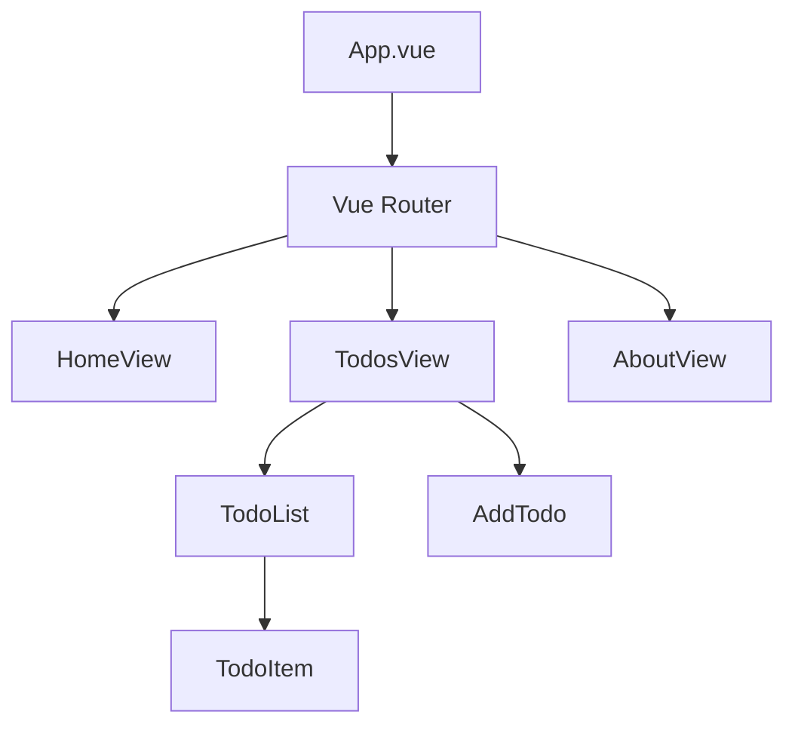

# Vue.js Code Structure

## Introduction

A well-organized code structure is essential for creating maintainable and scalable Vue.js applications. When your project grows, having a consistent and logical organization becomes crucial. This guide will walk you through the best practices for structuring your Vue.js code, from component organization to project architecture, helping you build applications that are easy to understand, test, and extend.

## Component Structure

### Single-File Components (SFC)

Vue's single-file components (`.vue` files) are the building blocks of your application and follow a standard structure:

```html
<template>
  <!-- Your HTML goes here -->
  <div class="hello">
    <h1>{{ greeting }}</h1>
    <button @click="changeGreeting">Change Greeting</button>
  </div>
</template>

<script>
export default {
  name: 'HelloWorld',
  props: {
    initialGreeting: String
  },
  data() {
    return {
      greeting: this.initialGreeting
    }
  },
  methods: {
    changeGreeting() {
      this.greeting = 'Greeting changed!'
    }
  }
}
</script>

<style scoped>
/* Component-specific CSS */
.hello {
  padding: 20px;
  border: 1px solid #ccc;
}
</style>
```

#### Best Practices for SFCs:

1. **Component Naming**: Use multi-word names in PascalCase (e.g., `UserProfile.vue`, `NavigationBar.vue`)
2. **Script Organization**: Follow a consistent order for component properties:
   - name
   - components
   - props
   - data
   - computed
   - methods
   - watch
   - lifecycle hooks

3. **Scoped Styles**: Use `scoped` attribute to prevent CSS leakage to other components

### Using the Script Setup Syntax (Vue 3)

Vue 3's Composition API with `<script setup>` offers a more concise way to structure components:

```html
<template>
  <div class="hello">
    <h1>{{ greeting }}</h1>
    <button @click="changeGreeting">Change Greeting</button>
  </div>
</template>

<script setup>
import { ref } from 'vue';

// Props declaration
const props = defineProps({
  initialGreeting: String
});

// Reactive state
const greeting = ref(props.initialGreeting);

// Methods
const changeGreeting = () => {
  greeting.value = 'Greeting changed!';
};
</script>

<style scoped>
.hello {
  padding: 20px;
  border: 1px solid #ccc;
}
</style>
```

## Project Directory Structure

A well-organized project structure helps maintain clarity as your application grows. Here's a recommended structure for Vue.js projects:

```
src/
├── assets/            # Static assets (images, fonts, etc.)
├── components/        # Reusable Vue components
│   ├── common/        # App-wide shared components (Button, Modal, etc.)
│   └── features/      # Feature-specific components
├── composables/       # Reusable composition functions (Vue 3)
├── directives/        # Custom Vue directives
├── layouts/           # Page layout components
├── plugins/           # Vue plugins, third-party libraries
├── router/            # Vue Router configuration
├── services/          # API calls, external service integrations
├── store/             # Vuex/Pinia store modules
├── styles/            # Global CSS/SCSS
├── utils/             # Utility functions
├── views/             # Page components
├── App.vue            # Root component
└── main.js            # Application entry point
```

### Components Organization

Organizing components by their purpose and scope makes it easier to locate and reuse them:

1. **Common Components**: Reusable across the entire application
   ```
   components/common/
   ├── AppButton.vue
   ├── AppModal.vue
   ├── AppInput.vue
   └── AppCard.vue
   ```

2. **Feature Components**: Specific to a particular feature or domain
   ```
   components/features/
   ├── authentication/
   │   ├── LoginForm.vue
   │   └── SignupForm.vue
   ├── dashboard/
   │   ├── DashboardStats.vue
   │   └── ActivityFeed.vue
   └── profile/
       ├── ProfileHeader.vue
       └── ProfileSettings.vue
   ```

### Views vs Components

- **Views**: Represent pages/routes in your application
  ```html
  <!-- views/Dashboard.vue -->
  <template>
    <div class="dashboard-page">
      <DashboardHeader />
      <DashboardStats :user-data="userData" />
      <ActivityFeed :activities="recentActivities" />
    </div>
  </template>

  <script>
  import DashboardHeader from '@/components/features/dashboard/DashboardHeader.vue'
  import DashboardStats from '@/components/features/dashboard/DashboardStats.vue'
  import ActivityFeed from '@/components/features/dashboard/ActivityFeed.vue'
  
  export default {
    name: 'Dashboard',
    components: {
      DashboardHeader,
      DashboardStats,
      ActivityFeed
    },
    data() {
      return {
        userData: { /* ... */ },
        recentActivities: [ /* ... */ ]
      }
    }
  }
  </script>
  ```

- **Components**: Building blocks that compose views or other components

## Organizing by Feature

For larger applications, consider organizing code by feature rather than type:

```
src/
├── features/
│   ├── authentication/
│   │   ├── components/
│   │   ├── services/
│   │   ├── store/
│   │   └── routes.js
│   ├── dashboard/
│   │   ├── components/
│   │   ├── services/
│   │   ├── store/
│   │   └── routes.js
│   └── profile/
│       ├── components/
│       ├── services/
│       ├── store/
│       └── routes.js
├── common/            # Shared code across features
├── App.vue
└── main.js
```

This approach helps developers navigate the codebase more easily when working on a specific feature.

## State Management Structure

### Vuex Store Organization

For Vue 2 or Vue 3 with Vuex, structure your store with modules:

```js
// store/index.js
import Vue from 'vue'
import Vuex from 'vuex'
import auth from './modules/auth'
import products from './modules/products'
import cart from './modules/cart'

Vue.use(Vuex)

export default new Vuex.Store({
  modules: {
    auth,
    products,
    cart
  }
})

// store/modules/auth.js
export default {
  namespaced: true,
  state: {
    user: null,
    isAuthenticated: false
  },
  mutations: {
    SET_USER(state, user) {
      state.user = user;
      state.isAuthenticated = !!user;
    }
  },
  actions: {
    async login({ commit }, credentials) {
      // API call logic here
      const user = await authService.login(credentials);
      commit('SET_USER', user);
    },
    logout({ commit }) {
      commit('SET_USER', null);
    }
  },
  getters: {
    currentUser: state => state.user,
    isAdmin: state => state.user?.role === 'admin'
  }
}
```

### Pinia Store Organization (Vue 3)

For Vue 3 with Pinia, create separate store files:

```js
// stores/useAuthStore.js
import { defineStore } from 'pinia';
import { authService } from '@/services';

export const useAuthStore = defineStore('auth', {
  state: () => ({
    user: null,
    isAuthenticated: false
  }),
  
  actions: {
    async login(credentials) {
      const user = await authService.login(credentials);
      this.user = user;
      this.isAuthenticated = true;
    },
    
    logout() {
      this.user = null;
      this.isAuthenticated = false;
    }
  },
  
  getters: {
    currentUser: (state) => state.user,
    isAdmin: (state) => state.user?.role === 'admin'
  }
});
```

## API and Services

Organize API calls into service modules to keep components clean and make API logic reusable:

```js
// services/api.js
import axios from 'axios';

const apiClient = axios.create({
  baseURL: 'https://api.example.com',
  headers: {
    'Content-Type': 'application/json'
  }
});

// Add request/response interceptors for auth, error handling, etc.
apiClient.interceptors.request.use(config => {
  const token = localStorage.getItem('token');
  if (token) {
    config.headers.Authorization = `Bearer ${token}`;
  }
  return config;
});

export default apiClient;

// services/productService.js
import apiClient from './api';

export default {
  getProducts() {
    return apiClient.get('/products');
  },
  getProduct(id) {
    return apiClient.get(`/products/${id}`);
  },
  createProduct(product) {
    return apiClient.post('/products', product);
  }
};
```

Then use these services in your components or store actions:

```html
<script>
import productService from '@/services/productService';

export default {
  data() {
    return {
      products: [],
      loading: false,
      error: null
    }
  },
  async created() {
    try {
      this.loading = true;
      const response = await productService.getProducts();
      this.products = response.data;
    } catch (err) {
      this.error = 'Failed to load products';
      console.error(err);
    } finally {
      this.loading = false;
    }
  }
}
</script>
```

## Using Vue Router

Structure your router configuration to keep it maintainable:

```js
// router/index.js
import Vue from 'vue'
import VueRouter from 'vue-router'
import authRoutes from './auth-routes'
import productRoutes from './product-routes'
import { authGuard } from './guards'

Vue.use(VueRouter)

const routes = [
  {
    path: '/',
    name: 'Home',
    component: () => import('@/views/Home.vue')
  },
  ...authRoutes,
  ...productRoutes,
  {
    path: '/dashboard',
    name: 'Dashboard',
    component: () => import('@/views/Dashboard.vue'),
    meta: { requiresAuth: true },
    beforeEnter: authGuard
  },
  {
    path: '/profile',
    name: 'Profile',
    component: () => import('@/views/Profile.vue'),
    meta: { requiresAuth: true },
    beforeEnter: authGuard
  },
  {
    path: '*',
    name: 'NotFound',
    component: () => import('@/views/NotFound.vue')
  }
]

const router = new VueRouter({
  mode: 'history',
  base: process.env.BASE_URL,
  routes
})

export default router

// router/auth-routes.js
export default [
  {
    path: '/login',
    name: 'Login',
    component: () => import('@/views/auth/Login.vue')
  },
  {
    path: '/register',
    name: 'Register',
    component: () => import('@/views/auth/Register.vue')
  }
]
```

## Real-world Project Example

Let's look at a simple todo application to illustrate these concepts:



### Project Structure

```
src/
├── components/
│   ├── common/
│   │   ├── BaseButton.vue
│   │   └── BaseInput.vue
│   └── todos/
│       ├── TodoItem.vue
│       ├── TodoList.vue
│       └── AddTodo.vue
├── composables/
│   └── useTodos.js
├── services/
│   └── todoService.js
├── stores/
│   └── todoStore.js
├── views/
│   ├── HomeView.vue
│   ├── TodosView.vue
│   └── AboutView.vue
├── App.vue
└── main.js
```

### Implementation Example

```html
<!-- components/todos/TodoItem.vue -->
<template>
  <div class="todo-item" :class="{ completed: todo.completed }">
    <input type="checkbox" :checked="todo.completed" @change="toggleComplete" />
    <span>{{ todo.title }}</span>
    <BaseButton @click="$emit('delete')" variant="danger">Delete</BaseButton>
  </div>
</template>

<script>
import BaseButton from '@/components/common/BaseButton.vue';

export default {
  name: 'TodoItem',
  components: {
    BaseButton
  },
  props: {
    todo: {
      type: Object,
      required: true
    }
  },
  methods: {
    toggleComplete() {
      this.$emit('toggle', {
        ...this.todo,
        completed: !this.todo.completed
      });
    }
  }
}
</script>

<style scoped>
.todo-item {
  display: flex;
  align-items: center;
  padding: 10px;
  margin: 5px 0;
  border: 1px solid #eee;
}
.completed span {
  text-decoration: line-through;
  color: #888;
}
</style>
```

```html
<!-- components/todos/TodoList.vue -->
<template>
  <div class="todo-list">
    <h2>My Todos ({{ todos.length }})</h2>
    <TodoItem
      v-for="todo in todos"
      :key="todo.id"
      :todo="todo"
      @toggle="$emit('toggle', $event)"
      @delete="$emit('delete', todo.id)"
    />
  </div>
</template>

<script>
import TodoItem from './TodoItem.vue';

export default {
  name: 'TodoList',
  components: {
    TodoItem
  },
  props: {
    todos: {
      type: Array,
      required: true
    }
  }
}
</script>
```

```html
<!-- views/TodosView.vue -->
<template>
  <div class="todos-container">
    <h1>Todo List</h1>
    <AddTodo @add="addTodo" />
    <TodoList
      :todos="filteredTodos"
      @toggle="updateTodo"
      @delete="deleteTodo"
    />
    
    <div class="filters">
      <BaseButton @click="filter = 'all'" :class="{ active: filter === 'all' }">All</BaseButton>
      <BaseButton @click="filter = 'active'" :class="{ active: filter === 'active' }">Active</BaseButton>
      <BaseButton @click="filter = 'completed'" :class="{ active: filter === 'completed' }">Completed</BaseButton>
    </div>
    
    <div v-if="loading" class="loading">Loading...</div>
  </div>
</template>

<script>
import { computed, ref, onMounted } from 'vue';
import TodoList from '@/components/todos/TodoList.vue';
import AddTodo from '@/components/todos/AddTodo.vue';
import BaseButton from '@/components/common/BaseButton.vue';
import { useTodoStore } from '@/stores/todoStore';

export default {
  name: 'TodosView',
  components: {
    TodoList,
    AddTodo,
    BaseButton
  },
  setup() {
    const todoStore = useTodoStore();
    const filter = ref('all');
    const loading = ref(false);
    
    const filteredTodos = computed(() => {
      switch (filter.value) {
        case 'active':
          return todoStore.todos.filter(todo => !todo.completed);
        case 'completed':
          return todoStore.todos.filter(todo => todo.completed);
        default:
          return todoStore.todos;
      }
    });
    
    onMounted(async () => {
      loading.value = true;
      await todoStore.fetchTodos();
      loading.value = false;
    });
    
    const addTodo = (title) => {
      todoStore.addTodo({ title, completed: false });
    };
    
    const updateTodo = (todo) => {
      todoStore.updateTodo(todo);
    };
    
    const deleteTodo = (id) => {
      todoStore.deleteTodo(id);
    };
    
    return {
      filter,
      loading,
      filteredTodos,
      addTodo,
      updateTodo,
      deleteTodo
    };
  }
}
</script>
```

```js
// stores/todoStore.js
import { defineStore } from 'pinia';
import todoService from '@/services/todoService';

export const useTodoStore = defineStore('todos', {
  state: () => ({
    todos: []
  }),
  
  actions: {
    async fetchTodos() {
      try {
        const response = await todoService.getTodos();
        this.todos = response.data;
      } catch (error) {
        console.error('Error fetching todos:', error);
      }
    },
    
    async addTodo(todo) {
      try {
        const response = await todoService.createTodo(todo);
        this.todos.push(response.data);
      } catch (error) {
        console.error('Error adding todo:', error);
      }
    },
    
    async updateTodo(updatedTodo) {
      try {
        await todoService.updateTodo(updatedTodo.id, updatedTodo);
        const index = this.todos.findIndex(todo => todo.id === updatedTodo.id);
        if (index !== -1) {
          this.todos[index] = updatedTodo;
        }
      } catch (error) {
        console.error('Error updating todo:', error);
      }
    },
    
    async deleteTodo(id) {
      try {
        await todoService.deleteTodo(id);
        this.todos = this.todos.filter(todo => todo.id !== id);
      } catch (error) {
        console.error('Error deleting todo:', error);
      }
    }
  },
  
  getters: {
    completedTodos: (state) => state.todos.filter(todo => todo.completed),
    activeTodos: (state) => state.todos.filter(todo => !todo.completed),
    totalCount: (state) => state.todos.length
  }
});
```

## Summary

An effective Vue.js code structure follows these key principles:

1. **Component Structure**: Organize single-file components with a clear template/script/style structure
2. **Project Organization**: Use a logical directory structure based on component types and features
3. **State Management**: Organize store by modules or by feature
4. **API Services**: Separate API calls into service modules
5. **Router Configuration**: Structure routes logically with proper guards

A well-organized codebase leads to:
- Better maintainability as the project grows
- Easier onboarding for new team members
- Improved code reusability
- More efficient debugging and testing
- Better collaboration among developers

## Additional Resources

To deepen your understanding of Vue.js code structure:

- Explore the [Vue.js Style Guide](https://v3.vuejs.org/style-guide/)
- Practice refactoring an existing application using these principles
- Study open-source Vue.js projects to observe different structure approaches

### Exercise: Refactor a Simple Application

Take a simple Vue application and apply the above principles to refactor its code structure:

1. Separate components into common and feature-specific
2. Extract API calls into service modules
3. Implement proper Vuex/Pinia store organization
4. Organize router configuration with route groups

By applying these best practices to your Vue.js applications, you'll build a foundation for scalable and maintainable code that grows with your project needs.