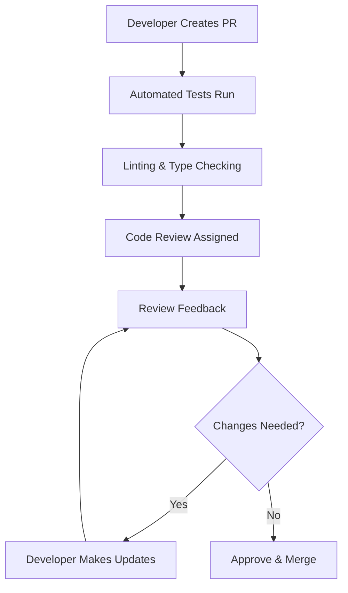

# Vue.js Code Reviews

## Introduction

Code reviews are a crucial part of the development process that help teams maintain high code quality, share knowledge, and ensure consistency across a project. For Vue.js applications, effective code reviews can significantly impact the application's performance, maintainability, and developer experience.

In this guide, we'll explore how to conduct effective Vue.js code reviews, what aspects to focus on, and how to create a positive code review culture within your team.

## Why Code Reviews Matter in Vue.js Projects

Code reviews in Vue.js projects serve multiple important purposes:

1. **Quality Assurance**: Identifying bugs, edge cases, and potential issues before they reach production
2. **Knowledge Sharing**: Helping team members learn Vue.js best practices and patterns
3. **Consistency**: Ensuring the codebase follows agreed-upon standards and conventions
4. **Architecture Guidance**: Maintaining clean component architecture and proper state management
5. **Performance Optimization**: Spotting potential performance bottlenecks early

## Setting Up a Code Review Process

Before diving into the technical aspects, let's establish a solid code review process:



### Code Review Checklist for Vue.js

Create a checklist for your team's Vue.js code reviews:

1. **Component Structure**
   - Are components single-responsibility?
   - Is the component hierarchy logical?
   - Are components properly decomposed?

2. **Props and Events**
   - Are props properly validated?
   - Is data flowing correctly between components?
   - Are events named consistently?

3. **Performance Considerations**
   - Is `v-for` used with `key`?
   - Are heavy operations cached or computed?
   - Are large lists virtualized if needed?

4. **State Management**
   - Is state managed at the appropriate level?
   - Is Vuex/Pinia used effectively?
   - Are mutations synchronous and actions asynchronous?

5. **Vue Patterns and Anti-patterns**
   - Are lifecycle hooks used correctly?
   - Are watchers and computed properties used appropriately?
   - Are there any memory leaks (e.g., event listeners not removed)?

## Example: Reviewing Component Structure

Let's look at a component with issues that would be identified in a code review:

```html
<template>
  <div>
    <h1>User Dashboard</h1>
    <div v-if="isLoading">Loading...</div>
    <div v-else>
      <div class="user-info">
        <h2>{{ user.name }}</h2>
        <p>{{ user.email }}</p>
      </div>
      <div class="user-stats">
        <!-- A lot of complex stats calculation and rendering -->
        <div v-for="stat in userStats">
          <span>{{ stat.name }}: {{ stat.value }}</span>
        </div>
      </div>
      <div class="user-posts">
        <!-- Complex post handling logic -->
        <div v-for="post in userPosts">
          <h3>{{ post.title }}</h3>
          <p>{{ post.content }}</p>
        </div>
      </div>
    </div>
  </div>
</template>

<script>
export default {
  data() {
    return {
      isLoading: true,
      user: {},
      userStats: [],
      userPosts: []
    }
  },
  created() {
    this.fetchEverything()
  },
  methods: {
    async fetchEverything() {
      const userId = this.$route.params.id
      this.user = await this.$api.getUser(userId)
      this.userStats = await this.$api.getUserStats(userId)
      this.userPosts = await this.$api.getUserPosts(userId)
      this.isLoading = false
    }
  }
}
</script>
```

### Review Feedback

Here's how we might provide constructive feedback:

1. **Component Decomposition**:
   - This component is handling too many responsibilities. Consider splitting it into `<UserInfo>`, `<UserStats>`, and `<UserPosts>` components.

2. **API Calls**:
   - Sequential API calls can slow down rendering. Consider using `Promise.all` or separating the loading states.

3. **List Rendering**:
   - Missing `key` prop in both v-for loops, which could cause issues with Vue's virtual DOM diffing.

4. **Error Handling**:
   - No error handling for API calls.

## Example: Improved Version After Review

```html
<template>
  <div>
    <h1>User Dashboard</h1>
    <user-info 
      :user="user" 
      :is-loading="isLoadingUser" 
      @retry="fetchUser" 
    />
    <user-stats 
      :stats="userStats" 
      :is-loading="isLoadingStats" 
      @retry="fetchUserStats" 
    />
    <user-posts 
      :posts="userPosts" 
      :is-loading="isLoadingPosts" 
      @retry="fetchUserPosts" 
    />
  </div>
</template>

<script>
import UserInfo from './UserInfo.vue'
import UserStats from './UserStats.vue'
import UserPosts from './UserPosts.vue'

export default {
  components: {
    UserInfo,
    UserStats,
    UserPosts
  },
  data() {
    return {
      isLoadingUser: true,
      isLoadingStats: true,
      isLoadingPosts: true,
      user: {},
      userStats: [],
      userPosts: [],
      userId: null
    }
  },
  created() {
    this.userId = this.$route.params.id
    this.fetchUser()
    this.fetchUserStats()
    this.fetchUserPosts()
  },
  methods: {
    async fetchUser() {
      this.isLoadingUser = true
      try {
        this.user = await this.$api.getUser(this.userId)
      } catch (error) {
        console.error('Failed to fetch user:', error)
      } finally {
        this.isLoadingUser = false
      }
    },
    async fetchUserStats() {
      this.isLoadingStats = true
      try {
        this.userStats = await this.$api.getUserStats(this.userId)
      } catch (error) {
        console.error('Failed to fetch user stats:', error)
      } finally {
        this.isLoadingStats = false
      }
    },
    async fetchUserPosts() {
      this.isLoadingPosts = true
      try {
        this.userPosts = await this.$api.getUserPosts(this.userId)
      } catch (error) {
        console.error('Failed to fetch user posts:', error)
      } finally {
        this.isLoadingPosts = false
      }
    }
  }
}
</script>
```

## Example: Reviewing Reactive Data Usage

Looking at prop validation and reactive data usage:

```html
<template>
  <div>
    <h2>{{ title }}</h2>
    <p>Count: {{ count }}</p>
    <button @click="incrementCount">Increment</button>
  </div>
</template>

<script>
export default {
  props: ['title'],
  data() {
    return {
      count: 0
    }
  },
  methods: {
    incrementCount() {
      this.count++
      this.$emit('count-changed', this.count)
    }
  }
}
</script>
```

### Review Feedback

1. **Props Validation**:
   - The `title` prop doesn't have validation. We should specify type and whether it's required.

2. **Events Naming**:
   - Event names should use kebab-case according to Vue style guide.

## Example: Improved Version After Review

```html
<template>
  <div>
    <h2>{{ title }}</h2>
    <p>Count: {{ count }}</p>
    <button @click="incrementCount">Increment</button>
  </div>
</template>

<script>
export default {
  props: {
    title: {
      type: String,
      required: true
    }
  },
  data() {
    return {
      count: 0
    }
  },
  methods: {
    incrementCount() {
      this.count++
      this.$emit('count-changed', this.count)
    }
  }
}
</script>
```

## Code Review Communication Guidelines

Effective communication is crucial for successful code reviews. Here are some guidelines:

1. **Be Specific and Constructive**
   - Instead of: "This component is too complex."
   - Say: "This component has multiple responsibilities. Consider splitting the user stats into a separate component to improve readability."

2. **Ask Questions Rather Than Make Demands**
   - Instead of: "Move this logic to a computed property."
   - Ask: "Could this logic work better as a computed property since it depends on reactive data?"

3. **Explain the "Why", Not Just the "What"**
   - Instead of: "Use v-if here instead of v-show."
   - Say: "Using v-if would be more appropriate here since this component is rarely shown, and v-if will avoid rendering it completely when not needed."

4. **Recognize Good Code**
   - "I really like how you extracted the form validation logic into a composable function. It makes the component much cleaner!"

## Automated Tools for Vue.js Code Reviews

Incorporate these tools into your CI/CD pipeline to catch issues before the review:

1. **ESLint with Vue Plugin**
   - Sets up rules specific to Vue.js best practices

   ```bash
   npm install --save-dev eslint eslint-plugin-vue
   ```

2. **Vue TypeScript**
   - Adds type checking to catch type errors

3. **Vue Test Utils**
   - Ensure components are tested before review

4. **Lighthouse CI**
   - Check for performance issues in Vue applications

## Common Issues to Look For in Vue.js Reviews

### 1. Component Communication Anti-patterns

```html
<!-- Problematic: Parent component accessing child's internal state -->
<template>
  <child-component ref="childComp" />
  <button @click="accessChildData">Get Child Data</button>
</template>

<script>
export default {
  methods: {
    accessChildData() {
      // Anti-pattern: Direct access to child's data
      console.log(this.$refs.childComp.internalValue)
    }
  }
}
</script>
```

**Better approach**: Use props down, events up pattern

```html
<template>
  <child-component @data-requested="onChildDataReceived" />
  <button @click="requestChildData">Get Child Data</button>
</template>

<script>
export default {
  data() {
    return {
      childData: null
    }
  },
  methods: {
    requestChildData() {
      this.$emit('request-data')
    },
    onChildDataReceived(data) {
      this.childData = data
    }
  }
}
</script>
```

### 2. Reactivity Gotchas

```html
<script>
export default {
  data() {
    return {
      user: {
        name: 'John',
        preferences: {}
      }
    }
  },
  methods: {
    updatePreference() {
      // This won't trigger reactivity
      this.user.preferences.theme = 'dark'
    }
  }
}
</script>
```

**Better approach**: Use Vue's reactivity system correctly

```html
<script>
export default {
  data() {
    return {
      user: {
        name: 'John',
        preferences: {
          theme: 'light'
        }
      }
    }
  },
  methods: {
    updatePreference() {
      // Using Vue.set (Vue 2) or direct assignment with pre-defined property (Vue 3)
      this.$set(this.user.preferences, 'theme', 'dark') // Vue 2
      // or for Vue 3
      this.user.preferences.theme = 'dark' // Works in Vue 3 if theme is pre-defined
    }
  }
}
</script>
```

### 3. Performance Issues

```html
<!-- Problematic: Expensive computation in template -->
<template>
  <div>
    <div v-for="item in expensiveFilter(items)" :key="item.id">
      {{ item.name }}
    </div>
  </div>
</template>

<script>
export default {
  props: ['items'],
  methods: {
    expensiveFilter(items) {
      console.log('Running expensive filter')
      return items.filter(item => {
        // Some expensive operation
        return complexCalculation(item)
      })
    }
  }
}
</script>
```

**Better approach**: Use computed properties

```html
<template>
  <div>
    <div v-for="item in filteredItems" :key="item.id">
      {{ item.name }}
    </div>
  </div>
</template>

<script>
export default {
  props: ['items'],
  computed: {
    filteredItems() {
      console.log('Computing filtered items')
      return this.items.filter(item => {
        // Now cached until dependencies change
        return complexCalculation(item)
      })
    }
  }
}
</script>
```

## Code Review Workflow in Practice

Here's a practical workflow for Vue.js code reviews:

1. **Before Creating a Pull Request**
   - Run linters and tests locally
   - Self-review with the checklist
   - Document complex decisions

2. **Submitting for Review**
   - Create a focused PR with clear description
   - Include screenshots for UI changes
   - Link to related issues or requirements

3. **During Review**
   - Reviewer examines code using the Vue.js checklist
   - Focus on architecture, patterns, and edge cases
   - Check for consistency with project standards

4. **After Review**
   - Address feedback promptly
   - Discuss challenging suggestions
   - Document decisions for future reference

## Summary

Effective Vue.js code reviews are essential for maintaining high-quality applications. By focusing on component structure, reactivity patterns, performance optimizations, and proper Vue.js conventions, teams can catch issues early and continuously improve their codebase.

Remember that code reviews are not just about finding problems—they're also opportunities for knowledge sharing, mentoring, and team growth. Approach reviews with a collaborative mindset, focusing on the code rather than the person who wrote it.

## Additional Resources

- **Vue.js Style Guide**: Review the official style guide for consistent code
- **Vue DevTools**: Use to inspect component structure and state during reviews
- **Pair Programming**: Consider complementing code reviews with occasional pair programming sessions
- **Code Review Templates**: Create custom templates for Vue.js projects

## Exercises

1. **Review Practice**: Take an existing Vue component from your project and conduct a code review using the checklist provided.

2. **Refactoring Exercise**: Identify a complex component and refactor it into smaller, more focused components.

3. **Code Review Simulation**: With a colleague, practice giving and receiving code review feedback on a Vue.js component.

4. **Performance Review**: Use Vue DevTools to identify a performance bottleneck in a component, then create a PR with your fix.

5. **Team Checklist**: Collaborate with your team to create a custom Vue.js code review checklist specific to your project's needs.