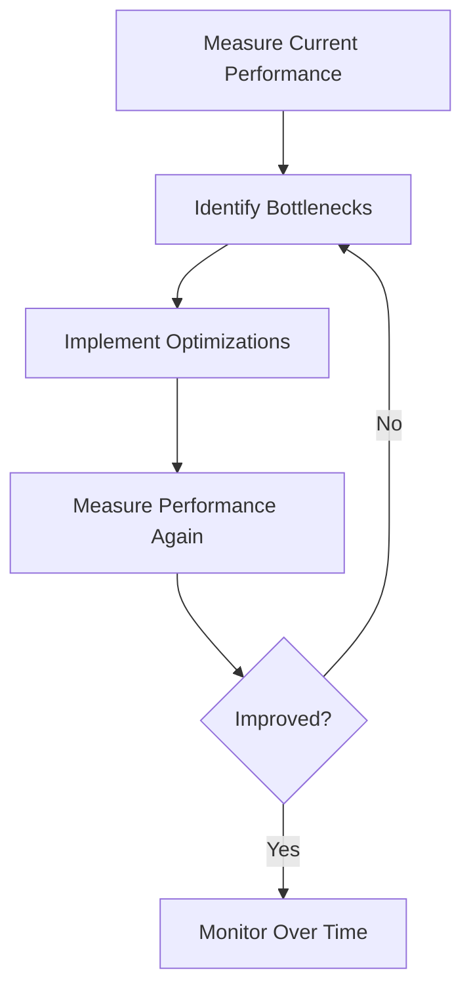

# Vue.js Performance Checklist

## Introduction

Performance optimization is a crucial aspect of developing Vue.js applications, especially as your projects grow in complexity. A well-optimized Vue application loads faster, responds more quickly to user interactions, and provides a smoother overall experience. This guide presents a comprehensive performance checklist to help you identify and resolve common bottlenecks in your Vue.js applications.

Whether you're building a small application or an enterprise-level system, following these performance best practices will help ensure your Vue.js applications remain fast and efficient.

## Why Performance Matters

Before diving into specific techniques, let's understand why performance optimization is important:

- **User Experience**: Users expect web applications to be fast and responsive. Studies show that users tend to abandon sites that take more than 3 seconds to load.
- **SEO Rankings**: Search engines like Google consider page speed as a ranking factor.
- **Conversion Rates**: Faster websites generally have higher conversion rates.
- **Reduced Server Costs**: Optimized applications consume fewer server resources.

## Performance Checklist

### 1. Use Production Build

#### What to Do

Always use the production build of Vue.js in your deployed applications.

#### Why It Matters

The development build of Vue includes warnings, debugging information, and runtime checks that are helpful during development but add unnecessary weight to your application in production.

#### Implementation

When using Vue CLI:

```bash
# Build for production with minification
npm run build
```

If you're using Vue directly in your HTML:

```html
<!-- Development version -->
<script src="https://cdn.jsdelivr.net/npm/vue@2.6.14/dist/vue.js"></script>

<!-- Production version -->
<script src="https://cdn.jsdelivr.net/npm/vue@2.6.14/dist/vue.min.js"></script>
```

### 2. Implement Code Splitting

#### What to Do

Break your application into smaller chunks that are loaded on demand.

#### Why It Matters

Code splitting reduces the initial load time of your application by only loading the code necessary for the current view.

#### Implementation

Using dynamic imports with Vue Router:

```js
// Instead of this
import UserDashboard from './components/UserDashboard.vue'

const routes = [
  { path: '/dashboard', component: UserDashboard }
]

// Do this
const routes = [
  { 
    path: '/dashboard', 
    component: () => import('./components/UserDashboard.vue') 
  }
]
```

This creates a separate chunk for the `UserDashboard` component that will only be loaded when a user navigates to the dashboard route.

### 3. Lazy Load Components

#### What to Do

Load components only when they are needed.

#### Why It Matters

Lazy loading components can significantly reduce initial load time, especially for large components that aren't immediately visible.

#### Implementation

You can register components asynchronously:

```js
Vue.component('heavy-component', () => import('./HeavyComponent.vue'))
```

Or in a Single File Component:

```js
export default {
  components: {
    'heavy-component': () => import('./HeavyComponent.vue')
  }
}
```

### 4. Use v-show for Frequently Toggled Elements

#### What to Do

Use `v-show` instead of `v-if` for elements that toggle frequently.

#### Why It Matters

While `v-if` removes elements from the DOM when the condition is false, `v-show` simply hides them with CSS. For elements that toggle frequently, `v-show` is more efficient as it avoids the cost of repeatedly creating and destroying DOM nodes.

#### Implementation

```html
<!-- Good for frequently toggled elements -->
<template>
  <div v-show="isVisible" class="notification">Important message!</div>
</template>

<!-- Better for elements that are rarely toggled -->
<template>
  <div v-if="isRarelyShown" class="complex-component">
    <!-- Complex content -->
  </div>
</template>
```

### 5. Use Computed Properties for Complex Calculations

#### What to Do

Leverage computed properties for complex calculations instead of performing them directly in templates.

#### Why It Matters

Computed properties are cached based on their reactive dependencies and only re-evaluated when their dependencies change, making them more efficient than methods.

#### Implementation

```html
<template>
  <!-- Bad -->
  <div>{{ message.split('').reverse().join('') }}</div>

  <!-- Good -->
  <div>{{ reversedMessage }}</div>
</template>

<script>
export default {
  data() {
    return {
      message: 'Hello Vue.js'
    }
  },
  computed: {
    reversedMessage() {
      return this.message.split('').reverse().join('')
    }
  }
}
</script>
```

### 6. Avoid Expensive Operations in Computed Properties

#### What to Do

Ensure computed properties perform only reactive data-dependent operations.

#### Why It Matters

Computed properties should be fast and synchronous. Expensive operations or asynchronous tasks can negatively impact performance.

#### Implementation

```html
<script>
export default {
  data() {
    return {
      items: []
    }
  },
  computed: {
    // Good: Fast operation dependent on reactive data
    filteredItems() {
      return this.items.filter(item => item.isActive)
    }
  },
  methods: {
    // Better place for expensive operations
    performExpensiveOperation() {
      // Complex calculations that don't need to run on every render
    }
  }
}
</script>
```

### 7. Use Object Freeze for Static Data

#### What to Do

Use `Object.freeze()` for data that doesn't need to be reactive.

#### Why It Matters

When you freeze an object, Vue.js will not set up reactivity on its properties, saving memory and improving performance.

#### Implementation

```html
<script>
export default {
  data() {
    return {
      // This data won't be reactive - perfect for static content
      staticData: Object.freeze({
        title: 'This will not change',
        items: ['item1', 'item2', 'item3']
      })
    }
  }
}
</script>
```

### 8. Implement Virtualization for Long Lists

#### What to Do

Use a virtual scrolling library for rendering long lists.

#### Why It Matters

Rendering a large number of DOM elements can cause significant performance issues. Virtual scrolling renders only the visible items in a list, greatly improving performance.

#### Implementation

Using the popular `vue-virtual-scroller` library:

```html
<template>
  <RecycleScroller
    class="scroller"
    :items="items"
    :item-size="50"
    key-field="id"
    v-slot="{ item }"
  >
    <div class="user-item">
      {{ item.name }}
    </div>
  </RecycleScroller>
</template>

<script>
import { RecycleScroller } from 'vue-virtual-scroller'
import 'vue-virtual-scroller/dist/vue-virtual-scroller.css'

export default {
  components: {
    RecycleScroller
  },
  data() {
    return {
      items: Array.from({ length: 10000 }).map((_, i) => ({
        id: i,
        name: `User ${i}`
      }))
    }
  }
}
</script>
```

### 9. Use Key Attributes Properly

#### What to Do

Always use unique, stable keys for v-for directives.

#### Why It Matters

Vue uses the key attribute to track node identity across renders, which helps it efficiently update the DOM when items change order.

#### Implementation

```html
<template>
  <!-- Bad -->
  <div v-for="(item, index) in items" :key="index">
    {{ item.name }}
  </div>

  <!-- Good -->
  <div v-for="item in items" :key="item.id">
    {{ item.name }}
  </div>
</template>
```

### 10. Avoid Using v-for with v-if on the Same Element

#### What to Do

Never use `v-for` and `v-if` directives together on the same element.

#### Why It Matters

When `v-for` and `v-if` are on the same element, `v-for` takes precedence over `v-if`, resulting in the filter being applied to each iteration rather than skipping the loop entirely.

#### Implementation

```html
<template>
  <!-- Bad - v-if runs on each iteration -->
  <div v-for="item in items" v-if="item.isActive" :key="item.id">
    {{ item.name }}
  </div>

  <!-- Good - filter items first -->
  <div v-for="item in activeItems" :key="item.id">
    {{ item.name }}
  </div>
</template>

<script>
export default {
  computed: {
    activeItems() {
      return this.items.filter(item => item.isActive)
    }
  }
}
</script>
```

### 11. Optimize Dependencies

#### What to Do

Carefully choose and audit external libraries.

#### Why It Matters

External dependencies can significantly increase your bundle size and slow down your application. Sometimes smaller, more focused libraries or custom implementations may be more efficient.

#### Implementation

Use tools like `webpack-bundle-analyzer` to visualize your bundle:

```bash
npm install --save-dev webpack-bundle-analyzer
```

Then in your `vue.config.js`:

```js
const BundleAnalyzerPlugin = require('webpack-bundle-analyzer').BundleAnalyzerPlugin

module.exports = {
  configureWebpack: {
    plugins: [
      new BundleAnalyzerPlugin()
    ]
  }
}
```

### 12. Implement Proper Error Handling

#### What to Do

Handle errors gracefully to prevent application crashes.

#### Why It Matters

Uncaught errors can lead to frozen UI or broken functionality, severely impacting user experience.

#### Implementation

Use Vue's error handler:

```js
Vue.config.errorHandler = function(err, vm, info) {
  console.error(`Error: ${err.stack}\nInfo: ${info}`)
  // Report to your error tracking service
}
```

### 13. Optimize Images and Assets

#### What to Do

Compress and optimize all assets used in your application.

#### Why It Matters

Unoptimized images and assets can significantly slow down page loading times.

#### Implementation

Use tools like `imagemin` for image compression or consider using modern formats like WebP:

```js
// vue.config.js
module.exports = {
  chainWebpack: config => {
    config.module
      .rule('images')
      .use('image-webpack-loader')
      .loader('image-webpack-loader')
      .options({
        bypassOnDebug: true
      })
      .end()
  }
}
```

### 14. Use Server-Side Rendering (SSR) or Static Site Generation

#### What to Do

Consider implementing SSR or static site generation for content-heavy applications.

#### Why It Matters

SSR and static generation improve initial load time and are beneficial for SEO.

#### Implementation

With Nuxt.js, you can easily implement SSR:

```js
// nuxt.config.js
export default {
  // Enable SSR
  mode: 'universal',
  
  // Or for static generation
  target: 'static'
}
```

### 15. Implement Prefetching and Preloading

#### What to Do

Use prefetch and preload directives for critical resources.

#### Why It Matters

Prefetching and preloading can significantly improve perceived performance by loading resources before they're needed.

#### Implementation

In Vue CLI projects, you can configure resource hints in `vue.config.js`:

```js
// vue.config.js
module.exports = {
  chainWebpack: config => {
    // Disable prefetch for all chunks
    config.plugins.delete('prefetch')
    
    // Or modify prefetch to specific chunks
    config.plugin('prefetch').tap(options => {
      options[0].fileBlacklist = options[0].fileBlacklist || []
      options[0].fileBlacklist.push(/myasyncRoute(.)+?\.js$/)
      return options
    })
  }
}
```

## Performance Monitoring

After implementing the optimizations, it's important to monitor your application's performance over time.

### Tools for Performance Monitoring

1. **Vue DevTools**: The official browser extension for debugging Vue.js applications.
2. **Lighthouse**: Google's automated tool for improving web page quality.
3. **Web Vitals**: Essential metrics for a healthy site.
4. **Chrome DevTools Performance tab**: For in-depth performance analysis.

### Example Performance Audit Process



## Real-World Application Example

Let's look at how these principles apply to a real-world application. Consider a dashboard that displays user data, activity charts, and allows filtering through large datasets:

```html
<!-- Dashboard.vue -->
<template>
  <div class="dashboard">
    <!-- Lazy-loaded heavy component -->
    <heavy-data-chart v-if="showChart" />
    
    <!-- Using v-show for frequently toggled elements -->
    <user-notifications v-show="showNotifications" />
    
    <!-- Using computed property for filtering -->
    <user-list :users="filteredUsers" />
    
    <!-- Virtual scrolling for long lists -->
    <RecycleScroller
      v-if="activities.length > 100"
      class="scroller"
      :items="activities"
      :item-size="50"
      key-field="id"
      v-slot="{ item: activity }"
    >
      <activity-item :activity="activity" />
    </RecycleScroller>
    
    <div v-else>
      <activity-item 
        v-for="activity in activities" 
        :key="activity.id" 
        :activity="activity"
      />
    </div>
  </div>
</template>

<script>
import { RecycleScroller } from 'vue-virtual-scroller'
import 'vue-virtual-scroller/dist/vue-virtual-scroller.css'
import ActivityItem from './ActivityItem.vue'

export default {
  components: {
    'heavy-data-chart': () => import('./HeavyDataChart.vue'),
    'user-notifications': () => import('./UserNotifications.vue'),
    'user-list': () => import('./UserList.vue'),
    RecycleScroller,
    ActivityItem
  },
  data() {
    return {
      users: [],
      activities: [],
      userFilter: '',
      showChart: false,
      showNotifications: false
    }
  },
  computed: {
    filteredUsers() {
      if (!this.userFilter) return this.users
      
      return this.users.filter(user => 
        user.name.toLowerCase().includes(this.userFilter.toLowerCase())
      )
    }
  },
  methods: {
    async fetchDashboardData() {
      try {
        // Fetch data in parallel for better performance
        const [usersResponse, activitiesResponse] = await Promise.all([
          fetch('/api/users'),
          fetch('/api/activities')
        ])
        
        this.users = await usersResponse.json()
        this.activities = await activitiesResponse.json()
      } catch (error) {
        console.error('Failed to fetch dashboard data:', error)
      }
    }
  },
  created() {
    this.fetchDashboardData()
  }
}
</script>
```

This example incorporates several performance optimizations:
- Lazy loading of heavy components
- Using `v-show` for toggled elements
- Computed properties for filtering
- Virtual scrolling for long lists
- Efficient data fetching with parallel requests
- Proper error handling

## Summary

Optimizing your Vue.js applications for performance is a continuous process that involves careful planning, implementation, and monitoring. By following the practices outlined in this checklist, you can significantly improve your application's speed, responsiveness, and overall user experience.

Remember that performance optimization should be data-driven. Always measure the impact of your changes to ensure they're actually improving performance and not causing unexpected issues elsewhere in your application.

## Additional Resources

To deepen your understanding of Vue.js performance optimization, consider exploring these resources:

- [Vue.js Official Performance Documentation](https://vuejs.org/guide/best-practices/performance.html)
- [Vue.js Performance Optimization Tools](https://github.com/vuejs/awesome-vue#performance)
- [Web.dev Performance Optimization Guide](https://web.dev/fast/)
- [Performance Budgets 101](https://web.dev/performance-budgets-101/)

## Practice Exercises

1. **Analyze an Existing Application**: Use Lighthouse or Chrome DevTools to analyze the performance of an existing Vue.js application. Identify at least three areas for improvement.

2. **Implement Virtual Scrolling**: Add virtual scrolling to a component that renders a large list of items.

3. **Optimize Component Rendering**: Refactor a component that uses `v-if` and `v-for` on the same element to follow best practices.

4. **Code Splitting**: Implement route-based code splitting in a Vue Router application.

5. **Performance Monitoring**: Set up a basic performance monitoring system that tracks key metrics like load time and time to interactive.

By continually applying and refining these performance techniques, you'll be able to create Vue.js applications that are not only feature-rich but also fast and responsive.