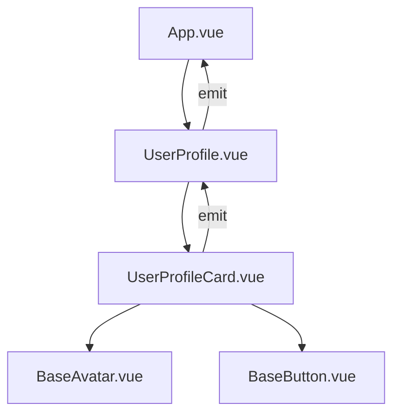

# Vue.js Naming Conventions

When working with Vue.js, following consistent naming conventions improves code readability, maintainability, and helps prevent common issues. This guide covers the recommended naming practices for different aspects of a Vue.js application.

## Introduction

Naming things properly in programming is often cited as one of the hardest challenges. In Vue.js applications, applying consistent naming conventions helps team members understand the purpose and behavior of various parts of your application. This guide will help you establish good naming practices for:

- Components
- Props
- Events
- Methods
- Data properties
- Computed properties
- Vuex store elements
- Files and directories

## Component Naming Conventions

### Multi-Word Component Names

Always use multi-word names for your Vue components to avoid conflicts with existing and future HTML elements, as all HTML elements are single words.

```html
<!-- ❌ Bad -->
<template>
  <div>
    <header>...</header>
  </div>
</template>

<script>
export default {
  name: 'Header', // Conflicts with HTML element
}
</script>
```

```html
<!-- ✅ Good -->
<template>
  <div>
    <app-header>...</app-header>
  </div>
</template>

<script>
export default {
  name: 'AppHeader',
}
</script>
```

### Component Name Casing

Vue supports two formats for component names:

1. **PascalCase** - For defining components in JavaScript/TypeScript
2. **kebab-case** - For using components in templates

#### Single-File Components (SFC)

For `.vue` files, use either PascalCase or kebab-case, but be consistent:

```
// PascalCase
components/
  AppHeader.vue
  UserProfile.vue
  TodoItem.vue

// OR kebab-case
components/
  app-header.vue
  user-profile.vue
  todo-item.vue
```

#### In JavaScript/TypeScript Registration

Use PascalCase when registering components:

```js
// In a component file
export default {
  name: 'UserProfile',
  components: {
    AppHeader,
    TodoItem,
  }
}
```

#### In Templates

Use kebab-case in templates:

```html
<template>
  <div>
    <app-header></app-header>
    <user-profile></user-profile>
    <todo-item></todo-item>
  </div>
</template>
```

### Base/Common Components

Base components that are used throughout your application should be prefixed with "Base", "App", or "V":

```
components/
  BaseButton.vue
  BaseIcon.vue
  AppModal.vue
  VDatePicker.vue
```

### Component Name Structure

Structure component names in a logical way:

1. **Feature/domain prefix** - Helps identify which feature the component belongs to
2. **Component purpose** - Describes what the component does

Example:

```
UserProfileCard.vue        // User feature, Profile component, Card variant
ShopCartItem.vue           // Shop feature, Cart component, Item variant
AdminDashboardMetrics.vue  // Admin feature, Dashboard component, Metrics variant
```

## Props Naming Conventions

### Props Case

Always use camelCase for prop names in JavaScript:

```js
export default {
  props: {
    greetingMessage: String,
    userProfile: Object,
    itemCount: Number,
  }
}
```

When using props in templates, use kebab-case:

```html
<template>
  <user-profile 
    :greeting-message="hello"
    :user-profile="user"
    :item-count="count">
  </user-profile>
</template>
```

### Boolean Props

For boolean props, use "is", "has", or "should" prefixes to make their purpose clear:

```js
export default {
  props: {
    isActive: Boolean,
    hasPermission: Boolean,
    shouldValidate: Boolean,
  }
}
```

## Event Naming Conventions

### Event Case

Use kebab-case for event names:

```html
<!-- In child component -->
<script>
export default {
  methods: {
    onSubmit() {
      this.$emit('form-submitted', { data: this.formData })
    },
    onClick() {
      this.$emit('button-clicked')
    }
  }
}
</script>

<!-- In parent component -->
<template>
  <user-form 
    @form-submitted="handleFormSubmit" 
    @button-clicked="handleButtonClick">
  </user-form>
</template>
```

### Event Verb Structure

Structure events with a verb (past tense) + noun pattern:

```js
// Good event names
this.$emit('item-selected', item)
this.$emit('form-submitted', formData)
this.$emit('search-completed', results)
this.$emit('upload-succeeded', file)

// Avoid generic names
// ❌ Bad
this.$emit('success')
this.$emit('done')
this.$emit('change')
```

### Two-Way Binding Events

When implementing two-way binding with custom components, follow Vue's convention:

```js
// Inside a custom input component
export default {
  props: {
    value: String
  },
  methods: {
    updateValue(newValue) {
      this.$emit('input', newValue) // Vue 2
      // OR
      this.$emit('update:modelValue', newValue) // Vue 3
    }
  }
}
```

## Method Naming Conventions

### Method Case

Use camelCase for method names:

```js
export default {
  methods: {
    fetchUserData() {
      // Implementation
    },
    handleSubmit() {
      // Implementation
    }
  }
}
```

### Method Naming Patterns

1. **Event handlers**: Prefix with `handle` or `on`:

```js
methods: {
  handleClick() { /* ... */ },
  onSubmit() { /* ... */ },
}
```

2. **Actions**: Use verb + noun format:

```js
methods: {
  fetchUsers() { /* ... */ },
  saveSettings() { /* ... */ },
  validateForm() { /* ... */ },
}
```

3. **Lifecycle hooks**: Use Vue's built-in naming conventions:

```js
export default {
  created() { /* ... */ },
  mounted() { /* ... */ },
  beforeDestroy() { /* ... */ }, // Vue 2
  beforeUnmount() { /* ... */ }, // Vue 3
}
```

## Data Properties Naming Conventions

Use camelCase for data properties:

```js
export default {
  data() {
    return {
      userName: '',
      isLoading: false,
      userList: [],
      formConfig: {
        showLabels: true,
        submitButtonText: 'Save',
      }
    }
  }
}
```

For collections, use plural nouns:

```js
data() {
  return {
    users: [],
    products: [],
    selectedItems: [],
  }
}
```

## Computed Properties Naming Conventions

### Naming Pattern

For computed properties, use descriptive names that explain what they compute:

```js
export default {
  computed: {
    fullName() {
      return `${this.firstName} ${this.lastName}`
    },
    isFormValid() {
      return this.email && this.password && this.password.length >= 8
    },
    filteredProducts() {
      return this.products.filter(p => p.isActive)
    }
  }
}
```

### Boolean Computed Properties

For boolean computed properties, use "is", "has", or "should" prefixes:

```js
computed: {
  isAdmin() {
    return this.userRole === 'admin'
  },
  hasItems() {
    return this.cartItems.length > 0
  },
  shouldShowWelcome() {
    return this.isNewUser && !this.hasSeenWelcome
  }
}
```

## Vuex Store Naming Conventions

### Modules Names

Use camelCase for module names:

```js
// store/index.js
import Vue from 'vue'
import Vuex from 'vuex'
import userModule from './modules/user'
import cartModule from './modules/cart'

Vue.use(Vuex)

export default new Vuex.Store({
  modules: {
    user: userModule,
    cart: cartModule
  }
})
```

### State Properties

Use camelCase for state properties:

```js
// store/modules/user.js
export default {
  state: {
    currentUser: null,
    isAuthenticated: false,
    permissions: [],
    lastLoginDate: null
  }
}
```

### Mutations

Use UPPER_SNAKE_CASE for mutation types:

```js
// mutation-types.js
export const SET_CURRENT_USER = 'SET_CURRENT_USER'
export const TOGGLE_AUTH_STATUS = 'TOGGLE_AUTH_STATUS'
export const ADD_PERMISSION = 'ADD_PERMISSION'

// user.js module
import * as types from '../mutation-types'

export default {
  mutations: {
    [types.SET_CURRENT_USER](state, user) {
      state.currentUser = user
    },
    [types.TOGGLE_AUTH_STATUS](state, status) {
      state.isAuthenticated = status
    }
  }
}
```

### Actions

Use camelCase for action names:

```js
// user.js module
export default {
  actions: {
    async fetchUserProfile({ commit }, userId) {
      try {
        const user = await api.getUser(userId)
        commit('SET_CURRENT_USER', user)
      } catch (error) {
        console.error(error)
      }
    },
    logoutUser({ commit }) {
      commit('SET_CURRENT_USER', null)
      commit('TOGGLE_AUTH_STATUS', false)
    }
  }
}
```

### Getters

Use camelCase for getter names:

```js
// user.js module
export default {
  getters: {
    isAdmin(state) {
      return state.currentUser && state.currentUser.role === 'admin'
    },
    userFullName(state) {
      if (!state.currentUser) return ''
      return `${state.currentUser.firstName} ${state.currentUser.lastName}`
    }
  }
}
```

## File and Directory Structure

### Directory Names

Use kebab-case for directory names:

```
src/
  components/
  views/
  store/
  assets/
  user-management/
  form-elements/
```

### File Names

1. **Vue component files**: Use either PascalCase or kebab-case (be consistent)

```
components/
  AppHeader.vue
  UserProfile.vue
  TodoItem.vue

// OR

components/
  app-header.vue
  user-profile.vue
  todo-item.vue
```

2. **JavaScript/TypeScript utility files**: Use kebab-case

```
utils/
  date-formatter.js
  api-client.js
  local-storage.js
```

3. **Vuex files**: Use kebab-case

```
store/
  index.js
  modules/
    user.js
    shopping-cart.js
    product-catalog.js
```

## Practical Examples

Let's look at a complete example of a well-structured Vue component with proper naming conventions:

```html
<!-- UserProfileCard.vue -->
<template>
  <div class="user-profile-card">
    <base-avatar
      :image-url="profilePicture"
      :alt-text="`${userFullName}'s avatar`"
      @click="handleAvatarClick"
    ></base-avatar>
    
    <div class="user-info">
      <h2>{{ userFullName }}</h2>
      <p v-if="hasEmail">Email: {{ user.email }}</p>
      <p>Joined: {{ formattedJoinDate }}</p>
      
      <base-button 
        :is-primary="true"
        @button-clicked="handleEditProfile"
      >
        Edit Profile
      </base-button>
    </div>
  </div>
</template>

<script>
import BaseAvatar from '@/components/BaseAvatar.vue'
import BaseButton from '@/components/BaseButton.vue'
import { formatDate } from '@/utils/date-formatter'

export default {
  name: 'UserProfileCard',
  
  components: {
    BaseAvatar,
    BaseButton
  },
  
  props: {
    user: {
      type: Object,
      required: true
    },
    isEditable: {
      type: Boolean,
      default: false
    }
  },
  
  data() {
    return {
      isLoading: false,
      editMode: false
    }
  },
  
  computed: {
    userFullName() {
      return `${this.user.firstName} ${this.user.lastName}`
    },
    
    profilePicture() {
      return this.user.avatar || '/images/default-avatar.png'
    },
    
    hasEmail() {
      return Boolean(this.user.email)
    },
    
    formattedJoinDate() {
      return formatDate(this.user.joinDate, 'MMMM DD, YYYY')
    }
  },
  
  methods: {
    handleAvatarClick() {
      this.$emit('avatar-clicked', this.user.id)
    },
    
    handleEditProfile() {
      if (!this.isEditable) return
      this.editMode = true
      this.$emit('edit-profile-requested', this.user)
    },
    
    async fetchUserStats() {
      this.isLoading = true
      try {
        const stats = await this.$store.dispatch('user/fetchUserStats', this.user.id)
        this.$emit('stats-loaded', stats)
      } catch (error) {
        this.$emit('fetch-error', error)
      } finally {
        this.isLoading = false
      }
    }
  },
  
  mounted() {
    this.fetchUserStats()
  }
}
</script>
```

Let's visualize the component relationship with a simple diagram:



## Summary

Following consistent naming conventions in your Vue.js applications makes your code more maintainable, readable, and helps prevent common errors. Here's a quick summary:

- **Components**: Use multi-word names in PascalCase (`UserProfile.vue`) for file names and component registration, kebab-case in templates (`<user-profile>`)
- **Props**: Use camelCase in JavaScript (`userName`), kebab-case in templates (`:user-name="value"`)
- **Events**: Use kebab-case with verb + noun pattern (`form-submitted`, `item-selected`)
- **Methods**: Use camelCase with descriptive verb + noun or handle/on prefix
- **Data/Computed**: Use camelCase with descriptive names
- **Vuex**: Use UPPER_SNAKE_CASE for mutations, camelCase for actions, getters, and state
- **Boolean properties**: Use "is", "has", or "should" prefixes

By following these conventions, your Vue.js code will be clearer and more consistent, making it easier to maintain over time and for new team members to understand.

## Additional Resources

- [Vue.js Style Guide](https://vuejs.org/style-guide/)
- [Vue.js Documentation](https://vuejs.org/guide/introduction.html)
- Practice exercise: Take an existing component and refactor it to follow these naming conventions

## Practice Exercise

Take the following poorly named component and refactor it to follow the naming conventions:

```html
<template>
  <div>
    <header>{{ title }}</header>
    <button @click="click">{{ btntext }}</button>
    <span v-if="load">Loading...</span>
  </div>
</template>

<script>
export default {
  props: ['title', 'btntext'],
  data() {
    return {
      load: false,
    }
  },
  methods: {
    click() {
      this.load = true
      this.$emit('done')
      setTimeout(() => {
        this.load = false
      }, 1000)
    }
  }
}
</script>
```