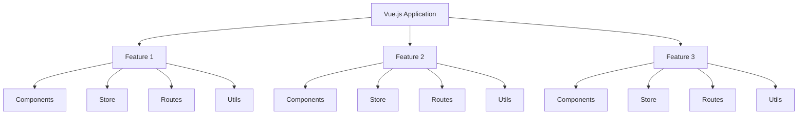
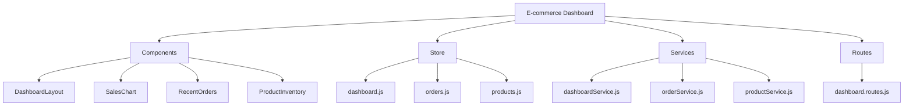

# Vue.js Scalable Architecture

## Introduction

As your Vue.js application grows in size and complexity, having a well-defined architecture becomes increasingly important. A scalable architecture ensures your codebase remains maintainable, your team can work efficiently, and your application continues to perform well as it evolves.

In this guide, we'll explore how to structure Vue.js applications for scalability, covering component organization, state management, routing strategies, and best practices that will help you build robust applications that can grow without becoming unwieldy.

## Why Architecture Matters

Before diving into specific patterns, let's understand why architecture is crucial for Vue.js applications:

1. **Maintainability**: Well-organized code is easier to understand and modify
2. **Team Collaboration**: Clear structures help teams work together efficiently
3. **Performance**: Smart architecture decisions improve application performance
4. **Testing**: A good architecture makes testing simpler and more effective
5. **Onboarding**: New developers can understand and contribute to the project faster

## Component Structure

### Component Organization

A common approach is to organize components by feature or domain, rather than by type:



### Directory Structure

A scalable Vue.js application might have a directory structure like this:

```
src/
├── assets/           # Static assets like images, fonts, etc.
├── components/       # Shared/common components
│   ├── common/       # Very generic components used throughout the app
│   └── ui/           # UI components like buttons, inputs, etc.
├── features/         # Feature-based modules
│   ├── auth/         # Authentication related features
│   │   ├── components/
│   │   ├── store/
│   │   ├── routes/
│   │   └── services/
│   └── dashboard/    # Dashboard related features
│       ├── components/
│       ├── store/
│       ├── routes/
│       └── services/
├── router/           # Vue Router configuration
├── store/            # Vuex store (or Pinia)
├── services/         # API services, etc.
├── utils/            # Utility functions
├── App.vue           # Root component
└── main.js          # Application entry point
```

### Component Hierarchy

Creating a clear component hierarchy helps manage complexity:

1. **App Shell Components**: Layout components like headers, footers, navigation
2. **Feature Components**: Components tied to specific features
3. **Common Components**: Reusable components across features
4. **UI Components**: Basic building blocks like buttons, form elements

Let's implement a basic example:

```jsx
// src/components/ui/AppButton.vue
<template>
  <button 
    :class="['app-button', `app-button--${variant}`]" 
    :disabled="disabled"
  >
    <slot></slot>
  </button>
</template>

<script>
export default {
  name: 'AppButton',
  props: {
    variant: {
      type: String,
      default: 'primary',
      validator: (value) => ['primary', 'secondary', 'danger'].includes(value)
    },
    disabled: {
      type: Boolean,
      default: false
    }
  }
}
</script>
```

This UI component can then be used throughout the application consistently.

## State Management at Scale

### Modular Store Structure

For large applications, organizing your Vuex (or Pinia) store into modules is essential:

```jsx
// src/store/index.js
import Vue from 'vue'
import Vuex from 'vuex'
import auth from './modules/auth'
import products from './modules/products'
import cart from './modules/cart'

Vue.use(Vuex)

export default new Vuex.Store({
  modules: {
    auth,
    products,
    cart
  }
})
```

Each module handles its own state, mutations, actions, and getters:

```jsx
// src/store/modules/auth.js
export default {
  namespaced: true,
  state: {
    user: null,
    token: localStorage.getItem('token') || null,
    loading: false,
    error: null
  },
  mutations: {
    SET_USER(state, user) {
      state.user = user
    },
    SET_TOKEN(state, token) {
      state.token = token
    },
    SET_LOADING(state, status) {
      state.loading = status
    },
    SET_ERROR(state, error) {
      state.error = error
    }
  },
  actions: {
    async login({ commit }, credentials) {
      try {
        commit('SET_LOADING', true)
        commit('SET_ERROR', null)
        
        // Here would be an API call to login
        const response = await authService.login(credentials)
        
        commit('SET_USER', response.user)
        commit('SET_TOKEN', response.token)
        localStorage.setItem('token', response.token)
        
        return response
      } catch (error) {
        commit('SET_ERROR', error.message)
        throw error
      } finally {
        commit('SET_LOADING', false)
      }
    }
  },
  getters: {
    isAuthenticated: state => !!state.token,
    currentUser: state => state.user,
    isLoading: state => state.loading,
    error: state => state.error
  }
}
```

### When to Use Central Store vs Local State

Not everything needs to go in a central store:

- **Use Vuex/Pinia for**:
  - Data that is shared between components
  - Authentication state
  - User information and preferences
  - Application-wide settings
  - Data that needs to persist between page navigation

- **Use Component State for**:
  - Temporary UI state (like open/closed modals)
  - Form input values (unless needed elsewhere)
  - Component-specific state

## Routing and Navigation

### Lazy Loading Routes

For large applications, lazy loading routes improves initial load time:

```jsx
// src/router/index.js
import Vue from 'vue'
import VueRouter from 'vue-router'

Vue.use(VueRouter)

const routes = [
  {
    path: '/',
    name: 'Home',
    component: () => import(/* webpackChunkName: "home" */ '@/features/home/views/HomeView.vue')
  },
  {
    path: '/products',
    name: 'Products',
    component: () => import(/* webpackChunkName: "products" */ '@/features/products/views/ProductsView.vue')
  },
  {
    path: '/dashboard',
    name: 'Dashboard',
    component: () => import(/* webpackChunkName: "dashboard" */ '@/features/dashboard/views/DashboardView.vue'),
    meta: { requiresAuth: true },
    children: [
      {
        path: 'profile',
        name: 'Profile',
        component: () => import(/* webpackChunkName: "profile" */ '@/features/dashboard/views/ProfileView.vue')
      },
      {
        path: 'settings',
        name: 'Settings',
        component: () => import(/* webpackChunkName: "settings" */ '@/features/dashboard/views/SettingsView.vue')
      }
    ]
  }
]

const router = new VueRouter({
  mode: 'history',
  base: process.env.BASE_URL,
  routes
})

export default router
```

### Route Guards for Authentication and Authorization

```jsx
// src/router/index.js (continued)
import store from '@/store'

router.beforeEach((to, from, next) => {
  const requiresAuth = to.matched.some(record => record.meta.requiresAuth)
  const isAuthenticated = store.getters['auth/isAuthenticated']

  if (requiresAuth && !isAuthenticated) {
    next('/login')
  } else {
    next()
  }
})
```

## API and Service Layer

Creating a dedicated service layer for API calls improves maintainability:

```jsx
// src/services/api.js
import axios from 'axios'
import store from '@/store'

const api = axios.create({
  baseURL: process.env.VUE_APP_API_URL,
  headers: {
    'Content-Type': 'application/json'
  }
})

// Request interceptor for adding auth token
api.interceptors.request.use(
  config => {
    const token = store.getters['auth/token']
    if (token) {
      config.headers.Authorization = `Bearer ${token}`
    }
    return config
  },
  error => Promise.reject(error)
)

// Response interceptor for handling errors
api.interceptors.response.use(
  response => response,
  error => {
    if (error.response && error.response.status === 401) {
      // Handle unauthorized errors (e.g., redirect to login)
      store.dispatch('auth/logout')
    }
    return Promise.reject(error)
  }
)

export default api
```

Then create feature-specific service modules:

```jsx
// src/services/products.js
import api from './api'

export default {
  getProducts(params) {
    return api.get('/products', { params })
  },
  
  getProduct(id) {
    return api.get(`/products/${id}`)
  },
  
  createProduct(product) {
    return api.post('/products', product)
  },
  
  updateProduct(id, product) {
    return api.put(`/products/${id}`, product)
  },
  
  deleteProduct(id) {
    return api.delete(`/products/${id}`)
  }
}
```

## Implementing Composable Functions (Vue 3)

For Vue 3 applications, composable functions provide a clean way to reuse logic:

```jsx
// src/composables/useProductSearch.js
import { ref, computed } from 'vue'
import { useStore } from 'vuex'

export function useProductSearch() {
  const store = useStore()
  const searchQuery = ref('')
  const sortBy = ref('name')
  const showOnlyInStock = ref(false)
  
  const filteredProducts = computed(() => {
    let result = store.getters['products/allProducts']
    
    // Filter by search query
    if (searchQuery.value) {
      result = result.filter(product => 
        product.name.toLowerCase().includes(searchQuery.value.toLowerCase())
      )
    }
    
    // Filter by stock
    if (showOnlyInStock.value) {
      result = result.filter(product => product.inStock)
    }
    
    // Sort results
    return result.sort((a, b) => {
      if (a[sortBy.value] < b[sortBy.value]) return -1
      if (a[sortBy.value] > b[sortBy.value]) return 1
      return 0
    })
  })
  
  return {
    searchQuery,
    sortBy,
    showOnlyInStock,
    filteredProducts
  }
}
```

Using the composable in a component:

```jsx
// src/features/products/components/ProductList.vue
<template>
  <div class="product-list">
    <div class="filters">
      <input v-model="searchQuery" placeholder="Search products..." />
      <select v-model="sortBy">
        <option value="name">Sort by name</option>
        <option value="price">Sort by price</option>
      </select>
      <label>
        <input type="checkbox" v-model="showOnlyInStock" />
        Only show products in stock
      </label>
    </div>
    
    <div v-if="filteredProducts.length === 0" class="no-results">
      No products found.
    </div>
    
    <div v-else class="products-grid">
      <product-card 
        v-for="product in filteredProducts" 
        :key="product.id" 
        :product="product"
      />
    </div>
  </div>
</template>

<script>
import { useProductSearch } from '@/composables/useProductSearch'
import ProductCard from './ProductCard.vue'

export default {
  components: {
    ProductCard
  },
  setup() {
    // Use the composable
    const { searchQuery, sortBy, showOnlyInStock, filteredProducts } = useProductSearch()
    
    return {
      searchQuery,
      sortBy,
      showOnlyInStock,
      filteredProducts
    }
  }
}
</script>
```

## Performance Optimization

### Component Registration Strategy

For large applications, consider using automatic global registration for common components:

```jsx
// src/components/ui/index.js
import Vue from 'vue'

// Import all UI components
import AppButton from './AppButton.vue'
import AppInput from './AppInput.vue'
import AppCard from './AppCard.vue'
import AppModal from './AppModal.vue'

// Register components that are used frequently throughout the app
const components = {
  AppButton,
  AppInput,
  AppCard,
  AppModal
}

Object.entries(components).forEach(([name, component]) => {
  Vue.component(name, component)
})
```

Then in your main.js:

```jsx
import './components/ui' // This will register all UI components
```

### Keep-Alive for Expensive Components

Use `<keep-alive>` for components that are expensive to render:

```jsx
<template>
  <div>
    <keep-alive>
      <router-view v-if="$route.meta.keepAlive"/>
    </keep-alive>
    <router-view v-if="!$route.meta.keepAlive"/>
  </div>
</template>
```

## Testing Considerations

A scalable architecture should be designed with testability in mind:

```jsx
// src/features/auth/components/__tests__/LoginForm.spec.js
import { mount, createLocalVue } from '@vue/test-utils'
import Vuex from 'vuex'
import LoginForm from '../LoginForm.vue'

const localVue = createLocalVue()
localVue.use(Vuex)

describe('LoginForm', () => {
  let wrapper
  let actions
  let store
  
  beforeEach(() => {
    actions = {
      login: jest.fn()
    }
    
    store = new Vuex.Store({
      modules: {
        auth: {
          namespaced: true,
          actions,
          getters: {
            isLoading: () => false,
            error: () => null
          }
        }
      }
    })
    
    wrapper = mount(LoginForm, {
      localVue,
      store
    })
  })
  
  test('submits login form with credentials', async () => {
    const emailInput = wrapper.find('[data-test="email-input"]')
    const passwordInput = wrapper.find('[data-test="password-input"]')
    const form = wrapper.find('form')
    
    await emailInput.setValue('user@example.com')
    await passwordInput.setValue('password123')
    await form.trigger('submit')
    
    expect(actions.login).toHaveBeenCalledWith(
      expect.any(Object), // The context
      { email: 'user@example.com', password: 'password123' },
      undefined
    )
  })
})
```

## Real-World Example: E-commerce Dashboard

Let's apply these concepts to an e-commerce dashboard feature:



Implementation example:

```jsx
// src/features/dashboard/components/DashboardLayout.vue
<template>
  <div class="dashboard-layout">
    <aside class="sidebar">
      <h2>Dashboard</h2>
      <nav>
        <router-link to="/dashboard">Overview</router-link>
        <router-link to="/dashboard/orders">Orders</router-link>
        <router-link to="/dashboard/products">Products</router-link>
        <router-link to="/dashboard/customers">Customers</router-link>
      </nav>
    </aside>
    
    <main class="content">
      <header class="dashboard-header">
        <h1>{{ pageTitle }}</h1>
        <div class="user-menu">
          <app-dropdown>
            <template #trigger>
              {{ user.name }}
            </template>
            <app-dropdown-item @click="logout">Logout</app-dropdown-item>
          </app-dropdown>
        </div>
      </header>
      
      <div class="dashboard-content">
        <router-view />
      </div>
    </main>
  </div>
</template>

<script>
import { mapActions, mapGetters } from 'vuex'

export default {
  name: 'DashboardLayout',
  
  computed: {
    ...mapGetters({
      user: 'auth/currentUser'
    }),
    
    pageTitle() {
      const routeTitles = {
        'dashboard': 'Dashboard Overview',
        'dashboard-orders': 'Orders Management',
        'dashboard-products': 'Product Inventory',
        'dashboard-customers': 'Customer Database'
      }
      
      return routeTitles[this.$route.name] || 'Dashboard'
    }
  },
  
  methods: {
    ...mapActions({
      logout: 'auth/logout'
    })
  }
}
</script>
```

This example shows a dashboard layout that:
1. Has a sidebar with navigation links
2. Shows a dynamic page title based on the current route
3. Displays user information and logout option
4. Provides a content area for the current view

## Summary and Best Practices

To create a scalable Vue.js architecture:

1. **Organize by Feature**: Structure your app around business domains
2. **Component Composition**: Build complex UIs with smaller, reusable components
3. **State Management**: Use Vuex/Pinia for shared state, component state for local concerns
4. **Services Layer**: Abstract API calls and external services
5. **Lazy Loading**: Implement code-splitting to improve performance
6. **Consistent Naming**: Follow a clear naming convention
7. **Testing**: Design components and functions to be testable

## Additional Resources

Here are some resources to deepen your understanding of scalable Vue.js architecture:

- [Vue.js Official Style Guide](https://vuejs.org/style-guide/)
- [Vue.js Official Scaling Up guide](https://vuejs.org/guide/scaling-up/sfc.html)
- [Vue Mastery](https://www.vuemastery.com/) courses on advanced Vue patterns

## Exercises

1. **Refactor a Simple App**: Take a single-file Vue application and refactor it to use a more scalable architecture with proper component organization.

2. **State Management Migration**: Convert an application using just component state to use Vuex or Pinia for shared state management.

3. **Feature-Based Structure**: Reorganize an existing Vue app from a type-based structure to a feature-based structure.

4. **Service Layer Implementation**: Create an API service layer for an existing Vue application that's currently making API calls directly from components.

5. **Build a Dashboard**: Create a small dashboard application implementing the architecture patterns discussed in this guide.

By following these patterns and practices, you'll be well on your way to building Vue.js applications that can scale elegantly as requirements grow and change.