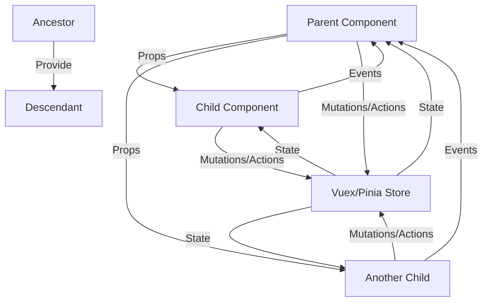

# Vue.js Component Communication

## Introduction

In Vue.js applications, components are the building blocks that make up your interface. As your application grows, these components need to communicate with each other to share data and respond to changes. Effective component communication is crucial for maintaining a predictable data flow and building scalable applications.

This guide explores various patterns for communication between Vue components, from basic parent-child relationships to more complex scenarios involving distant components.

## Why Component Communication Matters

Before diving into the patterns, let's understand why proper component communication is essential:

1. **Maintainability**: Well-organized communication patterns make your code easier to understand and maintain.
2. **Data Consistency**: Proper data flow ensures all components display consistent information.
3. **Reusability**: Components with clear communication interfaces are more reusable across projects.
4. **Debugging**: When data flows predictably, bugs are easier to track and fix.

## Basic Component Communication Patterns

### Props (Parent to Child Communication)

Props provide a way for parent components to pass data down to their children.

```html
<!-- Parent.vue -->
<template>
  <div>
    <child-component :message="parentMessage" />
  </div>
</template>

<script>
import ChildComponent from './ChildComponent.vue'

export default {
  components: {
    ChildComponent
  },
  data() {
    return {
      parentMessage: 'Hello from parent!'
    }
  }
}
</script>
```

```html
<!-- ChildComponent.vue -->
<template>
  <div>
    <p>{{ message }}</p>
  </div>
</template>

<script>
export default {
  props: {
    message: {
      type: String,
      required: true
    }
  }
}
</script>
```

In this example:
1. The parent component has a `parentMessage` data property
2. It passes this data to the child component using the `:message` prop
3. The child component defines the `message` prop with validation
4. The child component can use but not modify this prop

:::tip
Always validate your props using the object syntax with type and required or default properties to make your components more robust.
:::

### Events (Child to Parent Communication)

When a child component needs to communicate back to its parent, Vue provides custom events.

```html
<!-- ChildComponent.vue -->
<template>
  <button @click="sendMessageToParent">Send Message to Parent</button>
</template>

<script>
export default {
  methods: {
    sendMessageToParent() {
      this.$emit('message-sent', 'Hello from child!')
    }
  }
}
</script>
```

```html
<!-- Parent.vue -->
<template>
  <div>
    <p>{{ receivedMessage }}</p>
    <child-component @message-sent="handleChildMessage" />
  </div>
</template>

<script>
import ChildComponent from './ChildComponent.vue'

export default {
  components: {
    ChildComponent
  },
  data() {
    return {
      receivedMessage: ''
    }
  },
  methods: {
    handleChildMessage(message) {
      this.receivedMessage = message
    }
  }
}
</script>
```

In this example:
1. The child component emits a custom `message-sent` event with data
2. The parent listens for this event with `@message-sent`
3. When the event is emitted, the parent's `handleChildMessage` method is called with the emitted data

## Advanced Component Communication

### v-model for Two-Way Communication

The `v-model` directive provides a shorthand for two-way binding between a parent and child component:

```html
<!-- Parent.vue -->
<template>
  <div>
    <p>User Input: {{ userInput }}</p>
    <custom-input v-model="userInput" />
  </div>
</template>

<script>
import CustomInput from './CustomInput.vue'

export default {
  components: {
    CustomInput
  },
  data() {
    return {
      userInput: ''
    }
  }
}
</script>
```

```html
<!-- CustomInput.vue -->
<template>
  <input 
    :value="modelValue"
    @input="$emit('update:modelValue', $event.target.value)" 
    class="custom-input"
  />
</template>

<script>
export default {
  props: {
    modelValue: {
      type: String,
      required: true
    }
  },
  emits: ['update:modelValue']
}
</script>
```

In Vue 3, `v-model` uses `modelValue` prop and `update:modelValue` event by default.

### Provide/Inject (Ancestor to Descendant Communication)

When you need to share data between distant components in the hierarchy, provide/inject is useful:

```html
<!-- Ancestor.vue -->
<template>
  <div>
    <slot></slot>
  </div>
</template>

<script>
export default {
  data() {
    return {
      sharedData: 'This data is shared with descendants'
    }
  },
  provide() {
    return {
      sharedData: this.sharedData,
      updateSharedData: this.updateSharedData
    }
  },
  methods: {
    updateSharedData(newValue) {
      this.sharedData = newValue
    }
  }
}
</script>
```

```html
<!-- DistantDescendant.vue -->
<template>
  <div>
    <p>Data from ancestor: {{ sharedData }}</p>
    <button @click="changeData">Update Shared Data</button>
  </div>
</template>

<script>
export default {
  inject: ['sharedData', 'updateSharedData'],
  methods: {
    changeData() {
      this.updateSharedData('Updated by descendant!')
    }
  }
}
</script>
```

:::warning
In Vue 2, provided data is not reactive by default. To make it reactive, use computed properties or Vue.observable. In Vue 3, reactivity is preserved when providing a reactive object.
:::

### Reactivity with Provide/Inject in Vue 3

In Vue 3, you can leverage the Composition API to make provided values reactive:

```html
<!-- AncestorCompositionAPI.vue -->
<template>
  <div>
    <slot></slot>
  </div>
</template>

<script>
import { ref, provide } from 'vue'

export default {
  setup() {
    const sharedData = ref('This data is shared with descendants')
    
    const updateSharedData = (newValue) => {
      sharedData.value = newValue
    }
    
    provide('sharedData', sharedData)
    provide('updateSharedData', updateSharedData)
    
    return {
      sharedData
    }
  }
}
</script>
```

```html
<!-- DescendantCompositionAPI.vue -->
<template>
  <div>
    <p>Data from ancestor: {{ sharedData }}</p>
    <button @click="changeData">Update Shared Data</button>
  </div>
</template>

<script>
import { inject } from 'vue'

export default {
  setup() {
    const sharedData = inject('sharedData')
    const updateSharedData = inject('updateSharedData')
    
    const changeData = () => {
      updateSharedData('Updated by descendant with Composition API!')
    }
    
    return {
      sharedData,
      changeData
    }
  }
}
</script>
```

## State Management with Vuex or Pinia

For more complex applications, dedicated state management libraries like Vuex (Vue 2 & 3) or Pinia (preferred for Vue 3) provide a centralized store for all components to access.

Here's a basic Vuex example:

```js
// store.js
import { createStore } from 'vuex'

export default createStore({
  state: {
    message: 'Hello from Vuex!'
  },
  mutations: {
    updateMessage(state, newMessage) {
      state.message = newMessage
    }
  },
  actions: {
    setMessageAsync({ commit }, newMessage) {
      setTimeout(() => {
        commit('updateMessage', newMessage)
      }, 1000)
    }
  },
  getters: {
    capitalizedMessage(state) {
      return state.message.toUpperCase()
    }
  }
})
```

```html
<!-- UsingVuex.vue -->
<template>
  <div>
    <p>Message: {{ message }}</p>
    <p>Capitalized: {{ capitalizedMessage }}</p>
    <button @click="updateMessage">Update Message</button>
    <button @click="updateMessageAsync">Update Async</button>
  </div>
</template>

<script>
import { mapState, mapGetters, mapMutations, mapActions } from 'vuex'

export default {
  computed: {
    ...mapState(['message']),
    ...mapGetters(['capitalizedMessage'])
  },
  methods: {
    ...mapMutations({
      updateMessageMutation: 'updateMessage'
    }),
    ...mapActions({
      updateMessageAsync: 'setMessageAsync'
    }),
    updateMessage() {
      this.updateMessageMutation('Updated from component!')
    }
  }
}
</script>
```

## Real-World Component Communication Example

Let's build a simple shopping cart component system that demonstrates multiple communication patterns:

```html
<!-- ProductList.vue -->
<template>
  <div class="products">
    <h2>Available Products</h2>
    <div class="product-grid">
      <product-item
        v-for="product in products"
        :key="product.id"
        :product="product"
        @add-to-cart="addToCart"
      />
    </div>
  </div>
</template>

<script>
import ProductItem from './ProductItem.vue'

export default {
  components: {
    ProductItem
  },
  data() {
    return {
      products: [
        { id: 1, name: 'Laptop', price: 999.99 },
        { id: 2, name: 'Smartphone', price: 699.99 },
        { id: 3, name: 'Headphones', price: 149.99 }
      ]
    }
  },
  methods: {
    addToCart(product) {
      this.$emit('add-product-to-cart', product)
    }
  }
}
</script>
```

```html
<!-- ProductItem.vue -->
<template>
  <div class="product-item">
    <h3>{{ product.name }}</h3>
    <p>${{ product.price.toFixed(2) }}</p>
    <button @click="addToCart">Add to Cart</button>
  </div>
</template>

<script>
export default {
  props: {
    product: {
      type: Object,
      required: true
    }
  },
  methods: {
    addToCart() {
      this.$emit('add-to-cart', this.product)
    }
  }
}
</script>
```

```html
<!-- ShoppingCart.vue -->
<template>
  <div class="shopping-cart">
    <h2>Shopping Cart ({{ totalItems }})</h2>
    <ul v-if="items.length > 0">
      <li v-for="(item, index) in items" :key="index">
        {{ item.name }} - ${{ item.price.toFixed(2) }}
        <button @click="$emit('remove-item', index)">Remove</button>
      </li>
    </ul>
    <p v-else>Your cart is empty</p>
    <p class="total">Total: ${{ totalPrice.toFixed(2) }}</p>
  </div>
</template>

<script>
export default {
  props: {
    items: {
      type: Array,
      required: true
    }
  },
  computed: {
    totalItems() {
      return this.items.length
    },
    totalPrice() {
      return this.items.reduce((sum, item) => sum + item.price, 0)
    }
  },
  emits: ['remove-item']
}
</script>
```

```html
<!-- App.vue - Combining everything -->
<template>
  <div id="app">
    <h1>Online Shop</h1>
    <div class="shop-container">
      <product-list @add-product-to-cart="addItemToCart" />
      <shopping-cart :items="cartItems" @remove-item="removeCartItem" />
    </div>
  </div>
</template>

<script>
import ProductList from './components/ProductList.vue'
import ShoppingCart from './components/ShoppingCart.vue'

export default {
  components: {
    ProductList,
    ShoppingCart
  },
  data() {
    return {
      cartItems: []
    }
  },
  methods: {
    addItemToCart(product) {
      this.cartItems.push(product)
    },
    removeCartItem(index) {
      this.cartItems.splice(index, 1)
    }
  }
}
</script>
```

This example demonstrates:
1. **Props** - Parent to child: `App` passing `cartItems` to `ShoppingCart`
2. **Events** - Child to parent: `ProductItem` emitting `add-to-cart` to `ProductList`
3. **Event chains** - Grandchild to grandparent: Events from `ProductItem` traveling through `ProductList` to `App`
4. **Computed properties** - `ShoppingCart` calculating `totalItems` and `totalPrice` from props

## Communication Flow Visualization

Here's a diagram showing how component communication flows in a typical Vue application:



## Best Practices for Component Communication

1. **Keep communication as simple as possible** - Use props and events for direct parent-child communication
2. **Use provide/inject sparingly** - It's perfect for application-level features like themes or authentication, but can make data flow harder to track
3. **Props down, events up** - Maintain unidirectional data flow for clarity
4. **Document component interfaces** - Clear comments and prop validations help other developers
5. **Validate everything** - Use prop validation to catch issues early
6. **Consider state management for complex cases** - When your app's state becomes complex, Vuex or Pinia help centralize state logic

## Common Pitfalls to Avoid

1. **Mutating props directly** - Props should be treated as read-only
2. **Event naming inconsistencies** - Use kebab-case for event names consistently
3. **Deeply nested component communication** - If you have events traveling through many layers, consider restructuring or using state management
4. **Creating circular dependencies** - Be careful with components that import each other
5. **Overusing global state** - Not everything needs to be in a state store

## Summary

Effective component communication is essential for building maintainable Vue applications. This guide covered:

- Basic parent-child communication with props and events
- Two-way binding with v-model
- Long-distance communication with provide/inject
- Centralized state management with Vuex/Pinia
- A practical shopping cart example demonstrating these patterns

By understanding these communication patterns, you can build Vue applications with clean, predictable data flow that are easier to maintain and extend.

## Additional Resources

- Practice creating a more complex shopping cart with inventory management
- Try refactoring the shopping cart example to use Vuex or Pinia
- Experiment with the Composition API for component communication
- Build a form system with nested form components that communicate about validation

## Exercises

1. Create a nested form with at least 3 levels of components that communicate validation errors upward
2. Implement provide/inject to create a theme switching feature that affects all components
3. Build a todo list application using Vuex or Pinia for state management
4. Convert the shopping cart example to use the Composition API

Master these communication patterns, and you'll be well on your way to building robust Vue applications that are a joy to maintain!