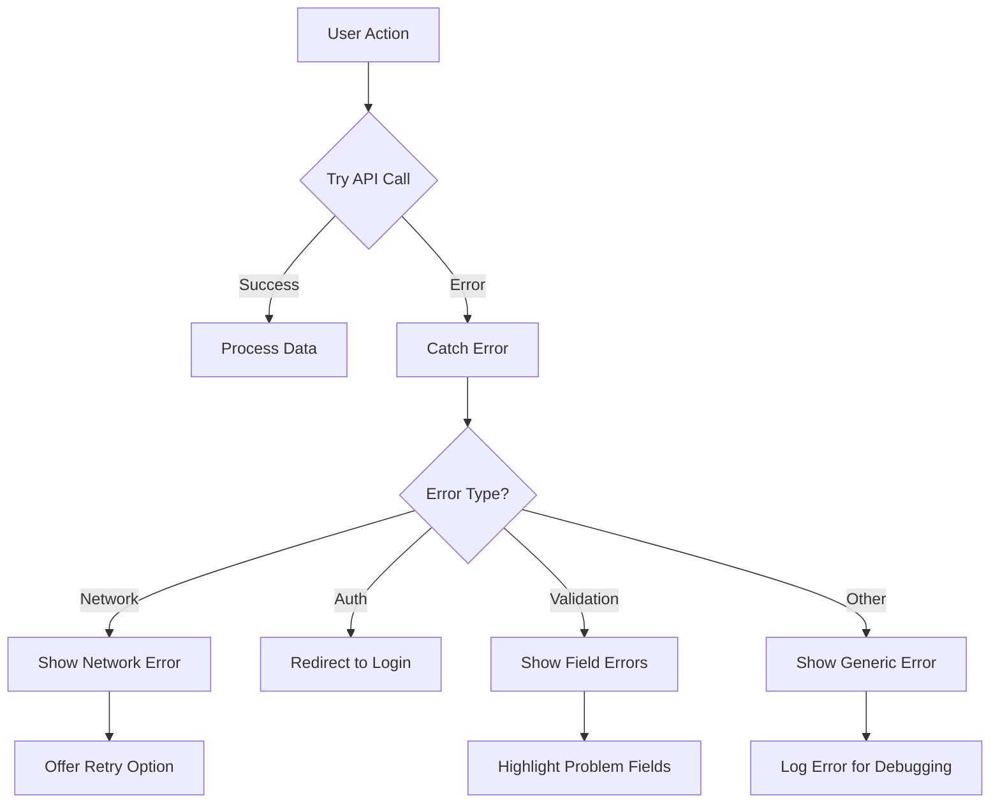

# Vue.js Error Handling

## Introduction

Error handling is a critical aspect of developing robust Vue.js applications. When left unhandled, errors can lead to poor user experience, difficult debugging sessions, and potentially broken applications. In this guide, we'll explore various techniques to effectively handle errors in Vue.js applications, from component-level error handling to global error management.

Proper error handling serves multiple purposes:
- Prevents application crashes
- Provides meaningful feedback to users
- Makes debugging easier
- Improves application reliability

## Basic Error Handling Techniques

### Try-Catch Blocks

The most fundamental error handling technique in JavaScript is using try-catch blocks, which works perfectly in Vue.js methods:

```js
export default {
  methods: {
    fetchData() {
      try {
        // Code that might throw an error
        const data = JSON.parse(someInvalidJSON);
        return data;
      } catch (error) {
        console.error('Failed to parse JSON:', error);
        // Handle error appropriately
        return null;
      }
    }
  }
}
```

This approach is ideal for synchronous operations where errors can be anticipated.

### Handling Async Errors with Async/Await

For asynchronous operations, combining try-catch with async/await provides an elegant solution:

```js
export default {
  methods: {
    async fetchUserData() {
      try {
        this.isLoading = true;
        const response = await fetch('https://api.example.com/user');
        
        if (!response.ok) {
          throw new Error(`HTTP error! Status: ${response.status}`);
        }
        
        this.userData = await response.json();
      } catch (error) {
        this.errorMessage = `Failed to fetch user data: ${error.message}`;
      } finally {
        this.isLoading = false;
      }
    }
  },
  data() {
    return {
      userData: null,
      errorMessage: null,
      isLoading: false
    };
  }
}
```

The above example demonstrates:
1. Setting a loading state
2. Making an API request
3. Handling potential errors
4. Ensuring the loading state is reset regardless of success or failure

## Component-Level Error Handling

### Error Boundaries with ErrorCaptured Hook

Vue provides the `errorCaptured` lifecycle hook to catch errors from descendant components:

```js
export default {
  name: 'ErrorBoundary',
  errorCaptured(error, vm, info) {
    // Handle the error
    this.hasError = true;
    this.error = {
      message: error.message,
      component: vm.$options.name,
      info: info
    };
    
    // Return false to prevent the error from propagating further
    return false;
  },
  data() {
    return {
      hasError: false,
      error: null
    };
  },
  template: `
    <div>
      <div v-if="hasError" class="error-container">
        <h2>Something went wrong</h2>
        <p>{{ error.message }}</p>
        <p>Component: {{ error.component }}</p>
        <button @click="hasError = false">Try Again</button>
      </div>
      <slot v-else></slot>
    </div>
  `
}
```

Usage example:

```html
<template>
  <div>
    <h1>My Application</h1>
    <error-boundary>
      <problematic-component />
    </error-boundary>
  </div>
</template>

<script>
import ErrorBoundary from './ErrorBoundary.vue';
import ProblematicComponent from './ProblematicComponent.vue';

export default {
  components: {
    ErrorBoundary,
    ProblematicComponent
  }
}
</script>
```

This pattern creates a safety net around components that might throw errors, preventing the entire application from crashing.

## Global Error Handling

### Vue Global Error Handler

Vue.js allows setting up a global error handler to catch uncaught errors throughout your application:

```js
// In your main.js file
import Vue from 'vue';
import App from './App.vue';

Vue.config.errorHandler = function(err, vm, info) {
  console.error('Global error caught:', err);
  console.log('Component:', vm);
  console.log('Error info:', info);
  
  // Log to an error tracking service like Sentry
  // logErrorToService(err, vm, info);
};

new Vue({
  render: h => h(App),
}).$mount('#app');
```

For Vue 3:

```js
// In your main.js file
import { createApp } from 'vue';
import App from './App.vue';

const app = createApp(App);

app.config.errorHandler = (err, vm, info) => {
  console.error('Global error caught:', err);
  console.log('Error info:', info);
  
  // Log to an error tracking service
};

app.mount('#app');
```

This global handler catches runtime errors in components, watchers, lifecycle hooks, and event handlers.

### Handling Promise Rejections

To capture unhandled promise rejections, you should also set up the `unhandledrejection` event handler:

```js
// In your main.js
window.addEventListener('unhandledrejection', event => {
  console.error('Unhandled promise rejection:', event.reason);
  
  // Optionally prevent the default browser behavior
  event.preventDefault();
});
```

## Practical Error Handling Patterns

### Loading and Error States

Managing loading and error states is crucial for user experience:

```html
<template>
  <div class="user-profile">
    <div v-if="loading" class="loading-spinner">
      Loading...
    </div>
    <div v-else-if="error" class="error-message">
      <h3>Error</h3>
      <p>{{ error }}</p>
      <button @click="fetchUser">Try Again</button>
    </div>
    <div v-else-if="user" class="user-details">
      <h2>{{ user.name }}</h2>
      <p>{{ user.email }}</p>
    </div>
  </div>
</template>

<script>
export default {
  data() {
    return {
      user: null,
      loading: false,
      error: null
    };
  },
  created() {
    this.fetchUser();
  },
  methods: {
    async fetchUser() {
      this.loading = true;
      this.error = null;
      
      try {
        const response = await fetch(`/api/users/${this.$route.params.id}`);
        
        if (!response.ok) {
          throw new Error(`Failed to fetch user: ${response.statusText}`);
        }
        
        this.user = await response.json();
      } catch (err) {
        this.error = err.message;
      } finally {
        this.loading = false;
      }
    }
  }
};
</script>
```

This pattern clearly separates different states of the component: loading, error, and success, improving user experience by providing appropriate feedback.

### Reusable Error Handling with Composables (Vue 3)

In Vue 3, we can create reusable error handling logic using the Composition API:

```js
// useAsyncRequest.js
import { ref } from 'vue';

export function useAsyncRequest(requestFunction) {
  const data = ref(null);
  const error = ref(null);
  const loading = ref(false);

  async function execute(...args) {
    loading.value = true;
    data.value = null;
    error.value = null;
    
    try {
      data.value = await requestFunction(...args);
      return data.value;
    } catch (err) {
      error.value = err.message || 'Something went wrong';
      throw err;
    } finally {
      loading.value = false;
    }
  }

  return { data, error, loading, execute };
}
```

Usage example:

```html
<template>
  <div>
    <div v-if="loading">Loading posts...</div>
    <div v-else-if="error" class="error">{{ error }}</div>
    <div v-else>
      <h2>Posts</h2>
      <ul>
        <li v-for="post in data" :key="post.id">{{ post.title }}</li>
      </ul>
      <button @click="loadPosts">Reload</button>
    </div>
  </div>
</template>

<script>
import { onMounted } from 'vue';
import { useAsyncRequest } from './useAsyncRequest';

export default {
  setup() {
    const fetchPosts = async () => {
      const response = await fetch('https://jsonplaceholder.typicode.com/posts');
      if (!response.ok) throw new Error('Failed to fetch posts');
      return response.json();
    };

    const { data, error, loading, execute: loadPosts } = useAsyncRequest(fetchPosts);

    onMounted(() => {
      loadPosts();
    });

    return {
      data,
      error,
      loading,
      loadPosts
    };
  }
};
</script>
```

This composable pattern promotes code reuse and provides consistent error handling across your application.

## Form Validation Error Handling

Form validation is another area where proper error handling is crucial:

```html
<template>
  <form @submit.prevent="submitForm">
    <div class="form-group">
      <label for="email">Email</label>
      <input 
        id="email" 
        v-model="form.email" 
        :class="{ 'is-invalid': errors.email }" 
        type="email"
      />
      <div v-if="errors.email" class="error-message">{{ errors.email }}</div>
    </div>
    
    <div class="form-group">
      <label for="password">Password</label>
      <input 
        id="password" 
        v-model="form.password" 
        :class="{ 'is-invalid': errors.password }" 
        type="password"
      />
      <div v-if="errors.password" class="error-message">{{ errors.password }}</div>
    </div>
    
    <button type="submit" :disabled="isSubmitting">
      {{ isSubmitting ? 'Submitting...' : 'Submit' }}
    </button>
    
    <div v-if="formError" class="form-error">{{ formError }}</div>
  </form>
</template>

<script>
export default {
  data() {
    return {
      form: {
        email: '',
        password: ''
      },
      errors: {
        email: null,
        password: null
      },
      formError: null,
      isSubmitting: false
    };
  },
  methods: {
    validateForm() {
      let isValid = true;
      this.errors = {
        email: null,
        password: null
      };
      
      if (!this.form.email) {
        this.errors.email = 'Email is required';
        isValid = false;
      } else if (!/^\w+([.-]?\w+)*@\w+([.-]?\w+)*(\.\w{2,3})+$/.test(this.form.email)) {
        this.errors.email = 'Please enter a valid email address';
        isValid = false;
      }
      
      if (!this.form.password) {
        this.errors.password = 'Password is required';
        isValid = false;
      } else if (this.form.password.length < 6) {
        this.errors.password = 'Password must be at least 6 characters';
        isValid = false;
      }
      
      return isValid;
    },
    async submitForm() {
      if (!this.validateForm()) {
        return;
      }
      
      this.isSubmitting = true;
      this.formError = null;
      
      try {
        // Example API call
        const response = await fetch('/api/login', {
          method: 'POST',
          headers: {
            'Content-Type': 'application/json'
          },
          body: JSON.stringify(this.form)
        });
        
        const data = await response.json();
        
        if (!response.ok) {
          throw new Error(data.message || 'Login failed');
        }
        
        // Handle successful login
        this.$router.push('/dashboard');
      } catch (error) {
        this.formError = error.message;
      } finally {
        this.isSubmitting = false;
      }
    }
  }
};
</script>
```

This example demonstrates:
1. Form validation with meaningful error messages
2. Conditional styling for invalid fields
3. Displaying backend API errors
4. Disabling submission during API calls
5. Proper error handling during submission

## Strategies for Third-Party Integration Errors

When integrating third-party libraries or services, proper error handling is essential:

```html
<template>
  <div>
    <div ref="mapContainer" class="map-container"></div>
    <div v-if="mapError" class="map-error">
      <p>{{ mapError }}</p>
      <button @click="initializeMap">Try Again</button>
    </div>
  </div>
</template>

<script>
export default {
  data() {
    return {
      map: null,
      mapError: null
    };
  },
  mounted() {
    this.initializeMap();
  },
  methods: {
    initializeMap() {
      this.mapError = null;
      
      // Check if third-party library exists
      if (!window.GoogleMaps) {
        this.loadGoogleMapsScript()
          .then(() => this.renderMap())
          .catch(error => {
            this.mapError = `Failed to load Google Maps: ${error.message}`;
          });
      } else {
        this.renderMap();
      }
    },
    loadGoogleMapsScript() {
      return new Promise((resolve, reject) => {
        const script = document.createElement('script');
        script.src = 'https://maps.googleapis.com/maps/api/js?key=YOUR_API_KEY';
        script.async = true;
        script.defer = true;
        
        script.onload = () => resolve();
        script.onerror = () => reject(new Error('Google Maps failed to load'));
        
        document.head.appendChild(script);
      });
    },
    renderMap() {
      try {
        // Initialize map
        this.map = new window.GoogleMaps.Map(this.$refs.mapContainer, {
          center: { lat: 40.7128, lng: -74.0060 },
          zoom: 12
        });
      } catch (error) {
        this.mapError = `Error initializing map: ${error.message}`;
      }
    }
  }
};
</script>
```

This example shows how to:
1. Handle potential missing third-party libraries
2. Gracefully fail if loading scripts fails
3. Provide users with retry options
4. Catch initialization errors

## Error Handling Flow

Here's a visualization of an error handling flow in a Vue application:



## Summary

Effective error handling in Vue.js applications is crucial for creating robust, user-friendly applications. In this guide, we've covered:

1. Basic error handling techniques using try-catch blocks
2. Component-level error handling with the `errorCaptured` hook
3. Global error handling with Vue's error handler configuration
4. Practical patterns for loading states and error feedback
5. Creating reusable error handling with composables
6. Form validation error handling
7. Strategies for third-party integration error handling

By implementing these strategies, you'll create more resilient Vue applications that provide better user experiences and are easier to debug and maintain.

## Additional Resources

- [Vue.js Error Handling Documentation](https://vuejs.org/v2/api/#errorHandler)
- [Vue 3 Error Handling](https://v3.vuejs.org/guide/migration/global-api.html#config-errorhandler)
- [JavaScript Error Handling Best Practices](https://developer.mozilla.org/en-US/docs/Web/JavaScript/Guide/Control_flow_and_error_handling)

## Exercises

1. **Basic Error Handler**: Create a simple component that fetches data from an API and implements proper error handling for both network errors and invalid responses.

2. **Error Boundary Component**: Build an `ErrorBoundary` component that can wrap other components and display an error UI if descendant components throw errors.

3. **Form Validation**: Create a registration form with client-side validation that provides detailed error messages and handles server validation errors.

4. **Error Service**: Implement a centralized error logging service that captures errors throughout your Vue application and formats them for submission to a hypothetical backend logging service.

5. **Composables Practice**: Convert the loading state pattern into a reusable composable that can be used with any async operation in your Vue 3 application.