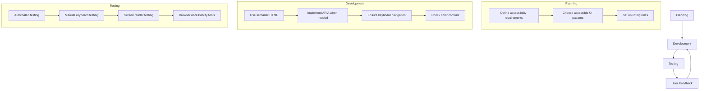

# Vue.js Accessibility

## Introduction

Accessibility (often abbreviated as a11y) refers to making websites and web applications usable by people of all abilities and disabilities. When developing Vue.js applications, ensuring accessibility should be an integral part of your development workflow rather than an afterthought.

This guide will walk you through best practices, common accessibility issues, and Vue-specific techniques to make your applications accessible to everyone. By following these practices, you'll not only serve users with disabilities but also improve the overall user experience for all users, meet legal requirements in many jurisdictions, and enhance your application's SEO.

## Why Accessibility Matters

- **Inclusivity**: Around 15% of the world's population lives with some form of disability.
- **Legal requirements**: Many countries have laws requiring digital accessibility (ADA in the US, EAA in Europe).
- **Better UX for everyone**: Features like keyboard navigation and clear contrast benefit all users.
- **SEO benefits**: Many accessibility practices align with SEO best practices.

## Basic Accessibility Principles for Vue.js

### Semantic HTML

Vue allows you to use all native HTML elements. Always prefer semantic HTML elements over generic `div` or `span` elements when appropriate.

**Not accessible:**

```html
<template>
  <div @click="navigate">Go to Dashboard</div>
</template>
```

**Accessible:**

```html
<template>
  <button @click="navigate">Go to Dashboard</button>
</template>
```

Using the correct semantic element (`button` instead of `div`) provides:
- Keyboard accessibility (users can tab to buttons and activate with Enter/Space)
- Proper role information for screen readers
- Focus states by default

### ARIA Attributes

ARIA (Accessible Rich Internet Applications) attributes enhance accessibility when native HTML semantics aren't enough. Use them wisely in your Vue templates.

```html
<template>
  <div 
    role="alert" 
    aria-live="assertive" 
    v-if="showError"
  >
    {{ errorMessage }}
  </div>
</template>
```

This example creates an alert that screen readers will announce immediately when it appears.

### Focus Management

Proper focus management is crucial for keyboard users. Vue's lifecycle hooks can help manage focus effectively:

```html
<template>
  <div>
    <button @click="openDialog">Open Dialog</button>
    <div v-if="isDialogOpen" class="dialog">
      <h2 ref="dialogTitle">Important Information</h2>
      <p>This is an important message.</p>
      <button @click="closeDialog" ref="closeButton">Close</button>
    </div>
  </div>
</template>

<script>
export default {
  data() {
    return {
      isDialogOpen: false
    }
  },
  methods: {
    openDialog() {
      this.isDialogOpen = true;
      // Use nextTick to ensure DOM is updated before focus
      this.$nextTick(() => {
        this.$refs.closeButton.focus();
      });
    },
    closeDialog() {
      this.isDialogOpen = false;
      // Return focus to the trigger button
      document.querySelector('button').focus();
    }
  }
}
</script>
```

## Vue-Specific Accessibility Features

### Binding Dynamic ARIA Attributes

Vue's binding syntax makes it easy to connect your component's state to ARIA attributes:

```html
<template>
  <button 
    :aria-expanded="isExpanded" 
    @click="toggleExpand"
  >
    {{ isExpanded ? 'Collapse' : 'Expand' }} Section
  </button>
  <div v-show="isExpanded">
    <p>Additional content here...</p>
  </div>
</template>

<script>
export default {
  data() {
    return {
      isExpanded: false
    }
  },
  methods: {
    toggleExpand() {
      this.isExpanded = !this.isExpanded;
    }
  }
}
</script>
```

### Accessible Form Labels

Always associate labels with form controls. In Vue, you can do this easily:

```html
<template>
  <div>
    <label :for="uniqueId">Email address:</label>
    <input 
      :id="uniqueId" 
      type="email" 
      v-model="email" 
      aria-describedby="emailHelp"
    />
    <p id="emailHelp">We'll never share your email with anyone else.</p>
  </div>
</template>

<script>
export default {
  data() {
    return {
      email: '',
      uniqueId: `email-${this._uid}` // Generate unique ID for this component instance
    }
  }
}
</script>
```

## Creating Accessible Custom Components

### Implementing Keyboard Navigation

When creating custom interactive components, ensure they can be operated with a keyboard:

```html
<template>
  <div 
    class="custom-dropdown"
    @keydown.down.prevent="highlightNextItem"
    @keydown.up.prevent="highlightPrevItem"
    @keydown.enter.prevent="selectHighlighted"
    @keydown.esc.prevent="closeDropdown"
    tabindex="0"
    role="listbox"
    :aria-expanded="isOpen"
    :aria-activedescendant="highlightedItemId"
  >
    <div @click="toggleDropdown">{{ selectedOption || 'Select an option' }}</div>
    
    <ul v-if="isOpen" class="options">
      <li 
        v-for="(option, index) in options" 
        :key="index"
        :id="`option-${index}`"
        role="option"
        :aria-selected="selectedOption === option"
        :class="{ highlighted: highlightedIndex === index }"
        @click="selectOption(option, index)"
      >
        {{ option }}
      </li>
    </ul>
  </div>
</template>

<script>
export default {
  props: {
    options: {
      type: Array,
      required: true
    }
  },
  data() {
    return {
      isOpen: false,
      selectedOption: null,
      highlightedIndex: -1
    }
  },
  computed: {
    highlightedItemId() {
      return this.highlightedIndex >= 0 ? `option-${this.highlightedIndex}` : '';
    }
  },
  methods: {
    toggleDropdown() {
      this.isOpen = !this.isOpen;
      if (this.isOpen && this.options.length > 0) {
        this.highlightedIndex = 0;
      }
    },
    closeDropdown() {
      this.isOpen = false;
      this.highlightedIndex = -1;
    },
    selectOption(option, index) {
      this.selectedOption = option;
      this.closeDropdown();
      this.$emit('option-selected', option);
    },
    selectHighlighted() {
      if (this.highlightedIndex >= 0) {
        this.selectOption(this.options[this.highlightedIndex], this.highlightedIndex);
      }
    },
    highlightNextItem() {
      if (!this.isOpen) {
        this.toggleDropdown();
        return;
      }
      if (this.highlightedIndex < this.options.length - 1) {
        this.highlightedIndex++;
      }
    },
    highlightPrevItem() {
      if (this.highlightedIndex > 0) {
        this.highlightedIndex--;
      }
    }
  }
}
</script>

<style scoped>
.highlighted {
  background-color: #eee;
}
.custom-dropdown {
  position: relative;
  width: 200px;
}
.options {
  position: absolute;
  width: 100%;
  list-style: none;
  padding: 0;
  margin: 0;
  border: 1px solid #ccc;
}
</style>
```

## Testing Accessibility in Vue Applications

### Automated Testing

You can use the [axe-core](https://github.com/dequelabs/axe-core) library with Vue Test Utils for automated accessibility testing:

```javascript
import { mount } from '@vue/test-utils'
import { axe, toHaveNoViolations } from 'jest-axe'
import MyComponent from '@/components/MyComponent.vue'

expect.extend(toHaveNoViolations)

describe('MyComponent', () => {
  it('should have no accessibility violations', async () => {
    const wrapper = mount(MyComponent)
    const results = await axe(wrapper.element)
    expect(results).toHaveNoViolations()
  })
})
```

### Vue Directives for Accessibility

Creating custom directives can help enforce accessibility practices across your Vue application:

```javascript
// src/directives/a11y.js
export const focusable = {
  inserted: (el) => {
    el.setAttribute('tabindex', '0')
  }
}

export const screenReaderOnly = {
  inserted: (el) => {
    el.style.position = 'absolute'
    el.style.width = '1px'
    el.style.height = '1px'
    el.style.padding = '0'
    el.style.overflow = 'hidden'
    el.style.clip = 'rect(0, 0, 0, 0)'
    el.style.whiteSpace = 'nowrap'
    el.style.border = '0'
  }
}
```

Using these directives in your components:

```html
<template>
  <div>
    <button @click="showHelp">Need Help?</button>
    <div v-if="helpVisible">
      <span v-screen-reader-only>Beginning of help section</span>
      <p>This is the help content...</p>
      <div v-focusable @keyup.esc="hideHelp">
        Press ESC to close
      </div>
      <span v-screen-reader-only>End of help section</span>
    </div>
  </div>
</template>

<script>
import { focusable, screenReaderOnly } from '@/directives/a11y'

export default {
  directives: {
    focusable,
    'screen-reader-only': screenReaderOnly
  },
  data() {
    return {
      helpVisible: false
    }
  },
  methods: {
    showHelp() {
      this.helpVisible = true
    },
    hideHelp() {
      this.helpVisible = false
    }
  }
}
</script>
```

## Real-World Example: Accessible Tab Component

Here's a complete example of an accessible tab component in Vue:

```html
<template>
  <div class="tabs-component">
    <div role="tablist" class="tabs">
      <button
        v-for="(tab, index) in tabs"
        :key="index"
        role="tab"
        :id="`tab-${index}`"
        :aria-selected="activeTab === index"
        :aria-controls="`panel-${index}`"
        :tabindex="activeTab === index ? 0 : -1"
        class="tab-button"
        :class="{ active: activeTab === index }"
        @click="activateTab(index)"
        @keydown.right.prevent="focusNextTab"
        @keydown.left.prevent="focusPrevTab"
        @keydown.home.prevent="focusFirstTab"
        @keydown.end.prevent="focusLastTab"
        ref="tabButtons"
      >
        {{ tab.title }}
      </button>
    </div>

    <div
      v-for="(tab, index) in tabs"
      :key="`panel-${index}`"
      role="tabpanel"
      :id="`panel-${index}`"
      :aria-labelledby="`tab-${index}`"
      :hidden="activeTab !== index"
      class="tab-panel"
    >
      {{ tab.content }}
    </div>
  </div>
</template>

<script>
export default {
  name: 'AccessibleTabs',
  props: {
    tabs: {
      type: Array,
      required: true,
      validator: (tabs) => tabs.every(tab => typeof tab.title === 'string' && typeof tab.content === 'string')
    }
  },
  data() {
    return {
      activeTab: 0
    }
  },
  methods: {
    activateTab(index) {
      this.activeTab = index
      this.$nextTick(() => {
        this.$refs.tabButtons[index].focus()
      })
    },
    focusNextTab() {
      const next = this.activeTab < this.tabs.length - 1 ? this.activeTab + 1 : 0
      this.activateTab(next)
    },
    focusPrevTab() {
      const prev = this.activeTab > 0 ? this.activeTab - 1 : this.tabs.length - 1
      this.activateTab(prev)
    },
    focusFirstTab() {
      this.activateTab(0)
    },
    focusLastTab() {
      this.activateTab(this.tabs.length - 1)
    }
  }
}
</script>

<style scoped>
.tabs-component {
  margin: 20px 0;
}
.tabs {
  display: flex;
  border-bottom: 1px solid #ccc;
}
.tab-button {
  padding: 10px 15px;
  border: none;
  background: none;
  cursor: pointer;
}
.tab-button.active {
  border-bottom: 2px solid #42b983;
  font-weight: bold;
}
.tab-button:hover, .tab-button:focus {
  background-color: #f5f5f5;
  outline: 2px solid #42b983;
}
.tab-panel {
  padding: 15px;
}
</style>
```

Usage of the tab component:

```html
<template>
  <div>
    <h1>Product Information</h1>
    <AccessibleTabs :tabs="productTabs" />
  </div>
</template>

<script>
import AccessibleTabs from '@/components/AccessibleTabs.vue'

export default {
  components: {
    AccessibleTabs
  },
  data() {
    return {
      productTabs: [
        { title: 'Description', content: 'This is a fantastic product with many features.' },
        { title: 'Specifications', content: 'Weight: 2.5kg, Dimensions: 15x30x10cm' },
        { title: 'Reviews', content: 'Average rating: 4.5/5 stars based on 230 reviews.' }
      ]
    }
  }
}
</script>
```

## Accessibility Workflow in Vue Development

Here's a recommended workflow for maintaining accessibility in your Vue.js projects:



## Tools and Resources

### Vue Accessibility Tools

- **vue-axe**: Accessibility auditing during development
- **vue-announcer**: Screen reader announcements in Vue
- **eslint-plugin-vue-a11y**: ESLint plugin for Vue.js accessibility rules

### Setting up vue-axe for Development

```javascript
// main.js
import Vue from 'vue'
import App from './App.vue'

if (process.env.NODE_ENV !== 'production') {
  const VueAxe = require('vue-axe').default
  Vue.use(VueAxe, {
    config: {
      // your axe-core configuration
      rules: [
        { id: 'heading-order', enabled: true },
        { id: 'label-title-only', enabled: true }
      ]
    }
  })
}

new Vue({
  render: h => h(App)
}).$mount('#app')
```

## Common Pitfalls and How to Avoid Them

### 1. Neglecting keyboard users

**Problem**: Interactive elements created with `div` or `span` aren't keyboard accessible.

**Solution**: Use native HTML elements like `button`, `a`, or add proper keyboard event handling and ARIA roles.

### 2. Forgetting form labels

**Problem**: Form inputs without associated labels are inaccessible to screen reader users.

**Solution**: Always use `<label>` elements with `for` attributes or wrap inputs in labels.

### 3. Low color contrast

**Problem**: Text with poor contrast against its background is hard to read for many users.

**Solution**: Use tools like the Chrome DevTools color contrast checker and ensure a minimum contrast ratio of 4.5:1.

### 4. Using v-if/v-show without announcing changes

**Problem**: Dynamic content changes aren't announced to screen reader users.

**Solution**: Use ARIA live regions or a dedicated announcement component to notify users of important changes.

## Summary

Accessibility in Vue.js applications isn't just a checkbox to tick—it's an ongoing commitment to creating inclusive user experiences. The Vue framework provides all the tools needed to build accessible applications, but it requires developers to be mindful of accessibility best practices. 

By following the guidelines in this article, you can create Vue applications that are usable by everyone, regardless of their abilities or disabilities. Remember that accessible applications benefit all users, not just those with disabilities.

## Exercises

1. Take an existing Vue component you've built and perform an accessibility audit using browser developer tools.
2. Refactor a non-accessible component (e.g., a custom dropdown built with divs) to make it fully accessible.
3. Create a custom Vue directive that ensures elements have appropriate contrast ratios.
4. Implement keyboard navigation for a complex component like a data table or a datepicker.
5. Add automated accessibility testing to your build pipeline using jest-axe or similar tools.

## Additional Resources

- [Web Content Accessibility Guidelines (WCAG)](https://www.w3.org/WAI/standards-guidelines/wcag/)
- [The A11Y Project](https://www.a11yproject.com/)
- [MDN Web Accessibility Guide](https://developer.mozilla.org/en-US/docs/Web/Accessibility)
- [Vue.js Official Accessibility Guide](https://v3.vuejs.org/guide/a11y-basics.html)