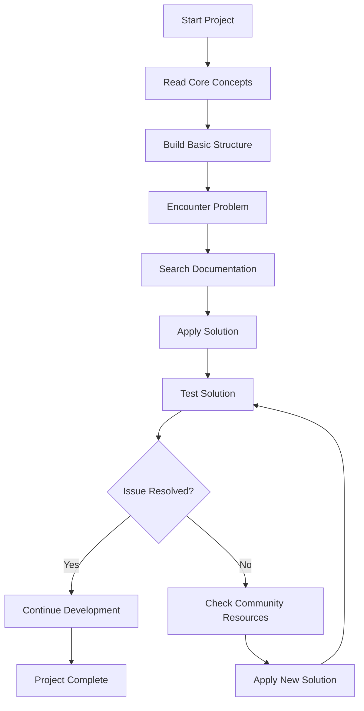

# Vue.js Documentation

## Introduction

Documentation is a crucial resource for any developer, especially when working with frameworks like Vue.js. As a beginner, navigating through documentation might seem overwhelming, but mastering this skill will significantly enhance your development experience and productivity. Vue.js is known for its excellent documentation that caters to both beginners and experienced developers.

In this guide, we'll explore how to effectively use Vue.js documentation, understand its structure, and apply best practices for referencing it during development.

## Understanding Vue.js Documentation Structure

The Vue.js documentation is organized in a logical manner that helps developers find what they need quickly. Let's break down its structure:

### 1. Main Sections

- **Essentials**: Core concepts and features
- **Components In-Depth**: Detailed component usage
- **Reusability & Composition**: Code reuse patterns
- **Advanced Topics**: Advanced features and techniques
- **Ecosystem**: Related libraries and tools

### 2. API Reference

The API reference provides detailed information about:
- Global configuration
- Global API
- Options API
- Composition API
- Built-in directives
- Built-in components
- Special elements

## How to Effectively Use Vue.js Documentation

### Finding Information Quickly

One of the most important skills is knowing how to search for information efficiently:

```js
// Example: If you're looking for information about lifecycle hooks
// 1. Use the search feature in the documentation
// 2. Or navigate to: Guide > Essentials > Lifecycle Hooks
// 3. Or directly to the API section for complete reference
```

### Understanding Code Examples

Vue.js documentation includes many code examples that demonstrate concepts:

```html
<!-- Documentation Example: Component Registration -->
<script>
// Global registration
Vue.component('my-component', {
  template: '<div>A custom component!</div>'
})

// Local registration
const app = new Vue({
  components: {
    'my-component': {
      template: '<div>A locally registered component!</div>'
    }
  }
})
</script>
```

Try to recreate these examples in your own projects to solidify your understanding.

## Best Practices for Using Documentation

### 1. Start with Tutorials for Concepts

When learning a new concept, start with the guide/tutorial sections before diving into the API reference.

For example, to learn about Vue Router:

1. First, read the introduction and guide
2. Then, explore examples
3. Finally, refer to the API reference when implementing

### 2. Bookmark Frequently Used Sections

Create bookmarks for sections you frequently reference:

- Component Registration
- Lifecycle Hooks
- Computed Properties and Watchers
- Class and Style Bindings
- Event Handling

### 3. Use the Playground

Vue.js provides an online playground (JSFiddle/CodePen examples) throughout the documentation. Use these to experiment with code:

```html
<!-- Try modifying this code in the Vue playground -->
<div id="app">
  <p>{{ message }}</p>
  <button @click="reverseMessage">Reverse Message</button>
</div>

<script>
new Vue({
  el: '#app',
  data: {
    message: 'Hello Vue.js!'
  },
  methods: {
    reverseMessage() {
      this.message = this.message.split('').reverse().join('')
    }
  }
})
</script>
```

### 4. Version-Specific Documentation

Always check which version of Vue.js the documentation refers to:

```js
// Vue 2.x syntax
new Vue({
  data: {
    count: 0
  }
})

// Vue 3.x syntax
createApp({
  data() {
    return {
      count: 0
    }
  }
})
```

## Practical Example: Using Documentation for Problem-Solving

Let's walk through a practical example of how to use Vue.js documentation to solve a common problem.

**Problem**: You need to implement a component that filters a list of items based on user input.

**Solution using documentation**:

1. Search the documentation for "filtering lists"
2. Find relevant sections on list rendering and computed properties
3. Implement the solution based on examples:

```html
<template>
  <div>
    <input v-model="searchText" placeholder="Search fruits...">
    <ul>
      <li v-for="fruit in filteredFruits" :key="fruit">{{ fruit }}</li>
    </ul>
  </div>
</template>

<script>
export default {
  data() {
    return {
      searchText: '',
      fruits: ['Apple', 'Banana', 'Orange', 'Mango', 'Pineapple', 'Grape']
    }
  },
  computed: {
    filteredFruits() {
      return this.fruits.filter(fruit => 
        fruit.toLowerCase().includes(this.searchText.toLowerCase())
      )
    }
  }
}
</script>
```

This solution combines knowledge from multiple documentation sections:
- `v-model` for two-way binding
- `v-for` for list rendering
- Computed properties for filtering data

## Common Documentation Sections for Beginners

### 1. Installation and Setup

```bash
# NPM
npm install vue

# Using Vue CLI
npm install -g @vue/cli
vue create my-project
```

### 2. Template Syntax

```html
<div>
  <!-- Text interpolation -->
  <span>Message: {{ msg }}</span>

  <!-- Directive -->
  <p v-if="seen">Now you see me</p>

  <!-- Binding attributes -->
  <a v-bind:href="url">Link</a>
  <!-- Shorthand -->
  <a :href="url">Link</a>

  <!-- Event handling -->
  <button v-on:click="doSomething">Click me</button>
  <!-- Shorthand -->
  <button @click="doSomething">Click me</button>
</div>
```

### 3. Component Basics

```html
// MyComponent.vue
<template>
  <div class="component">
    <h2>{{ title }}</h2>
    <slot></slot>
  </div>
</template>

<script>
export default {
  props: {
    title: {
      type: String,
      required: true
    }
  }
}
</script>

<style scoped>
.component {
  border: 1px solid #ccc;
  padding: 10px;
  margin: 10px 0;
}
</style>
```

## Documentation Development Workflow

Here's a recommended workflow integrating Vue.js documentation into your development process:



## Summary

The Vue.js documentation is a comprehensive resource designed to help developers of all skill levels. By understanding its structure and adopting best practices for using it, you can significantly accelerate your learning process and become more efficient at solving problems.

Remember these key points:
- Start with tutorials for new concepts before diving into API references
- Utilize the interactive examples and playgrounds
- Be mindful of version differences
- Combine knowledge from different sections to solve complex problems
- Bookmark frequently used sections for quick reference

## Additional Resources

1. **Official Vue.js Documentation**: Always the primary and most up-to-date resource
2. **Vue Mastery**: Video courses on Vue.js (some free content available)
3. **Vue School**: Interactive lessons for learning Vue.js
4. **Vue.js Cookbook**: Practical recipes for common scenarios
5. **Vue.js Style Guide**: Best practices for writing maintainable Vue code

## Exercises

1. Find three different ways to register a component in Vue.js using the documentation.
2. Use the documentation to implement a simple form with validation.
3. Find information on how to create custom directives and create a simple directive that changes text color.
4. Research the Vue Router documentation and implement a basic navigation system.
5. Compare the Options API and Composition API documentation sections and list the key differences.

By consistently referencing the documentation and applying what you learn, you'll develop a strong foundation in Vue.js and become a more independent and efficient developer.