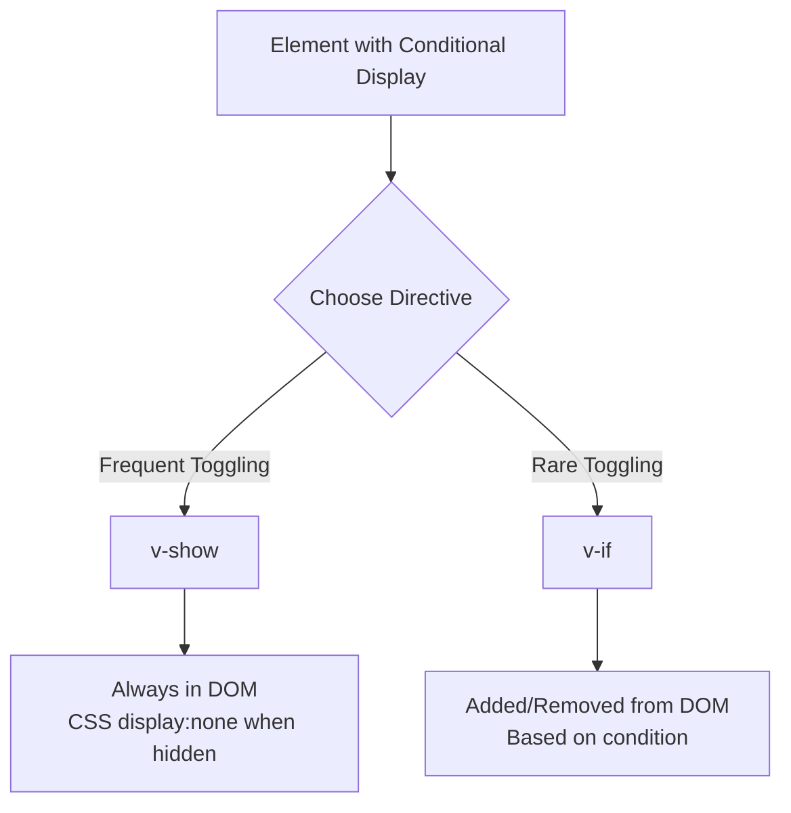

# Vue.js v-show Directive

## Introduction

When building interactive web applications, one of the most common needs is to show or hide elements based on certain conditions. Vue.js offers two primary ways to handle this: the `v-if` directive and the `v-show` directive. 

In this tutorial, we'll focus on the `v-show` directive, which is a simple yet powerful tool for toggling an element's visibility without removing it from the DOM. This is particularly useful for elements that need to be toggled frequently, as it has better performance implications than repeatedly adding and removing elements.

## What is the v-show Directive?

The `v-show` directive is used to conditionally display an element based on the truthiness of an expression. Unlike `v-if` which actually creates or destroys elements, `v-show` simply toggles the CSS `display` property of the element.

### Basic Syntax

```html
<element v-show="condition">Content</element>
```

When the `condition` evaluates to a truthy value, the element will be visible. When it evaluates to a falsy value, the element will be hidden (but still present in the DOM).

## How v-show Works

Under the hood, `v-show` works by manipulating the CSS `display` property of an element:

- When the condition is `true`, the element is displayed normally (no inline style)
- When the condition is `false`, the element is hidden with `display: none`

Let's see a basic example:

```html
<template>
  <div>
    <p v-show="isVisible">This text will be visible based on the value of isVisible</p>
    <button @click="toggleVisibility">Toggle Visibility</button>
  </div>
</template>

<script>
export default {
  data() {
    return {
      isVisible: true
    }
  },
  methods: {
    toggleVisibility() {
      this.isVisible = !this.isVisible;
    }
  }
}
</script>
```

In this example, clicking the button will toggle the visibility of the paragraph by switching the `isVisible` data property between `true` and `false`.

## v-show vs v-if: Understanding the Difference

It's important to understand when to use `v-show` versus `v-if`:

| Feature | v-show | v-if |
|---------|--------|------|
| Initial cost | Higher (element is always rendered) | Lower (element not rendered if condition is initially false) |
| Toggle cost | Lower (just toggles CSS property) | Higher (creates/destroys DOM elements) |
| DOM presence | Always present, just hidden | Only present when condition is true |
| Template compilation | Always compiled | Lazy compiled |
| Suitable for | Elements toggled frequently | Elements rarely toggled |

### Visual Representation



## Practical Examples

### Example 1: Simple Toggle Button

```html
<template>
  <div class="container">
    <div v-show="isDetailsVisible" class="details-panel">
      <h2>User Details</h2>
      <p><strong>Name:</strong> John Doe</p>
      <p><strong>Email:</strong> john@example.com</p>
      <p><strong>Role:</strong> Administrator</p>
    </div>
    
    <button @click="isDetailsVisible = !isDetailsVisible">
      {{ isDetailsVisible ? 'Hide Details' : 'Show Details' }}
    </button>
  </div>
</template>

<script>
export default {
  data() {
    return {
      isDetailsVisible: false
    }
  }
}
</script>

<style scoped>
.details-panel {
  border: 1px solid #ddd;
  padding: 15px;
  margin-bottom: 10px;
  border-radius: 4px;
}
</style>
```

This example shows a details panel that can be toggled with a button. When hiding the panel, it's still in the DOM but not visible.

### Example 2: Mobile Menu Toggle

```html
<template>
  <div class="navbar">
    <div class="logo">MySite</div>
    
    <!-- Desktop Navigation (always visible) -->
    <nav class="desktop-nav">
      <a href="#home">Home</a>
      <a href="#about">About</a>
      <a href="#services">Services</a>
      <a href="#contact">Contact</a>
    </nav>
    
    <!-- Mobile Navigation Toggle Button -->
    <button class="menu-toggle" @click="isMobileMenuOpen = !isMobileMenuOpen">
      ☰ Menu
    </button>
    
    <!-- Mobile Navigation Dropdown -->
    <nav v-show="isMobileMenuOpen" class="mobile-nav">
      <a href="#home">Home</a>
      <a href="#about">About</a>
      <a href="#services">Services</a>
      <a href="#contact">Contact</a>
    </nav>
  </div>
</template>

<script>
export default {
  data() {
    return {
      isMobileMenuOpen: false
    }
  }
}
</script>

<style scoped>
.navbar {
  display: flex;
  flex-wrap: wrap;
  justify-content: space-between;
  padding: 15px;
  background: #333;
  color: white;
}

.desktop-nav {
  display: none;
}

.mobile-nav {
  width: 100%;
  background: #444;
  padding: 10px;
}

.mobile-nav a {
  display: block;
  padding: 10px;
  color: white;
  text-decoration: none;
}

.menu-toggle {
  background: none;
  border: none;
  color: white;
  font-size: 20px;
  cursor: pointer;
}

@media (min-width: 768px) {
  .desktop-nav {
    display: block;
  }
  .menu-toggle, .mobile-nav {
    display: none !important;
  }
}
</style>
```

This example shows a common mobile navigation pattern. On mobile devices, the menu is hidden by default and can be toggled with a button. Note how `v-show` is perfect for this use case because the menu will be toggled frequently.

### Example 3: Form Field Conditionals

```html
<template>
  <div class="form-container">
    <h2>Registration Form</h2>
    
    <div class="form-group">
      <label for="account-type">Account Type:</label>
      <select id="account-type" v-model="accountType">
        <option value="personal">Personal</option>
        <option value="business">Business</option>
      </select>
    </div>
    
    <!-- Basic fields for all account types -->
    <div class="form-group">
      <label for="name">Name:</label>
      <input type="text" id="name">
    </div>
    
    <div class="form-group">
      <label for="email">Email:</label>
      <input type="email" id="email">
    </div>
    
    <!-- Business-specific fields -->
    <div v-show="accountType === 'business'">
      <h3>Business Information</h3>
      
      <div class="form-group">
        <label for="company-name">Company Name:</label>
        <input type="text" id="company-name">
      </div>
      
      <div class="form-group">
        <label for="tax-id">Tax ID:</label>
        <input type="text" id="tax-id">
      </div>
      
      <div class="form-group">
        <label for="industry">Industry:</label>
        <select id="industry">
          <option value="tech">Technology</option>
          <option value="retail">Retail</option>
          <option value="healthcare">Healthcare</option>
          <option value="other">Other</option>
        </select>
      </div>
    </div>
    
    <button type="submit">Register</button>
  </div>
</template>

<script>
export default {
  data() {
    return {
      accountType: 'personal'
    }
  }
}
</script>

<style scoped>
.form-container {
  max-width: 500px;
  margin: 0 auto;
  padding: 20px;
}

.form-group {
  margin-bottom: 15px;
}

label {
  display: block;
  margin-bottom: 5px;
}

input, select {
  width: 100%;
  padding: 8px;
  border: 1px solid #ddd;
  border-radius: 4px;
}

button {
  background-color: #4CAF50;
  color: white;
  padding: 10px 15px;
  border: none;
  border-radius: 4px;
  cursor: pointer;
}
</style>
```

In this example, we use `v-show` to conditionally display business-specific form fields when the user selects "Business" as their account type. Since users might switch back and forth between account types during registration, using `v-show` is more efficient than `v-if` here.

## Best Practices for Using v-show

1. **Use `v-show` for frequently toggled elements**: If an element will be hidden and shown many times, `v-show` is more efficient.

2. **Consider initial page load**: If an element is likely to be hidden when the page loads and for a long time afterward, consider using `v-if` instead to avoid rendering it initially.

3. **Combine with computed properties**: For complex conditions, use a computed property:

```html
<template>
  <div v-show="shouldShowDashboard">
    <!-- Dashboard content -->
  </div>
</template>

<script>
export default {
  data() {
    return {
      userRole: 'guest',
      isLoggedIn: false
    }
  },
  computed: {
    shouldShowDashboard() {
      return this.isLoggedIn && (this.userRole === 'admin' || this.userRole === 'manager');
    }
  }
}
</script>
```

4. **Remember that `v-show` doesn't support `<template>` or `v-else`**: Unlike `v-if`, you can't use `v-show` with `<template>` tags or with `v-else`.

5. **Consider accessibility**: Elements hidden with `v-show` are still in the DOM, so ensure that hidden interactive elements aren't accidentally focusable via keyboard navigation.

## Summary

The `v-show` directive in Vue.js is a powerful tool for conditionally displaying elements based on changing conditions. It works by toggling the CSS `display` property rather than actually adding or removing elements from the DOM.

Key points to remember:

- Use `v-show` for elements that will be toggled frequently
- `v-show` has higher initial render cost but lower toggle cost compared to `v-if`
- Elements with `v-show` are always rendered in the DOM, just hidden when the condition is false
- `v-show` doesn't support `<template>` tags or `v-else` directives

By understanding the differences between `v-show` and `v-if`, you can make better decisions about which directive to use in different scenarios, leading to better performance and user experience in your Vue applications.

## Exercises

1. Create a simple image gallery where clicking on a thumbnail shows a larger version of the image using `v-show`.
2. Build a tabbed interface where clicking on different tab buttons shows different content panels.
3. Implement a FAQ page where clicking on questions toggles the visibility of answers.
4. Create a form with conditional sections that appear based on previous selections.
5. Compare the performance of `v-show` vs `v-if` in a scenario with 100 elements being toggled repeatedly.

## Additional Resources

- [Vue.js Official Documentation on v-show](https://v3.vuejs.org/guide/conditional.html#v-show)
- [Vue.js Guide on Conditional Rendering](https://v3.vuejs.org/guide/conditional.html)
- [Performance Comparison: v-if vs v-show](https://vuejs.org/guide/essentials/conditional.html#v-if-vs-v-show)