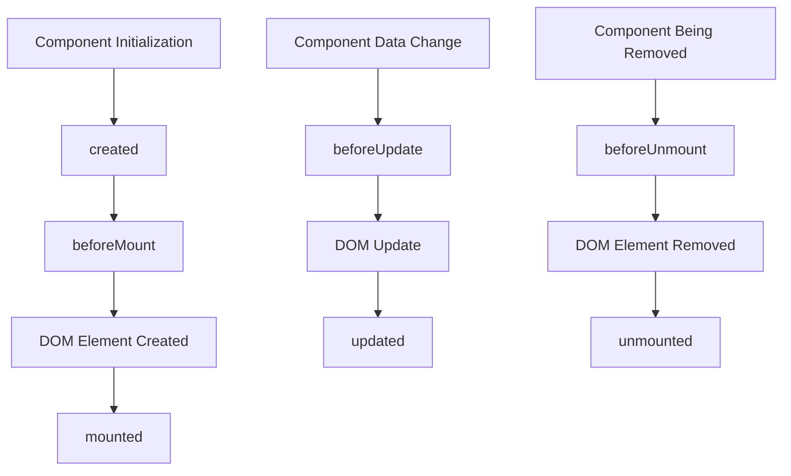

# Vue.js Custom Directives

## Introduction

While Vue.js provides several built-in directives like `v-if`, `v-for`, and `v-model` that cover most common use cases, sometimes you need special functionality that interacts directly with the DOM in ways not covered by these standard tools. Vue's custom directives system allows you to register your own directives to perform low-level DOM manipulations.

Custom directives are perfect when you need to:
- Access and manipulate DOM elements directly
- Create reusable DOM manipulation logic
- Integrate with third-party libraries that manipulate the DOM
- Implement behaviors not easily achievable with standard Vue features

## Understanding Custom Directives

### Basic Syntax

A Vue.js custom directive has the following registration syntax:

```js
// Global registration
app.directive('my-directive', {
  // Directive hooks go here
})

// Local registration in a component
export default {
  directives: {
    'my-directive': {
      // Directive hooks go here
    }
  }
}
```

And you use it in your template like this:

```html
<div v-my-directive></div>
```

## Directive Hooks

Custom directives have several lifecycle hooks that are called at different stages:

- `created`: Called before the element's attributes or event listeners are applied
- `beforeMount`: Called when the directive is first bound to the element
- `mounted`: Called after the element is inserted into the parent DOM
- `beforeUpdate`: Called before the containing component's VNode is updated
- `updated`: Called after the containing component's VNode and the children's VNodes have updated
- `beforeUnmount`: Called before the element is removed from the DOM
- `unmounted`: Called when the directive is unbound from the element

Each hook receives the following arguments:

- `el`: The element the directive is bound to
- `binding`: An object containing various properties related to the directive
- `vnode`: The virtual node representing the element
- `prevVnode`: The previous virtual node (only available in `beforeUpdate` and `updated`)

## Creating Your First Custom Directive

Let's start with a simple example - a directive that automatically focuses an input element when it appears on the page:

```js
// Global registration
app.directive('focus', {
  mounted(el) {
    el.focus()
  }
})
```

```html
<!-- Usage in a template -->
<input v-focus type="text" placeholder="I'll be focused automatically">
```

This directive will automatically focus the input element when it's inserted into the DOM.

## Passing Values to Custom Directives

You can pass values to your directives using arguments, modifiers, and values:

```js
app.directive('color', {
  mounted(el, binding) {
    // binding.value contains the value passed to the directive
    el.style.color = binding.value || 'blue'
  },
  updated(el, binding) {
    el.style.color = binding.value || 'blue'
  }
})
```

```html
<p v-color="'red'">This text will be red</p>
<p v-color="textColor">This text will use the textColor value from data</p>
```

## The Binding Object

The binding object provides several properties that give you information about how the directive was used:

- `value`: The value passed to the directive
- `oldValue`: The previous value (only available in `beforeUpdate` and `updated`)
- `arg`: Any arguments passed to the directive
- `modifiers`: An object containing any modifiers used
- `instance`: The component instance where the directive is used
- `dir`: The directive definition object

Here's an example using these properties:

```js
app.directive('highlight', {
  mounted(el, binding) {
    // Extract the properties from binding
    const { value, arg, modifiers } = binding
    
    // Default color is yellow
    let color = 'yellow'
    
    // If an argument is provided, use it as the color
    if (arg) {
      color = arg
    }
    
    // Apply background or text highlighting based on modifiers
    if (modifiers.background) {
      el.style.backgroundColor = value || color
    } else {
      el.style.color = value || color
    }
    
    // If bold modifier is present, make text bold
    if (modifiers.bold) {
      el.style.fontWeight = 'bold'
    }
  }
})
```

Usage examples:

```html
<!-- Basic usage with default color (yellow) -->
<p v-highlight>Highlighted text</p>

<!-- With a color argument -->
<p v-highlight:red>Red highlighted text</p>

<!-- With a dynamic value -->
<p v-highlight="color">Dynamic color</p>

<!-- With modifiers -->
<p v-highlight.background>Yellow background</p>
<p v-highlight:blue.bold.background>Bold text with blue background</p>
```

## Function Shorthand

For simple directives that only need the `mounted` and `updated` hooks with the same behavior, you can use the function shorthand:

```js
app.directive('simple', (el, binding) => {
  // This will be called for both mounted and updated
  el.textContent = binding.value
})
```

```html
<span v-simple="message"></span>
```

## Practical Examples

### Example 1: Clickable Outside Directive

This directive detects clicks outside of an element, which is useful for closing dropdowns or modals:

```js
app.directive('click-outside', {
  mounted(el, binding) {
    el._clickOutsideHandler = (event) => {
      // Check if the click was outside the element
      if (!(el === event.target || el.contains(event.target))) {
        // Call the provided method
        binding.value(event)
      }
    }
    document.addEventListener('click', el._clickOutsideHandler)
  },
  unmounted(el) {
    // Clean up event listener when element is removed
    document.removeEventListener('click', el._clickOutsideHandler)
    delete el._clickOutsideHandler
  }
})
```

Usage:

```html
<template>
  <div class="dropdown">
    <button @click="isOpen = !isOpen">Toggle Dropdown</button>
    <div v-if="isOpen" v-click-outside="closeDropdown" class="dropdown-menu">
      <a href="#">Option 1</a>
      <a href="#">Option 2</a>
      <a href="#">Option 3</a>
    </div>
  </div>
</template>

<script>
export default {
  data() {
    return {
      isOpen: false
    }
  },
  methods: {
    closeDropdown() {
      this.isOpen = false
    }
  }
}
</script>
```

### Example 2: Tooltip Directive

Here's a custom directive that creates a simple tooltip:

```js
app.directive('tooltip', {
  mounted(el, binding) {
    // Create the tooltip element
    const tooltip = document.createElement('div')
    tooltip.className = 'tooltip'
    tooltip.textContent = binding.value
    tooltip.style.display = 'none'
    
    // Position style
    tooltip.style.position = 'absolute'
    tooltip.style.padding = '6px 12px'
    tooltip.style.backgroundColor = 'rgba(0, 0, 0, 0.7)'
    tooltip.style.color = 'white'
    tooltip.style.borderRadius = '4px'
    tooltip.style.fontSize = '14px'
    tooltip.style.zIndex = '9999'
    
    // Add tooltip to the document body
    document.body.appendChild(tooltip)
    
    // Store tooltip reference
    el._tooltip = tooltip
    
    // Show the tooltip on mouseenter
    el.addEventListener('mouseenter', () => {
      const rect = el.getBoundingClientRect()
      tooltip.style.display = 'block'
      
      // Position the tooltip
      if (binding.arg === 'top') {
        tooltip.style.top = `${rect.top - tooltip.offsetHeight - 5}px`
        tooltip.style.left = `${rect.left + rect.width / 2 - tooltip.offsetWidth / 2}px`
      } else {
        tooltip.style.top = `${rect.bottom + 5}px`
        tooltip.style.left = `${rect.left + rect.width / 2 - tooltip.offsetWidth / 2}px`
      }
    })
    
    // Hide the tooltip on mouseleave
    el.addEventListener('mouseleave', () => {
      tooltip.style.display = 'none'
    })
  },
  updated(el, binding) {
    // Update tooltip text if it changes
    el._tooltip.textContent = binding.value
  },
  unmounted(el) {
    // Remove the tooltip when element is removed
    document.body.removeChild(el._tooltip)
    delete el._tooltip
  }
})
```

Usage:

```html
<button v-tooltip="'Delete this item'">Delete</button>
<button v-tooltip:top="'Edit this item'">Edit</button>
```

## Local Registration of Custom Directives

You can register directives locally within a specific component:

```html
<template>
  <div>
    <input v-local-focus>
  </div>
</template>

<script>
export default {
  directives: {
    'local-focus': {
      mounted(el) {
        el.focus()
      }
    }
  }
}
</script>
```

This is useful when the directive is only needed in a specific component and doesn't need to be available globally.

## Best Practices for Custom Directives

1. **Do one thing well**: Each directive should have a single, well-defined purpose

2. **Clean up after yourself**: Always remove event listeners and clean up any DOM manipulations in the `unmounted` hook

3. **Use computed properties or methods when possible**: Custom directives are for DOM manipulation - if you're just transforming data, consider other Vue features

4. **Name consistently**: Prefix your directives with a common name (like `v-app-*`) to avoid conflicts with future Vue directives

5. **Document your directives**: Add clear comments explaining what your directive does, what arguments and modifiers it accepts

## Directive Lifecycle Flow



## Summary

Custom directives in Vue.js provide a powerful way to create reusable DOM manipulation logic. They allow you to extend Vue's capabilities beyond the standard features, letting you interact directly with the DOM when necessary. With the various hooks and binding properties available, you can create complex behaviors that respond to changing data or element states.

Key points to remember:
- Use custom directives when you need direct DOM access
- Directives have lifecycle hooks that let you control when your code runs
- You can pass values, arguments, and modifiers to directives
- Always clean up resources in the unmounted hook
- Register directives globally or locally depending on your needs

## Exercises

1. Create a `v-longpress` directive that triggers a function when a user holds down on an element for more than 1 second.

2. Build a `v-animate` directive that applies a CSS animation when an element enters the viewport.

3. Implement a `v-copy` directive that copies text to the clipboard when clicked and shows a temporary success message.

4. Create a `v-resize` directive that watches for element size changes and calls a callback function.

5. Make a `v-scroll-lock` directive that prevents page scrolling when a modal is open.

## Additional Resources

- [Vue.js Official Documentation on Custom Directives](https://vuejs.org/guide/reusability/custom-directives.html)
- [Vue 3 Composition API with Custom Directives](https://v3.vuejs.org/api/application-api.html#directive)
- [Vue Mastery: Advanced Components Course](https://www.vuemastery.com/)
- [GitHub: Awesome Vue - Custom Directives](https://github.com/vuejs/awesome-vue#custom-directives)