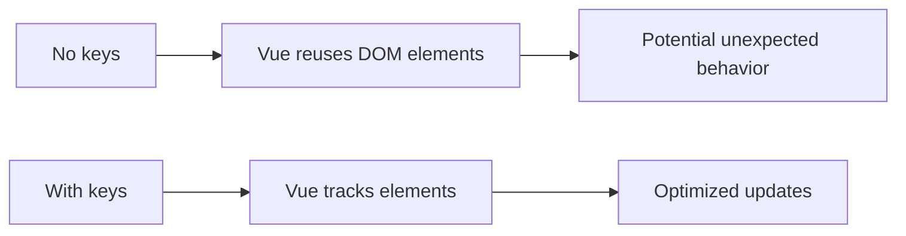

# Vue.js v-for Directive

## Introduction

The `v-for` directive is one of Vue.js's most powerful built-in directives. It allows you to render multiple elements based on an array or object's data. Whether you're creating a simple list, a complex table, or iterating through object properties, `v-for` makes it easy to dynamically create repeating elements in your Vue applications.

In this guide, we'll explore how to use the `v-for` directive effectively, understand its syntax, learn about key management, and see practical examples of how it can be used in real applications.

## Basic Syntax

The basic syntax of `v-for` follows this pattern:

```html
<element v-for="item in items">
  {{ item }}
</element>
```

Where:
- `items` is the source data (an array or object)
- `item` is the alias for the current element being iterated over

## Rendering Arrays

Let's start with a simple example of rendering an array of strings:

```html
<template>
  <div>
    <h2>Programming Languages</h2>
    <ul>
      <li v-for="language in languages" :key="language">
        {{ language }}
      </li>
    </ul>
  </div>
</template>

<script>
export default {
  data() {
    return {
      languages: ['JavaScript', 'Python', 'Java', 'Ruby', 'Go']
    }
  }
}
</script>
```

**Output:**
- JavaScript
- Python
- Java
- Ruby
- Go

### Accessing the Index

You can also access the current index in the iteration:

```html
<li v-for="(language, index) in languages" :key="language">
  {{ index }}: {{ language }}
</li>
```

**Output:**
- 0: JavaScript
- 1: Python
- 2: Java
- 3: Ruby
- 4: Go

## Using `v-for` with Objects

`v-for` works with objects too, allowing you to iterate over an object's properties:

```html
<template>
  <div>
    <h2>User Profile</h2>
    <ul>
      <li v-for="(value, key, index) in userProfile" :key="key">
        {{ index }}. {{ key }}: {{ value }}
      </li>
    </ul>
  </div>
</template>

<script>
export default {
  data() {
    return {
      userProfile: {
        name: 'John Doe',
        age: 30,
        email: 'john@example.com',
        location: 'New York'
      }
    }
  }
}
</script>
```

**Output:**
- 0. name: John Doe
- 1. age: 30
- 2. email: john@example.com
- 3. location: New York

## The Importance of `:key`

You might have noticed the `:key` attribute in our examples. When using `v-for`, Vue strongly recommends providing a unique key for each item:

```html
<li v-for="item in items" :key="item.id">
  <!-- content -->
</li>
```

The `:key` attribute helps Vue identify which items have changed, been added, or removed. This leads to more efficient DOM updates and helps avoid subtle rendering issues.

### Why keys are important:



For example, if you have a list of todo items and you remove one in the middle:

- **Without keys**: Vue might just update the content of each element, potentially causing state issues.
- **With keys**: Vue knows exactly which DOM element to remove.

## Rendering Ranges

You can also use `v-for` with integers to repeat an element a set number of times:

```html
<template>
  <div>
    <h2>Counting to 5</h2>
    <ul>
      <li v-for="n in 5" :key="n">{{ n }}</li>
    </ul>
  </div>
</template>
```

**Output:**
- 1
- 2
- 3
- 4
- 5

## Nested `v-for`

You can nest `v-for` directives to iterate through multi-dimensional arrays:

```html
<template>
  <div>
    <h2>Nested Lists</h2>
    <ul>
      <li v-for="(category, index) in nestedData" :key="index">
        {{ category.name }}
        <ul>
          <li v-for="(item, itemIndex) in category.items" :key="itemIndex">
            {{ item }}
          </li>
        </ul>
      </li>
    </ul>
  </div>
</template>

<script>
export default {
  data() {
    return {
      nestedData: [
        { name: 'Fruits', items: ['Apple', 'Banana', 'Orange'] },
        { name: 'Vegetables', items: ['Carrot', 'Broccoli', 'Spinach'] }
      ]
    }
  }
}
</script>
```

**Output:**
- Fruits
  - Apple
  - Banana
  - Orange
- Vegetables
  - Carrot
  - Broccoli
  - Spinach

## `v-for` with a Component

You can use `v-for` to render multiple instances of a component. This is useful for creating reusable UI elements:

```html
<template>
  <div>
    <h2>User List</h2>
    <user-card
      v-for="user in users"
      :key="user.id"
      :name="user.name"
      :role="user.role"
      :email="user.email"
    />
  </div>
</template>

<script>
import UserCard from './UserCard.vue'

export default {
  components: {
    UserCard
  },
  data() {
    return {
      users: [
        { id: 1, name: 'Alice', role: 'Developer', email: 'alice@example.com' },
        { id: 2, name: 'Bob', role: 'Designer', email: 'bob@example.com' },
        { id: 3, name: 'Charlie', role: 'Manager', email: 'charlie@example.com' }
      ]
    }
  }
}
</script>
```

## Filtering and Sorting Lists

You can use computed properties with `v-for` to display filtered or sorted data:

```html
<template>
  <div>
    <h2>Active Users</h2>
    <ul>
      <li v-for="user in activeUsers" :key="user.id">
        {{ user.name }} - {{ user.status }}
      </li>
    </ul>
  </div>
</template>

<script>
export default {
  data() {
    return {
      users: [
        { id: 1, name: 'Alice', status: 'active' },
        { id: 2, name: 'Bob', status: 'inactive' },
        { id: 3, name: 'Charlie', status: 'active' },
        { id: 4, name: 'David', status: 'inactive' }
      ]
    }
  },
  computed: {
    activeUsers() {
      return this.users.filter(user => user.status === 'active')
    }
  }
}
</script>
```

**Output:**
- Alice - active
- Charlie - active

## Practical Example: Todo List

Here's a complete example of a simple todo list application using `v-for`:

```html
<template>
  <div class="todo-app">
    <h2>My Todo List</h2>
    
    <div class="input-container">
      <input 
        v-model="newTodo" 
        @keyup.enter="addTodo"
        placeholder="Add a new task"
      />
      <button @click="addTodo">Add</button>
    </div>
    
    <ul class="todo-list">
      <li 
        v-for="(todo, index) in todos" 
        :key="todo.id"
        :class="{ completed: todo.completed }"
      >
        <input 
          type="checkbox" 
          v-model="todo.completed"
        />
        <span>{{ todo.text }}</span>
        <button @click="removeTodo(index)" class="delete-btn">Delete</button>
      </li>
    </ul>
    
    <div class="stats">
      <p>{{ completedCount }} completed / {{ todos.length }} total</p>
    </div>
  </div>
</template>

<script>
export default {
  data() {
    return {
      newTodo: '',
      todos: [
        { id: 1, text: 'Learn Vue.js', completed: true },
        { id: 2, text: 'Build a todo app', completed: false },
        { id: 3, text: 'Master v-for directive', completed: false }
      ],
      nextId: 4
    }
  },
  computed: {
    completedCount() {
      return this.todos.filter(todo => todo.completed).length
    }
  },
  methods: {
    addTodo() {
      if (this.newTodo.trim()) {
        this.todos.push({
          id: this.nextId++,
          text: this.newTodo,
          completed: false
        })
        this.newTodo = ''
      }
    },
    removeTodo(index) {
      this.todos.splice(index, 1)
    }
  }
}
</script>

<style scoped>
.todo-app {
  max-width: 500px;
  margin: 0 auto;
}
.todo-list {
  list-style-type: none;
  padding: 0;
}
.todo-list li {
  display: flex;
  align-items: center;
  padding: 10px;
  border-bottom: 1px solid #eee;
}
.completed {
  text-decoration: line-through;
  color: #999;
}
.delete-btn {
  margin-left: auto;
  color: red;
}
.input-container {
  display: flex;
  margin-bottom: 20px;
}
.input-container input {
  flex-grow: 1;
  padding: 8px;
  margin-right: 10px;
}
</style>
```

## Common Pitfalls and Best Practices

### 1. Array Mutation Methods

Vue can detect when reactive arrays are modified using the standard array mutation methods like `push()`, `pop()`, `shift()`, `unshift()`, `splice()`, `sort()`, and `reverse()`.

However, there are cases where Vue cannot detect changes:

```js
// This won't trigger a re-render
this.myArray[index] = newValue

// Instead, use Vue.set or Array.splice
this.$set(this.myArray, index, newValue)
// or
this.myArray.splice(index, 1, newValue)
```

### 2. Avoid using `v-if` on the same element as `v-for`

When `v-if` and `v-for` are used together on the same element, `v-for` takes priority. This can be inefficient if you're filtering items.

```html
<!-- Avoid this -->
<li v-for="user in users" v-if="user.isActive" :key="user.id">
  {{ user.name }}
</li>

<!-- Better approach -->
<template v-for="user in users" :key="user.id">
  <li v-if="user.isActive">
    {{ user.name }}
  </li>
</template>

<!-- Or best, use a computed property -->
<li v-for="user in activeUsers" :key="user.id">
  {{ user.name }}
</li>
```

## Summary

The `v-for` directive is a fundamental tool in Vue.js for rendering lists and working with collections of data. We've covered:

- Basic syntax and usage with arrays and objects
- The importance of providing a unique `:key` attribute
- Accessing indexes and properties
- Nested list rendering
- Using `v-for` with components
- Filtering and sorting data
- Best practices and potential pitfalls

When used correctly, `v-for` allows you to create dynamic, efficient interfaces that respond to changing data.

## Exercises

1. Create a simple shopping list app that allows adding and removing items.
2. Build a table with sortable columns using `v-for` and computed properties.
3. Create a component that displays a pagination system for a list of items (showing only a subset at a time).

## Additional Resources

- [Official Vue.js Guide on List Rendering](https://v3.vuejs.org/guide/list.html)
- [Vue.js API Documentation for v-for](https://v3.vuejs.org/api/directives.html#v-for)
- [Understanding Vue.js Reactivity](https://v3.vuejs.org/guide/reactivity.html)

By mastering the `v-for` directive, you'll be well-equipped to handle any list rendering needs in your Vue.js applications, from simple displays to complex, interactive data tables.