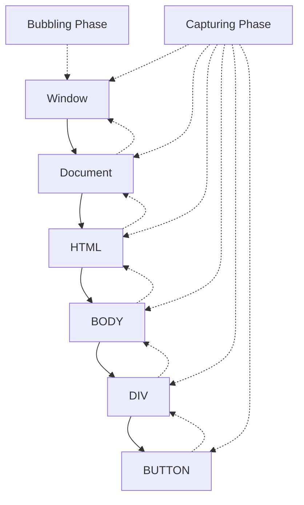

# Vue.js v-on Directive

## Introduction

The `v-on` directive is one of the most important features in Vue.js, allowing you to listen to DOM events and execute JavaScript when those events are triggered. Often abbreviated with the `@` symbol, this directive enables you to create interactive web applications by responding to user actions like clicks, key presses, form submissions, and more.

In this guide, we'll explore the `v-on` directive in detail, including its syntax, usage patterns, modifiers, and practical applications.

## Basic Syntax and Usage

The basic syntax of the `v-on` directive is:

```html
<element v-on:event="handler"></element>
```

Or using the shorthand syntax:

```html
<element @event="handler"></element>
```

Where:
- `event` is the DOM event you want to listen for (like `click`, `submit`, `keyup`)
- `handler` is either a method defined in your Vue component or an inline JavaScript statement

## Simple Event Handling

### Click Events

Let's start with a simple button click example:

```html
<template>
  <div>
    <p>Count: {{ count }}</p>
    <button v-on:click="increment">Increment</button>
    <!-- Shorthand syntax -->
    <button @click="decrement">Decrement</button>
  </div>
</template>

<script>
export default {
  data() {
    return {
      count: 0
    }
  },
  methods: {
    increment() {
      this.count += 1
    },
    decrement() {
      if (this.count > 0) {
        this.count -= 1
      }
    }
  }
}
</script>
```

In this example:
- We've defined a `count` data property
- Created two methods, `increment` and `decrement`
- Attached these methods to button click events using both the full syntax (`v-on:click`) and shorthand (`@click`)

## Event Handlers with Arguments

You can pass arguments to your event handlers:

```html
<template>
  <div>
    <p>Current value: {{ value }}</p>
    <button @click="updateValue(5)">Add 5</button>
    <button @click="updateValue(10)">Add 10</button>
  </div>
</template>

<script>
export default {
  data() {
    return {
      value: 0
    }
  },
  methods: {
    updateValue(amount) {
      this.value += amount
    }
  }
}
</script>
```

## Accessing the Event Object

Sometimes you need access to the original DOM event. Vue automatically passes it as the first parameter if you don't provide arguments:

```html
<template>
  <div>
    <input @keyup="onKeyUp" placeholder="Type something...">
    <p>You pressed: {{ lastKey }}</p>
  </div>
</template>

<script>
export default {
  data() {
    return {
      lastKey: ''
    }
  },
  methods: {
    onKeyUp(event) {
      this.lastKey = event.key
    }
  }
}
</script>
```

If you need the event object along with custom arguments, you can use the special `$event` variable:

```html
<button @click="handleClick('button-clicked', $event)">Click me</button>
```

```html
<script>
export default {
  methods: {
    handleClick(message, event) {
      console.log(message)
      console.log('Event target:', event.target)
    }
  }
}
</script>
```

## Inline Handlers

For simple operations, you can use inline JavaScript:

```html
<template>
  <div>
    <p>Count: {{ count }}</p>
    <button @click="count++">Increment</button>
    <button @click="count = 0">Reset</button>
  </div>
</template>

<script>
export default {
  data() {
    return {
      count: 0
    }
  }
}
</script>
```

## Event Modifiers

Vue provides event modifiers to handle common tasks without explicitly writing them in event handlers. You add modifiers by appending them to the event with a dot.

```html
<template>
  <div>
    <!-- Stop propagation -->
    <button @click.stop="handleClick">Stop Propagation</button>
    
    <!-- Prevent default -->
    <form @submit.prevent="submitForm">
      <button type="submit">Submit</button>
    </form>
    
    <!-- Chain modifiers -->
    <a @click.stop.prevent="handleLink">Link with modifiers</a>
    
    <!-- Only trigger once -->
    <button @click.once="showMessage">Show Message Once</button>
    
    <!-- Capture mode -->
    <div @click.capture="handleCapture">
      Capture Phase
    </div>
    
    <!-- Self modifier (only trigger if event.target is the element itself) -->
    <div @click.self="handleSelf">
      Only trigger for clicks on this div, not children
    </div>
  </div>
</template>
```

## Key and Mouse Modifiers

Vue provides modifiers for keyboard and mouse events:

### Key Modifiers

```html
<template>
  <div>
    <!-- Only trigger when Enter key is pressed -->
    <input @keyup.enter="submitForm">
    
    <!-- Common key aliases: enter, tab, delete, esc, space, up, down, left, right -->
    <input @keyup.esc="clearInput">
    
    <!-- Key combinations -->
    <input @keyup.alt.enter="specialSubmit">
  </div>
</template>
```

### Mouse Button Modifiers

```html
<template>
  <div>
    <!-- Only trigger for left, right, or middle mouse button -->
    <button @click.left="leftClick">Left Click</button>
    <button @click.right="rightClick">Right Click</button>
    <button @click.middle="middleClick">Middle Click</button>
  </div>
</template>
```

## System Modifier Keys

You can use the following modifiers to trigger mouse or keyboard event listeners only when the corresponding modifier key is pressed:

```html
<template>
  <div>
    <!-- Ctrl, Alt, Shift, Meta -->
    <button @click.ctrl="doSomething">Ctrl + Click</button>
    <button @click.alt="doSomethingElse">Alt + Click</button>
    <div @keyup.shift.enter="handleShiftEnter">Press Shift+Enter</div>
    
    <!-- Meta key (Windows key or Command key) -->
    <div @click.meta="handleMetaClick">Meta + Click</div>
    
    <!-- Exact modifier - triggers only if ONLY specified keys are pressed -->
    <button @click.ctrl.exact="onCtrlClick">Ctrl only (no other keys)</button>
  </div>
</template>
```

## Practical Examples

### Form Handling

```html
<template>
  <form @submit.prevent="submitForm">
    <div>
      <label for="name">Name:</label>
      <input 
        id="name" 
        v-model="form.name" 
        @focus="clearError('name')"
      />
      <p v-if="errors.name" class="error">{{ errors.name }}</p>
    </div>
    
    <div>
      <label for="email">Email:</label>
      <input 
        id="email" 
        type="email" 
        v-model="form.email" 
        @blur="validateEmail"
      />
      <p v-if="errors.email" class="error">{{ errors.email }}</p>
    </div>
    
    <button type="submit" :disabled="isSubmitting">
      {{ isSubmitting ? 'Submitting...' : 'Submit' }}
    </button>
  </form>
</template>

<script>
export default {
  data() {
    return {
      form: {
        name: '',
        email: ''
      },
      errors: {
        name: '',
        email: ''
      },
      isSubmitting: false
    }
  },
  methods: {
    clearError(field) {
      this.errors[field] = ''
    },
    validateEmail() {
      const emailRegex = /^[^\s@]+@[^\s@]+\.[^\s@]+$/
      if (!emailRegex.test(this.form.email)) {
        this.errors.email = 'Please enter a valid email address'
      } else {
        this.errors.email = ''
      }
    },
    submitForm() {
      // Validate form
      if (!this.form.name) {
        this.errors.name = 'Name is required'
      }
      this.validateEmail()
      
      // Check for errors
      if (this.errors.name || this.errors.email) {
        return
      }
      
      // Submit form
      this.isSubmitting = true
      
      // Simulate API call
      setTimeout(() => {
        alert(`Form submitted!\nName: ${this.form.name}\nEmail: ${this.form.email}`)
        this.isSubmitting = false
        
        // Reset form
        this.form.name = ''
        this.form.email = ''
      }, 1500)
    }
  }
}
</script>
```

### Interactive List Management

```html
<template>
  <div>
    <h2>Task List</h2>
    
    <div>
      <input 
        v-model="newTask" 
        @keyup.enter="addTask" 
        placeholder="Add a new task"
      />
      <button @click="addTask">Add</button>
    </div>
    
    <ul>
      <li v-for="(task, index) in tasks" :key="index">
        <input 
          type="checkbox" 
          :checked="task.completed" 
          @change="toggleTask(index)"
        />
        <span :class="{ completed: task.completed }">
          {{ task.text }}
        </span>
        <button @click.stop="deleteTask(index)">Delete</button>
      </li>
    </ul>
    
    <div class="controls">
      <button @click="clearCompleted">Clear Completed</button>
      <button @click="markAllCompleted">Mark All Completed</button>
    </div>
  </div>
</template>

<script>
export default {
  data() {
    return {
      newTask: '',
      tasks: [
        { text: 'Learn Vue.js', completed: false },
        { text: 'Build a project', completed: false },
        { text: 'Share with friends', completed: false }
      ]
    }
  },
  methods: {
    addTask() {
      if (this.newTask.trim()) {
        this.tasks.push({
          text: this.newTask,
          completed: false
        })
        this.newTask = ''
      }
    },
    toggleTask(index) {
      this.tasks[index].completed = !this.tasks[index].completed
    },
    deleteTask(index) {
      this.tasks.splice(index, 1)
    },
    clearCompleted() {
      this.tasks = this.tasks.filter(task => !task.completed)
    },
    markAllCompleted() {
      this.tasks.forEach(task => {
        task.completed = true
      })
    }
  }
}
</script>

<style scoped>
.completed {
  text-decoration: line-through;
  color: gray;
}
</style>
```

## Event Flow Visualization

Understanding event flow (bubbling and capturing) is important when working with event handlers:



In Vue, you can control this flow with modifiers like `.stop`, `.prevent`, and `.capture`.

## Summary

The `v-on` directive is a powerful tool in Vue.js for handling user interactions and events. Key points to remember:

- Use `v-on:event` or the shorthand `@event` to listen to DOM events
- You can call methods, use inline statements, or combine both approaches
- Access the event object using the implicit parameter or the `$event` variable
- Event modifiers like `.stop`, `.prevent`, and `.once` simplify common patterns
- Key and mouse modifiers allow for specific user interaction patterns
- Using the right event handling approach can make your code more maintainable

By mastering the `v-on` directive, you can create highly interactive Vue applications that respond smoothly to user input.

## Practice Exercises

1. Create a simple counter application with buttons to increment, decrement, and reset the count.
2. Build a form with validation that checks inputs on blur events and prevents submission if there are errors.
3. Create a keyboard shortcut system using key modifiers that performs different actions when pressing different key combinations.
4. Implement a drag-and-drop interface using mouse events.
5. Create a custom event logger that captures and displays all events happening on a specific element.

## Additional Resources

- [Official Vue.js Event Handling Guide](https://vuejs.org/guide/essentials/event-handling.html)
- [Vue.js Event Handling in Depth](https://vuejs.org/v2/guide/events.html)
- [MDN Web Docs: DOM Events](https://developer.mozilla.org/en-US/docs/Web/Events)