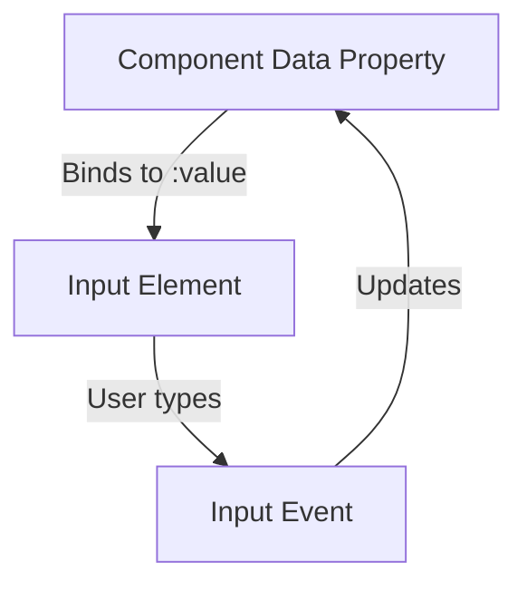

# Vue.js v-model Directive

## Introduction

The `v-model` directive is one of the most powerful features in Vue.js, providing a clean and efficient way to implement two-way data binding between form inputs and your application's state. Unlike one-way data binding where data only flows in one direction, two-way binding creates a connection where:

1. Changes to the model update the view (DOM)
2. User interactions with the view update the model

This bidirectional flow makes form handling extremely straightforward in Vue.js applications. Instead of manually tracking input events and updating values, `v-model` handles this synchronization automatically.

## Basic Syntax

The basic syntax of `v-model` is quite simple:

```html
<input v-model="propertyName">
```

Where `propertyName` is a property in your component's data.

## How v-model Works

Under the hood, `v-model` is syntactic sugar that combines:

1. A `:value` binding (or `:checked` for checkboxes and radio buttons)
2. An event listener that updates the bound data

For example, these two code snippets accomplish the same thing:

```html
<input v-model="message">
```

is equivalent to:

```html
<input 
  :value="message" 
  @input="message = $event.target.value"
>
```

## v-model with Different Input Types

### Text Input

Let's start with a basic text input example:

```html
<template>
  <div>
    <input v-model="message" placeholder="Edit me">
    <p>Message: {{ message }}</p>
  </div>
</template>

<script>
export default {
  data() {
    return {
      message: ''
    }
  }
}
</script>
```

As you type in the input field, the text in the paragraph below will update instantly.

### Textarea

The `v-model` directive works seamlessly with textarea elements:

```html
<template>
  <div>
    <textarea v-model="description" placeholder="Add a description"></textarea>
    <p>Description ({{ description.length }} characters):</p>
    <p>{{ description }}</p>
  </div>
</template>

<script>
export default {
  data() {
    return {
      description: ''
    }
  }
}
</script>
```

### Checkbox

For a single checkbox, `v-model` binds to a boolean value:

```html
<template>
  <div>
    <input type="checkbox" id="subscribe" v-model="subscribed">
    <label for="subscribe">Subscribe to newsletter</label>
    <p>Subscription status: {{ subscribed ? 'Subscribed' : 'Not subscribed' }}</p>
  </div>
</template>

<script>
export default {
  data() {
    return {
      subscribed: false
    }
  }
}
</script>
```

For multiple checkboxes, `v-model` binds to an array:

```html
<template>
  <div>
    <h3>Selected Technologies:</h3>
    <input type="checkbox" id="vue" value="Vue" v-model="selectedTech">
    <label for="vue">Vue</label>
    
    <input type="checkbox" id="react" value="React" v-model="selectedTech">
    <label for="react">React</label>
    
    <input type="checkbox" id="angular" value="Angular" v-model="selectedTech">
    <label for="angular">Angular</label>
    
    <p>You have selected: {{ selectedTech.join(', ') }}</p>
  </div>
</template>

<script>
export default {
  data() {
    return {
      selectedTech: []
    }
  }
}
</script>
```

### Radio Buttons

For radio buttons, `v-model` binds to the value of the selected button:

```html
<template>
  <div>
    <input type="radio" id="basic" value="Basic" v-model="subscription">
    <label for="basic">Basic Plan</label>
    
    <input type="radio" id="premium" value="Premium" v-model="subscription">
    <label for="premium">Premium Plan</label>
    
    <input type="radio" id="pro" value="Pro" v-model="subscription">
    <label for="pro">Pro Plan</label>
    
    <p>Selected plan: {{ subscription }}</p>
  </div>
</template>

<script>
export default {
  data() {
    return {
      subscription: 'Basic'
    }
  }
}
</script>
```

### Select Dropdown

For select elements, `v-model` binds to the value of the selected option:

```html
<template>
  <div>
    <select v-model="selectedCountry">
      <option disabled value="">Please select a country</option>
      <option>USA</option>
      <option>Canada</option>
      <option>UK</option>
      <option>Australia</option>
      <option>Japan</option>
    </select>
    <p>Selected country: {{ selectedCountry }}</p>
  </div>
</template>

<script>
export default {
  data() {
    return {
      selectedCountry: ''
    }
  }
}
</script>
```

For multi-select (with the `multiple` attribute), `v-model` binds to an array:

```html
<template>
  <div>
    <select v-model="selectedFruits" multiple>
      <option>Apple</option>
      <option>Banana</option>
      <option>Orange</option>
      <option>Mango</option>
      <option>Grape</option>
    </select>
    <p>Selected fruits: {{ selectedFruits.join(', ') }}</p>
  </div>
</template>

<script>
export default {
  data() {
    return {
      selectedFruits: []
    }
  }
}
</script>
```

## Modifiers for v-model

Vue.js provides several modifiers for `v-model` to adjust its behavior:

### .lazy

By default, `v-model` synchronizes the input with the data on every `input` event. Adding the `.lazy` modifier changes it to sync on `change` events instead:

```html
<!-- Update happens on "change" instead of "input" -->
<input v-model.lazy="message">
```

This means the data will only update when the input loses focus or the user presses Enter.

### .number

The `.number` modifier converts the user input to a number using JavaScript's `parseFloat`:

```html
<input v-model.number="age" type="number">
```

This is useful when you need numerical values, as user input from form elements is normally returned as strings.

### .trim

The `.trim` modifier automatically removes whitespace from the beginning and end of the input:

```html
<input v-model.trim="username">
```

This helps prevent accidental spaces that might cause validation issues.

## Practical Example: Form Validation

Here's a more comprehensive example showing a simple registration form with validation:

```html
<template>
  <div class="form-container">
    <h2>Registration Form</h2>
    <form @submit.prevent="submitForm">
      <div class="form-group">
        <label for="username">Username:</label>
        <input 
          id="username" 
          v-model.trim="form.username" 
          type="text" 
          required
          @blur="validateUsername"
        >
        <span v-if="errors.username" class="error">{{ errors.username }}</span>
      </div>
      
      <div class="form-group">
        <label for="email">Email:</label>
        <input 
          id="email" 
          v-model="form.email" 
          type="email" 
          required
          @blur="validateEmail"
        >
        <span v-if="errors.email" class="error">{{ errors.email }}</span>
      </div>
      
      <div class="form-group">
        <label for="age">Age:</label>
        <input 
          id="age" 
          v-model.number="form.age" 
          type="number" 
          min="18"
          required
          @blur="validateAge"
        >
        <span v-if="errors.age" class="error">{{ errors.age }}</span>
      </div>
      
      <div class="form-group">
        <label for="password">Password:</label>
        <input 
          id="password" 
          v-model="form.password" 
          type="password" 
          required
          @blur="validatePassword"
        >
        <span v-if="errors.password" class="error">{{ errors.password }}</span>
      </div>
      
      <div class="form-group">
        <input 
          id="terms" 
          v-model="form.acceptTerms" 
          type="checkbox" 
          required
        >
        <label for="terms">I accept the terms and conditions</label>
        <span v-if="errors.acceptTerms" class="error">{{ errors.acceptTerms }}</span>
      </div>
      
      <button type="submit" :disabled="!isFormValid">Register</button>
    </form>
    
    <div v-if="formSubmitted" class="success-message">
      <h3>Registration Successful!</h3>
      <p>Thank you for registering, {{ form.username }}!</p>
    </div>
  </div>
</template>

<script>
export default {
  data() {
    return {
      form: {
        username: '',
        email: '',
        age: null,
        password: '',
        acceptTerms: false
      },
      errors: {
        username: '',
        email: '',
        age: '',
        password: '',
        acceptTerms: ''
      },
      formSubmitted: false
    }
  },
  computed: {
    isFormValid() {
      return !this.errors.username && 
             !this.errors.email && 
             !this.errors.age && 
             !this.errors.password && 
             this.form.username && 
             this.form.email && 
             this.form.age && 
             this.form.password && 
             this.form.acceptTerms;
    }
  },
  methods: {
    validateUsername() {
      if (this.form.username.length < 3) {
        this.errors.username = 'Username must be at least 3 characters';
      } else {
        this.errors.username = '';
      }
    },
    validateEmail() {
      const emailPattern = /^[^\s@]+@[^\s@]+\.[^\s@]+$/;
      if (!emailPattern.test(this.form.email)) {
        this.errors.email = 'Please enter a valid email address';
      } else {
        this.errors.email = '';
      }
    },
    validateAge() {
      if (!this.form.age) {
        this.errors.age = 'Age is required';
      } else if (this.form.age < 18) {
        this.errors.age = 'You must be at least 18 years old';
      } else {
        this.errors.age = '';
      }
    },
    validatePassword() {
      if (this.form.password.length < 8) {
        this.errors.password = 'Password must be at least 8 characters';
      } else {
        this.errors.password = '';
      }
    },
    submitForm() {
      // Validate all fields one last time
      this.validateUsername();
      this.validateEmail();
      this.validateAge();
      this.validatePassword();
      
      if (this.isFormValid) {
        // In a real app, you'd send the data to your server here
        console.log('Form submitted:', this.form);
        this.formSubmitted = true;
      }
    }
  }
}
</script>

<style scoped>
.form-container {
  max-width: 500px;
  margin: 0 auto;
}
.form-group {
  margin-bottom: 15px;
}
.error {
  color: red;
  font-size: 12px;
  display: block;
  margin-top: 5px;
}
.success-message {
  background-color: #dff0d8;
  color: #3c763d;
  padding: 15px;
  margin-top: 20px;
  border-radius: 4px;
}
</style>
```

## v-model with Components

One of the most powerful aspects of `v-model` is that it can be used with custom components, allowing you to create reusable form input components with built-in two-way binding.

In Vue 2, this is implemented using a `prop` (usually named `value`) and an `input` event:

```html
<!-- CustomInput.vue -->
<template>
  <div class="custom-input">
    <input 
      :value="value" 
      @input="$emit('input', $event.target.value)" 
      class="fancy-input"
    >
  </div>
</template>

<script>
export default {
  props: {
    value: {
      type: String,
      default: ''
    }
  }
}
</script>
```

Used in a parent component:

```html
<template>
  <div>
    <custom-input v-model="searchText"></custom-input>
    <p>You're searching for: {{ searchText }}</p>
  </div>
</template>

<script>
import CustomInput from './CustomInput.vue'

export default {
  components: {
    CustomInput
  },
  data() {
    return {
      searchText: ''
    }
  }
}
</script>
```

In Vue 3, this has been made more customizable with the ability to specify the prop and event names using `model` options:

```html
<!-- CustomInput.vue (Vue 3) -->
<template>
  <div class="custom-input">
    <input 
      :value="modelValue" 
      @input="$emit('update:modelValue', $event.target.value)" 
      class="fancy-input"
    >
  </div>
</template>

<script>
export default {
  props: {
    modelValue: {
      type: String,
      default: ''
    }
  },
  emits: ['update:modelValue']
}
</script>
```

## The Flow of v-model

To better understand how `v-model` works, here's a visualization of the data flow:



## Summary

The `v-model` directive is a powerful feature in Vue.js that simplifies form handling by creating two-way data bindings. Here's what we've covered:

- The basics of `v-model` and how it works under the hood
- Using `v-model` with different form elements (text inputs, textareas, checkboxes, radio buttons, and select dropdowns)
- Applying modifiers (`.lazy`, `.number`, and `.trim`) to customize behavior
- Creating forms with validation using `v-model`
- Using `v-model` with custom components

By leveraging the power of `v-model`, you can create more interactive and responsive forms with less code, making your Vue applications more maintainable and user-friendly.

## Practice Exercises

To reinforce your understanding of `v-model`:

1. Create a simple to-do list application with a text input to add new items, and checkboxes to mark items as completed.
2. Build a dynamic form where selecting an option in one dropdown affects the available options in another dropdown.
3. Create a custom form component that uses `v-model` and includes built-in validation.
4. Build a multi-step form wizard that collects and validates information across multiple screens.

## Additional Resources

- [Vue.js Official Documentation on Form Input Bindings](https://vuejs.org/guide/essentials/forms.html)
- [Vue.js Official Documentation on Components Basics](https://vuejs.org/guide/essentials/component-basics.html)
- [Vue Mastery Course on Forms](https://www.vuemastery.com/)

Mastering `v-model` is a key step in becoming proficient with Vue.js, as it's one of the features that makes Vue particularly well-suited for building interactive user interfaces.