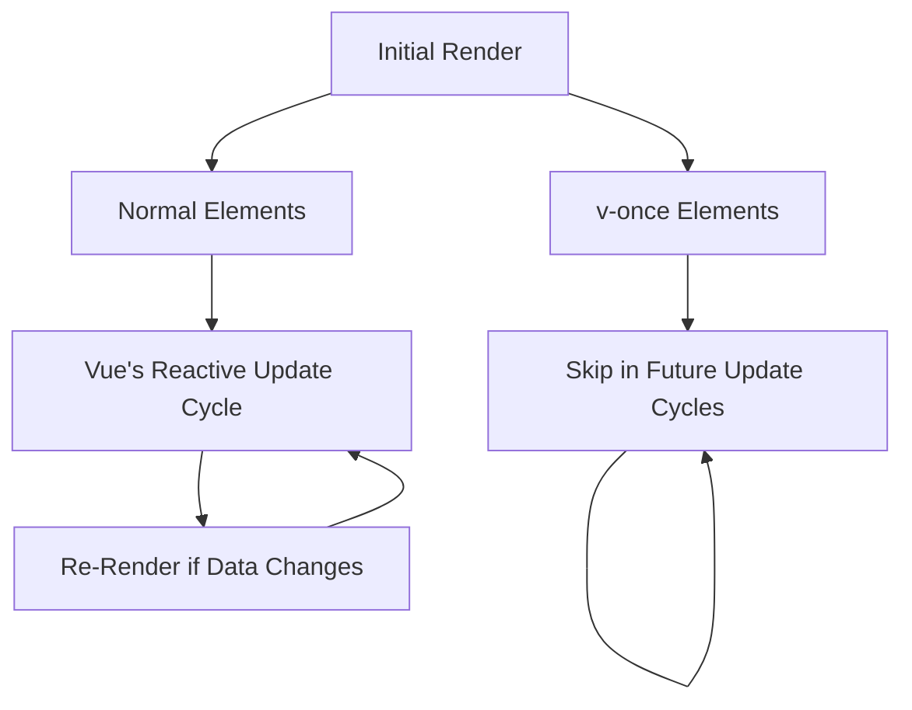

# Vue.js v-once Directive

## Introduction

When building Vue.js applications, optimizing rendering performance becomes crucial as your application grows in complexity. The `v-once` directive is a powerful tool in Vue.js that allows you to render an element or component only once and then skip future updates to that element or component.

This directive is particularly useful when you have content that you know won't change after the initial render. By using `v-once`, you're essentially telling Vue to "render this once and then leave it alone," which can provide performance benefits by reducing unnecessary virtual DOM diffing and re-rendering operations.

## Basic Syntax

The `v-once` directive is one of the simplest directives to use in Vue as it doesn't require any expression or value:

```html
<template>
  <div v-once>{{ message }}</div>
</template>

<script>
export default {
  data() {
    return {
      message: 'This message will not change when data updates'
    }
  }
}
</script>
```

## How v-once Works

To understand the value of `v-once`, let's compare how Vue handles templates with and without this directive:

### Without v-once

```html
<template>
  <div>
    <p>{{ staticMessage }}</p>
    <p>{{ dynamicMessage }}</p>
    <button @click="updateMessages">Update Messages</button>
  </div>
</template>

<script>
export default {
  data() {
    return {
      staticMessage: 'This message should never change',
      dynamicMessage: 'This message will be updated'
    }
  },
  methods: {
    updateMessages() {
      this.staticMessage = 'Tried to change static message';
      this.dynamicMessage = 'Message updated at: ' + new Date().toLocaleTimeString();
    }
  }
}
</script>
```

In this example, even though `staticMessage` is conceptually static, Vue will still check and update the DOM if the value changes.

### With v-once

```html
<template>
  <div>
    <p v-once>{{ staticMessage }}</p>
    <p>{{ dynamicMessage }}</p>
    <button @click="updateMessages">Update Messages</button>
  </div>
</template>

<script>
export default {
  data() {
    return {
      staticMessage: 'This message should never change',
      dynamicMessage: 'This message will be updated'
    }
  },
  methods: {
    updateMessages() {
      this.staticMessage = 'Tried to change static message';
      this.dynamicMessage = 'Message updated at: ' + new Date().toLocaleTimeString();
    }
  }
}
</script>
```

With `v-once` added to the first paragraph, Vue will render it once and then never update it again, even if `staticMessage` changes. The second paragraph will continue to update normally.

## When to Use v-once

The `v-once` directive is best used in the following scenarios:

1. **Static Content**: For elements that contain data that will not change after initial render
2. **Expensive Computations**: For template sections that involve expensive computations
3. **Large Static Lists**: For large lists of static data that won't be modified
4. **Static Components**: For components that don't need to be reactive

## Practical Examples

### Example 1: Static Headers and Footers

```html
<template>
  <div class="app-layout">
    <!-- Header with static content -->
    <header v-once>
      <h1>{{ companyName }}</h1>
      <p>{{ companySlogan }}</p>
    </header>
    
    <!-- Dynamic content area -->
    <main>
      <h2>{{ pageTitle }}</h2>
      <p>{{ pageContent }}</p>
      <button @click="updatePage">Change Page Content</button>
    </main>
    
    <!-- Footer with static content -->
    <footer v-once>
      <p>{{ copyrightNotice }}</p>
    </footer>
  </div>
</template>

<script>
export default {
  data() {
    return {
      companyName: 'Vue Masters Inc.',
      companySlogan: 'Building reactive interfaces with ease',
      copyrightNotice: '© 2023 Vue Masters Inc. All rights reserved.',
      pageTitle: 'Welcome',
      pageContent: 'This is the main content area that will update.'
    }
  },
  methods: {
    updatePage() {
      this.pageTitle = 'Updated Page';
      this.pageContent = 'The content has been updated at ' + new Date().toLocaleTimeString();
      
      // These won't affect the rendered output due to v-once
      this.companyName = 'Attempted Change';
      this.copyrightNotice = 'Attempted change to footer';
    }
  }
}
</script>
```

In this example, the header and footer sections are marked with `v-once` as their content doesn't need to be updated, while the main content area remains reactive.

### Example 2: Optimization for Large Static Lists

```html
<template>
  <div>
    <h2>Product Categories</h2>
    <!-- Static list that won't change -->
    <ul v-once>
      <li v-for="category in categories" :key="category.id">
        {{ category.name }} - {{ category.description }}
      </li>
    </ul>
    
    <h2>Products ({{ products.length }})</h2>
    <!-- Dynamic list that will update -->
    <ul>
      <li v-for="product in products" :key="product.id">
        {{ product.name }} - ${{ product.price }}
        <button @click="removeProduct(product.id)">Remove</button>
      </li>
    </ul>
    
    <button @click="addProduct">Add Random Product</button>
  </div>
</template>

<script>
export default {
  data() {
    return {
      categories: [
        { id: 1, name: 'Electronics', description: 'Gadgets and devices' },
        { id: 2, name: 'Books', description: 'Physical and digital books' },
        { id: 3, name: 'Clothing', description: 'Apparel and accessories' },
        { id: 4, name: 'Home', description: 'Home goods and furniture' }
      ],
      products: [
        { id: 101, name: 'Laptop', price: 999.99 },
        { id: 102, name: 'Headphones', price: 149.99 }
      ],
      nextId: 103
    }
  },
  methods: {
    addProduct() {
      const randomNames = ['Smartphone', 'Tablet', 'Monitor', 'Keyboard', 'Mouse'];
      const name = randomNames[Math.floor(Math.random() * randomNames.length)];
      const price = +(Math.random() * 500 + 100).toFixed(2);
      
      this.products.push({
        id: this.nextId++,
        name,
        price
      });
    },
    removeProduct(id) {
      this.products = this.products.filter(product => product.id !== id);
    }
  }
}
</script>
```

Here, we've applied `v-once` to a list of categories that won't change, while the products list remains dynamic and reactive.

### Example 3: Static UI Elements with Dynamic Data

```html
<template>
  <div class="user-profile">
    <!-- Static UI structure with v-once -->
    <div class="profile-layout" v-once>
      <div class="avatar-container">
        
      </div>
      
      <div class="info-container">
        <h3>User Information</h3>
        <div class="info-fields">
          <div class="field">
            <label>Name:</label>
            <span class="dynamic-name"></span>
          </div>
          <div class="field">
            <label>Email:</label>
            <span class="dynamic-email"></span>
          </div>
          <div class="field">
            <label>Joined:</label>
            <span class="dynamic-date"></span>
          </div>
        </div>
      </div>
    </div>
    
    <!-- Dynamic content via refs -->
    <div ref="dynamicContent" style="display: none;">
      {{ user.name }}
      {{ user.email }}
      {{ user.joinDate }}
    </div>
    
    <button @click="updateUser">Update User Data</button>
  </div>
</template>

<script>
export default {
  data() {
    return {
      defaultAvatar: 'https://placeholder.com/user',
      user: {
        name: 'John Doe',
        email: 'john@example.com',
        joinDate: '2023-01-15'
      }
    }
  },
  methods: {
    updateUser() {
      this.user = {
        name: 'Jane Smith',
        email: 'jane@example.com',
        joinDate: '2023-06-22'
      };
      
      // Manually update the content
      this.$nextTick(() => {
        document.querySelector('.dynamic-name').textContent = this.user.name;
        document.querySelector('.dynamic-email').textContent = this.user.email;
        document.querySelector('.dynamic-date').textContent = this.user.joinDate;
      });
    }
  },
  mounted() {
    // Initialize the dynamic content
    document.querySelector('.dynamic-name').textContent = this.user.name;
    document.querySelector('.dynamic-email').textContent = this.user.email;
    document.querySelector('.dynamic-date').textContent = this.user.joinDate;
  }
}
</script>
```

This example shows a more advanced pattern where the layout is kept static with `v-once`, but we manually update specific parts of the DOM. This approach should be used with care, as it bypasses Vue's reactivity system.

## Performance Considerations

### Benefits of v-once

1. **Reduced Virtual DOM Diffing**: Vue skips the element in its diffing algorithm after initial render
2. **Memory Optimization**: The element's VNodes can be reused rather than re-created
3. **Render Function Optimization**: For components with render functions, parts of the render tree can be cached

### Performance Visualization



## Limitations and Considerations

When using the `v-once` directive, keep these important considerations in mind:

1. **All-or-Nothing**: `v-once` affects the element and all its children. You can't selectively make only parts of a sub-tree static.

2. **No Reactivity**: Once an element is marked with `v-once`, it will never update automatically, even if the underlying data changes.

3. **Debugging Challenges**: It might be confusing during development when parts of the UI don't update as expected due to `v-once`.

4. **Not a Silver Bullet**: Don't use `v-once` prematurely as an optimization technique. Only apply it when you're certain the content won't change.

## Using v-once with Components

The `v-once` directive can also be applied to components:

```html
<template>
  <div>
    <static-component v-once :initial-data="initialValue"></static-component>
    <dynamic-component :data="dynamicValue"></dynamic-component>
    
    <button @click="updateValues">Update Values</button>
  </div>
</template>

<script>
import StaticComponent from './StaticComponent.vue';
import DynamicComponent from './DynamicComponent.vue';

export default {
  components: {
    StaticComponent,
    DynamicComponent
  },
  data() {
    return {
      initialValue: { message: 'Initial Static Value' },
      dynamicValue: { message: 'Initial Dynamic Value' }
    }
  },
  methods: {
    updateValues() {
      // This won't cause StaticComponent to re-render due to v-once
      this.initialValue = { message: 'Updated Static Value' };
      
      // This will cause DynamicComponent to re-render
      this.dynamicValue = { message: 'Updated Dynamic Value at ' + new Date().toLocaleTimeString() };
    }
  }
}
</script>
```

## Summary

The `v-once` directive is a powerful optimization tool in Vue.js that allows you to render elements and components only once, skipping them in future updates. This can lead to performance improvements in cases where you have content that is known to be static.

Key takeaways:

- Use `v-once` for truly static content that won't change after the initial render
- Apply it to elements, components, or entire sections of your template
- Remember that it affects all child elements of the element it's applied to
- Use it strategically for performance optimization, particularly with large static lists or expensive computations
- Be aware that elements with `v-once` will never automatically update, even if their data dependencies change

## Exercise: Optimizing a Dashboard

Try creating a dashboard layout with:
1. A static header and footer with `v-once`
2. A sidebar navigation menu with `v-once` (assuming navigation doesn't change)
3. A dynamic content area that updates based on user interactions
4. A large static table of reference data with `v-once`
5. A small dynamic table showing real-time data without `v-once`

Monitor the performance differences between using and not using `v-once` for the static parts.

## Additional Resources

- [Vue.js Official Documentation on v-once](https://vuejs.org/api/built-in-directives.html#v-once)
- [Vue.js Performance Optimization Strategies](https://vuejs.org/guide/best-practices/performance.html)

By strategically applying the `v-once` directive in your Vue applications, you can achieve better performance while maintaining the reactivity where it matters most.