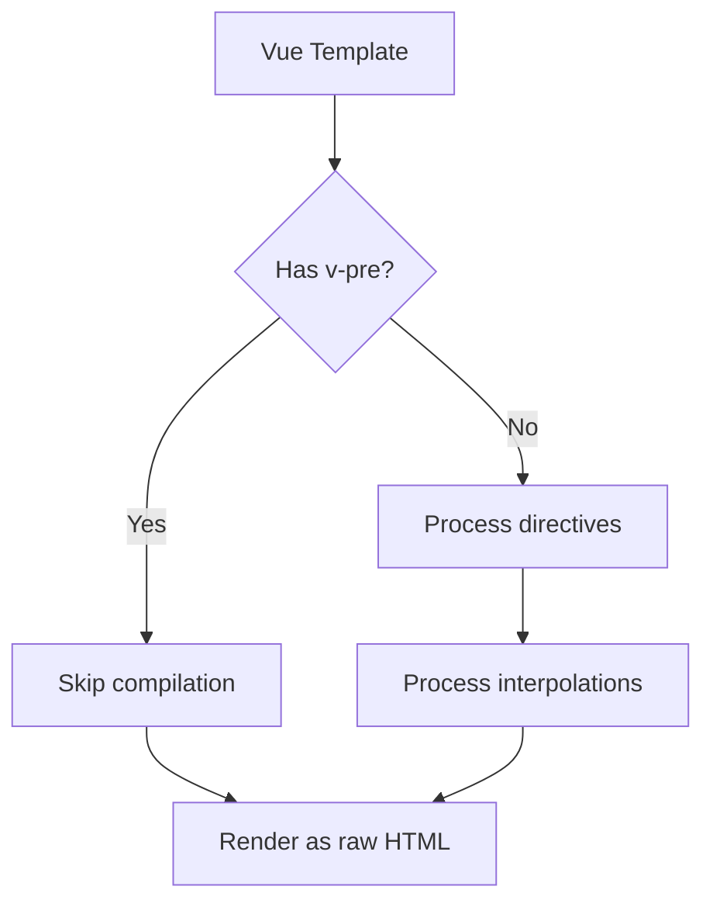

# Vue.js v-pre Directive

## Introduction

When working with Vue.js applications, you'll often use template syntax with mustache interpolations like `{{ variable }}` to display dynamic content. Sometimes, however, you might want Vue to skip compilation of certain elements in your template. That's where the `v-pre` directive comes in.

The `v-pre` directive instructs Vue to skip compilation for the element it's applied to and all of its children. This means Vue will not process any directives or interpolations within that element, rendering the content exactly as written.

## What is v-pre?

The `v-pre` directive is a special attribute that tells Vue's compiler to skip processing an element and its children entirely. When you apply `v-pre` to an element:

- Vue will not interpret any Vue templates or directives within the element
- Mustache interpolations (`{{ }}`) will be displayed literally, rather than evaluated
- The element and its children are essentially treated as plain HTML

## Basic Syntax

Using the `v-pre` directive is straightforward - just add it to any element you want Vue to ignore:

```html
<span v-pre>{{ This will be displayed as-is }}</span>
```

## How v-pre Works

Let's explore how `v-pre` affects rendering with some examples:

### Example 1: Without v-pre

```html
<template>
  <div>
    <p>{{ message }}</p>
  </div>
</template>

<script>
export default {
  data() {
    return {
      message: "Hello Vue!"
    }
  }
}
</script>
```

**Output:**
```
Hello Vue!
```

### Example 2: With v-pre

```html
<template>
  <div>
    <p v-pre>{{ message }}</p>
  </div>
</template>

<script>
export default {
  data() {
    return {
      message: "Hello Vue!"
    }
  }
}
</script>
```

**Output:**
```
{{ message }}
```

As you can see, with `v-pre`, the mustache syntax is displayed literally rather than being interpreted by Vue.

## Practical Use Cases

You might be wondering when to use the `v-pre` directive in real-world applications. Let's explore some practical scenarios:

### 1. Documentation and Teaching

When creating documentation for Vue.js or teaching others how Vue's template syntax works, you often need to display Vue syntax literally:

```html
<template>
  <div class="tutorial">
    <h2>Vue Basic Syntax</h2>
    <p>Here's how to display a variable in Vue:</p>
    
    <code v-pre>{{ yourVariableName }}</code>
    
    <p>Just replace 'yourVariableName' with your actual variable!</p>
  </div>
</template>
```

### 2. Performance Optimization

For large static blocks of content that don't need Vue's reactivity, using `v-pre` can slightly improve performance:

```html
<template>
  <div>
    <!-- Dynamic content -->
    <header>Welcome, {{ username }}</header>
    
    <!-- Static content with v-pre for slight performance boost -->
    <div v-pre class="static-content">
      <p>This is a large block of static content.</p>
      <p>It doesn't need Vue's reactivity system.</p>
      <!-- Many more paragraphs... -->
    </div>
  </div>
</template>
```

### 3. Displaying Code Snippets

When building developer tools or code editors, you might want to display code that contains Vue-like syntax:

```html
<template>
  <div class="code-editor">
    <h3>Code Preview:</h3>
    <pre v-pre class="code-block">
      <template>
        <div>
          <p>{{ userData.name }}</p>
          <button @click="sayHello">Say Hello</button>
        </div>
      </template>
    </pre>
  </div>
</template>
```

## Combining v-pre with Other Features

### Using v-pre with v-if

You can combine `v-pre` with other directives like `v-if` to conditionally show literal template syntax:

```html
<template>
  <div>
    <button @click="toggleShowCode">
      {{ showCode ? 'Hide Code' : 'Show Code' }}
    </button>
    
    <pre v-if="showCode" v-pre class="code-block">
      {{ message }}
      <span v-for="item in items">{{ item }}</span>
    </pre>
  </div>
</template>

<script>
export default {
  data() {
    return {
      showCode: false,
      message: "This won't be rendered because of v-pre",
      items: [1, 2, 3]
    }
  },
  methods: {
    toggleShowCode() {
      this.showCode = !this.showCode
    }
  }
}
</script>
```

### Creating a Code Display Component

You can create a reusable component for displaying Vue code examples:

```html
<!-- CodeDisplay.vue -->
<template>
  <div class="code-display">
    <h4>{{ title }}</h4>
    <pre v-pre class="code-block"><slot></slot></pre>
  </div>
</template>

<script>
export default {
  props: {
    title: {
      type: String,
      default: 'Code Example'
    }
  }
}
</script>
```

Then use it like this:

```html
<template>
  <div class="tutorial">
    <h2>Vue Tutorial</h2>
    
    <CodeDisplay title="Basic Template Syntax">
      <div>
        <p>{{ userName }}</p>
        <button @click="greet">Say Hello</button>
      </div>
    </CodeDisplay>
  </div>
</template>
```

## Understanding the Flow

Here's a simple flowchart showing how Vue processes elements with and without `v-pre`:



## Best Practices

1. **Use Sparingly**: Only use `v-pre` when necessary, as it prevents Vue's reactivity system from working on that element.

2. **Documentation Context**: `v-pre` is ideal for displaying Vue syntax in documentation or tutorials.

3. **Performance Considerations**: While `v-pre` can provide minor performance improvements for large static blocks, don't overuse it solely for optimization.

4. **Clear Intentions**: Comment your code to make it clear why you're using `v-pre` in a particular location.

## Common Mistakes

### Forgetting Scope

Remember that `v-pre` affects not just the element it's applied to, but all of its children as well:

```html
<div v-pre>
  <p>{{ message }}</p>
  <child-component :prop="value"></child-component> <!-- This won't work either -->
</div>
```

### Misusing for Static Content

Don't use `v-pre` for all static content. Vue is already optimized for handling static content efficiently:

```html
<!-- Unnecessary usage -->
<p v-pre>This is static text without interpolation</p>

<!-- Correct usage - Vue optimizes this automatically -->
<p>This is static text without interpolation</p>
```

## Summary

The `v-pre` directive is a specialized tool in Vue.js that allows you to:

- Skip compilation for specific elements and their children
- Display mustache interpolations and directives literally
- Create documentation, tutorials or code previews for Vue syntax
- Make minor performance optimizations for large blocks of static content

While not frequently used in everyday Vue development, `v-pre` serves specific purposes that make it valuable to understand as you become more proficient with Vue.js.

## Additional Resources and Exercises

### Practice Exercises

1. **Basic v-pre Usage**: Create a simple Vue component that shows both the rendered and raw versions of a template with variables.

2. **Code Display Component**: Build a more sophisticated version of the CodeDisplay component we demonstrated, with syntax highlighting.

3. **Tutorial Creator**: Create a mini-application that lets users input Vue.js code and see both the rendered output and the raw code side by side.

### Additional Resources

- [Vue.js Official Documentation on Directives](https://vuejs.org/v2/api/#Directives)
- [Vue.js Style Guide](https://vuejs.org/v2/style-guide/)

By understanding when and how to use the `v-pre` directive, you've added another useful tool to your Vue.js development toolkit. While you won't use it in every component, it's invaluable for specific scenarios where you need to display Vue syntax literally.