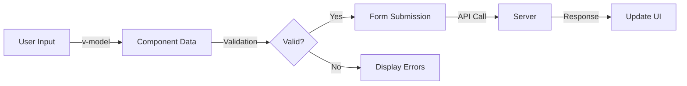

# Vue.js Form Handling

## Introduction

Form handling is a crucial part of web applications, allowing users to input data and interact with your application. Vue.js provides powerful tools and directives that make form handling intuitive and efficient. In this tutorial, we'll explore how to create, manipulate, and validate forms in Vue.js applications.

By the end of this guide, you'll understand how to:
- Bind form inputs to Vue data using `v-model`
- Handle different types of form inputs
- Validate user input
- Process form submissions
- Implement real-world form patterns

## Basic Form Binding with v-model

The `v-model` directive is the cornerstone of Vue.js form handling. It creates two-way data binding between form inputs and Vue component data.

### How v-model Works

`v-model` is essentially syntactic sugar that combines:
1. `:value` binding (passing data to the input)
2. `@input` event listener (updating data when input changes)

Let's start with a simple example:

```html
<template>
  <div>
    <h2>Basic Input Binding</h2>
    <input v-model="message" placeholder="Type something">
    <p>The message is: {{ message }}</p>
  </div>
</template>

<script>
export default {
  data() {
    return {
      message: ''
    }
  }
}
</script>
```

In this example, whatever you type in the input field immediately updates the `message` data property, which is then displayed on the page.

## Handling Different Input Types

Vue's `v-model` adapts to different form input types automatically.

### Text and Textarea

Text and textarea inputs bind directly to string values:

```html
<template>
  <div>
    <h3>Single-line input</h3>
    <input v-model="name" placeholder="Name">
    
    <h3>Multi-line textarea</h3>
    <textarea v-model="description" placeholder="Describe yourself"></textarea>
    
    <div class="preview">
      <p><strong>Name:</strong> {{ name }}</p>
      <p><strong>Description:</strong> {{ description }}</p>
    </div>
  </div>
</template>

<script>
export default {
  data() {
    return {
      name: '',
      description: ''
    }
  }
}
</script>
```

### Checkboxes

For single checkboxes, `v-model` binds to a boolean value:

```html
<template>
  <div>
    <input type="checkbox" id="subscribe" v-model="subscribed">
    <label for="subscribe">Subscribe to newsletter</label>
    
    <p>Subscription status: {{ subscribed ? 'Subscribed' : 'Not subscribed' }}</p>
  </div>
</template>

<script>
export default {
  data() {
    return {
      subscribed: false
    }
  }
}
</script>
```

For multiple checkboxes that bind to the same array:

```html
<template>
  <div>
    <h3>Select your interests:</h3>
    <input type="checkbox" id="coding" value="coding" v-model="interests">
    <label for="coding">Coding</label>
    
    <input type="checkbox" id="music" value="music" v-model="interests">
    <label for="music">Music</label>
    
    <input type="checkbox" id="sports" value="sports" v-model="interests">
    <label for="sports">Sports</label>
    
    <p>Your interests: {{ interests.join(', ') }}</p>
  </div>
</template>

<script>
export default {
  data() {
    return {
      interests: []
    }
  }
}
</script>
```

### Radio Buttons

Radio buttons let users select one option from a set:

```html
<template>
  <div>
    <h3>Select your preferred contact method:</h3>
    <input type="radio" id="email" value="email" v-model="contactPreference">
    <label for="email">Email</label>
    
    <input type="radio" id="phone" value="phone" v-model="contactPreference">
    <label for="phone">Phone</label>
    
    <input type="radio" id="mail" value="mail" v-model="contactPreference">
    <label for="mail">Mail</label>
    
    <p>Preferred contact: {{ contactPreference }}</p>
  </div>
</template>

<script>
export default {
  data() {
    return {
      contactPreference: 'email'
    }
  }
}
</script>
```

### Select Dropdowns

Vue also handles select dropdowns with ease:

```html
<template>
  <div>
    <h3>Select your country:</h3>
    <select v-model="country">
      <option value="">-- Select country --</option>
      <option value="usa">United States</option>
      <option value="canada">Canada</option>
      <option value="uk">United Kingdom</option>
      <option value="australia">Australia</option>
    </select>
    
    <p>Selected country: {{ country || 'None selected' }}</p>
    
    <!-- Multi-select example -->
    <h3>Select programming languages you know:</h3>
    <select v-model="languages" multiple>
      <option value="javascript">JavaScript</option>
      <option value="python">Python</option>
      <option value="java">Java</option>
      <option value="csharp">C#</option>
      <option value="go">Go</option>
    </select>
    
    <p>Languages: {{ languages.join(', ') }}</p>
  </div>
</template>

<script>
export default {
  data() {
    return {
      country: '',
      languages: []
    }
  }
}
</script>
```

## Form Submission

Handling form submission is straightforward with Vue's `@submit` event. To prevent the default form submission action (which would cause a page reload), use `@submit.prevent`.

```html
<template>
  <div>
    <h2>Contact Form</h2>
    <form @submit.prevent="submitForm">
      <div>
        <label for="name">Name:</label>
        <input id="name" v-model="form.name" required>
      </div>
      
      <div>
        <label for="email">Email:</label>
        <input id="email" type="email" v-model="form.email" required>
      </div>
      
      <div>
        <label for="message">Message:</label>
        <textarea id="message" v-model="form.message" required></textarea>
      </div>
      
      <button type="submit">Send Message</button>
    </form>
    
    <div v-if="submitted">
      <h3>Form Submitted!</h3>
      <pre>{{ JSON.stringify(form, null, 2) }}</pre>
    </div>
  </div>
</template>

<script>
export default {
  data() {
    return {
      form: {
        name: '',
        email: '',
        message: ''
      },
      submitted: false
    }
  },
  methods: {
    submitForm() {
      // In a real app, you would send the data to your backend here
      console.log('Form submitted:', this.form);
      this.submitted = true;
      
      // Example: Reset form after submission
      // this.resetForm();
    },
    resetForm() {
      this.form = {
        name: '',
        email: '',
        message: ''
      };
      this.submitted = false;
    }
  }
}
</script>
```

## Form Validation

Form validation is essential for ensuring users provide correct and complete information. While Vue doesn't include built-in validation, we can implement it easily. Let's look at a basic validation approach:

```html
<template>
  <div>
    <h2>Registration Form with Validation</h2>
    <form @submit.prevent="submitForm">
      <div class="form-group">
        <label for="username">Username:</label>
        <input 
          id="username" 
          v-model="form.username" 
          @blur="validateUsername"
        >
        <span v-if="errors.username" class="error">{{ errors.username }}</span>
      </div>
      
      <div class="form-group">
        <label for="password">Password:</label>
        <input 
          id="password" 
          type="password" 
          v-model="form.password"
          @blur="validatePassword"
        >
        <span v-if="errors.password" class="error">{{ errors.password }}</span>
      </div>
      
      <div class="form-group">
        <label for="email">Email:</label>
        <input 
          id="email" 
          type="email" 
          v-model="form.email"
          @blur="validateEmail"
        >
        <span v-if="errors.email" class="error">{{ errors.email }}</span>
      </div>
      
      <button type="submit" :disabled="!isFormValid">Register</button>
    </form>
  </div>
</template>

<script>
export default {
  data() {
    return {
      form: {
        username: '',
        password: '',
        email: ''
      },
      errors: {
        username: '',
        password: '',
        email: ''
      }
    }
  },
  computed: {
    isFormValid() {
      // Form is valid if there are no errors and all fields have values
      return !this.errors.username && 
             !this.errors.password && 
             !this.errors.email &&
             this.form.username && 
             this.form.password && 
             this.form.email;
    }
  },
  methods: {
    validateUsername() {
      if (!this.form.username) {
        this.errors.username = 'Username is required';
      } else if (this.form.username.length < 3) {
        this.errors.username = 'Username must be at least 3 characters';
      } else {
        this.errors.username = '';
      }
    },
    validatePassword() {
      if (!this.form.password) {
        this.errors.password = 'Password is required';
      } else if (this.form.password.length < 6) {
        this.errors.password = 'Password must be at least 6 characters';
      } else {
        this.errors.password = '';
      }
    },
    validateEmail() {
      const emailRegex = /^[^\s@]+@[^\s@]+\.[^\s@]+$/;
      if (!this.form.email) {
        this.errors.email = 'Email is required';
      } else if (!emailRegex.test(this.form.email)) {
        this.errors.email = 'Please enter a valid email address';
      } else {
        this.errors.email = '';
      }
    },
    validateForm() {
      this.validateUsername();
      this.validatePassword();
      this.validateEmail();
      return this.isFormValid;
    },
    submitForm() {
      if (this.validateForm()) {
        // Form is valid, proceed with submission
        console.log('Form submitted successfully:', this.form);
        alert('Registration successful!');
      }
    }
  }
}
</script>

<style scoped>
.form-group {
  margin-bottom: 15px;
}
.error {
  color: red;
  font-size: 0.8em;
  display: block;
  margin-top: 5px;
}
</style>
```

For more complex validation needs, consider using validation libraries like Vuelidate or VeeValidate, which integrate well with Vue applications.

## Real-World Example: Dynamic Form Generation

Let's look at a more advanced example where we dynamically generate form fields based on a configuration:

```html
<template>
  <div>
    <h2>Dynamic Form</h2>
    <form @submit.prevent="submitForm">
      <div v-for="(field, index) in formFields" :key="index" class="form-group">
        <label :for="field.id">{{ field.label }}:</label>
        
        <!-- Text input -->
        <input 
          v-if="field.type === 'text' || field.type === 'email' || field.type === 'password'"
          :id="field.id"
          :type="field.type"
          v-model="formData[field.id]"
          :required="field.required"
          :placeholder="field.placeholder"
        >
        
        <!-- Textarea -->
        <textarea 
          v-else-if="field.type === 'textarea'"
          :id="field.id"
          v-model="formData[field.id]"
          :required="field.required"
          :placeholder="field.placeholder"
        ></textarea>
        
        <!-- Select dropdown -->
        <select 
          v-else-if="field.type === 'select'"
          :id="field.id"
          v-model="formData[field.id]"
          :required="field.required"
        >
          <option value="">-- Select {{ field.label }} --</option>
          <option 
            v-for="option in field.options" 
            :key="option.value" 
            :value="option.value"
          >
            {{ option.label }}
          </option>
        </select>
        
        <!-- Checkbox -->
        <div v-else-if="field.type === 'checkbox'">
          <input 
            :id="field.id"
            type="checkbox"
            v-model="formData[field.id]"
          >
        </div>
      </div>
      
      <button type="submit">Submit</button>
    </form>
    
    <div v-if="submitted">
      <h3>Form Results:</h3>
      <pre>{{ JSON.stringify(formData, null, 2) }}</pre>
    </div>
  </div>
</template>

<script>
export default {
  data() {
    return {
      formFields: [
        {
          id: 'name',
          label: 'Name',
          type: 'text',
          required: true,
          placeholder: 'Enter your name'
        },
        {
          id: 'email',
          label: 'Email',
          type: 'email',
          required: true,
          placeholder: 'Enter your email'
        },
        {
          id: 'country',
          label: 'Country',
          type: 'select',
          required: true,
          options: [
            { value: 'us', label: 'United States' },
            { value: 'ca', label: 'Canada' },
            { value: 'uk', label: 'United Kingdom' },
            { value: 'au', label: 'Australia' }
          ]
        },
        {
          id: 'message',
          label: 'Message',
          type: 'textarea',
          required: false,
          placeholder: 'Enter your message (optional)'
        },
        {
          id: 'subscribe',
          label: 'Subscribe to newsletter',
          type: 'checkbox',
          required: false
        }
      ],
      formData: {},
      submitted: false
    }
  },
  created() {
    // Initialize formData with empty values based on formFields
    this.formFields.forEach(field => {
      if (field.type === 'checkbox') {
        this.formData[field.id] = false;
      } else {
        this.formData[field.id] = '';
      }
    });
  },
  methods: {
    submitForm() {
      // In a real app, you would validate and send this data
      console.log('Form submitted with:', this.formData);
      this.submitted = true;
    }
  }
}
</script>

<style scoped>
.form-group {
  margin-bottom: 15px;
}
</style>
```

This approach allows you to define form fields in your data and render them dynamically, making your forms more maintainable and configurable.

## Form Modifiers

Vue provides modifiers for `v-model` that can help with common form handling tasks:

### .lazy

By default, `v-model` syncs data after each `input` event. The `.lazy` modifier changes this to sync after `change` events instead:

```html
<!-- Only updates when focus leaves the input or user presses enter -->
<input v-model.lazy="message">
```

### .number

Automatically converts user input to a number:

```html
<input v-model.number="age" type="number">
```

### .trim

Automatically trims whitespace from user input:

```html
<input v-model.trim="username">
```

You can combine modifiers as needed:

```html
<input v-model.trim.lazy="username">
```

## Form Structure Visualization

Here's a diagram showing the typical flow of data in Vue.js forms:



## Summary

In this guide, we've explored how to handle forms in Vue.js applications:

- Using `v-model` for two-way data binding with form elements
- Working with different input types including text, checkboxes, radio buttons, and select dropdowns
- Handling form submission with the `@submit` event
- Implementing form validation techniques
- Creating dynamic forms
- Using form modifiers to control data binding behavior

Forms are a critical part of web applications, and Vue.js provides intuitive and powerful tools to make form handling simpler and more efficient.

## Additional Resources

To further enhance your Vue.js form handling skills:

1. **Form Validation Libraries**
   - [Vuelidate](https://vuelidate.js.org/) - Lightweight model-based validation
   - [VeeValidate](https://vee-validate.logaretm.com/v4/) - Template-based validation

2. **Practice Exercises**
   - Create a multi-step form wizard
   - Build a form that dynamically shows/hides fields based on user input
   - Implement file upload with preview functionality
   - Create a form with nested components that share form state

3. **Advanced Topics**
   - Form handling in Vue 3 with Composition API
   - Implementing custom form controls
   - Handling complex validation scenarios
   - Creating accessible forms

By mastering form handling in Vue.js, you'll be able to create intuitive and user-friendly interfaces for collecting and validating user input in your applications.