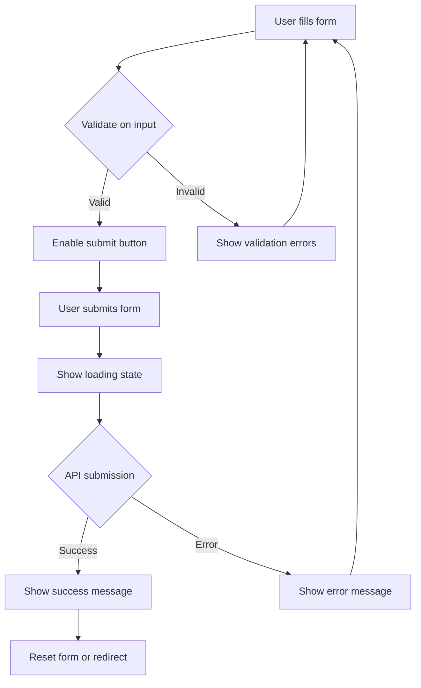

# Vue.js Form Best Practices

Forms are a crucial part of most web applications, serving as the primary way users interact with your application. In Vue.js, building forms that are both user-friendly and developer-friendly requires following established best practices. This guide will walk you through the essential patterns and techniques for creating effective forms in Vue.js.

## Introduction

When building forms in Vue.js, you'll want to focus on:

- Creating a good user experience
- Implementing proper validation
- Managing form state efficiently
- Writing maintainable code

Following best practices ensures that your forms are accessible, responsive, and provide meaningful feedback to users while being easy to maintain as a developer.

## Form Architecture Patterns

### v-model Binding

The foundation of Vue forms is the `v-model` directive, which creates two-way data binding between form inputs and your component's data.

```html
<template>
  <form @submit.prevent="submitForm">
    <div>
      <label for="username">Username:</label>
      <input 
        id="username" 
        v-model="formData.username" 
        type="text"
      />
    </div>
    <button type="submit">Submit</button>
  </form>
</template>

<script>
export default {
  data() {
    return {
      formData: {
        username: ''
      }
    }
  },
  methods: {
    submitForm() {
      console.log('Form submitted with:', this.formData);
      // API submission logic would go here
    }
  }
}
</script>
```

### Form Submission

Always handle form submissions with `@submit.prevent` to avoid unwanted page refreshes:

```html
<form @submit.prevent="submitForm">
  <!-- Form elements -->
</form>
```

The `.prevent` modifier is equivalent to calling `event.preventDefault()`, stopping the browser's default form submission behavior.

## Structuring Form Data

### Using Objects for Form State

Group related form fields in a single object for better organization:

```html
<script>
export default {
  data() {
    return {
      formData: {
        firstName: '',
        lastName: '',
        email: '',
        password: ''
      }
    }
  }
}
</script>
```

This approach makes it easier to:
- Reset the entire form
- Submit the form data to an API
- Track the initial state of the form

### Form State Management

For complex forms, consider using computed properties to derive additional information:

```html
<template>
  <form @submit.prevent="submitForm">
    <!-- Form fields -->
    <div>
      <p v-if="isComplete">All fields are filled!</p>
    </div>
  </form>
</template>

<script>
export default {
  data() {
    return {
      formData: {
        name: '',
        email: '',
        message: ''
      }
    }
  },
  computed: {
    isComplete() {
      return this.formData.name && 
             this.formData.email && 
             this.formData.message;
    }
  }
}
</script>
```

## Form Validation Strategies

### Client-Side Validation

Client-side validation provides immediate feedback to users. You can implement basic validation with computed properties:

```html
<template>
  <form @submit.prevent="submitForm">
    <div>
      <label for="email">Email:</label>
      <input 
        id="email" 
        v-model="formData.email" 
        type="email" 
      />
      <span class="error" v-if="!isEmailValid && formData.email">
        Please enter a valid email
      </span>
    </div>
    <button type="submit" :disabled="!isFormValid">Submit</button>
  </form>
</template>

<script>
export default {
  data() {
    return {
      formData: {
        email: ''
      }
    }
  },
  computed: {
    isEmailValid() {
      const emailRegex = /^[^\s@]+@[^\s@]+\.[^\s@]+$/;
      return emailRegex.test(this.formData.email);
    },
    isFormValid() {
      return this.isEmailValid && this.formData.email;
    }
  }
}
</script>
```

### Using Validation Libraries

For more complex validation, consider using libraries like Vuelidate or VeeValidate:

#### Example with VeeValidate

```html
<template>
  <Form @submit="submitForm">
    <div>
      <label for="email">Email:</label>
      <Field 
        name="email" 
        type="email" 
        v-model="formData.email" 
        :rules="{ required: true, email: true }" 
      />
      <ErrorMessage name="email" class="error" />
    </div>
    <button type="submit">Submit</button>
  </Form>
</template>

<script>
import { Form, Field, ErrorMessage } from 'vee-validate';

export default {
  components: {
    Form,
    Field,
    ErrorMessage
  },
  data() {
    return {
      formData: {
        email: ''
      }
    }
  },
  methods: {
    submitForm() {
      // Handle form submission
    }
  }
}
</script>
```

## Real-World Form Patterns

### Registration Form Example

Here's a complete registration form that implements several best practices:

```html
<template>
  <div class="form-container">
    <h2>Create an Account</h2>
    
    <form @submit.prevent="registerUser">
      <!-- Username field -->
      <div class="form-group">
        <label for="username">Username</label>
        <input 
          id="username"
          v-model.trim="formData.username"
          type="text"
          :class="{ 'has-error': errors.username }"
        />
        <span class="error-message" v-if="errors.username">
          {{ errors.username }}
        </span>
      </div>
      
      <!-- Email field -->
      <div class="form-group">
        <label for="email">Email</label>
        <input 
          id="email"
          v-model.trim="formData.email"
          type="email"
          :class="{ 'has-error': errors.email }"
        />
        <span class="error-message" v-if="errors.email">
          {{ errors.email }}
        </span>
      </div>
      
      <!-- Password field -->
      <div class="form-group">
        <label for="password">Password</label>
        <input 
          id="password"
          v-model="formData.password"
          type="password"
          :class="{ 'has-error': errors.password }"
        />
        <span class="error-message" v-if="errors.password">
          {{ errors.password }}
        </span>
        <div class="password-strength" v-if="formData.password">
          Password strength: {{ passwordStrength }}
        </div>
      </div>
      
      <!-- Terms agreement -->
      <div class="form-group checkbox">
        <input 
          id="terms"
          v-model="formData.agreeToTerms"
          type="checkbox"
        />
        <label for="terms">I agree to the Terms of Service</label>
        <span class="error-message" v-if="errors.agreeToTerms">
          {{ errors.agreeToTerms }}
        </span>
      </div>
      
      <!-- Submit button -->
      <div class="form-actions">
        <button 
          type="submit" 
          :disabled="isSubmitting || !isFormValid"
        >
          <span v-if="isSubmitting">Registering...</span>
          <span v-else>Register</span>
        </button>
      </div>
      
      <!-- Form submission status -->
      <div v-if="submissionMessage" class="submission-message" :class="submissionStatus">
        {{ submissionMessage }}
      </div>
    </form>
  </div>
</template>

<script>
export default {
  data() {
    return {
      formData: {
        username: '',
        email: '',
        password: '',
        agreeToTerms: false
      },
      errors: {},
      isSubmitting: false,
      submissionMessage: '',
      submissionStatus: ''
    }
  },
  computed: {
    passwordStrength() {
      const password = this.formData.password;
      if (!password) return '';
      
      if (password.length < 6) return 'Weak';
      if (password.length < 10) return 'Medium';
      if (/[A-Z]/.test(password) && 
          /[a-z]/.test(password) && 
          /[0-9]/.test(password) && 
          /[^A-Za-z0-9]/.test(password)) {
        return 'Strong';
      }
      return 'Medium';
    },
    isFormValid() {
      return this.validateForm() && !this.isSubmitting;
    }
  },
  methods: {
    validateForm() {
      this.errors = {};
      
      // Username validation
      if (!this.formData.username) {
        this.errors.username = 'Username is required';
      } else if (this.formData.username.length < 3) {
        this.errors.username = 'Username must be at least 3 characters';
      }
      
      // Email validation
      const emailRegex = /^[^\s@]+@[^\s@]+\.[^\s@]+$/;
      if (!this.formData.email) {
        this.errors.email = 'Email is required';
      } else if (!emailRegex.test(this.formData.email)) {
        this.errors.email = 'Please enter a valid email address';
      }
      
      // Password validation
      if (!this.formData.password) {
        this.errors.password = 'Password is required';
      } else if (this.formData.password.length < 6) {
        this.errors.password = 'Password must be at least 6 characters';
      }
      
      // Terms agreement
      if (!this.formData.agreeToTerms) {
        this.errors.agreeToTerms = 'You must agree to the terms';
      }
      
      return Object.keys(this.errors).length === 0;
    },
    async registerUser() {
      if (!this.validateForm()) return;
      
      this.isSubmitting = true;
      
      try {
        // Simulate API call
        await new Promise(resolve => setTimeout(resolve, 1500));
        
        // Simulate successful registration
        this.submissionMessage = 'Registration successful! Please check your email.';
        this.submissionStatus = 'success';
        
        // Reset form after successful submission
        this.resetForm();
      } catch (error) {
        this.submissionMessage = 'Registration failed. Please try again.';
        this.submissionStatus = 'error';
      } finally {
        this.isSubmitting = false;
      }
    },
    resetForm() {
      this.formData = {
        username: '',
        email: '',
        password: '',
        agreeToTerms: false
      };
      this.errors = {};
    }
  }
}
</script>

<style scoped>
.form-container {
  max-width: 500px;
  margin: 0 auto;
}

.form-group {
  margin-bottom: 20px;
}

.has-error {
  border-color: red !important;
}

.error-message {
  color: red;
  font-size: 0.8em;
  margin-top: 5px;
  display: block;
}

.submission-message {
  margin-top: 20px;
  padding: 10px;
  border-radius: 4px;
}

.success {
  background-color: #dff0d8;
  color: #3c763d;
}

.error {
  background-color: #f2dede;
  color: #a94442;
}
</style>
```

This example demonstrates:
- Form validation with immediate feedback
- Password strength indicator
- Form submission state management
- User feedback for submission status
- Form reset after successful submission

### Form Workflow Visualization

Here's a visualization of the form submission workflow:



## Accessibility Best Practices

### Labeling Form Elements

Always use proper labels with `for` attributes that match the input's `id`:

```html
<div class="form-group">
  <label for="email">Email address</label>
  <input id="email" type="email" v-model="formData.email" />
</div>
```

### Error Messages

Make error messages clear, concise, and accessible:

```html
<div class="form-group">
  <label for="username">Username</label>
  <input 
    id="username" 
    type="text" 
    v-model="formData.username"
    aria-describedby="username-error" 
  />
  <span id="username-error" class="error" role="alert" v-if="errors.username">
    {{ errors.username }}
  </span>
</div>
```

## Performance Considerations

### Debouncing Input Validation

For expensive validation operations, use debouncing to avoid excessive processing:

```html
<template>
  <div>
    <input type="text" v-model="username" @input="debouncedValidate" />
    <span v-if="usernameError">{{ usernameError }}</span>
  </div>
</template>

<script>
export default {
  data() {
    return {
      username: '',
      usernameError: '',
      debounceTimer: null
    }
  },
  methods: {
    debouncedValidate() {
      clearTimeout(this.debounceTimer);
      this.debounceTimer = setTimeout(() => {
        this.validateUsername();
      }, 500);
    },
    async validateUsername() {
      if (this.username.length < 3) {
        this.usernameError = 'Username must be at least 3 characters';
        return;
      }
      
      // Simulate API check for username availability
      try {
        const isAvailable = await this.checkUsernameAvailability(this.username);
        this.usernameError = isAvailable ? '' : 'Username already taken';
      } catch (error) {
        this.usernameError = 'Error checking username availability';
      }
    },
    async checkUsernameAvailability(username) {
      // Simulate API call
      await new Promise(resolve => setTimeout(resolve, 300));
      
      // Mock response - in real app, this would be an API call
      return !['admin', 'user', 'moderator'].includes(username);
    }
  }
}
</script>
```

## Summary

Building forms in Vue.js requires attention to several key areas:

1. **Form Structure**: Organize your form data and validation logically
2. **Validation**: Implement both client-side and server-side validation
3. **User Experience**: Provide clear feedback on form status and errors
4. **Accessibility**: Ensure your forms are usable by all users
5. **Performance**: Optimize validation for better user experience

By following these best practices, you'll create forms that are pleasant to use, resilient against errors, and maintainable as your application grows.

## Additional Resources

To deepen your knowledge of Vue.js forms, explore these resources:

- [Vue.js official documentation on form input bindings](https://vuejs.org/guide/essentials/forms.html)
- [VeeValidate - Form validation library for Vue.js](https://vee-validate.logaretm.com/)
- [Vuelidate - Simple, lightweight model-based validation](https://vuelidate-next.netlify.app/)

## Exercises

1. **Simple Contact Form**: Build a contact form with name, email, and message fields that validates each field before submission.

2. **Multi-Step Form**: Create a multi-step form (like a wizard) where each step validates before proceeding to the next.

3. **Dynamic Form Builder**: Build a component that takes a configuration object and generates a form with validation based on the configuration.

4. **Form with Dependent Fields**: Create a form where some fields become required or change their validation rules based on the values of other fields.