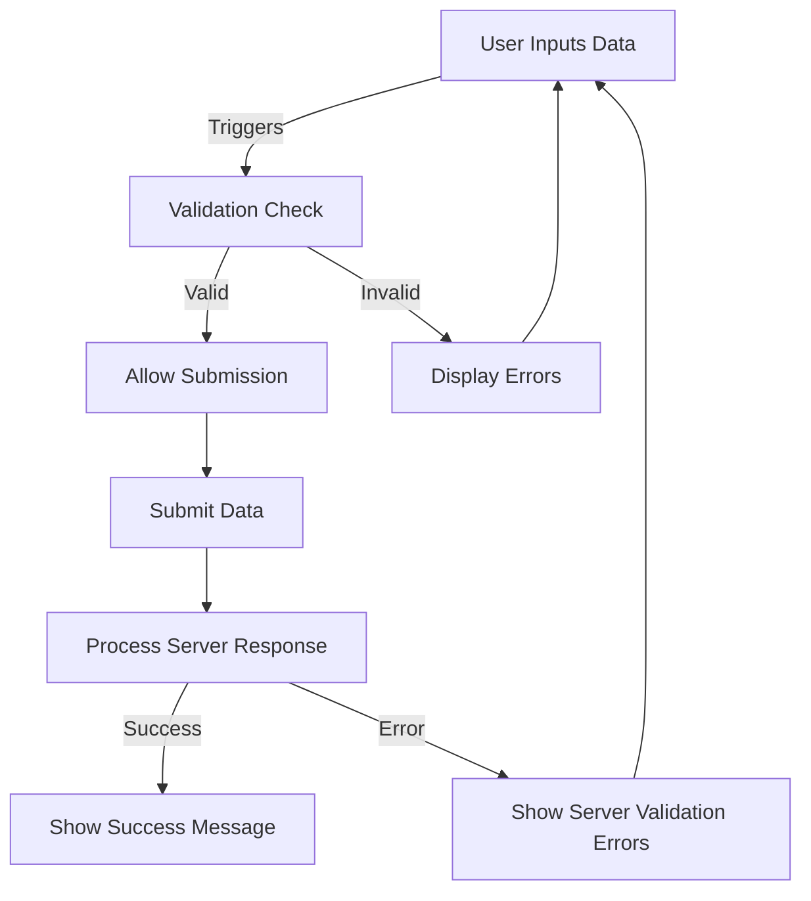

# Vue.js Form Validation

## Introduction

Form validation is a crucial aspect of web development that ensures users submit correct and properly formatted data. In Vue.js applications, implementing form validation helps prevent errors, improves user experience, and maintains data integrity. This guide will walk you through different approaches to form validation in Vue.js, from basic built-in validation to using dedicated validation libraries.

By the end of this tutorial, you'll understand how to:
- Implement basic form validation using Vue's built-in features
- Create custom validation rules
- Use popular Vue validation libraries
- Display validation errors to users effectively

## Basic Form Validation in Vue

### Using HTML5 Validation

The simplest way to start validating forms is by leveraging HTML5 validation attributes. Vue works seamlessly with these built-in browser validations.

```html
<template>
  <form @submit.prevent="submitForm">
    <div class="form-group">
      <label for="email">Email:</label>
      <input 
        type="email" 
        id="email" 
        v-model="email"
        required
      />
    </div>
    
    <div class="form-group">
      <label for="password">Password:</label>
      <input 
        type="password" 
        id="password" 
        v-model="password"
        required
        minlength="8"
      />
    </div>
    
    <button type="submit">Submit</button>
  </form>
</template>

<script>
export default {
  data() {
    return {
      email: '',
      password: ''
    }
  },
  methods: {
    submitForm() {
      // Form submission is automatically prevented if validation fails
      console.log('Form submitted:', { email: this.email, password: this.password });
    }
  }
}
</script>
```

In this example, the browser will handle validation based on:
- The `type="email"` attribute, which enforces a valid email format
- The `required` attribute, which ensures fields aren't empty
- The `minlength="8"` attribute, which enforces a minimum password length

### Custom Validation with Computed Properties

While HTML5 validation is convenient, you'll often need more complex validation logic. Vue's computed properties provide an elegant way to implement custom validation rules.

```html
<template>
  <form @submit.prevent="submitForm">
    <div class="form-group">
      <label for="username">Username:</label>
      <input 
        type="text" 
        id="username" 
        v-model="username"
      />
      <span class="error" v-if="!isUsernameValid && username">
        Username must be at least 3 characters
      </span>
    </div>
    
    <div class="form-group">
      <label for="email">Email:</label>
      <input 
        type="email" 
        id="email" 
        v-model="email"
      />
      <span class="error" v-if="!isEmailValid && email">
        Please enter a valid email address
      </span>
    </div>
    
    <button 
      type="submit" 
      :disabled="!isFormValid"
    >
      Submit
    </button>
  </form>
</template>

<script>
export default {
  data() {
    return {
      username: '',
      email: ''
    }
  },
  computed: {
    isUsernameValid() {
      return this.username.length >= 3;
    },
    isEmailValid() {
      const emailPattern = /^[^\s@]+@[^\s@]+\.[^\s@]+$/;
      return emailPattern.test(this.email);
    },
    isFormValid() {
      return this.isUsernameValid && this.isEmailValid;
    }
  },
  methods: {
    submitForm() {
      if (this.isFormValid) {
        console.log('Form submitted successfully!');
        // Process the form data
      } else {
        console.log('Form has validation errors');
      }
    }
  }
}
</script>

<style>
.error {
  color: red;
  font-size: 0.8em;
}
.form-group {
  margin-bottom: 15px;
}
</style>
```

This approach provides more flexibility by:
- Defining custom validation rules using computed properties
- Displaying error messages conditionally using Vue's directives
- Disabling the submit button until all validations pass

## Real-time Validation with Watchers

For an even better user experience, you can implement real-time validation using Vue's watchers. This approach validates input as the user types:

```html
<template>
  <form @submit.prevent="submitForm">
    <div class="form-group">
      <label for="password">Password:</label>
      <input 
        type="password" 
        id="password" 
        v-model="password"
      />
      <div class="validation-list">
        <p :class="{ valid: validations.hasMinLength }">
          At least 8 characters
        </p>
        <p :class="{ valid: validations.hasNumber }">
          Contains a number
        </p>
        <p :class="{ valid: validations.hasSpecial }">
          Contains a special character
        </p>
      </div>
    </div>
    
    <button 
      type="submit" 
      :disabled="!isPasswordValid"
    >
      Submit
    </button>
  </form>
</template>

<script>
export default {
  data() {
    return {
      password: '',
      validations: {
        hasMinLength: false,
        hasNumber: false,
        hasSpecial: false
      }
    }
  },
  computed: {
    isPasswordValid() {
      return this.validations.hasMinLength && 
             this.validations.hasNumber && 
             this.validations.hasSpecial;
    }
  },
  watch: {
    password: {
      handler(newValue) {
        this.validatePassword(newValue);
      },
      immediate: true
    }
  },
  methods: {
    validatePassword(password) {
      this.validations.hasMinLength = password.length >= 8;
      this.validations.hasNumber = /\d/.test(password);
      this.validations.hasSpecial = /[!@#$%^&*(),.?":{}|<>]/.test(password);
    },
    submitForm() {
      if (this.isPasswordValid) {
        console.log('Password meets all requirements');
        // Process form
      }
    }
  }
}
</script>

<style>
.validation-list p {
  color: red;
}
.validation-list p.valid {
  color: green;
}
</style>
```

This example demonstrates:
- Real-time validation as the user types using Vue watchers
- Visual feedback on which validation rules are satisfied
- A comprehensive password validation with multiple rules

## Form Validation with Vuelidate

For larger applications, using a dedicated validation library like Vuelidate can make validation more manageable and consistent. Here's how to implement form validation using Vuelidate:

First, install Vuelidate:

```bash
npm install @vuelidate/core @vuelidate/validators
```

Then implement it in your Vue component:

```html
<template>
  <form @submit.prevent="submitForm">
    <div class="form-group">
      <label for="name">Full Name:</label>
      <input 
        type="text" 
        id="name" 
        v-model="name"
      />
      <div class="error" v-if="v$.name.$error">
        <span v-if="v$.name.required.$invalid">Name is required</span>
        <span v-if="v$.name.minLength.$invalid">Name must be at least 3 characters</span>
      </div>
    </div>
    
    <div class="form-group">
      <label for="email">Email:</label>
      <input 
        type="email" 
        id="email" 
        v-model="email"
      />
      <div class="error" v-if="v$.email.$error">
        <span v-if="v$.email.required.$invalid">Email is required</span>
        <span v-if="v$.email.email.$invalid">Email is not valid</span>
      </div>
    </div>
    
    <div class="form-group">
      <label for="age">Age:</label>
      <input 
        type="number" 
        id="age" 
        v-model.number="age"
      />
      <div class="error" v-if="v$.age.$error">
        <span v-if="v$.age.required.$invalid">Age is required</span>
        <span v-if="v$.age.minValue.$invalid">You must be 18 or older</span>
      </div>
    </div>
    
    <button type="submit" :disabled="v$.$invalid">Submit</button>
  </form>
</template>

<script>
import { useVuelidate } from '@vuelidate/core';
import { required, minLength, email, minValue } from '@vuelidate/validators';

export default {
  setup() {
    return { v$: useVuelidate() }
  },
  data() {
    return {
      name: '',
      email: '',
      age: null
    }
  },
  validations() {
    return {
      name: { 
        required, 
        minLength: minLength(3) 
      },
      email: { 
        required, 
        email 
      },
      age: { 
        required, 
        minValue: minValue(18) 
      }
    }
  },
  methods: {
    async submitForm() {
      const isFormCorrect = await this.v$.$validate();
      if (!isFormCorrect) {
        console.log('Form validation failed');
        return;
      }
      
      // Form is valid, process submission
      console.log('Form submitted successfully', {
        name: this.name,
        email: this.email,
        age: this.age
      });
      
      // Reset validation state
      this.v$.$reset();
    }
  }
}
</script>
```

Using Vuelidate provides:
- A wide range of built-in validators
- Support for async validation (like checking if a username is already taken)
- Easy combination of multiple validation rules
- Clean separation of validation logic from component logic

## Implementing a Complete Registration Form

Let's combine everything we've learned to create a complete registration form with validation:

```html
<template>
  <div class="registration-form">
    <h2>Create an Account</h2>
    
    <form @submit.prevent="submitForm">
      <!-- Username Field -->
      <div class="form-group">
        <label for="username">Username:</label>
        <input 
          type="text" 
          id="username" 
          v-model="formData.username"
          @blur="v$.formData.username.$touch()"
        />
        <div class="error" v-if="v$.formData.username.$error">
          <span v-if="v$.formData.username.required.$invalid">Username is required</span>
          <span v-if="v$.formData.username.minLength.$invalid">Username must be at least 4 characters</span>
          <span v-if="v$.formData.username.alpha.$invalid">Username must contain only letters</span>
        </div>
      </div>
      
      <!-- Email Field -->
      <div class="form-group">
        <label for="email">Email:</label>
        <input 
          type="email" 
          id="email" 
          v-model="formData.email"
          @blur="v$.formData.email.$touch()"
        />
        <div class="error" v-if="v$.formData.email.$error">
          <span v-if="v$.formData.email.required.$invalid">Email is required</span>
          <span v-if="v$.formData.email.email.$invalid">Please enter a valid email</span>
        </div>
      </div>
      
      <!-- Password Field -->
      <div class="form-group">
        <label for="password">Password:</label>
        <input 
          type="password" 
          id="password" 
          v-model="formData.password"
          @blur="v$.formData.password.$touch()"
        />
        <div class="error" v-if="v$.formData.password.$error">
          <span v-if="v$.formData.password.required.$invalid">Password is required</span>
          <span v-if="v$.formData.password.minLength.$invalid">Password must be at least 8 characters</span>
          <span v-if="v$.formData.password.containsNumber.$invalid">
            Password must contain at least one number
          </span>
        </div>
      </div>
      
      <!-- Confirm Password Field -->
      <div class="form-group">
        <label for="confirmPassword">Confirm Password:</label>
        <input 
          type="password" 
          id="confirmPassword" 
          v-model="formData.confirmPassword"
          @blur="v$.formData.confirmPassword.$touch()"
        />
        <div class="error" v-if="v$.formData.confirmPassword.$error">
          <span v-if="v$.formData.confirmPassword.required.$invalid">Please confirm your password</span>
          <span v-if="v$.formData.confirmPassword.sameAsPassword.$invalid">
            Passwords do not match
          </span>
        </div>
      </div>
      
      <!-- Terms & Conditions -->
      <div class="form-group checkbox">
        <input 
          type="checkbox" 
          id="terms" 
          v-model="formData.termsAccepted"
          @change="v$.formData.termsAccepted.$touch()"
        />
        <label for="terms">I accept the Terms and Conditions</label>
        <div class="error" v-if="v$.formData.termsAccepted.$error">
          <span v-if="v$.formData.termsAccepted.mustBeTrue.$invalid">
            You must accept the terms and conditions
          </span>
        </div>
      </div>
      
      <!-- Submit Button -->
      <div class="form-group">
        <button 
          type="submit" 
          :disabled="v$.$invalid"
          class="submit-button"
        >
          Register
        </button>
      </div>
      
      <!-- Success Message -->
      <div v-if="formSubmitted" class="success-message">
        Registration successful! Check your email to activate your account.
      </div>
    </form>
  </div>
</template>

<script>
import { useVuelidate } from '@vuelidate/core';
import { required, email, minLength, helpers, sameAs } from '@vuelidate/validators';

// Custom validators
const alpha = helpers.regex(/^[a-zA-Z]+$/);
const containsNumber = helpers.regex(/\d+/);
const mustBeTrue = value => value === true;

export default {
  setup() {
    return { v$: useVuelidate() }
  },
  data() {
    return {
      formData: {
        username: '',
        email: '',
        password: '',
        confirmPassword: '',
        termsAccepted: false
      },
      formSubmitted: false
    }
  },
  validations() {
    return {
      formData: {
        username: { 
          required, 
          minLength: minLength(4),
          alpha
        },
        email: { 
          required, 
          email 
        },
        password: { 
          required, 
          minLength: minLength(8),
          containsNumber
        },
        confirmPassword: { 
          required,
          sameAsPassword: sameAs(this.formData.password)
        },
        termsAccepted: {
          mustBeTrue
        }
      }
    }
  },
  methods: {
    async submitForm() {
      const isFormCorrect = await this.v$.$validate();
      if (!isFormCorrect) {
        console.log('Form validation failed');
        return;
      }
      
      // In a real application, you would submit this data to your API
      console.log('Form submitted successfully', this.formData);
      
      // Show success message and reset form
      this.formSubmitted = true;
      this.formData = {
        username: '',
        email: '',
        password: '',
        confirmPassword: '',
        termsAccepted: false
      };
      this.v$.$reset();
      
      // Hide success message after 3 seconds
      setTimeout(() => {
        this.formSubmitted = false;
      }, 3000);
    }
  }
}
</script>

<style scoped>
.registration-form {
  max-width: 500px;
  margin: 0 auto;
  padding: 20px;
  border: 1px solid #ddd;
  border-radius: 5px;
}

.form-group {
  margin-bottom: 15px;
}

label {
  display: block;
  margin-bottom: 5px;
  font-weight: bold;
}

input[type="text"],
input[type="email"],
input[type="password"] {
  width: 100%;
  padding: 8px;
  border: 1px solid #ddd;
  border-radius: 4px;
}

.checkbox {
  display: flex;
  align-items: center;
}

.checkbox input {
  margin-right: 10px;
}

.checkbox label {
  margin-bottom: 0;
  font-weight: normal;
}

.error {
  color: #ff4c4c;
  font-size: 0.8em;
  margin-top: 5px;
}

.submit-button {
  background-color: #4CAF50;
  color: white;
  padding: 10px 15px;
  border: none;
  border-radius: 4px;
  cursor: pointer;
  font-size: 1em;
}

.submit-button:disabled {
  background-color: #cccccc;
  cursor: not-allowed;
}

.success-message {
  margin-top: 15px;
  padding: 10px;
  background-color: #dff0d8;
  color: #3c763d;
  border: 1px solid #d6e9c6;
  border-radius: 4px;
}
</style>
```

This comprehensive example demonstrates:
- Form validation with Vuelidate
- Custom validation rules
- Real-time validation when fields lose focus
- Conditional error messaging
- Form submission handling
- Success feedback
- Form reset functionality

## Form Validation Workflow

Let's understand the general workflow for form validation in Vue applications:



## Tips for Better Form Validation

1. **Provide instant feedback**: Validate fields as soon as users finish typing or move to the next field

2. **Use clear error messages**: Be specific about what's wrong and how to fix it

3. **Highlight problematic fields**: Use visual cues like red borders to draw attention to fields with errors

4. **Prevent premature validation**: Don't show validation errors before users have had a chance to input data

5. **Progressive disclosure**: For complex forms, show validation rules progressively as users interact with the form

6. **Accessible validation**: Ensure validation errors are accessible to screen readers and keyboard-only users

7. **Debounce validation**: For resource-intensive validations, consider debouncing to prevent performance issues

## Summary

Form validation in Vue.js helps ensure data integrity and improves user experience. In this guide, we've covered:

- Basic HTML5 validation with Vue.js
- Custom validation using computed properties and watchers
- Using Vuelidate for more comprehensive validation needs
- Creating a complete registration form with validation
- Best practices for implementing form validation

Form validation is a critical aspect of building reliable web applications. By implementing proper validation, you help users submit correct data while providing a better overall user experience. The techniques covered in this guide will help you implement robust form validation in your Vue.js projects.

## Additional Resources

- [Official Vuelidate Documentation](https://vuelidate-next.netlify.app/)
- [Vue.js Form Validation Examples](https://vuejs.org/guide/essentials/forms.html)
- [Vue Form Generator](https://github.com/vue-generators/vue-form-generator) - For generating complex forms with validation

## Practice Exercises

1. Create a form for collecting shipping information with validation for address, city, zip code, and phone number.

2. Implement a contact form with validation and CAPTCHA integration.

3. Build a multi-step form wizard with validation at each step.

4. Create a custom validation directive that can be reused across your application.

5. Implement form validation with localized error messages for multiple languages.