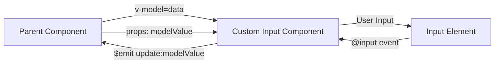

# Vue.js Custom Inputs

## Introduction

When building forms in Vue.js applications, you'll often need input elements that go beyond the standard HTML inputs. Creating custom input components allows you to encapsulate logic, styling, and validation, making your forms more maintainable and your code more reusable.

In this tutorial, we'll learn how to create custom input components in Vue.js that work seamlessly with forms, including how to properly implement `v-model` support and handle validation.

## Why Create Custom Input Components?

Before diving into implementation, let's understand why custom input components are valuable:

1. **Reusability**: Define an input once and use it throughout your application
2. **Consistency**: Ensure all inputs have the same styling and behavior
3. **Encapsulation**: Hide complex logic and validation inside the component
4. **Maintainability**: Update all inputs by changing a single component

## Basic Custom Input Component

Let's start by creating a simple custom text input component:

```html
<!-- CustomInput.vue -->
<template>
  <div class="custom-input">
    <label v-if="label">{{ label }}</label>
    <input 
      :type="type" 
      :value="modelValue" 
      @input="updateValue($event)"
      :placeholder="placeholder"
      :disabled="disabled"
      :class="{ error: hasError }"
    />
    <div v-if="hasError" class="error-message">
      {{ errorMessage }}
    </div>
  </div>
</template>

<script>
export default {
  name: 'CustomInput',
  props: {
    modelValue: {
      type: [String, Number],
      default: ''
    },
    label: {
      type: String,
      default: ''
    },
    type: {
      type: String,
      default: 'text'
    },
    placeholder: {
      type: String,
      default: ''
    },
    disabled: {
      type: Boolean,
      default: false
    },
    errorMessage: {
      type: String,
      default: ''
    }
  },
  computed: {
    hasError() {
      return this.errorMessage !== '';
    }
  },
  methods: {
    updateValue(event) {
      this.$emit('update:modelValue', event.target.value);
    }
  }
}
</script>

<style scoped>
.custom-input {
  margin-bottom: 16px;
}

label {
  display: block;
  margin-bottom: 4px;
  font-weight: bold;
}

input {
  width: 100%;
  padding: 8px;
  border: 1px solid #ccc;
  border-radius: 4px;
}

input.error {
  border-color: red;
}

.error-message {
  color: red;
  font-size: 12px;
  margin-top: 4px;
}
</style>
```

### Using the Custom Input

Here's how you would use this custom input in a parent component:

```html
<template>
  <div>
    <h2>Registration Form</h2>
    <form @submit.prevent="submitForm">
      <CustomInput 
        v-model="username" 
        label="Username" 
        placeholder="Enter your username"
        :error-message="errors.username"
      />
      
      <CustomInput 
        v-model="password" 
        label="Password" 
        type="password"
        placeholder="Enter your password" 
        :error-message="errors.password"
      />
      
      <button type="submit">Register</button>
    </form>
  </div>
</template>

<script>
import CustomInput from './CustomInput.vue';

export default {
  components: {
    CustomInput
  },
  data() {
    return {
      username: '',
      password: '',
      errors: {
        username: '',
        password: ''
      }
    };
  },
  methods: {
    submitForm() {
      // Reset errors
      this.errors = {
        username: '',
        password: ''
      };
      
      // Validate
      if (!this.username) {
        this.errors.username = 'Username is required';
      }
      
      if (!this.password) {
        this.errors.password = 'Password is required';
      } else if (this.password.length < 6) {
        this.errors.password = 'Password must be at least 6 characters';
      }
      
      // If no errors, submit the form
      if (!this.errors.username && !this.errors.password) {
        alert('Form submitted successfully!');
        // Here you would typically make an API call
      }
    }
  }
};
</script>
```

## Understanding v-model with Custom Components

A key aspect of creating custom input components is understanding how `v-model` works. When you use `v-model` on a custom component, Vue.js automatically:

1. Passes a prop called `modelValue` (in Vue 3) or `value` (in Vue 2)
2. Listens for an `update:modelValue` event (in Vue 3) or `input` event (in Vue 2)

This is why our component above accepts a `modelValue` prop and emits an `update:modelValue` event when the input changes.

### Vue 2 vs Vue 3 Syntax

For Vue 3:

```html
<!-- In the custom component -->
<script>
export default {
  props: ['modelValue'],
  methods: {
    updateValue(event) {
      this.$emit('update:modelValue', event.target.value);
    }
  }
}
</script>

<!-- In the parent -->
<CustomInput v-model="username" />
```

For Vue 2:

```html
<!-- In the custom component -->
<script>
export default {
  props: ['value'],
  methods: {
    updateValue(event) {
      this.$emit('input', event.target.value);
    }
  }
}
</script>

<!-- In the parent -->
<CustomInput v-model="username" />
```

## Advanced Custom Input Types

Now that we understand the basics, let's create some more specialized input components.

### Custom Checkbox Component

```html
<!-- CustomCheckbox.vue -->
<template>
  <div class="custom-checkbox">
    <input 
      type="checkbox"
      :id="id"
      :checked="modelValue"
      @input="$emit('update:modelValue', $event.target.checked)"
      :disabled="disabled"
    />
    <label :for="id">{{ label }}</label>
    <div v-if="hasError" class="error-message">
      {{ errorMessage }}
    </div>
  </div>
</template>

<script>
export default {
  name: 'CustomCheckbox',
  props: {
    modelValue: {
      type: Boolean,
      default: false
    },
    label: {
      type: String,
      default: ''
    },
    id: {
      type: String,
      required: true
    },
    disabled: {
      type: Boolean,
      default: false
    },
    errorMessage: {
      type: String,
      default: ''
    }
  },
  computed: {
    hasError() {
      return this.errorMessage !== '';
    }
  }
}
</script>

<style scoped>
.custom-checkbox {
  display: flex;
  align-items: center;
  margin-bottom: 16px;
}

label {
  margin-left: 8px;
}

.error-message {
  color: red;
  font-size: 12px;
  margin-left: 8px;
}
</style>
```

### Custom Select Component

```html
<!-- CustomSelect.vue -->
<template>
  <div class="custom-select">
    <label v-if="label">{{ label }}</label>
    <select 
      :value="modelValue"
      @change="$emit('update:modelValue', $event.target.value)"
      :disabled="disabled"
      :class="{ error: hasError }"
    >
      <option v-if="placeholder" value="" disabled selected>
        {{ placeholder }}
      </option>
      <option 
        v-for="option in options" 
        :key="option.value" 
        :value="option.value"
      >
        {{ option.text }}
      </option>
    </select>
    <div v-if="hasError" class="error-message">
      {{ errorMessage }}
    </div>
  </div>
</template>

<script>
export default {
  name: 'CustomSelect',
  props: {
    modelValue: {
      type: [String, Number],
      default: ''
    },
    label: {
      type: String,
      default: ''
    },
    options: {
      type: Array,
      required: true
      // Each option should be { value: 'value', text: 'display text' }
    },
    placeholder: {
      type: String,
      default: 'Please select an option'
    },
    disabled: {
      type: Boolean,
      default: false
    },
    errorMessage: {
      type: String,
      default: ''
    }
  },
  computed: {
    hasError() {
      return this.errorMessage !== '';
    }
  }
}
</script>

<style scoped>
.custom-select {
  margin-bottom: 16px;
}

label {
  display: block;
  margin-bottom: 4px;
  font-weight: bold;
}

select {
  width: 100%;
  padding: 8px;
  border: 1px solid #ccc;
  border-radius: 4px;
  background-color: white;
}

select.error {
  border-color: red;
}

.error-message {
  color: red;
  font-size: 12px;
  margin-top: 4px;
}
</style>
```

## Real-world Example: Form with Custom Inputs

Let's see how we can use all these custom inputs in a complete form:

```html
<!-- RegistrationForm.vue -->
<template>
  <div class="registration-form">
    <h2>Create an Account</h2>
    <form @submit.prevent="submitForm">
      <CustomInput
        v-model="form.fullName"
        label="Full Name"
        placeholder="Enter your full name"
        :error-message="errors.fullName"
      />
      
      <CustomInput
        v-model="form.email"
        label="Email"
        type="email"
        placeholder="Enter your email address"
        :error-message="errors.email"
      />
      
      <CustomInput
        v-model="form.password"
        label="Password"
        type="password"
        placeholder="Choose a strong password"
        :error-message="errors.password"
      />
      
      <CustomSelect
        v-model="form.country"
        label="Country"
        :options="countryOptions"
        placeholder="Select your country"
        :error-message="errors.country"
      />
      
      <CustomCheckbox
        v-model="form.agreeToTerms"
        id="terms"
        label="I agree to the terms and conditions"
        :error-message="errors.agreeToTerms"
      />
      
      <button type="submit" class="submit-button">Register</button>
    </form>
  </div>
</template>

<script>
import CustomInput from './CustomInput.vue';
import CustomSelect from './CustomSelect.vue';
import CustomCheckbox from './CustomCheckbox.vue';

export default {
  components: {
    CustomInput,
    CustomSelect,
    CustomCheckbox
  },
  data() {
    return {
      form: {
        fullName: '',
        email: '',
        password: '',
        country: '',
        agreeToTerms: false
      },
      errors: {
        fullName: '',
        email: '',
        password: '',
        country: '',
        agreeToTerms: ''
      },
      countryOptions: [
        { value: 'us', text: 'United States' },
        { value: 'ca', text: 'Canada' },
        { value: 'uk', text: 'United Kingdom' },
        { value: 'au', text: 'Australia' }
      ]
    };
  },
  methods: {
    validateEmail(email) {
      const re = /^[^\s@]+@[^\s@]+\.[^\s@]+$/;
      return re.test(email);
    },
    submitForm() {
      // Reset errors
      for (const key in this.errors) {
        this.errors[key] = '';
      }
      
      // Validate form
      let isValid = true;
      
      if (!this.form.fullName) {
        this.errors.fullName = 'Full name is required';
        isValid = false;
      }
      
      if (!this.form.email) {
        this.errors.email = 'Email is required';
        isValid = false;
      } else if (!this.validateEmail(this.form.email)) {
        this.errors.email = 'Please enter a valid email address';
        isValid = false;
      }
      
      if (!this.form.password) {
        this.errors.password = 'Password is required';
        isValid = false;
      } else if (this.form.password.length < 8) {
        this.errors.password = 'Password must be at least 8 characters';
        isValid = false;
      }
      
      if (!this.form.country) {
        this.errors.country = 'Please select a country';
        isValid = false;
      }
      
      if (!this.form.agreeToTerms) {
        this.errors.agreeToTerms = 'You must agree to the terms';
        isValid = false;
      }
      
      // Submit if valid
      if (isValid) {
        // Here you would typically make an API call
        console.log('Form submitted:', this.form);
        alert('Registration successful!');
      }
    }
  }
};
</script>

<style scoped>
.registration-form {
  max-width: 500px;
  margin: 0 auto;
  padding: 20px;
  border: 1px solid #ddd;
  border-radius: 8px;
  background-color: #f9f9f9;
}

h2 {
  text-align: center;
  margin-bottom: 20px;
}

.submit-button {
  width: 100%;
  padding: 10px;
  background-color: #4CAF50;
  color: white;
  border: none;
  border-radius: 4px;
  cursor: pointer;
  font-size: 16px;
}

.submit-button:hover {
  background-color: #45a049;
}
</style>
```

## Component Design Flow

Understanding how data flows between custom inputs and parent components is crucial:



## Best Practices for Custom Input Components

1. **Always emit the expected events**: For `v-model` to work correctly, emit `update:modelValue` in Vue 3 or `input` in Vue 2.

2. **Keep components focused**: Each component should do one thing well. Don't try to build a component that handles multiple input types.

3. **Provide good defaults**: Set sensible default values for all props to make your components easier to use.

4. **Handle accessibility**: Ensure your inputs are accessible by using proper ARIA attributes and focusing on keyboard navigation.

5. **Support validation**: Make sure your components can display validation errors in a consistent way.

6. **Document your components**: Add clear prop definitions with types, defaults, and required flags.

7. **Make styling customizable**: Allow parent components to customize the appearance of your inputs.

## Advanced Considerations

### Handling Composition API

If you're using Vue 3's Composition API, your custom input might look like this:

```html
<template>
  <div class="custom-input">
    <label v-if="label">{{ label }}</label>
    <input 
      :type="type" 
      :value="modelValue" 
      @input="updateValue($event)"
      :placeholder="placeholder"
    />
  </div>
</template>

<script>
import { computed } from 'vue';

export default {
  name: 'CustomInput',
  props: {
    modelValue: {
      type: [String, Number],
      default: ''
    },
    label: {
      type: String,
      default: ''
    },
    type: {
      type: String,
      default: 'text'
    },
    placeholder: {
      type: String,
      default: ''
    }
  },
  setup(props, { emit }) {
    const updateValue = (event) => {
      emit('update:modelValue', event.target.value);
    };

    return {
      updateValue
    };
  }
};
</script>
```

### Form Validation Libraries

When building complex forms, consider using validation libraries like Vuelidate or VeeValidate. These libraries work well with custom inputs.

Example with Vuelidate:

```html
<template>
  <div>
    <CustomInput
      v-model="v$.email.$model"
      label="Email"
      :error-message="v$.email.$errors[0]?.$message"
    />
  </div>
</template>

<script>
import { useVuelidate } from '@vuelidate/core';
import { required, email } from '@vuelidate/validators';
import CustomInput from './CustomInput.vue';

export default {
  components: { CustomInput },
  setup() {
    const state = reactive({
      email: ''
    });
    
    const rules = {
      email: { required, email }
    };
    
    const v$ = useVuelidate(rules, state);
    
    return { state, v$ };
  }
};
</script>
```

## Summary

Creating custom input components in Vue.js allows you to build more maintainable, consistent forms throughout your application. In this guide, we've covered:

- Creating basic custom input components
- Implementing `v-model` support
- Building specialized inputs like checkboxes and select dropdowns
- Creating a complete form with custom inputs
- Best practices for custom input development

By following these patterns, you can create a library of reusable input components that will make form development in your Vue applications faster, more consistent, and more maintainable.

## Additional Resources

- [Vue.js Documentation on Components](https://vuejs.org/guide/components/props.html)
- [Vue.js Documentation on Forms](https://vuejs.org/guide/essentials/forms.html)
- [Vuelidate for Form Validation](https://vuelidate-next.netlify.app/)
- [VeeValidate for Form Validation](https://vee-validate.logaretm.com/v4/)

## Exercises

1. Create a custom input component for handling numeric values only.
2. Build a custom file upload component that supports drag and drop.
3. Create a custom date picker component that uses `v-model`.
4. Enhance the existing components with accessibility features.
5. Implement a custom multi-select component that supports selecting multiple options.