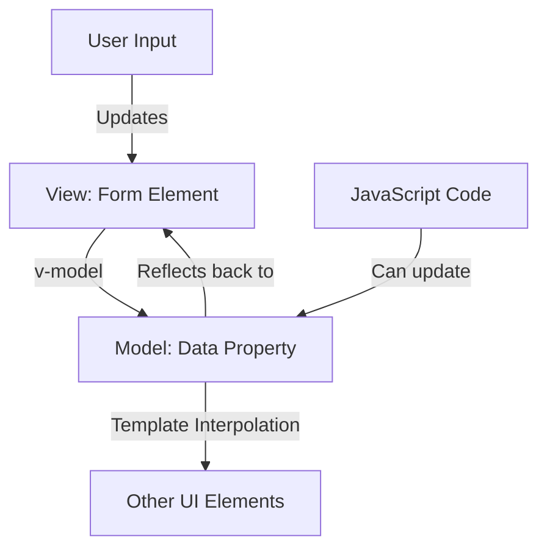

# Vue.js Value Binding

## Introduction

Value binding is a fundamental concept in Vue.js that allows you to create a connection between your form elements and your application's data. In traditional web development, you'd have to manually synchronize the values between your HTML inputs and your JavaScript variables. Vue.js simplifies this process significantly with its two-way data binding capability, primarily through the `v-model` directive.

In this tutorial, you'll learn how to implement value binding in Vue.js forms, understand the underlying mechanisms, and see how to apply it in real-world scenarios.

## Understanding Value Binding in Vue

Value binding in Vue.js refers to the synchronization of data between the view (HTML) and the model (JavaScript data). Vue provides a special directive called `v-model` that creates two-way binding on form inputs and components. This means:

1. When the data changes in your JavaScript, the input is updated automatically
2. When you interact with the form element, the JavaScript data is updated automatically

## Basic Value Binding with v-model

Let's start with a simple example of binding a text input to a data property:

```html
<template>
  <div>
    <h2>Basic Text Input</h2>
    <input v-model="message" placeholder="Edit me" />
    <p>The message is: {{ message }}</p>
  </div>
</template>

<script>
export default {
  data() {
    return {
      message: ''
    }
  }
}
</script>
```

In this example, the `message` data property is bound to the input field. When you type in the input, the `message` property is automatically updated, and the paragraph below shows the current value in real-time.

## How v-model Works Behind the Scenes

The `v-model` directive is actually syntactic sugar for two separate operations:

1. A `:value` binding (one-way data binding from model to view)
2. An `@input` event listener (to update the model when the view changes)

For example, the following two code snippets are equivalent:

```html
<input v-model="message" />
```

```html
<input 
  :value="message" 
  @input="message = $event.target.value"
/>
```

Understanding this underlying mechanism helps you customize binding behavior when necessary.

## Value Binding with Different Input Types

Vue's `v-model` works with all the standard form input types, but the behavior can vary slightly depending on the input type.

### Text and Textarea

For text fields and textareas, `v-model` binds to the `value` property and listens to the `input` event:

```html
<template>
  <div>
    <h3>Text Input</h3>
    <input v-model="textValue" type="text" />
    <p>Text value: {{ textValue }}</p>
    
    <h3>Textarea</h3>
    <textarea v-model="textareaValue" rows="4"></textarea>
    <p>Textarea content: {{ textareaValue }}</p>
  </div>
</template>

<script>
export default {
  data() {
    return {
      textValue: '',
      textareaValue: ''
    }
  }
}
</script>
```

### Checkbox

For checkboxes, `v-model` binds to the `checked` property:

```html
<template>
  <div>
    <h3>Single Checkbox</h3>
    <input type="checkbox" v-model="isChecked" />
    <label>{{ isChecked ? 'Checked' : 'Not checked' }}</label>
    
    <h3>Multiple Checkboxes</h3>
    <input type="checkbox" id="apple" value="Apple" v-model="checkedFruits" />
    <label for="apple">Apple</label>
    
    <input type="checkbox" id="banana" value="Banana" v-model="checkedFruits" />
    <label for="banana">Banana</label>
    
    <input type="checkbox" id="cherry" value="Cherry" v-model="checkedFruits" />
    <label for="cherry">Cherry</label>
    
    <p>Selected fruits: {{ checkedFruits }}</p>
  </div>
</template>

<script>
export default {
  data() {
    return {
      isChecked: false,
      checkedFruits: []
    }
  }
}
</script>
```

When using multiple checkboxes bound to the same array, Vue will automatically add or remove the checkbox's `value` from the array based on whether it's checked.

### Radio Buttons

For radio buttons, `v-model` makes managing mutually exclusive options easy:

```html
<template>
  <div>
    <h3>Radio Button Selection</h3>
    <input type="radio" id="option1" v-model="picked" value="Option 1" />
    <label for="option1">Option 1</label>
    <br />
    <input type="radio" id="option2" v-model="picked" value="Option 2" />
    <label for="option2">Option 2</label>
    <br />
    <p>Selected: {{ picked }}</p>
  </div>
</template>

<script>
export default {
  data() {
    return {
      picked: ''
    }
  }
}
</script>
```

### Select Dropdowns

The `v-model` directive also works with select elements:

```html
<template>
  <div>
    <h3>Single Select</h3>
    <select v-model="selectedColor">
      <option value="">Select a color</option>
      <option value="red">Red</option>
      <option value="green">Green</option>
      <option value="blue">Blue</option>
    </select>
    <p>Selected color: {{ selectedColor }}</p>
    
    <h3>Multiple Select</h3>
    <select multiple v-model="selectedColors">
      <option value="red">Red</option>
      <option value="green">Green</option>
      <option value="blue">Blue</option>
      <option value="yellow">Yellow</option>
    </select>
    <p>Selected colors: {{ selectedColors }}</p>
  </div>
</template>

<script>
export default {
  data() {
    return {
      selectedColor: '',
      selectedColors: []
    }
  }
}
</script>
```

## Value Binding Modifiers

Vue.js provides several modifiers for `v-model` that change how the binding behaves:

### .lazy

By default, `v-model` syncs the input with the data after each `input` event. You can use the `.lazy` modifier to instead sync after `change` events (when the input loses focus):

```html
<!-- Synced after "change" instead of "input" event -->
<input v-model.lazy="message" />
```

### .number

If you want the user input to be automatically converted to a number, you can use the `.number` modifier:

```html
<input v-model.number="age" type="number" />
```

### .trim

To automatically trim whitespace from user input, use the `.trim` modifier:

```html
<input v-model.trim="username" />
```

## Practical Example: Registration Form

Let's build a complete registration form using value binding:

```html
<template>
  <div class="registration-form">
    <h2>User Registration</h2>
    
    <div class="form-group">
      <label for="username">Username:</label>
      <input 
        id="username" 
        v-model.trim="formData.username" 
        type="text"
        @blur="validateField('username')"
      />
      <p v-if="errors.username" class="error">{{ errors.username }}</p>
    </div>
    
    <div class="form-group">
      <label for="email">Email:</label>
      <input 
        id="email" 
        v-model="formData.email" 
        type="email"
        @blur="validateField('email')"
      />
      <p v-if="errors.email" class="error">{{ errors.email }}</p>
    </div>
    
    <div class="form-group">
      <label for="password">Password:</label>
      <input 
        id="password" 
        v-model="formData.password" 
        type="password"
        @blur="validateField('password')"
      />
      <p v-if="errors.password" class="error">{{ errors.password }}</p>
    </div>
    
    <div class="form-group">
      <label for="age">Age:</label>
      <input 
        id="age" 
        v-model.number="formData.age" 
        type="number"
        min="1"
      />
    </div>
    
    <div class="form-group">
      <label>Interests:</label>
      <div>
        <input type="checkbox" id="coding" value="coding" v-model="formData.interests" />
        <label for="coding">Coding</label>
      </div>
      <div>
        <input type="checkbox" id="design" value="design" v-model="formData.interests" />
        <label for="design">Design</label>
      </div>
      <div>
        <input type="checkbox" id="business" value="business" v-model="formData.interests" />
        <label for="business">Business</label>
      </div>
    </div>
    
    <div class="form-group">
      <label>Preferred Contact Method:</label>
      <div>
        <input type="radio" id="contact-email" value="email" v-model="formData.contactMethod" />
        <label for="contact-email">Email</label>
      </div>
      <div>
        <input type="radio" id="contact-phone" value="phone" v-model="formData.contactMethod" />
        <label for="contact-phone">Phone</label>
      </div>
    </div>
    
    <div class="form-group">
      <label for="country">Country:</label>
      <select id="country" v-model="formData.country">
        <option value="">Select a country</option>
        <option value="usa">United States</option>
        <option value="canada">Canada</option>
        <option value="uk">United Kingdom</option>
        <option value="australia">Australia</option>
      </select>
    </div>
    
    <div class="form-group">
      <label for="bio">Bio:</label>
      <textarea id="bio" v-model.trim="formData.bio" rows="4"></textarea>
    </div>
    
    <div class="form-group">
      <label>
        <input type="checkbox" v-model="formData.termsAccepted" />
        I accept the terms and conditions
      </label>
      <p v-if="errors.termsAccepted" class="error">{{ errors.termsAccepted }}</p>
    </div>
    
    <button @click="submitForm" :disabled="!formIsValid">Register</button>
    
    <div v-if="formSubmitted" class="success-message">
      <h3>Registration Successful!</h3>
      <pre>{{ JSON.stringify(formData, null, 2) }}</pre>
    </div>
  </div>
</template>

<script>
export default {
  data() {
    return {
      formData: {
        username: '',
        email: '',
        password: '',
        age: null,
        interests: [],
        contactMethod: 'email',
        country: '',
        bio: '',
        termsAccepted: false
      },
      errors: {
        username: '',
        email: '',
        password: '',
        termsAccepted: ''
      },
      formSubmitted: false
    }
  },
  computed: {
    formIsValid() {
      return this.formData.username && 
             this.formData.email && 
             this.formData.password && 
             this.formData.termsAccepted &&
             !this.errors.username &&
             !this.errors.email &&
             !this.errors.password;
    }
  },
  methods: {
    validateField(field) {
      // Clear previous error
      this.errors[field] = '';
      
      if (field === 'username' && !this.formData.username) {
        this.errors.username = 'Username is required';
      } else if (field === 'username' && this.formData.username.length < 3) {
        this.errors.username = 'Username must be at least 3 characters';
      }
      
      if (field === 'email' && !this.formData.email) {
        this.errors.email = 'Email is required';
      } else if (field === 'email' && !this.isValidEmail(this.formData.email)) {
        this.errors.email = 'Please enter a valid email address';
      }
      
      if (field === 'password' && !this.formData.password) {
        this.errors.password = 'Password is required';
      } else if (field === 'password' && this.formData.password.length < 6) {
        this.errors.password = 'Password must be at least 6 characters';
      }
      
      if (field === 'termsAccepted' && !this.formData.termsAccepted) {
        this.errors.termsAccepted = 'You must accept the terms and conditions';
      }
    },
    isValidEmail(email) {
      const re = /^[^\s@]+@[^\s@]+\.[^\s@]+$/;
      return re.test(email);
    },
    validateForm() {
      this.validateField('username');
      this.validateField('email');
      this.validateField('password');
      this.validateField('termsAccepted');
      
      return !this.errors.username && 
             !this.errors.email && 
             !this.errors.password && 
             !this.errors.termsAccepted;
    },
    submitForm() {
      if (this.validateForm()) {
        // In a real app, you'd submit the form data to a server here
        console.log('Form submitted with data:', this.formData);
        this.formSubmitted = true;
      }
    }
  }
}
</script>

<style scoped>
.registration-form {
  max-width: 500px;
  margin: 0 auto;
}
.form-group {
  margin-bottom: 15px;
}
label {
  display: block;
  margin-bottom: 5px;
}
input[type="text"],
input[type="email"],
input[type="password"],
input[type="number"],
select,
textarea {
  width: 100%;
  padding: 8px;
  border: 1px solid #ddd;
  border-radius: 4px;
}
.error {
  color: red;
  font-size: 12px;
  margin-top: 5px;
}
button {
  background-color: #42b983;
  color: white;
  padding: 10px 15px;
  border: none;
  border-radius: 4px;
  cursor: pointer;
}
button:disabled {
  background-color: #a8d5c2;
  cursor: not-allowed;
}
.success-message {
  margin-top: 20px;
  padding: 15px;
  background-color: #dff0d8;
  border: 1px solid #d6e9c6;
  border-radius: 4px;
}
</style>
```

This example demonstrates a complete registration form with various input types all using v-model for data binding, along with validation and form submission.

## The Flow of Value Binding

To better understand how value binding works, let's visualize the data flow:



## Summary

In this tutorial, you've learned:

- How `v-model` creates two-way data binding between form inputs and Vue data properties
- The mechanics of how `v-model` works behind the scenes
- How to use value binding with different types of form elements
- Various modifiers to customize the behavior of value binding
- A practical example of building a complete form with validation

Value binding is one of Vue's most powerful features that simplifies form handling dramatically. By automatically synchronizing your UI with your data model, you can focus on building features instead of manually keeping your interface in sync with your application state.

## Exercises

To reinforce your learning, try these exercises:

1. Create a simple currency converter that uses `v-model.number` with two inputs and allows conversion between different currencies.

2. Build a dynamic survey form where questions appear based on previous answers, using `v-model` to track user responses.

3. Create a form with advanced validation that provides real-time feedback as the user types, implementing custom validation logic for each field.

4. Implement a multi-step form wizard where data is collected across multiple screens but stored in a single data object.

## Additional Resources

- [Vue.js Official Guide: Form Input Bindings](https://vuejs.org/guide/essentials/forms.html)
- [Vue.js API Reference: v-model](https://vuejs.org/api/built-in-directives.html#v-model)
- [Vue.js Form Validation Patterns](https://vuejs.org/guide/essentials/forms.html#form-validation)

Happy coding with Vue.js forms!