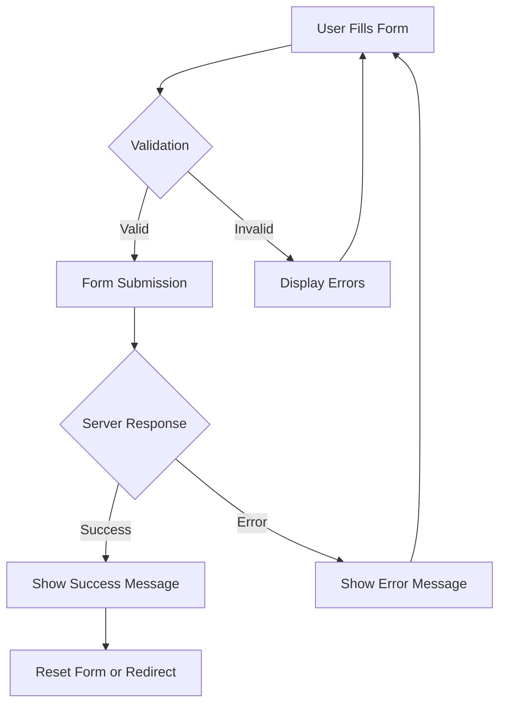

# Vue.js Form Submission

Forms are crucial components in web applications, serving as the primary interface for users to input data. In this tutorial, we'll explore how to handle form submissions effectively in Vue.js applications.

## Introduction

Form submission in Vue.js involves capturing user input, validating it, and sending it to a server for processing. Vue provides powerful tools to make these tasks straightforward and efficient. This guide will walk you through the entire process, from basic form handling to more advanced techniques.

## Basic Form Handling

### Setting Up a Form in Vue

Let's start with a basic form structure in Vue:

```html
<template>
  <form @submit="handleSubmit">
    <div>
      <label for="username">Username:</label>
      <input type="text" id="username" v-model="formData.username">
    </div>
    <div>
      <label for="email">Email:</label>
      <input type="email" id="email" v-model="formData.email">
    </div>
    <button type="submit">Submit</button>
  </form>
</template>

<script>
export default {
  data() {
    return {
      formData: {
        username: '',
        email: ''
      }
    }
  },
  methods: {
    handleSubmit(event) {
      event.preventDefault();
      console.log('Form submitted with data:', this.formData);
      // Here you would typically send data to a server
    }
  }
}
</script>
```

### Key Points:

1. We use the `v-model` directive to create two-way data binding between form inputs and Vue data properties.
2. The `@submit` event listener calls our `handleSubmit` method when the form is submitted.
3. `event.preventDefault()` stops the browser from performing its default form submission action.

## Preventing Default Form Submission

Vue provides a shorthand to prevent the default form submission behavior:

```html
<form @submit.prevent="handleSubmit">
  <!-- Form fields -->
</form>
```

The `.prevent` modifier is equivalent to calling `event.preventDefault()` in your method.

## Form Validation

### Basic Validation

Before submitting a form, you should validate user input:

```html
<template>
  <form @submit.prevent="handleSubmit">
    <div>
      <label for="username">Username:</label>
      <input 
        type="text" 
        id="username" 
        v-model="formData.username"
        :class="{ 'error': errors.username }"
      >
      <p v-if="errors.username" class="error-message">{{ errors.username }}</p>
    </div>
    <div>
      <label for="email">Email:</label>
      <input 
        type="email" 
        id="email" 
        v-model="formData.email"
        :class="{ 'error': errors.email }"
      >
      <p v-if="errors.email" class="error-message">{{ errors.email }}</p>
    </div>
    <button type="submit">Submit</button>
  </form>
</template>

<script>
export default {
  data() {
    return {
      formData: {
        username: '',
        email: ''
      },
      errors: {
        username: '',
        email: ''
      }
    }
  },
  methods: {
    validateForm() {
      let valid = true;
      this.errors = {
        username: '',
        email: ''
      };
      
      if (!this.formData.username) {
        this.errors.username = 'Username is required';
        valid = false;
      } else if (this.formData.username.length < 3) {
        this.errors.username = 'Username must be at least 3 characters';
        valid = false;
      }
      
      if (!this.formData.email) {
        this.errors.email = 'Email is required';
        valid = false;
      } else if (!this.validEmail(this.formData.email)) {
        this.errors.email = 'Please enter a valid email address';
        valid = false;
      }
      
      return valid;
    },
    validEmail(email) {
      const emailRegex = /^[^\s@]+@[^\s@]+\.[^\s@]+$/;
      return emailRegex.test(email);
    },
    handleSubmit() {
      if (this.validateForm()) {
        console.log('Form submitted with data:', this.formData);
        // Process the form data
      } else {
        console.log('Form validation failed');
      }
    }
  }
}
</script>

<style>
.error {
  border: 1px solid red;
}
.error-message {
  color: red;
  font-size: 0.8em;
  margin-top: 0.25em;
}
</style>
```

### Using Vuelidate

For more complex forms, consider using libraries like [Vuelidate](https://vuelidate.js.org/):

```html
<template>
  <form @submit.prevent="handleSubmit">
    <div>
      <label for="username">Username:</label>
      <input type="text" id="username" v-model="formData.username">
      <p v-if="v$.formData.username.$error" class="error-message">
        {{ v$.formData.username.$errors[0].$message }}
      </p>
    </div>
    <div>
      <label for="email">Email:</label>
      <input type="email" id="email" v-model="formData.email">
      <p v-if="v$.formData.email.$error" class="error-message">
        {{ v$.formData.email.$errors[0].$message }}
      </p>
    </div>
    <button type="submit">Submit</button>
  </form>
</template>

<script>
import { useVuelidate } from '@vuelidate/core';
import { required, minLength, email } from '@vuelidate/validators';

export default {
  setup() {
    return { v$: useVuelidate() };
  },
  data() {
    return {
      formData: {
        username: '',
        email: ''
      }
    };
  },
  validations() {
    return {
      formData: {
        username: { 
          required, 
          minLength: minLength(3) 
        },
        email: { 
          required, 
          email 
        }
      }
    };
  },
  methods: {
    async handleSubmit() {
      const isFormCorrect = await this.v$.$validate();
      if (isFormCorrect) {
        console.log('Form submitted with data:', this.formData);
        // Process the form data
      } else {
        console.log('Form validation failed');
      }
    }
  }
}
</script>
```

## Submitting Forms to a Server

### Using Fetch API

Once validated, you'll typically send the form data to a server:

```html
<script>
export default {
  // ...other code
  methods: {
    async handleSubmit() {
      if (this.validateForm()) {
        try {
          const response = await fetch('https://api.example.com/submit', {
            method: 'POST',
            headers: {
              'Content-Type': 'application/json'
            },
            body: JSON.stringify(this.formData)
          });
          
          if (!response.ok) {
            throw new Error('Network response was not ok');
          }
          
          const data = await response.json();
          console.log('Success:', data);
          this.resetForm();
          
        } catch (error) {
          console.error('Error:', error);
          this.formSubmissionError = 'There was a problem submitting your form';
        }
      }
    },
    resetForm() {
      this.formData = {
        username: '',
        email: ''
      };
    }
  }
}
</script>
```

### Using Axios

[Axios](https://axios-http.com/) simplifies HTTP requests and is commonly used with Vue:

```html
<script>
import axios from 'axios';

export default {
  // ...other code
  methods: {
    async handleSubmit() {
      if (this.validateForm()) {
        try {
          const response = await axios.post('https://api.example.com/submit', this.formData);
          console.log('Success:', response.data);
          this.resetForm();
        } catch (error) {
          console.error('Error:', error);
          this.formSubmissionError = 'There was a problem submitting your form';
        }
      }
    }
  }
}
</script>
```

## Form Submission State Management

It's important to give users feedback during form submission:

```html
<template>
  <form @submit.prevent="handleSubmit">
    <!-- Form fields -->
    
    <div v-if="submissionStatus.message" :class="['status-message', submissionStatus.type]">
      {{ submissionStatus.message }}
    </div>
    
    <button type="submit" :disabled="isSubmitting">
      {{ isSubmitting ? 'Submitting...' : 'Submit' }}
    </button>
  </form>
</template>

<script>
export default {
  data() {
    return {
      formData: {
        username: '',
        email: ''
      },
      errors: {
        username: '',
        email: ''
      },
      isSubmitting: false,
      submissionStatus: {
        message: '',
        type: 'success' // or 'error'
      }
    }
  },
  methods: {
    async handleSubmit() {
      if (this.validateForm()) {
        this.isSubmitting = true;
        this.submissionStatus = { message: '', type: 'success' };
        
        try {
          // Simulate API call
          await new Promise(resolve => setTimeout(resolve, 1500));
          
          // Successful submission
          this.submissionStatus = {
            message: 'Form submitted successfully!',
            type: 'success'
          };
          
          this.resetForm();
        } catch (error) {
          this.submissionStatus = {
            message: 'There was an error submitting your form.',
            type: 'error'
          };
        } finally {
          this.isSubmitting = false;
        }
      }
    }
  }
}
</script>

<style>
.status-message {
  padding: 10px;
  margin: 10px 0;
  border-radius: 4px;
}
.success {
  background-color: #d4edda;
  color: #155724;
}
.error {
  background-color: #f8d7da;
  color: #721c24;
}
</style>
```

## Real-World Example: Registration Form

Let's put everything together in a practical registration form example:

```html
<template>
  <div class="form-container">
    <h2>Create an Account</h2>
    
    <form @submit.prevent="handleSubmit" class="registration-form">
      <div class="form-group">
        <label for="fullName">Full Name</label>
        <input 
          type="text" 
          id="fullName" 
          v-model="form.fullName"
          :class="{ 'is-invalid': errors.fullName }"
        />
        <div v-if="errors.fullName" class="error-message">{{ errors.fullName }}</div>
      </div>
      
      <div class="form-group">
        <label for="email">Email Address</label>
        <input 
          type="email" 
          id="email" 
          v-model="form.email"
          :class="{ 'is-invalid': errors.email }"
        />
        <div v-if="errors.email" class="error-message">{{ errors.email }}</div>
      </div>
      
      <div class="form-group">
        <label for="password">Password</label>
        <input 
          type="password" 
          id="password" 
          v-model="form.password"
          :class="{ 'is-invalid': errors.password }"
        />
        <div v-if="errors.password" class="error-message">{{ errors.password }}</div>
      </div>
      
      <div class="form-group">
        <label for="confirmPassword">Confirm Password</label>
        <input 
          type="password" 
          id="confirmPassword" 
          v-model="form.confirmPassword"
          :class="{ 'is-invalid': errors.confirmPassword }"
        />
        <div v-if="errors.confirmPassword" class="error-message">{{ errors.confirmPassword }}</div>
      </div>
      
      <div class="form-group checkbox">
        <input type="checkbox" id="terms" v-model="form.termsAccepted" />
        <label for="terms">I agree to the Terms and Conditions</label>
        <div v-if="errors.termsAccepted" class="error-message">{{ errors.termsAccepted }}</div>
      </div>
      
      <div v-if="submissionMessage" :class="['submission-message', submissionStatus]">
        {{ submissionMessage }}
      </div>
      
      <button 
        type="submit" 
        class="submit-button" 
        :disabled="isSubmitting"
      >
        <span v-if="isSubmitting">Creating Account...</span>
        <span v-else>Create Account</span>
      </button>
    </form>
  </div>
</template>

<script>
export default {
  data() {
    return {
      form: {
        fullName: '',
        email: '',
        password: '',
        confirmPassword: '',
        termsAccepted: false
      },
      errors: {},
      isSubmitting: false,
      submissionMessage: '',
      submissionStatus: '' // 'success' or 'error'
    };
  },
  methods: {
    validateForm() {
      this.errors = {};
      let isValid = true;
      
      // Full Name validation
      if (!this.form.fullName.trim()) {
        this.errors.fullName = 'Full name is required';
        isValid = false;
      } else if (this.form.fullName.length < 2) {
        this.errors.fullName = 'Full name must be at least 2 characters';
        isValid = false;
      }
      
      // Email validation
      const emailRegex = /^[^\s@]+@[^\s@]+\.[^\s@]+$/;
      if (!this.form.email.trim()) {
        this.errors.email = 'Email is required';
        isValid = false;
      } else if (!emailRegex.test(this.form.email)) {
        this.errors.email = 'Please enter a valid email address';
        isValid = false;
      }
      
      // Password validation
      if (!this.form.password) {
        this.errors.password = 'Password is required';
        isValid = false;
      } else if (this.form.password.length < 8) {
        this.errors.password = 'Password must be at least 8 characters';
        isValid = false;
      }
      
      // Confirm Password validation
      if (!this.form.confirmPassword) {
        this.errors.confirmPassword = 'Please confirm your password';
        isValid = false;
      } else if (this.form.password !== this.form.confirmPassword) {
        this.errors.confirmPassword = 'Passwords do not match';
        isValid = false;
      }
      
      // Terms validation
      if (!this.form.termsAccepted) {
        this.errors.termsAccepted = 'You must accept the terms and conditions';
        isValid = false;
      }
      
      return isValid;
    },
    
    async handleSubmit() {
      if (this.validateForm()) {
        this.isSubmitting = true;
        this.submissionMessage = '';
        
        try {
          // Simulate API call
          await new Promise(resolve => setTimeout(resolve, 2000));
          
          // Success message
          this.submissionMessage = 'Account created successfully! Redirecting...';
          this.submissionStatus = 'success';
          
          // Redirect after successful registration
          setTimeout(() => {
            alert('In a real application, you would be redirected to the login page or dashboard');
          }, 2000);
          
        } catch (error) {
          this.submissionMessage = 'There was a problem creating your account. Please try again.';
          this.submissionStatus = 'error';
        } finally {
          this.isSubmitting = false;
        }
      }
    }
  }
}
</script>

<style scoped>
.form-container {
  max-width: 500px;
  margin: 0 auto;
  padding: 20px;
  background: #f9f9f9;
  border-radius: 8px;
  box-shadow: 0 2px 10px rgba(0, 0, 0, 0.1);
}

.registration-form {
  display: flex;
  flex-direction: column;
  gap: 15px;
}

.form-group {
  display: flex;
  flex-direction: column;
  gap: 5px;
}

.form-group.checkbox {
  flex-direction: row;
  align-items: center;
  gap: 10px;
}

label {
  font-weight: 600;
  color: #333;
}

input[type="text"],
input[type="email"],
input[type="password"] {
  padding: 10px;
  border: 1px solid #ddd;
  border-radius: 4px;
  font-size: 16px;
}

input.is-invalid {
  border-color: #dc3545;
}

.error-message {
  color: #dc3545;
  font-size: 14px;
  margin-top: 3px;
}

.submit-button {
  background-color: #4CAF50;
  color: white;
  border: none;
  padding: 12px 20px;
  font-size: 16px;
  border-radius: 4px;
  cursor: pointer;
  transition: background-color 0.3s;
}

.submit-button:hover:not(:disabled) {
  background-color: #45a049;
}

.submit-button:disabled {
  background-color: #cccccc;
  cursor: not-allowed;
}

.submission-message {
  padding: 10px;
  border-radius: 4px;
  text-align: center;
}

.submission-message.success {
  background-color: #d4edda;
  color: #155724;
}

.submission-message.error {
  background-color: #f8d7da;
  color: #721c24;
}
</style>
```

## Form Submission Process Flow

Here's a visual representation of the form submission process:



## Best Practices for Vue Form Submission

1. **Always validate on both client and server side**
   - Client-side validation provides immediate feedback
   - Server-side validation ensures data integrity

2. **Handle loading states**
   - Disable the submit button during submission
   - Show loading indicators

3. **Provide clear feedback**
   - Display success or error messages
   - Highlight fields with errors

4. **Use transitions**
   - Smooth animations for state changes
   - Vue's transition components can enhance UX

5. **Optimize for accessibility**
   - Ensure form fields have appropriate labels
   - Use ARIA attributes
   - Support keyboard navigation

6. **Consider form libraries for complex forms**
   - Vuelidate, VeeValidate, or FormKit can simplify complex validation

## Summary

In this tutorial, we've covered:

- Basic form setup in Vue.js
- Form validation techniques
- Submitting form data to a server
- Managing form submission states
- Building a complete registration form

Forms are essential components of web applications, and Vue.js provides powerful tools to handle them efficiently. By combining Vue's reactive data binding with proper validation and submission handling, you can create user-friendly forms that provide a seamless experience.

## Additional Resources

- [Vue.js Official Documentation on Form Input Bindings](https://vuejs.org/guide/essentials/forms.html)
- [Vuelidate for Form Validation](https://vuelidate.js.org/)
- [VeeValidate - Alternative Form Validation Library](https://vee-validate.logaretm.com/)
- [FormKit for Vue](https://formkit.com/)

## Exercises

1. Enhance the registration form to include additional fields like phone number, date of birth, and address.
2. Implement a multi-step form wizard using Vue components.
3. Create a form that dynamically adds or removes fields based on user selections.
4. Implement file upload functionality in a form.
5. Build a form that saves data to localStorage when partially completed and restores it when the page is reloaded.