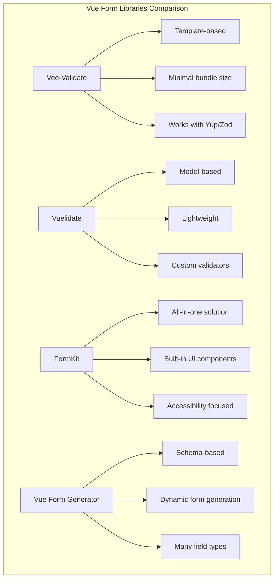

# Vue.js Form Libraries

## Introduction

While Vue.js provides built-in directives like `v-model` for basic form handling, more complex applications often require advanced form management capabilities. Form libraries extend Vue's capabilities by offering elegant solutions for validation, complex form state management, error handling, and form submission.

In this guide, we'll explore popular Vue.js form libraries, understand their strengths, and learn how to implement them in real-world applications.

## Why Use Form Libraries?

Handling forms with vanilla Vue can become challenging when dealing with:

- Complex validation rules
- Nested form structures
- Form submissions with error handling
- Large forms with many fields
- Conditional validation
- Asynchronous validation

Form libraries provide solutions to these challenges, making form management more maintainable and user-friendly.

## Popular Vue.js Form Libraries

Let's explore the most widely used form libraries in the Vue ecosystem:

### 1. Vee-Validate

Vee-Validate is a template-based validation library focused on providing a great developer experience while maintaining a small bundle size.

#### Installation

```bash
npm install vee-validate@next yup
# OR
yarn add vee-validate@next yup
```

#### Basic Usage

```html
<template>
  <div>
    <Form @submit="onSubmit">
      <div>
        <label for="email">Email</label>
        <Field name="email" type="email" :rules="validateEmail" />
        <ErrorMessage name="email" />
      </div>
      
      <div>
        <label for="password">Password</label>
        <Field name="password" type="password" :rules="validatePassword" />
        <ErrorMessage name="password" />
      </div>
      
      <button type="submit">Submit</button>
    </Form>
  </div>
</template>

<script>
import { Form, Field, ErrorMessage } from 'vee-validate';
import * as yup from 'yup';

export default {
  components: {
    Form,
    Field,
    ErrorMessage
  },
  setup() {
    const validateEmail = yup.string().required('Email is required').email('Email is not valid');
    const validatePassword = yup.string().required('Password is required').min(8, 'Password must be at least 8 characters');
    
    const onSubmit = values => {
      // Form is valid, handle submission
      console.log(values);
    };
    
    return {
      validateEmail,
      validatePassword,
      onSubmit
    };
  }
};
</script>
```

#### Integration with Yup

Vee-Validate works seamlessly with schema validation libraries like Yup:

```html
<template>
  <Form :validation-schema="schema" v-slot="{ errors }">
    <div>
      <Field name="name" type="text" />
      <span v-if="errors.name">{{ errors.name }}</span>
    </div>
    
    <div>
      <Field name="email" type="email" />
      <span v-if="errors.email">{{ errors.email }}</span>
    </div>
    
    <button type="submit">Submit</button>
  </Form>
</template>

<script>
import { Form, Field } from 'vee-validate';
import * as yup from 'yup';

export default {
  components: {
    Form,
    Field
  },
  setup() {
    const schema = yup.object({
      name: yup.string().required().min(2),
      email: yup.string().required().email()
    });
    
    return {
      schema
    };
  }
};
</script>
```

### 2. Vuelidate

Vuelidate is a simple, lightweight model-based validation library for Vue.js.

#### Installation

```bash
npm install @vuelidate/core @vuelidate/validators
# OR
yarn add @vuelidate/core @vuelidate/validators
```

#### Basic Usage

```html
<template>
  <div>
    <form @submit.prevent="submitForm">
      <div>
        <label for="firstName">First Name</label>
        <input id="firstName" v-model="firstName" />
        <div v-if="v$.firstName.$error" class="error">
          {{ v$.firstName.$errors[0].$message }}
        </div>
      </div>
      
      <div>
        <label for="email">Email</label>
        <input id="email" type="email" v-model="email" />
        <div v-if="v$.email.$error" class="error">
          {{ v$.email.$errors[0].$message }}
        </div>
      </div>
      
      <button type="submit">Submit</button>
    </form>
  </div>
</template>

<script>
import { ref } from 'vue';
import { useVuelidate } from '@vuelidate/core';
import { required, email, minLength } from '@vuelidate/validators';

export default {
  setup() {
    const firstName = ref('');
    const email = ref('');
    
    const rules = {
      firstName: { 
        required, 
        minLength: minLength(2)
      },
      email: { required, email }
    };
    
    const v$ = useVuelidate(rules, { firstName, email });
    
    const submitForm = async () => {
      const result = await v$.value.$validate();
      if (result) {
        // Form is valid, proceed with submission
        console.log({ firstName: firstName.value, email: email.value });
      }
    };
    
    return {
      firstName,
      email,
      v$,
      submitForm
    };
  }
};
</script>

<style scoped>
.error {
  color: red;
  font-size: 0.8em;
  margin-top: 5px;
}
</style>
```

#### Custom Validators

Vuelidate allows you to create custom validators:

```javascript
import { helpers } from '@vuelidate/validators';

const passwordStrength = helpers.withMessage(
  'Password must include at least one uppercase letter, one lowercase letter, and one number',
  (value) => /^(?=.*[a-z])(?=.*[A-Z])(?=.*\d).+$/.test(value)
);

const rules = {
  password: {
    required,
    minLength: minLength(8),
    passwordStrength
  }
};
```

### 3. FormKit

FormKit offers a complete form solution with input components, validation, error handling, and more.

#### Installation

```bash
npm install @formkit/vue
# OR
yarn add @formkit/vue
```

#### Setup in main.js

```javascript
import { createApp } from 'vue';
import App from './App.vue';
import { plugin, defaultConfig } from '@formkit/vue';

const app = createApp(App);
app.use(plugin, defaultConfig);
app.mount('#app');
```

#### Basic Usage

```html
<template>
  <FormKit
    type="form"
    @submit="submitHandler"
    :actions="false"
  >
    <FormKit
      type="text"
      name="name"
      label="Name"
      validation="required|length:2,50"
      placeholder="Your name"
    />
    
    <FormKit
      type="email"
      name="email"
      label="Email"
      validation="required|email"
      placeholder="Your email"
    />
    
    <FormKit
      type="password"
      name="password"
      label="Password"
      validation="required|length:8"
      placeholder="Your password"
      help="Password must be at least 8 characters"
    />
    
    <FormKit type="submit" label="Register" />
  </FormKit>
</template>

<script>
export default {
  methods: {
    submitHandler(formData) {
      console.log(formData);
      // Handle form submission
    }
  }
};
</script>
```

### 4. Vue Form Generator

Vue Form Generator is a powerful form generation library, especially useful for creating dynamic forms based on schemas.

#### Installation

```bash
npm install vue-form-generator
# OR
yarn add vue-form-generator
```

#### Basic Usage

```html
<template>
  <vue-form-generator :schema="schema" :model="model" :options="formOptions" @validated="onValidated">
  </vue-form-generator>
</template>

<script>
import { createVue } from 'vue';
import VueFormGenerator from 'vue-form-generator';
import 'vue-form-generator/dist/vfg.css';

export default {
  components: {
    'vue-form-generator': VueFormGenerator.component
  },
  data() {
    return {
      model: {
        id: 1,
        name: '',
        email: '',
        age: 25
      },
      schema: {
        fields: [
          {
            type: 'input',
            inputType: 'text',
            label: 'Name',
            model: 'name',
            required: true,
            validator: ['string', 'required']
          },
          {
            type: 'input',
            inputType: 'email',
            label: 'Email',
            model: 'email',
            required: true,
            validator: ['email', 'required']
          },
          {
            type: 'input',
            inputType: 'number',
            label: 'Age',
            model: 'age',
            validator: ['number', 'integer', 'required']
          },
          {
            type: 'submit',
            buttonText: 'Submit',
            validateBeforeSubmit: true
          }
        ]
      },
      formOptions: {
        validateAfterLoad: true,
        validateAfterChanged: true
      }
    };
  },
  methods: {
    onValidated(isValid, errors) {
      if (isValid) {
        console.log('Form is valid!', this.model);
      } else {
        console.log('Form has errors:', errors);
      }
    }
  }
};
</script>
```

## Real-world Example: Registration Form with Vee-Validate

Let's build a complete registration form using Vee-Validate with Yup for schema validation:

```html
<template>
  <div class="registration-form">
    <h2>Create Account</h2>
    
    <Form :validation-schema="schema" @submit="onSubmit" v-slot="{ errors, isSubmitting }">
      <div class="form-group">
        <label for="username">Username</label>
        <Field name="username" type="text" class="form-control" :class="{ 'is-invalid': errors.username }" />
        <ErrorMessage name="username" class="error-message" />
      </div>
      
      <div class="form-group">
        <label for="email">Email</label>
        <Field name="email" type="email" class="form-control" :class="{ 'is-invalid': errors.email }" />
        <ErrorMessage name="email" class="error-message" />
      </div>
      
      <div class="form-group">
        <label for="password">Password</label>
        <Field name="password" type="password" class="form-control" :class="{ 'is-invalid': errors.password }" />
        <ErrorMessage name="password" class="error-message" />
      </div>
      
      <div class="form-group">
        <label for="confirmPassword">Confirm Password</label>
        <Field name="confirmPassword" type="password" class="form-control" :class="{ 'is-invalid': errors.confirmPassword }" />
        <ErrorMessage name="confirmPassword" class="error-message" />
      </div>
      
      <div class="form-group checkbox">
        <label>
          <Field name="terms" type="checkbox" :value="true" />
          I agree to the terms and conditions
        </label>
        <ErrorMessage name="terms" class="error-message" />
      </div>
      
      <button type="submit" class="submit-btn" :disabled="isSubmitting">
        <span v-if="isSubmitting">Processing...</span>
        <span v-else>Register</span>
      </button>
    </Form>
  </div>
</template>

<script>
import { ref } from 'vue';
import { Form, Field, ErrorMessage } from 'vee-validate';
import * as yup from 'yup';

export default {
  components: {
    Form,
    Field,
    ErrorMessage
  },
  setup() {
    const schema = yup.object({
      username: yup.string()
        .required('Username is required')
        .min(3, 'Username must be at least 3 characters')
        .max(20, 'Username must be less than 20 characters'),
      email: yup.string()
        .required('Email is required')
        .email('Please enter a valid email'),
      password: yup.string()
        .required('Password is required')
        .min(8, 'Password must be at least 8 characters')
        .matches(/[A-Z]/, 'Password must contain at least one uppercase letter')
        .matches(/[a-z]/, 'Password must contain at least one lowercase letter')
        .matches(/[0-9]/, 'Password must contain at least one number'),
      confirmPassword: yup.string()
        .required('Please confirm your password')
        .oneOf([yup.ref('password')], 'Passwords do not match'),
      terms: yup.boolean()
        .required('You must accept the terms and conditions')
        .oneOf([true], 'You must accept the terms and conditions')
    });
    
    const registrationSuccess = ref(false);
    
    const onSubmit = async (values) => {
      // Simulate API call
      try {
        await new Promise(resolve => setTimeout(resolve, 1500));
        console.log('Registration successful:', values);
        registrationSuccess.value = true;
      } catch (error) {
        console.error('Registration failed:', error);
      }
    };
    
    return {
      schema,
      onSubmit,
      registrationSuccess
    };
  }
};
</script>

<style scoped>
.registration-form {
  max-width: 500px;
  margin: 0 auto;
  padding: 20px;
  border: 1px solid #ddd;
  border-radius: 5px;
  background-color: #f9f9f9;
}

.form-group {
  margin-bottom: 15px;
}

label {
  display: block;
  margin-bottom: 5px;
  font-weight: bold;
}

.form-control {
  width: 100%;
  padding: 10px;
  border: 1px solid #ddd;
  border-radius: 4px;
}

.is-invalid {
  border-color: #dc3545;
}

.error-message {
  color: #dc3545;
  font-size: 0.8em;
  margin-top: 5px;
}

.checkbox {
  display: flex;
  align-items: flex-start;
}

.checkbox label {
  margin-left: 10px;
  font-weight: normal;
}

.submit-btn {
  width: 100%;
  padding: 10px;
  background-color: #4caf50;
  color: white;
  border: none;
  border-radius: 4px;
  cursor: pointer;
}

.submit-btn:hover {
  background-color: #45a049;
}

.submit-btn:disabled {
  background-color: #cccccc;
  cursor: not-allowed;
}
</style>
```

## Comparing Form Libraries

To help you choose the right library for your project, here's a comparison table:



| Feature           | Vee-Validate        | Vuelidate          | FormKit            | Vue Form Generator |
|-------------------|---------------------|--------------------|--------------------|-------------------|
| Validation style  | Template-based      | Model-based        | Component-based    | Schema-based      |
| Bundle size       | Small (~20KB)       | Very small (~12KB) | Medium (~30KB)     | Medium (~35KB)    |
| Learning curve    | Medium              | Medium             | Easy               | Medium-High       |
| UI components     | No (just wrappers)  | No                 | Yes (built-in)     | Yes               |
| Schema validation | Yes (Yup, Zod)      | Custom validators  | Built-in syntax    | JSON schema       |
| Best for          | Most applications   | Small applications | Rapid development  | Complex forms     |

## Best Practices

Regardless of which form library you choose, follow these best practices:

1. **Validate on both client and server**: Always validate form data on both client and server sides.

2. **Use clear error messages**: Make error messages descriptive and user-friendly.

3. **Show field requirements upfront**: Don't wait for users to make mistakes before explaining the rules.

4. **Implement real-time validation**: Validate as users type or when they leave a field.

5. **Handle submission states**: Disable the submit button during submission to prevent duplicate submissions.

6. **Group related fields**: Organize forms logically by grouping related fields.

7. **Implement proper focus management**: Ensure good keyboard navigation for accessibility.

## Summary

Vue.js form libraries provide powerful tools to manage complex forms efficiently. In this guide, we've explored:

- The most popular Vue form libraries: Vee-Validate, Vuelidate, FormKit, and Vue Form Generator
- How to implement basic validation with each library
- A real-world registration form example
- Comparative analysis of each library's strengths
- Best practices for form handling in Vue applications

Choose a library that aligns with your project's needs, complexity, and your team's preferences. While Vee-Validate and Vuelidate focus on validation with different approaches, FormKit provides a more complete solution, and Vue Form Generator excels at creating dynamic forms from schemas.

## Additional Resources

- [Vee-Validate Documentation](https://vee-validate.logaretm.com/v4/)
- [Vuelidate Documentation](https://vuelidate-next.netlify.app/)
- [FormKit Documentation](https://formkit.com/)
- [Vue Form Generator Documentation](https://vue-generators.github.io/vue-form-generator/)
- [Vue.js Official Form Handling Guide](https://vuejs.org/guide/essentials/forms.html)

## Exercises

1. Convert a simple form using Vue's v-model to use Vee-Validate.
2. Create a multi-step form using Vuelidate with at least 3 steps and different types of fields.
3. Build a dynamic form that changes its fields based on user selections using Vue Form Generator.
4. Implement a complex form with conditional validation (where some fields are required only if others have specific values).
5. Create a custom validator for a specific use case (e.g., validating if a username is already taken by checking against an API).