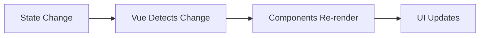

# Vue.js State Introduction

## What is State in Vue.js?

In Vue.js applications, **state** refers to the data that defines the condition of your application at a specific point in time. Think of state as a snapshot of all the information your app needs to render and function correctly.

State can include:

- User data (name, preferences, authentication status)
- UI conditions (is a modal open or closed?)
- Application data (items in a shopping cart, search results)
- Form inputs (what a user has typed so far)

Let's begin by understanding the basics of state in Vue before diving into more advanced state management solutions.

## Component-Level State in Vue

Vue components have their own built-in state management system through the `data` option (in Vue 2) or `ref`/`reactive` (in Vue 3).

### Vue 2 Example:

```js
export default {
  data() {
    return {
      count: 0,
      user: {
        name: 'John',
        isLoggedIn: false
      },
      items: []
    }
  },
  methods: {
    increment() {
      this.count++;
    }
  }
}
```

### Vue 3 Composition API Example:

```js
import { ref, reactive } from 'vue';

export default {
  setup() {
    // Primitive value (number, string, boolean)
    const count = ref(0);
    
    // Complex object
    const user = reactive({
      name: 'John',
      isLoggedIn: false
    });
    
    // Array
    const items = ref([]);
    
    function increment() {
      count.value++;
    }
    
    return {
      count,
      user,
      items,
      increment
    }
  }
}
```

## Reactivity: The Heart of Vue's State Management

What makes Vue special is its **reactivity system**. When state changes, Vue automatically updates any part of your UI that depends on that data.

Here's what happens when state changes in Vue:



## When Component State Isn't Enough

For small applications, managing state within components works well. However, as your application grows, you might encounter these problems:

1. **Prop Drilling**: Passing data through many levels of components
2. **Shared State**: Multiple components needing access to the same data
3. **State Persistence**: Keeping state consistent across page refreshes or navigation

Let's look at a problematic example of prop drilling:

```html
<!-- App.vue -->
<template>
  <div>
    <Header :user="user" />
    <MainContent :user="user" />
  </div>
</template>

<script>
export default {
  data() {
    return {
      user: { name: 'John', permissions: ['read', 'edit'] }
    }
  }
}
</script>
```

```html
<!-- Header.vue -->
<template>
  <header>
    <UserInfo :user="user" />
  </header>
</template>

<script>
export default {
  props: ['user']
}
</script>
```

```html
<!-- UserInfo.vue -->
<template>
  <div>
    Welcome, {{ user.name }}!
  </div>
</template>

<script>
export default {
  props: ['user']
}
</script>
```

This creates several issues:
- Components in the middle (like `Header`) must receive and pass data they don't need
- Updating state becomes difficult as the app grows
- Debugging gets harder because it's unclear where data originates

## Introducing State Management Patterns

Vue applications typically grow to use one of several state management patterns:

1. **Simple Shared Objects** - Using `reactive` objects shared between components
2. **Event Bus** (Vue 2) - Components communicate through events
3. **Provide/Inject** - Parent components "provide" data that distant descendants can "inject"
4. **Vuex/Pinia** - Dedicated state management libraries for Vue

Let's see a simple example of the `provide/inject` pattern in Vue 3:

```html
<!-- Parent.vue -->
<script setup>
import { provide, ref } from 'vue';
import ChildComponent from './ChildComponent.vue';

const count = ref(0);
const increment = () => { count.value++ };

provide('count', count);
provide('increment', increment);
</script>

<template>
  <div>
    <p>Parent count: {{ count }}</p>
    <button @click="increment">Increment from parent</button>
    <ChildComponent />
  </div>
</template>
```

```html
<!-- ChildComponent.vue -->
<script setup>
import { inject } from 'vue';
import GrandchildComponent from './GrandchildComponent.vue';

const count = inject('count');
const increment = inject('increment');
</script>

<template>
  <div class="child">
    <p>Child count: {{ count }}</p>
    <button @click="increment">Increment from child</button>
    <GrandchildComponent />
  </div>
</template>
```

```html
<!-- GrandchildComponent.vue -->
<script setup>
import { inject } from 'vue';

const count = inject('count');
const increment = inject('increment');
</script>

<template>
  <div class="grandchild">
    <p>Grandchild count: {{ count }}</p>
    <button @click="increment">Increment from grandchild</button>
  </div>
</template>
```

This pattern allows the state to be updated from any component, and all components see the same value.

## Why Use Dedicated State Management?

As applications grow in complexity, you may need features like:

- **Centralized state** - One place to look for all application data
- **Debugging capabilities** - Track when, where, why state changes
- **Middleware** - Add functionality between actions and state changes
- **Persistence** - Save state to localStorage or backend
- **Time-travel debugging** - Move backward and forward through state changes

This is where tools like **Vuex** and **Pinia** come in, which we'll explore in subsequent sections.

## Real-World Example: Shopping Cart State

Let's create a simple shopping cart state system to demonstrate how shared state works:

```html
<!-- store.js -->
<script>
import { reactive } from 'vue';

export const store = reactive({
  items: [],
  
  addItem(product) {
    const existingItem = this.items.find(item => item.id === product.id);
    
    if (existingItem) {
      existingItem.quantity += 1;
    } else {
      this.items.push({
        id: product.id,
        name: product.name,
        price: product.price,
        quantity: 1
      });
    }
  },
  
  removeItem(productId) {
    const index = this.items.findIndex(item => item.id === productId);
    if (index !== -1) {
      this.items.splice(index, 1);
    }
  },
  
  get totalItems() {
    return this.items.reduce((total, item) => total + item.quantity, 0);
  },
  
  get totalPrice() {
    return this.items.reduce((sum, item) => sum + (item.price * item.quantity), 0);
  }
});
</script>
```

Now we can use this shared store in multiple components:

```html
<!-- ProductList.vue -->
<script setup>
import { ref } from 'vue';
import { store } from './store.js';

const products = ref([
  { id: 1, name: 'Keyboard', price: 59.99 },
  { id: 2, name: 'Mouse', price: 29.99 },
  { id: 3, name: 'Monitor', price: 199.99 }
]);
</script>

<template>
  <div>
    <h2>Products</h2>
    <div v-for="product in products" :key="product.id" class="product">
      <h3>{{ product.name }}</h3>
      <p>${{ product.price }}</p>
      <button @click="store.addItem(product)">Add to Cart</button>
    </div>
  </div>
</template>
```

```html
<!-- ShoppingCart.vue -->
<script setup>
import { store } from './store.js';
</script>

<template>
  <div class="cart">
    <h2>Shopping Cart ({{ store.totalItems }} items)</h2>
    
    <div v-if="store.items.length === 0" class="empty-cart">
      Your cart is empty
    </div>
    
    <div v-else>
      <div v-for="item in store.items" :key="item.id" class="cart-item">
        <span>{{ item.name }} x {{ item.quantity }}</span>
        <span>${{ (item.price * item.quantity).toFixed(2) }}</span>
        <button @click="store.removeItem(item.id)">Remove</button>
      </div>
      
      <div class="cart-total">
        <strong>Total: ${{ store.totalPrice.toFixed(2) }}</strong>
      </div>
    </div>
  </div>
</template>
```

This simple store allows any component to access or modify the cart, and all components will automatically update when the cart changes.

## Summary

In this introduction to Vue.js state management, we've covered:

- What state is in Vue applications
- How Vue's reactivity system works with state
- Component-level state using `data`, `ref`, and `reactive`
- The limitations of component-based state
- Simple state sharing techniques
- A practical example of shared state with a shopping cart

As your applications grow in complexity, you'll want to explore more robust state management solutions like Vuex or Pinia, which we'll cover in upcoming sections.

## Additional Resources and Exercises

### Exercises

1. **Basic State Counter**: Create a Vue component with a counter that can be incremented and decremented using buttons.

2. **Shared State Practice**: Create a simple "theme switcher" using a shared reactive object that multiple components can access to toggle between light and dark themes.

3. **Advanced Practice**: Implement a "todo list" application where items can be added, completed, and filtered across multiple components using a shared state object.

### Further Reading

- [Vue.js Official Guide - State Management](https://vuejs.org/guide/scaling-up/state-management.html)
- [Vue.js Composition API Reference](https://vuejs.org/api/composition-api-setup.html)
- [Understanding Reactivity in Vue](https://vuejs.org/guide/extras/reactivity-in-depth.html)

In the next section, we'll explore how to implement Vuex, Vue's official state management library, for more complex applications.