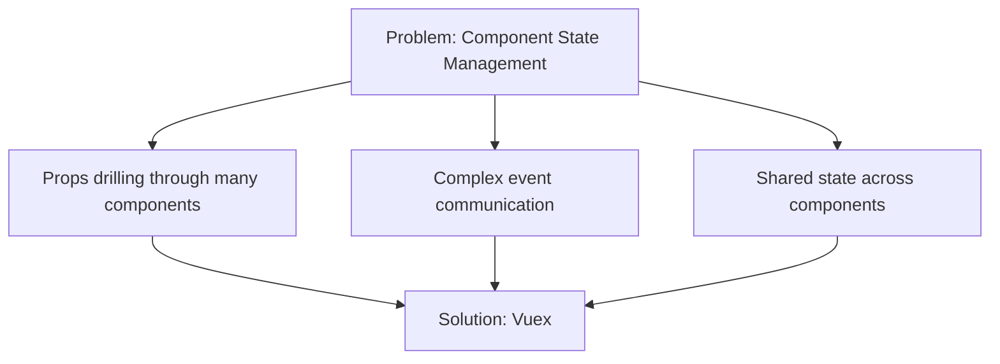

# Vue.js Vuex Basics

## Introduction

When building Vue.js applications that grow beyond simple components, managing state across your application becomes increasingly complex. Passing props down multiple component levels and emitting events up can quickly lead to unmaintainable code. This is where **Vuex** comes to the rescue.

Vuex is Vue's official state management pattern and library. It serves as a centralized store for all components in an application, with rules ensuring that state can only be mutated in a predictable fashion.

In this tutorial, we'll explore the fundamental concepts of Vuex and learn how to implement it in your Vue.js applications.

## Why Use Vuex?

Before diving into Vuex, let's understand why we might need a state management solution:



Consider a shopping cart application where multiple components need access to the cart items:

- The navigation bar needs to show the number of items
- The product list needs to show which items are already in the cart
- The cart page needs to show all items and totals

Without a centralized state management solution, you would need to pass data through props and events across many components, creating tight coupling and maintenance challenges.

## Installing Vuex

To start using Vuex, you need to install it first:

```bash
# Using npm
npm install vuex

# Or using yarn
yarn add vuex
```

## Core Concepts of Vuex

Vuex revolves around four core concepts:

1. **State**: The single source of truth
2. **Getters**: Computed properties for stores
3. **Mutations**: The only way to change state
4. **Actions**: Business logic and asynchronous operations

Let's explore each one:

### State

State in Vuex is simply an object that holds your application data. Think of it as a "single source of truth" for your application.

Here's how to create a basic store:

```js
// store/index.js
import Vue from 'vue'
import Vuex from 'vuex'

Vue.use(Vuex)

export default new Vuex.Store({
  state: {
    count: 0,
    todos: [
      { id: 1, text: 'Learn Vue', completed: true },
      { id: 2, text: 'Learn Vuex', completed: false }
    ]
  }
})
```

To use this state in a component:

```html
<template>
  <div>
    <p>Count: {{ $store.state.count }}</p>
    <ul>
      <li v-for="todo in $store.state.todos" :key="todo.id">
        {{ todo.text }}
      </li>
    </ul>
  </div>
</template>

<script>
export default {
  name: 'StateExample'
}
</script>
```

For better reusability, you can use the `mapState` helper:

```html
<template>
  <div>
    <p>Count: {{ count }}</p>
    <ul>
      <li v-for="todo in todos" :key="todo.id">
        {{ todo.text }}
      </li>
    </ul>
  </div>
</template>

<script>
import { mapState } from 'vuex'

export default {
  name: 'StateExample',
  computed: {
    // Map state properties to local computed properties
    ...mapState(['count', 'todos'])
  }
}
</script>
```

### Getters

Getters are like computed properties for stores. They allow you to derive new data from the state.

```js
// store/index.js
export default new Vuex.Store({
  state: {
    todos: [
      { id: 1, text: 'Learn Vue', completed: true },
      { id: 2, text: 'Learn Vuex', completed: false }
    ]
  },
  getters: {
    completedTodos: state => {
      return state.todos.filter(todo => todo.completed)
    },
    incompleteTodos: state => {
      return state.todos.filter(todo => !todo.completed)
    },
    totalTodos: state => state.todos.length
  }
})
```

Using getters in components:

```html
<template>
  <div>
    <p>Total todos: {{ totalTodos }}</p>
    <p>Completed todos: {{ completedTodos.length }}</p>
    
    <h3>Incomplete Todos:</h3>
    <ul>
      <li v-for="todo in incompleteTodos" :key="todo.id">
        {{ todo.text }}
      </li>
    </ul>
  </div>
</template>

<script>
import { mapGetters } from 'vuex'

export default {
  name: 'GettersExample',
  computed: {
    // Map getters to local computed properties
    ...mapGetters(['completedTodos', 'incompleteTodos', 'totalTodos'])
  }
}
</script>
```

### Mutations

Mutations are the only way to change state in Vuex. They are synchronous transactions that modify the state.

```js
// store/index.js
export default new Vuex.Store({
  state: {
    count: 0
  },
  mutations: {
    increment(state) {
      state.count++
    },
    incrementBy(state, payload) {
      state.count += payload.amount
    }
  }
})
```

You can commit mutations in components using the `commit` method:

```html
<template>
  <div>
    <p>Count: {{ count }}</p>
    <button @click="increment">Increment</button>
    <button @click="incrementByFive">Increment by 5</button>
  </div>
</template>

<script>
import { mapState } from 'vuex'

export default {
  name: 'MutationsExample',
  computed: {
    ...mapState(['count'])
  },
  methods: {
    increment() {
      this.$store.commit('increment')
    },
    incrementByFive() {
      this.$store.commit('incrementBy', { amount: 5 })
    }
  }
}
</script>
```

You can also use the `mapMutations` helper:

```html
<script>
import { mapState, mapMutations } from 'vuex'

export default {
  name: 'MutationsExample',
  computed: {
    ...mapState(['count'])
  },
  methods: {
    // Map mutations to local methods
    ...mapMutations(['increment']),
    incrementByFive() {
      this.$store.commit('incrementBy', { amount: 5 })
    }
  }
}
</script>
```

### Actions

Actions are similar to mutations, but they:
- Can contain asynchronous operations
- Commit mutations rather than directly mutating state

```js
// store/index.js
export default new Vuex.Store({
  state: {
    todos: [],
    loading: false
  },
  mutations: {
    setLoading(state, isLoading) {
      state.loading = isLoading
    },
    setTodos(state, todos) {
      state.todos = todos
    }
  },
  actions: {
    async fetchTodos({ commit }) {
      // Set loading state
      commit('setLoading', true)
      
      try {
        // Fetch data from API
        const response = await fetch('https://jsonplaceholder.typicode.com/todos')
        const todos = await response.json()
        
        // Commit mutation to update state
        commit('setTodos', todos)
      } catch (error) {
        console.error('Error fetching todos:', error)
      } finally {
        // Turn off loading state
        commit('setLoading', false)
      }
    }
  }
})
```

Dispatching actions from components:

```html
<template>
  <div>
    <p v-if="loading">Loading todos...</p>
    <ul v-else>
      <li v-for="todo in todos.slice(0, 5)" :key="todo.id">
        {{ todo.title }}
      </li>
    </ul>
    <button @click="loadTodos">Load Todos</button>
  </div>
</template>

<script>
import { mapState, mapActions } from 'vuex'

export default {
  name: 'ActionsExample',
  computed: {
    ...mapState(['todos', 'loading'])
  },
  methods: {
    ...mapActions({
      // Map 'fetchTodos' action to 'loadTodos' method
      loadTodos: 'fetchTodos'
    })
  },
  // Optionally load todos when component is mounted
  mounted() {
    // this.loadTodos()
  }
}
</script>
```

## Practical Example: Shopping Cart

Let's put everything together with a more complete shopping cart example:

```js
// store/index.js
import Vue from 'vue'
import Vuex from 'vuex'

Vue.use(Vuex)

export default new Vuex.Store({
  state: {
    products: [
      { id: 1, name: 'Laptop', price: 999.99 },
      { id: 2, name: 'Phone', price: 699.99 },
      { id: 3, name: 'Tablet', price: 399.99 }
    ],
    cart: []
  },
  getters: {
    cartTotal: state => {
      return state.cart.reduce((total, item) => {
        return total + (item.price * item.quantity)
      }, 0)
    },
    cartItemCount: state => {
      return state.cart.reduce((count, item) => count + item.quantity, 0)
    }
  },
  mutations: {
    addToCart(state, product) {
      const existingItem = state.cart.find(item => item.id === product.id)
      
      if (existingItem) {
        existingItem.quantity++
      } else {
        state.cart.push({
          ...product,
          quantity: 1
        })
      }
    },
    removeFromCart(state, productId) {
      const index = state.cart.findIndex(item => item.id === productId)
      if (index !== -1) {
        state.cart.splice(index, 1)
      }
    },
    updateCartItemQuantity(state, { productId, quantity }) {
      const item = state.cart.find(item => item.id === productId)
      if (item) {
        item.quantity = quantity
      }
    }
  },
  actions: {
    checkout({ state, commit }) {
      return new Promise((resolve) => {
        // Simulate API call
        setTimeout(() => {
          // Log the purchase
          console.log('Checkout complete!', state.cart)
          
          // Clear cart (you would need to add this mutation)
          // commit('clearCart')
          
          resolve('Purchase successful!')
        }, 1000)
      })
    }
  }
})
```

Using it in a product listing component:

```html
<template>
  <div>
    <div class="cart-summary">
      <p>Cart Items: {{ cartItemCount }}</p>
      <p>Total: ${{ cartTotal.toFixed(2) }}</p>
      <button @click="checkout">Checkout</button>
    </div>
    
    <div class="products">
      <div v-for="product in products" :key="product.id" class="product">
        <h3>{{ product.name }}</h3>
        <p>${{ product.price.toFixed(2) }}</p>
        <button @click="addToCart(product)">Add to Cart</button>
      </div>
    </div>
    
    <div class="cart">
      <h2>Your Cart</h2>
      <div v-for="item in cart" :key="item.id" class="cart-item">
        <span>{{ item.name }} - ${{ item.price.toFixed(2) }} x 
          <input 
            type="number" 
            :value="item.quantity" 
            @input="updateQuantity(item.id, $event)"
            min="1"
          />
        </span>
        <button @click="removeFromCart(item.id)">Remove</button>
      </div>
    </div>
  </div>
</template>

<script>
import { mapState, mapGetters, mapMutations, mapActions } from 'vuex'

export default {
  name: 'ShoppingCart',
  computed: {
    ...mapState(['products', 'cart']),
    ...mapGetters(['cartTotal', 'cartItemCount'])
  },
  methods: {
    ...mapMutations(['addToCart', 'removeFromCart']),
    ...mapActions(['checkout']),
    updateQuantity(productId, event) {
      const quantity = parseInt(event.target.value)
      if (quantity > 0) {
        this.$store.commit('updateCartItemQuantity', { 
          productId, 
          quantity 
        })
      }
    }
  }
}
</script>
```

## Organizing for Larger Applications: Modules

As your application grows, you might want to split your store into modules:

```js
// store/modules/products.js
export default {
  namespaced: true,
  state: {
    items: [/* products */]
  },
  getters: {/* product getters */},
  mutations: {/* product mutations */},
  actions: {/* product actions */}
}

// store/modules/cart.js
export default {
  namespaced: true,
  state: {
    items: []
  },
  getters: {/* cart getters */},
  mutations: {/* cart mutations */},
  actions: {/* cart actions */}
}

// store/index.js
import Vue from 'vue'
import Vuex from 'vuex'
import products from './modules/products'
import cart from './modules/cart'

Vue.use(Vuex)

export default new Vuex.Store({
  modules: {
    products,
    cart
  }
})
```

When using namespaced modules, your component code would look like:

```js
// Using namespaced modules in components
import { mapState, mapGetters, mapActions } from 'vuex'

export default {
  computed: {
    // For state and getters
    ...mapState('products', ['items']),
    ...mapGetters('cart', ['total', 'count'])
  },
  methods: {
    // For actions and mutations
    ...mapActions('cart', ['addToCart', 'checkout'])
  }
}
```

## Summary

In this tutorial, we've covered the basics of Vuex for state management in Vue.js applications:

- **State**: The centralized data store for your application
- **Getters**: Computed properties for the store
- **Mutations**: Synchronous functions to change state
- **Actions**: Asynchronous operations that commit mutations
- **Modules**: Organizing larger stores into manageable pieces

By using Vuex, you gain several benefits:
- A centralized store for all components
- Predictable state mutations
- Devtools for time-travel debugging
- A structured approach to managing shared state

Vuex is particularly useful for medium to large applications where components need to share and modify the same state.

## Further Exercises

1. **Todo App**: Create a complete todo application with Vuex that allows creating, completing, editing, and filtering todos.
2. **User Authentication**: Implement a user authentication store module that handles login, logout, and storing the user session.
3. **API Integration**: Extend the shopping cart example to fetch products from an API and handle loading states.

## Additional Resources

- [Official Vuex Documentation](https://vuex.vuejs.org/)
- [Vue.js Devtools](https://github.com/vuejs/vue-devtools) - Essential for debugging Vuex
- [Vuex Persisted State](https://github.com/robinvdvleuten/vuex-persistedstate) - Plugin for persisting Vuex state in localStorage

Learning Vuex thoroughly will give you a solid foundation for managing state in Vue applications of all sizes. As your applications grow in complexity, you'll appreciate having a consistent and maintainable approach to state management.