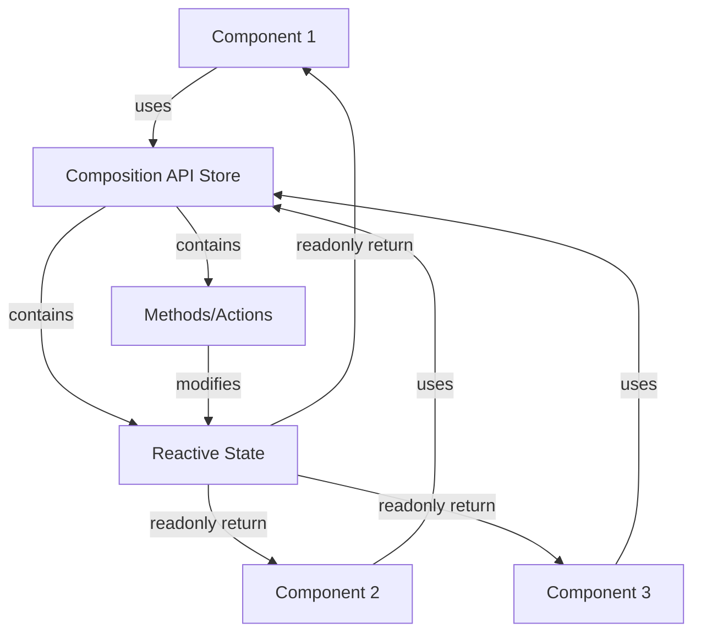

# Vue.js Composition API Store

## Introduction

In modern web applications, managing state efficiently is one of the most crucial aspects of development. Vue.js offers multiple approaches to state management, and with the introduction of the Composition API in Vue 3, developers now have a powerful and flexible way to create custom stores without relying on additional libraries like Vuex.

The Composition API store pattern allows you to:

- Create reactive state that can be shared across components
- Encapsulate related logic in a single place
- Provide better TypeScript support
- Maintain cleaner and more testable code
- Scale your application's state management needs effortlessly

In this guide, we'll explore how to implement effective state management using Vue's Composition API to create custom stores from scratch.

## Understanding the Composition API Store Concept

Before diving into code, let's understand the core concept behind Composition API stores. Unlike the traditional Vuex pattern with its strict architecture of state, mutations, actions, and getters, Composition API stores follow a simpler pattern:

1. **Create reactive state** using Vue's reactivity system
2. **Define functions** that modify this state
3. **Return both the state and functions** so they can be used by components

This pattern leverages Vue's reactivity system directly and follows a more functional approach to state management.

## Basic Implementation of a Composition API Store

Let's start with a simple implementation of a counter store using the Composition API:

```javascript
// stores/counter.js
import { reactive, readonly } from 'vue'

export function useCounterStore() {
  // Create reactive state
  const state = reactive({
    count: 0
  })

  // Define functions to modify state
  function increment() {
    state.count++
  }

  function decrement() {
    state.count--
  }

  function reset() {
    state.count = 0
  }

  // Return state (readonly) and functions
  return {
    state: readonly(state),
    increment,
    decrement,
    reset
  }
}
```

Now, let's use this store in a component:

```html
<template>
  <div>
    <p>Count: {{ counterState.count }}</p>
    <button @click="increment">Increment</button>
    <button @click="decrement">Decrement</button>
    <button @click="reset">Reset</button>
  </div>
</template>

<script>
import { useCounterStore } from '@/stores/counter'

export default {
  setup() {
    const { state: counterState, increment, decrement, reset } = useCounterStore()
    
    return {
      counterState,
      increment,
      decrement,
      reset
    }
  }
}
</script>
```

In this example, we:
1. Create reactive state with the `reactive` function
2. Define functions to modify the state
3. Return both the state (as readonly to prevent direct modification) and the functions
4. Import and use the store in a component through the `setup()` function

## Making a Singleton Store

The previous example creates a new store instance each time `useCounterStore()` is called. For true state sharing across components, we need a singleton pattern:

```javascript
// stores/counter.js
import { reactive, readonly } from 'vue'

// State is declared outside the function
const state = reactive({
  count: 0
})

export function useCounterStore() {
  // Functions to modify state
  function increment() {
    state.count++
  }

  function decrement() {
    state.count--
  }

  function reset() {
    state.count = 0
  }

  // Return state (readonly) and functions
  return {
    state: readonly(state),
    increment,
    decrement,
    reset
  }
}
```

Now every component that uses `useCounterStore()` will share the same state.

## Building a More Complex Store

Let's build a more realistic example with a todo list store:

```javascript
// stores/todos.js
import { reactive, readonly, computed } from 'vue'

const state = reactive({
  todos: [],
  filter: 'all' // 'all', 'completed', 'active'
})

export function useTodoStore() {
  // Computed properties (similar to getters in Vuex)
  const filteredTodos = computed(() => {
    switch (state.filter) {
      case 'completed':
        return state.todos.filter(todo => todo.completed)
      case 'active':
        return state.todos.filter(todo => !todo.completed)
      default:
        return state.todos
    }
  })

  const completedCount = computed(() => 
    state.todos.filter(todo => todo.completed).length
  )

  // Actions/Mutations
  function addTodo(text) {
    if (!text.trim()) return
    
    state.todos.push({
      id: Date.now(),
      text,
      completed: false
    })
  }

  function toggleTodo(id) {
    const todo = state.todos.find(todo => todo.id === id)
    if (todo) {
      todo.completed = !todo.completed
    }
  }

  function removeTodo(id) {
    const index = state.todos.findIndex(todo => todo.id === id)
    if (index !== -1) {
      state.todos.splice(index, 1)
    }
  }

  function setFilter(filter) {
    state.filter = filter
  }

  function clearCompleted() {
    state.todos = state.todos.filter(todo => !todo.completed)
  }

  // Return everything needed by components
  return {
    state: readonly(state),
    filteredTodos,
    completedCount,
    addTodo,
    toggleTodo,
    removeTodo,
    setFilter,
    clearCompleted
  }
}
```

Using this store in a component:

```html
<template>
  <div class="todo-app">
    <div class="input-section">
      <input 
        v-model="newTodo" 
        @keyup.enter="addNewTodo" 
        placeholder="What needs to be done?" 
      />
      <button @click="addNewTodo">Add</button>
    </div>
    
    <div class="filter-section">
      <button @click="setFilter('all')" :class="{ active: state.filter === 'all' }">All</button>
      <button @click="setFilter('active')" :class="{ active: state.filter === 'active' }">Active</button>
      <button @click="setFilter('completed')" :class="{ active: state.filter === 'completed' }">Completed</button>
    </div>
    
    <ul class="todo-list">
      <li v-for="todo in filteredTodos" :key="todo.id" :class="{ completed: todo.completed }">
        <input type="checkbox" :checked="todo.completed" @change="toggleTodo(todo.id)" />
        <span>{{ todo.text }}</span>
        <button @click="removeTodo(todo.id)">Delete</button>
      </li>
    </ul>
    
    <div class="footer" v-if="state.todos.length > 0">
      <span>{{ completedCount }} / {{ state.todos.length }} completed</span>
      <button @click="clearCompleted">Clear completed</button>
    </div>
  </div>
</template>

<script>
import { ref } from 'vue'
import { useTodoStore } from '@/stores/todos'

export default {
  setup() {
    const { 
      state, 
      filteredTodos, 
      completedCount, 
      addTodo, 
      toggleTodo, 
      removeTodo, 
      setFilter, 
      clearCompleted 
    } = useTodoStore()
    
    const newTodo = ref('')
    
    function addNewTodo() {
      addTodo(newTodo.value)
      newTodo.value = ''
    }
    
    return {
      state,
      filteredTodos,
      completedCount,
      newTodo,
      addNewTodo,
      toggleTodo,
      removeTodo,
      setFilter,
      clearCompleted
    }
  }
}
</script>
```

## Handling Async Operations

In real-world applications, you'll often need to handle asynchronous operations, like fetching data from an API. Let's modify our store to include async operations:

```javascript
// stores/posts.js
import { reactive, readonly } from 'vue'

const state = reactive({
  posts: [],
  loading: false,
  error: null
})

export function usePostStore() {
  // Async actions
  async function fetchPosts() {
    state.loading = true
    state.error = null
    
    try {
      const response = await fetch('https://jsonplaceholder.typicode.com/posts')
      
      if (!response.ok) {
        throw new Error('Failed to fetch posts')
      }
      
      state.posts = await response.json()
    } catch (error) {
      state.error = error.message
      console.error('Error fetching posts:', error)
    } finally {
      state.loading = false
    }
  }
  
  async function addPost(title, body) {
    state.loading = true
    state.error = null
    
    try {
      const response = await fetch('https://jsonplaceholder.typicode.com/posts', {
        method: 'POST',
        body: JSON.stringify({
          title,
          body,
          userId: 1 // Just for demo purposes
        }),
        headers: {
          'Content-type': 'application/json; charset=UTF-8',
        }
      })
      
      if (!response.ok) {
        throw new Error('Failed to add post')
      }
      
      const newPost = await response.json()
      state.posts.unshift(newPost) // Add new post to the beginning of the array
    } catch (error) {
      state.error = error.message
      console.error('Error adding post:', error)
    } finally {
      state.loading = false
    }
  }
  
  return {
    state: readonly(state),
    fetchPosts,
    addPost
  }
}
```

Using this store in a component:

```html
<template>
  <div class="posts">
    <div class="new-post">
      <h3>Add New Post</h3>
      <input v-model="newPostTitle" placeholder="Post Title" />
      <textarea v-model="newPostBody" placeholder="Post Content"></textarea>
      <button @click="submitPost" :disabled="state.loading">Submit</button>
    </div>
    
    <div v-if="state.loading" class="loading">Loading...</div>
    <div v-else-if="state.error" class="error">{{ state.error }}</div>
    
    <h2>Posts</h2>
    <button @click="fetchPosts" :disabled="state.loading">Refresh Posts</button>
    
    <div v-if="state.posts.length === 0 && !state.loading" class="empty">
      No posts available. Try refreshing or adding a new post.
    </div>
    
    <div v-else class="post-list">
      <div v-for="post in state.posts" :key="post.id" class="post">
        <h3>{{ post.title }}</h3>
        <p>{{ post.body }}</p>
      </div>
    </div>
  </div>
</template>

<script>
import { ref, onMounted } from 'vue'
import { usePostStore } from '@/stores/posts'

export default {
  setup() {
    const { state, fetchPosts, addPost } = usePostStore()
    
    const newPostTitle = ref('')
    const newPostBody = ref('')
    
    async function submitPost() {
      if (newPostTitle.value.trim() && newPostBody.value.trim()) {
        await addPost(newPostTitle.value, newPostBody.value)
        newPostTitle.value = ''
        newPostBody.value = ''
      }
    }
    
    onMounted(() => {
      fetchPosts()
    })
    
    return {
      state,
      fetchPosts,
      newPostTitle,
      newPostBody,
      submitPost
    }
  }
}
</script>
```

## Using TypeScript with Composition API Stores

One of the major benefits of the Composition API is improved TypeScript support. Let's rewrite our counter store using TypeScript:

```typescript
// stores/counter.ts
import { reactive, readonly, DeepReadonly } from 'vue'

interface CounterState {
  count: number
}

// Define the return type of our store
interface CounterStore {
  state: DeepReadonly<CounterState>
  increment: () => void
  decrement: () => void
  reset: () => void
  incrementBy: (amount: number) => void
}

const state = reactive<CounterState>({
  count: 0
})

export function useCounterStore(): CounterStore {
  function increment(): void {
    state.count++
  }

  function decrement(): void {
    state.count--
  }

  function reset(): void {
    state.count = 0
  }

  function incrementBy(amount: number): void {
    state.count += amount
  }

  return {
    state: readonly(state) as DeepReadonly<CounterState>,
    increment,
    decrement,
    reset,
    incrementBy
  }
}
```

## Persistence with Composition API Store

Let's enhance our todo store with local storage persistence:

```javascript
// stores/todos.js
import { reactive, readonly, watch } from 'vue'

// Load initial state from localStorage
const savedTodos = localStorage.getItem('todos')
const initialTodos = savedTodos ? JSON.parse(savedTodos) : []

const state = reactive({
  todos: initialTodos,
  filter: 'all'
})

// Watch for changes and save to localStorage
watch(() => state.todos, (newTodos) => {
  localStorage.setItem('todos', JSON.stringify(newTodos))
}, { deep: true })

export function useTodoStore() {
  // Rest of the store implementation remains the same
  // ...
}
```

## Understanding the Store Pattern with a Visual Diagram

Here's a visual representation of how the Composition API Store pattern works:



## Comparison with Pinia

Pinia is a state management library that was built on these Composition API store concepts and is now the official Vue.js state management solution. Let's see how our manual implementation compares to Pinia:

Our custom implementation:
```javascript
// Custom store
import { reactive, readonly } from 'vue'

const state = reactive({
  count: 0
})

export function useCounterStore() {
  function increment() {
    state.count++
  }
  
  return {
    state: readonly(state),
    increment
  }
}
```

Equivalent Pinia store:
```javascript
// Pinia store
import { defineStore } from 'pinia'

export const useCounterStore = defineStore('counter', {
  state: () => ({
    count: 0
  }),
  
  actions: {
    increment() {
      this.count++
    }
  }
})

// Or using the setup syntax
export const useCounterStore = defineStore('counter', () => {
  const count = ref(0)
  
  function increment() {
    count.value++
  }
  
  return { count, increment }
})
```

While our custom stores provide flexibility, Pinia offers additional features like devtools integration, hot module replacement, and plugin support. However, understanding the underlying principles helps you make better decisions about when to use custom stores versus more formalized solutions.

## When to Use Composition API Stores

Custom Composition API stores are ideal when:

1. You want to avoid adding extra dependencies to your project
2. You need a simple state management solution for a small to medium-sized app
3. You want full control over your state management architecture
4. You're building a prototype or learning Vue.js
5. You want to understand how state management libraries work under the hood

However, for larger applications with complex state management needs, consider using Pinia, which builds upon these same concepts but adds important features for development and maintenance.

## Summary

In this guide, we've explored how to create custom state management solutions using Vue.js Composition API:

1. We learned how to create basic reactive stores with state and methods
2. We implemented singleton stores for state sharing across components
3. We built more complex examples with computed properties and async operations
4. We added TypeScript support for better type safety
5. We implemented persistence with localStorage
6. We compared our custom implementation with Pinia

The Composition API provides a powerful toolset for creating flexible state management solutions tailored to your specific needs. By understanding these principles, you can make informed decisions about your Vue.js application's architecture.

## Additional Resources and Exercises

### Resources
- [Vue.js Composition API Documentation](https://v3.vuejs.org/guide/composition-api-introduction.html)
- [Vue.js Reactivity Fundamentals](https://v3.vuejs.org/guide/reactivity-fundamentals.html)
- [Pinia Documentation](https://pinia.vuejs.org/) for comparing with a more robust solution

### Exercises

1. **Shopping Cart Store:** Create a store that manages a shopping cart with features like adding/removing items, calculating total price, and applying discounts.

2. **Authentication Store:** Build a store that handles user authentication with login, logout, and checking authentication status.

3. **Form State Management:** Implement a store that manages complex form state across multiple components with validation and persistence.

4. **Theme Switcher:** Create a store that manages theme preferences (light/dark mode) with localStorage persistence.

5. **Undo/Redo Functionality:** Enhance one of your stores with the ability to track state history and implement undo/redo functionality.

By practicing these exercises, you'll gain a deeper understanding of state management patterns in Vue.js applications.