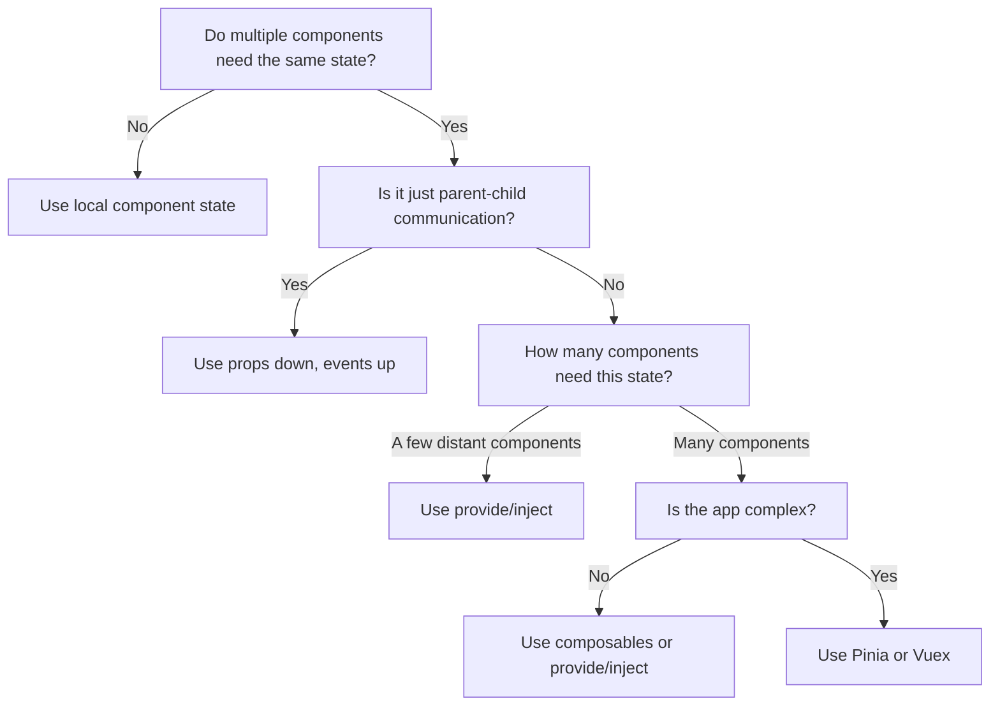

# Vue.js State Patterns

## Introduction

State management is a critical aspect of modern front-end applications. As your Vue.js application grows in complexity, having a structured approach to handle state becomes increasingly important. In this article, we'll explore various state management patterns in Vue.js, from basic techniques to more advanced solutions, helping you choose the right approach for your specific needs.

State in a Vue application refers to the data that your components depend on and interact with. How you organize, access, and mutate this state can significantly impact your application's maintainability, performance, and developer experience.

## Basic State Management Patterns

### Local Component State

The simplest form of state management in Vue is using a component's own data properties:

```html
<template>
  <div>
    <p>Count: {{ count }}</p>
    <button @click="increment">Increment</button>
  </div>
</template>

<script>
export default {
  data() {
    return {
      count: 0
    }
  },
  methods: {
    increment() {
      this.count++
    }
  }
}
</script>
```

**When to use**: For simple components where state doesn't need to be shared with other components.

### Props and Events

For parent-child communication, Vue's props (down) and custom events (up) provide a straightforward pattern:

```html
<!-- Parent.vue -->
<template>
  <div>
    <p>Parent Count: {{ count }}</p>
    <Child :count="count" @increment="incrementCount" />
  </div>
</template>

<script>
import Child from './Child.vue'

export default {
  components: { Child },
  data() {
    return {
      count: 0
    }
  },
  methods: {
    incrementCount() {
      this.count++
    }
  }
}
</script>

<!-- Child.vue -->
<template>
  <div>
    <p>Child received: {{ count }}</p>
    <button @click="$emit('increment')">Increment in Parent</button>
  </div>
</template>

<script>
export default {
  props: {
    count: {
      type: Number,
      required: true
    }
  }
}
</script>
```

**When to use**: For direct parent-child communication where the relationship is clear.

## Intermediate State Patterns

### Provide/Inject

When you need to pass data deeply through the component tree without prop drilling:

```html
<!-- Root component -->
<script>
export default {
  provide() {
    return {
      count: 0,
      incrementCount: this.incrementCount
    }
  },
  data() {
    return {
      count: 0
    }
  },
  methods: {
    incrementCount() {
      this.count++
    }
  }
}
</script>

<!-- Deeply nested component -->
<template>
  <button @click="incrementCount">
    Count is: {{ count }}
  </button>
</template>

<script>
export default {
  inject: ['count', 'incrementCount']
}
</script>
```

**Important note**: By default, `provide/inject` bindings are NOT reactive. To make them reactive, you need to use computed properties or reactive objects.

Here's a reactive example using Vue 3's Composition API:

```html
<!-- Root component -->
<script>
import { ref, provide } from 'vue'

export default {
  setup() {
    const count = ref(0)
    
    function incrementCount() {
      count.value++
    }
    
    provide('count', count)
    provide('incrementCount', incrementCount)
    
    return {
      count,
      incrementCount
    }
  }
}
</script>
```

**When to use**: For scenarios where you need to share state between distant components without prop drilling.

### Event Bus (Vue 2) / Mitt (Vue 3)

In Vue 2, a global event bus was a common pattern:

```js
// eventBus.js (Vue 2)
import Vue from 'vue'
export const eventBus = new Vue()

// Component A
import { eventBus } from './eventBus'
eventBus.$emit('user-logged-in', { name: 'John' })

// Component B
import { eventBus } from './eventBus'
eventBus.$on('user-logged-in', user => {
  console.log(user.name) // "John"
})
```

In Vue 3, since the Vue instance no longer includes the event emitter interface, you can use a dedicated event library like `mitt`:

```js
// eventBus.js (Vue 3 with mitt)
import mitt from 'mitt'
export const emitter = mitt()

// Component A
import { emitter } from './eventBus'
emitter.emit('user-logged-in', { name: 'John' })

// Component B
import { emitter } from './eventBus'
emitter.on('user-logged-in', user => {
  console.log(user.name) // "John"
})
```

**When to use**: For simpler applications where components need to communicate without a direct relationship. However, this approach can make state changes harder to track as applications grow.

## Advanced State Patterns

### Vuex Store

Vuex is Vue's official state management library, following the Flux-like pattern:

```js
// store.js
import { createStore } from 'vuex'

export default createStore({
  state: {
    count: 0,
    todos: []
  },
  mutations: {
    INCREMENT(state) {
      state.count++
    },
    ADD_TODO(state, todo) {
      state.todos.push(todo)
    }
  },
  actions: {
    increment(context) {
      context.commit('INCREMENT')
    },
    addTodo(context, todo) {
      // Can perform async operations here
      setTimeout(() => {
        context.commit('ADD_TODO', todo)
      }, 1000)
    }
  },
  getters: {
    completedTodos: state => {
      return state.todos.filter(todo => todo.completed)
    }
  }
})
```

Usage in components:

```html
<template>
  <div>
    <p>Count: {{ count }}</p>
    <button @click="increment">Increment</button>
    
    <div>
      <h3>Todos</h3>
      <ul>
        <li v-for="todo in todos" :key="todo.id">
          {{ todo.text }}
        </li>
      </ul>
      <p>Completed: {{ completedTodos.length }}</p>
    </div>
  </div>
</template>

<script>
import { mapState, mapGetters, mapActions } from 'vuex'

export default {
  computed: {
    ...mapState(['count', 'todos']),
    ...mapGetters(['completedTodos'])
  },
  methods: {
    ...mapActions(['increment', 'addTodo'])
  },
  mounted() {
    this.addTodo({ id: 1, text: 'Learn Vue', completed: false })
  }
}
</script>
```

**When to use**: Medium to large applications with complex state interactions, especially when many components need to access and modify the same state.

### Composition API with Reactive State

Vue 3's Composition API provides a more flexible way to manage state:

```js
// useCounter.js
import { ref, computed } from 'vue'

export function useCounter() {
  const count = ref(0)
  
  function increment() {
    count.value++
  }
  
  function decrement() {
    count.value--
  }
  
  const isPositive = computed(() => count.value > 0)
  
  return {
    count,
    increment,
    decrement,
    isPositive
  }
}
```

Using the composable in components:

```html
<template>
  <div>
    <p>Count: {{ count }}</p>
    <p v-if="isPositive">Count is positive!</p>
    <button @click="increment">+</button>
    <button @click="decrement">-</button>
  </div>
</template>

<script>
import { useCounter } from './composables/useCounter'

export default {
  setup() {
    const { count, increment, decrement, isPositive } = useCounter()
    
    return {
      count,
      increment,
      decrement,
      isPositive
    }
  }
}
</script>
```

**When to use**: Perfect for sharing logic and state between components, and for building reusable feature modules.

### Pinia (Next Generation Store for Vue)

Pinia is the new official state management solution for Vue, offering a simpler API than Vuex while maintaining great TypeScript support:

```js
// stores/counter.js
import { defineStore } from 'pinia'

export const useCounterStore = defineStore('counter', {
  // state
  state: () => ({
    count: 0,
    name: 'Counter'
  }),
  // getters
  getters: {
    doubleCount: (state) => state.count * 2,
  },
  // actions
  actions: {
    increment() {
      this.count++
    },
    async fetchCountFromAPI() {
      try {
        const response = await fetch('/api/count')
        const data = await response.json()
        this.count = data.count
      } catch (error) {
        console.error('Failed to fetch count:', error)
      }
    }
  }
})
```

Using Pinia in components:

```html
<template>
  <div>
    <h2>{{ counterStore.name }}</h2>
    <p>Count: {{ counterStore.count }}</p>
    <p>Double count: {{ counterStore.doubleCount }}</p>
    <button @click="counterStore.increment()">Increment</button>
    <button @click="counterStore.fetchCountFromAPI()">Fetch from API</button>
  </div>
</template>

<script>
import { useCounterStore } from '../stores/counter'

export default {
  setup() {
    const counterStore = useCounterStore()
    
    return {
      counterStore
    }
  }
}
</script>
```

**When to use**: Modern Vue applications that need robust state management with better TypeScript support and a simpler API than Vuex.

## Real-World Application: E-commerce Shopping Cart

Let's build a shopping cart using a combination of state patterns to demonstrate their practical application:

```html
<!-- stores/cart.js - Using Pinia -->
<script>
import { defineStore } from 'pinia'

export const useCartStore = defineStore('cart', {
  state: () => ({
    items: [],
    checkout: {
      inProgress: false,
      error: null
    }
  }),
  getters: {
    cartTotal: (state) => {
      return state.items.reduce((total, item) => {
        return total + (item.price * item.quantity)
      }, 0)
    },
    itemCount: (state) => {
      return state.items.reduce((count, item) => count + item.quantity, 0)
    }
  },
  actions: {
    addItem(product) {
      const existingItem = this.items.find(item => item.id === product.id)
      
      if (existingItem) {
        existingItem.quantity++
      } else {
        this.items.push({
          ...product,
          quantity: 1
        })
      }
    },
    removeItem(productId) {
      const index = this.items.findIndex(item => item.id === productId)
      if (index !== -1) {
        this.items.splice(index, 1)
      }
    },
    updateQuantity(productId, quantity) {
      const item = this.items.find(item => item.id === productId)
      if (item) {
        item.quantity = Math.max(1, quantity)
      }
    },
    async checkout() {
      this.checkout.inProgress = true
      this.checkout.error = null
      
      try {
        // Simulate API call
        await new Promise(resolve => setTimeout(resolve, 1500))
        
        // Clear the cart after successful checkout
        this.items = []
        
        return { success: true }
      } catch (error) {
        this.checkout.error = error.message
        return { success: false, error: error.message }
      } finally {
        this.checkout.inProgress = false
      }
    }
  }
})
</script>
```

Now, let's create our shopping cart components:

```html
<!-- components/ProductList.vue -->
<template>
  <div class="product-list">
    <h2>Products</h2>
    <div class="products">
      <div v-for="product in products" :key="product.id" class="product-card">
        <h3>{{ product.name }}</h3>
        <p>${{ product.price.toFixed(2) }}</p>
        <button @click="addToCart(product)">Add to Cart</button>
      </div>
    </div>
  </div>
</template>

<script>
import { ref } from 'vue'
import { useCartStore } from '../stores/cart'

export default {
  setup() {
    const cartStore = useCartStore()
    
    // Sample product data
    const products = ref([
      { id: 1, name: "Vue T-Shirt", price: 19.99 },
      { id: 2, name: "Vue Notebook", price: 9.99 },
      { id: 3, name: "Vue Stickers Pack", price: 4.99 }
    ])
    
    const addToCart = (product) => {
      cartStore.addItem(product)
    }
    
    return {
      products,
      addToCart
    }
  }
}
</script>
```

```html
<!-- components/ShoppingCart.vue -->
<template>
  <div class="shopping-cart">
    <h2>Your Cart ({{ cartStore.itemCount }} items)</h2>
    
    <div v-if="cartStore.items.length === 0" class="empty-cart">
      Your cart is empty
    </div>
    
    <div v-else>
      <div v-for="item in cartStore.items" :key="item.id" class="cart-item">
        <div class="item-details">
          <h3>{{ item.name }}</h3>
          <p>${{ item.price.toFixed(2) }} × {{ item.quantity }}</p>
        </div>
        
        <div class="item-controls">
          <button class="quantity-btn" @click="decreaseQuantity(item)">-</button>
          <span>{{ item.quantity }}</span>
          <button class="quantity-btn" @click="increaseQuantity(item)">+</button>
          <button class="remove-btn" @click="removeItem(item.id)">Remove</button>
        </div>
      </div>
      
      <div class="cart-summary">
        <h3>Total: ${{ cartStore.cartTotal.toFixed(2) }}</h3>
        <button 
          class="checkout-btn" 
          @click="checkout" 
          :disabled="cartStore.checkout.inProgress"
        >
          {{ cartStore.checkout.inProgress ? 'Processing...' : 'Checkout' }}
        </button>
        
        <p v-if="cartStore.checkout.error" class="error">
          {{ cartStore.checkout.error }}
        </p>
        
        <p v-if="checkoutSuccess" class="success">
          Order placed successfully!
        </p>
      </div>
    </div>
  </div>
</template>

<script>
import { ref } from 'vue'
import { useCartStore } from '../stores/cart'

export default {
  setup() {
    const cartStore = useCartStore()
    const checkoutSuccess = ref(false)
    
    const increaseQuantity = (item) => {
      cartStore.updateQuantity(item.id, item.quantity + 1)
    }
    
    const decreaseQuantity = (item) => {
      if (item.quantity > 1) {
        cartStore.updateQuantity(item.id, item.quantity - 1)
      }
    }
    
    const removeItem = (productId) => {
      cartStore.removeItem(productId)
    }
    
    const checkout = async () => {
      const result = await cartStore.checkout()
      
      if (result.success) {
        checkoutSuccess.value = true
        setTimeout(() => {
          checkoutSuccess.value = false
        }, 3000)
      }
    }
    
    return {
      cartStore,
      checkoutSuccess,
      increaseQuantity,
      decreaseQuantity,
      removeItem,
      checkout
    }
  }
}
</script>
```

```html
<!-- App.vue -->
<template>
  <div id="app">
    <header>
      <h1>Vue Shop</h1>
      <div class="cart-icon">
        Cart: {{ cartStore.itemCount }} items
      </div>
    </header>
    
    <div class="container">
      <ProductList />
      <ShoppingCart />
    </div>
  </div>
</template>

<script>
import { useCartStore } from './stores/cart'
import ProductList from './components/ProductList.vue'
import ShoppingCart from './components/ShoppingCart.vue'

export default {
  components: {
    ProductList,
    ShoppingCart
  },
  setup() {
    const cartStore = useCartStore()
    
    return {
      cartStore
    }
  }
}
</script>
```

This example demonstrates:
1. Using Pinia for centralized state management
2. Component-level composition with the Composition API
3. Real-time reactivity across components
4. Managing async operations in state
5. Derived state with getters

## Choosing the Right State Pattern

Here's a flowchart to help you decide which state pattern to use:



## Guidelines for Effective State Management

1. **Keep state as local as possible** - Only elevate state to a higher level when necessary
2. **Use the right tool for the job** - Simple solutions for simple problems
3. **Be consistent** - Choose patterns and stick with them
4. **Document your state** - Especially for complex stores
5. **Watch out for mutation bugs** - Always create new objects/arrays instead of mutating existing ones
6. **Separate UI state from domain state** - UI state (like "is dropdown open") vs. domain state (like "user data")

## Summary

Vue.js offers multiple approaches to state management, each with its own use cases:

- **Local component state**: Simple, isolated state
- **Props and events**: Direct parent-child communication
- **Provide/inject**: Sharing state with deeply nested components
- **Event bus / Mitt**: Cross-component communication without relationships
- **Vuex / Pinia**: Centralized state for complex applications
- **Composition API with reactive state**: Reusable, composable state logic

As your application grows, you'll likely use a combination of these patterns. Start with the simplest approach and only add complexity when needed. Remember that the goal of state management is to make your application more maintainable, not more complicated.

## Exercises

1. **Basic**: Create a simple counter component with local state.
2. **Intermediate**: Build a form with multiple components that share state using provide/inject.
3. **Advanced**: Implement a todo list application using Pinia with the following features:
   - Add, edit, and delete todos
   - Filter todos by status
   - Persist todos to localStorage
   - Add undo/redo functionality

## Additional Resources

- [Vue.js Official Documentation on State Management](https://vuejs.org/guide/scaling-up/state-management.html)
- [Pinia Documentation](https://pinia.vuejs.org/)
- [Vuex Documentation](https://vuex.vuejs.org/)
- [Vue Composition API Documentation](https://vuejs.org/guide/extras/composition-api-faq.html)

By understanding these state patterns, you'll be equipped to handle state management challenges in Vue.js applications of any size and complexity.