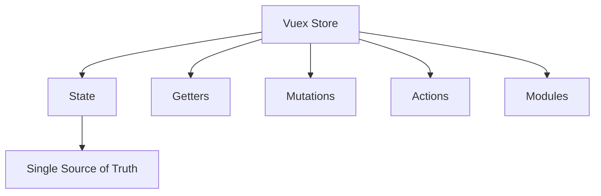

# Vue.js Vuex State

## Introduction

State management is one of the most critical aspects of building complex Vue.js applications. When your application grows beyond a few components, managing shared data becomes challenging. This is where Vuex comes in—a state management pattern and library specifically designed for Vue.js applications.

In this tutorial, we'll focus on the **state** property of Vuex, which serves as the single source of truth for your application's data. Understanding how to properly define, access, and modify your Vuex state is fundamental to building scalable Vue applications.

## What is Vuex State?

In Vuex, **state** is an object that contains all your application-level shared data. Think of it as a centralized database for your Vue application. Unlike component-level data which is isolated to a specific component, Vuex state can be accessed by any component in your application.



## Setting Up Vuex State

To use Vuex state, you first need to set up a Vuex store in your Vue.js application:

### 1. Install Vuex

```bash
npm install vuex
# OR using yarn
yarn add vuex
```

### 2. Create a Vuex Store

Create a new file called `store.js` in your project:

```javascript
import Vue from 'vue'
import Vuex from 'vuex'

Vue.use(Vuex)

export default new Vuex.Store({
  state: {
    // This is where you define your application's state
    count: 0,
    todos: [],
    user: null
  }
})
```

### 3. Add the Store to Your Vue Instance

In your `main.js`:

```javascript
import Vue from 'vue'
import App from './App.vue'
import store from './store'

new Vue({
  store, // Inject the store into all components
  render: h => h(App)
}).$mount('#app')
```

## Accessing Vuex State in Components

Once you've set up your Vuex store and defined your state, you can access it from any component. There are several ways to do this:

### Option 1: Direct Access via `this.$store.state`

You can directly access the state using the `$store` property that's injected into every component:

```html
<template>
  <div>
    <p>Count: {{ $store.state.count }}</p>
    <ul>
      <li v-for="todo in $store.state.todos" :key="todo.id">
        {{ todo.text }}
      </li>
    </ul>
  </div>
</template>

<script>
export default {
  name: 'MyComponent',
  methods: {
    logCount() {
      console.log(this.$store.state.count)
    }
  }
}
</script>
```

### Option 2: Using Computed Properties

For better code organization and reusability, it's recommended to use computed properties:

```html
<template>
  <div>
    <p>Count: {{ count }}</p>
    <ul>
      <li v-for="todo in todos" :key="todo.id">
        {{ todo.text }}
      </li>
    </ul>
  </div>
</template>

<script>
export default {
  name: 'MyComponent',
  computed: {
    count() {
      return this.$store.state.count
    },
    todos() {
      return this.$store.state.todos
    }
  }
}
</script>
```

### Option 3: Using `mapState` Helper

Vuex provides a `mapState` helper that simplifies accessing multiple state properties:

```html
<template>
  <div>
    <p>Count: {{ count }}</p>
    <ul>
      <li v-for="todo in todos" :key="todo.id">
        {{ todo.text }}
      </li>
    </ul>
    <div v-if="user">Hello, {{ user.name }}</div>
  </div>
</template>

<script>
import { mapState } from 'vuex'

export default {
  name: 'MyComponent',
  computed: {
    // This spreads all the state properties into computed properties
    ...mapState([
      'count',
      'todos',
      'user'
    ]),
    
    // You can also rename the properties
    ...mapState({
      counter: 'count',
      todoList: 'todos',
      currentUser: 'user'
    }),
    
    // You can also use functions for more complex mapping
    ...mapState({
      todoCount: state => state.todos.length,
      isLoggedIn: state => !!state.user
    })
  }
}
</script>
```

## Changing Vuex State

It's important to note that in Vuex, you should **never directly modify the state**. Instead, state changes should be made through **mutations**:

```html
<template>
  <div>
    <p>Count: {{ count }}</p>
    <button @click="incrementCount">Increment</button>
  </div>
</template>

<script>
import { mapState } from 'vuex'

export default {
  name: 'CounterComponent',
  computed: {
    ...mapState(['count'])
  },
  methods: {
    incrementCount() {
      // This is the WRONG way:
      // this.$store.state.count++
      
      // This is the RIGHT way:
      this.$store.commit('incrementCount')
    }
  }
}
</script>
```

And in your store, define the mutation:

```javascript
export default new Vuex.Store({
  state: {
    count: 0
  },
  mutations: {
    incrementCount(state) {
      state.count++
    }
  }
})
```

## Organizing State in Large Applications

As your application grows, your state can become complex. Here are some strategies to keep it organized:

### Namespaced Modules

```javascript
// store/index.js
import Vue from 'vue'
import Vuex from 'vuex'
import todoModule from './modules/todos'
import userModule from './modules/user'

Vue.use(Vuex)

export default new Vuex.Store({
  modules: {
    todos: todoModule,
    user: userModule
  }
})
```

```javascript
// store/modules/todos.js
export default {
  namespaced: true,
  state: {
    list: [],
    loading: false
  },
  mutations: {
    // Mutations go here
  }
}
```

Accessing namespaced state:

```html
<template>
  <div>
    <p v-if="loading">Loading todos...</p>
    <ul v-else>
      <li v-for="todo in todos" :key="todo.id">
        {{ todo.text }}
      </li>
    </ul>
  </div>
</template>

<script>
import { mapState } from 'vuex'

export default {
  computed: {
    ...mapState('todos', {
      todos: state => state.list,
      loading: state => state.loading
    })
  }
}
</script>
```

## Practical Example: Todo Application

Let's put everything together in a practical todo application example:

```javascript
// store.js
import Vue from 'vue'
import Vuex from 'vuex'

Vue.use(Vuex)

export default new Vuex.Store({
  state: {
    todos: [],
    filter: 'all' // 'all', 'completed', 'active'
  },
  mutations: {
    addTodo(state, todo) {
      state.todos.push({
        id: Date.now(),
        text: todo,
        completed: false
      })
    },
    toggleTodo(state, id) {
      const todo = state.todos.find(todo => todo.id === id)
      if (todo) {
        todo.completed = !todo.completed
      }
    },
    setFilter(state, filter) {
      state.filter = filter
    }
  },
  getters: {
    filteredTodos(state) {
      if (state.filter === 'completed') {
        return state.todos.filter(todo => todo.completed)
      } else if (state.filter === 'active') {
        return state.todos.filter(todo => !todo.completed)
      }
      return state.todos
    }
  }
})
```

Now, let's create a Todo app component:

```html
<template>
  <div class="todo-app">
    <h1>Todo App</h1>
    
    <!-- Add new todo -->
    <div class="add-todo">
      <input 
        v-model="newTodo" 
        @keyup.enter="addTodo" 
        placeholder="Add a new task"
      />
      <button @click="addTodo">Add</button>
    </div>
    
    <!-- Filter controls -->
    <div class="filters">
      <button 
        :class="{ active: filter === 'all' }" 
        @click="setFilter('all')"
      >
        All
      </button>
      <button 
        :class="{ active: filter === 'active' }" 
        @click="setFilter('active')"
      >
        Active
      </button>
      <button 
        :class="{ active: filter === 'completed' }" 
        @click="setFilter('completed')"
      >
        Completed
      </button>
    </div>
    
    <!-- Todo list -->
    <ul class="todo-list">
      <li 
        v-for="todo in filteredTodos" 
        :key="todo.id"
        :class="{ completed: todo.completed }"
      >
        <input 
          type="checkbox" 
          :checked="todo.completed" 
          @change="toggleTodo(todo.id)" 
        />
        <span>{{ todo.text }}</span>
      </li>
    </ul>
    
    <!-- Status -->
    <div class="status">
      <p>{{ todos.length }} tasks total</p>
    </div>
  </div>
</template>

<script>
import { mapState, mapGetters } from 'vuex'

export default {
  name: 'TodoApp',
  data() {
    return {
      newTodo: ''
    }
  },
  computed: {
    ...mapState(['todos', 'filter']),
    ...mapGetters(['filteredTodos'])
  },
  methods: {
    addTodo() {
      if (this.newTodo.trim()) {
        this.$store.commit('addTodo', this.newTodo.trim())
        this.newTodo = ''
      }
    },
    toggleTodo(id) {
      this.$store.commit('toggleTodo', id)
    },
    setFilter(filter) {
      this.$store.commit('setFilter', filter)
    }
  }
}
</script>

<style scoped>
.todo-app {
  max-width: 500px;
  margin: 0 auto;
  padding: 20px;
}
.add-todo {
  display: flex;
  margin-bottom: 20px;
}
.add-todo input {
  flex-grow: 1;
  padding: 8px;
}
.filters {
  margin-bottom: 10px;
}
.filters button {
  margin-right: 5px;
}
.filters button.active {
  background: #42b983;
  color: white;
}
.todo-list {
  list-style: none;
  padding: 0;
}
.todo-list li {
  display: flex;
  align-items: center;
  padding: 10px 0;
  border-bottom: 1px solid #eee;
}
.todo-list li.completed span {
  text-decoration: line-through;
  color: #888;
}
.status {
  margin-top: 20px;
  color: #888;
}
</style>
```

## Best Practices for Vuex State

1. **Single Source of Truth**: Keep all shared application data in the Vuex store.

2. **Never Directly Modify State**: Always use mutations to change state values.

3. **State Structure**: Keep your state structure flat and avoid deeply nested objects.

4. **Use Modules**: For larger applications, split your state into modules.

5. **Avoid Redundant Data**: Don't duplicate data in your state that can be derived through getters.

6. **Use TypeScript Interfaces**: If you're using TypeScript, define interfaces for your state structure.

   ```typescript
   interface RootState {
     count: number;
     todos: Todo[];
     user: User | null;
   }
   
   interface Todo {
     id: number;
     text: string;
     completed: boolean;
   }
   
   interface User {
     id: number;
     name: string;
     email: string;
   }
   ```

7. **Keep State Serializable**: Avoid storing complex non-serializable objects like class instances in your state.

## Summary

Vuex state serves as the centralized data store for your Vue.js application. By maintaining a single source of truth, you ensure consistency across your application's UI and avoid complex prop drilling through component trees.

In this tutorial, we've covered:

- What Vuex state is and why it's important
- How to set up a Vuex store with state
- Different ways to access state in components
- Properly modifying state through mutations
- Organizing state with modules
- A practical todo application example
- Best practices for managing Vuex state

By following these patterns and practices, you'll be well-equipped to manage state in your Vue.js applications efficiently, keeping your code clean, maintainable, and performant.

## Additional Resources and Exercises

### Resources

1. [Official Vuex Documentation](https://vuex.vuejs.org/)
2. [Vue.js State Management Guide](https://vuejs.org/guide/scaling-up/state-management.html)
3. [Vuex Core Concepts: State](https://vuex.vuejs.org/guide/state.html)

### Exercises

1. **Basic Counter App**: Create a counter application with increment, decrement, and reset buttons using Vuex state.

2. **Shopping Cart**: Build a simple e-commerce page with products and a shopping cart. Use Vuex to manage the cart state.

3. **User Authentication**: Implement a user login system where the authenticated user's information is stored in Vuex state.

4. **Blog Post Manager**: Create an application to manage blog posts with features like adding, editing, and filtering posts.

5. **Advanced Todo App**: Extend the todo app from this tutorial to include features like:
   - Categories for todos
   - Priority levels
   - Due dates
   - Search functionality
   - Persistence using localStorage

By working through these exercises, you'll gain hands-on experience with Vuex state management and develop a deeper understanding of how to effectively structure your application's data.