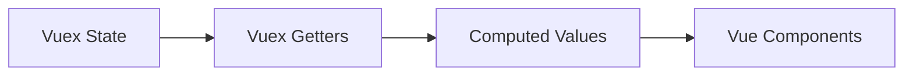

# Vue.js Vuex Getters

## Introduction

When managing state in Vue.js applications, you'll often need to derive new data from your store's state. Rather than computing this derived state in multiple components (which could lead to code duplication), Vuex provides **getters** - a powerful feature that allows you to define computed properties for your store.

Think of Vuex getters as the store's equivalent of Vue component's computed properties. They help you extract, filter, and transform data from your store's state before presenting it to your components.

In this tutorial, we'll explore:
- What Vuex getters are and why they're useful
- How to define and access getters
- Creating getters that accept arguments
- Real-world examples of getters in action

## Understanding Vuex Getters

### What are Getters?

Getters are functions in your Vuex store that take the state as their first argument and return computed values based on that state. They're particularly useful when multiple components need to use the same computed property.



### Why Use Getters?

1. **Avoid Duplication**: Define data transformation logic once in your store
2. **Caching**: Results are cached based on dependencies and only re-evaluated when dependencies change
3. **Centralization**: Keep data transformation logic close to your state
4. **Reusability**: Use the same derived state across multiple components

## Defining and Using Basic Getters

### Defining Getters

Let's create a simple store with some state and define getters to access derived information:

```javascript
import { createStore } from 'vuex'

const store = createStore({
  state() {
    return {
      todos: [
        { id: 1, text: 'Learn Vue', completed: true },
        { id: 2, text: 'Learn Vuex', completed: false },
        { id: 3, text: 'Build something awesome', completed: false }
      ]
    }
  },
  getters: {
    // Getter to count completed todos
    completedTodos(state) {
      return state.todos.filter(todo => todo.completed)
    },
    
    // Getter to count incomplete todos
    incompleteTodos(state) {
      return state.todos.filter(todo => !todo.completed)
    },
    
    // Getter that returns a count
    todoCount(state) {
      return state.todos.length
    }
  }
})

export default store
```

### Accessing Getters in Components

You can access getters in your components in several ways:

#### Option 1: Using `this.$store.getters`

```html
<template>
  <div>
    <p>Total todos: {{ $store.getters.todoCount }}</p>
    <p>Completed todos: {{ $store.getters.completedTodos.length }}</p>
    <p>Todos left: {{ $store.getters.incompleteTodos.length }}</p>
  </div>
</template>
```

#### Option 2: Using `mapGetters` Helper

The `mapGetters` helper maps store getters to local computed properties:

```html
<template>
  <div>
    <p>Total todos: {{ todoCount }}</p>
    <p>Completed todos: {{ completedTodos.length }}</p>
    <p>Todos left: {{ incompleteTodos.length }}</p>
  </div>
</template>

<script>
import { mapGetters } from 'vuex'

export default {
  computed: {
    // Map store getters to local computed properties
    ...mapGetters([
      'todoCount',
      'completedTodos',
      'incompleteTodos'
    ]),
    
    // You can still define other computed properties
    progress() {
      if (this.todoCount === 0) return 0
      return Math.round((this.completedTodos.length / this.todoCount) * 100)
    }
  }
}
</script>
```

#### Option 3: Using `mapGetters` with Custom Names

You can also rename getters when mapping them:

```javascript
computed: {
  ...mapGetters({
    count: 'todoCount',
    finished: 'completedTodos',
    remaining: 'incompleteTodos'
  })
}
```

## Advanced Getters

### Getters Accessing Other Getters

Getters can access other getters via the second argument:

```javascript
getters: {
  todoCount(state) {
    return state.todos.length
  },
  
  completedTodoCount(state) {
    return state.todos.filter(todo => todo.completed).length
  },
  
  // This getter uses other getters
  progressPercentage(state, getters) {
    if (getters.todoCount === 0) return 0
    return Math.round((getters.completedTodoCount / getters.todoCount) * 100)
  }
}
```

### Getters with Arguments (Method-Style Getters)

Sometimes you need to pass arguments to your getters, like filtering an array based on a parameter. You can return a function from your getter to achieve this:

```javascript
getters: {
  // Getter that returns a function
  getTodoById: (state) => (id) => {
    return state.todos.find(todo => todo.id === id)
  },
  
  // Filter todos by completion status
  filterTodosByStatus: (state) => (status) => {
    return state.todos.filter(todo => todo.completed === status)
  }
}
```

Using method-style getters in components:

```html
<template>
  <div>
    <p>Todo #2: {{ $store.getters.getTodoById(2).text }}</p>
    
    <h3>All completed todos:</h3>
    <ul>
      <li v-for="todo in $store.getters.filterTodosByStatus(true)" :key="todo.id">
        {{ todo.text }}
      </li>
    </ul>
  </div>
</template>
```

## Real-World Example: E-commerce Shopping Cart

Let's explore a more practical example of using Vuex getters in an e-commerce application:

```javascript
const store = createStore({
  state() {
    return {
      cart: [
        { id: 1, name: 'Wireless Headphones', price: 99.99, quantity: 1 },
        { id: 2, name: 'Smartphone', price: 699.99, quantity: 1 },
        { id: 3, name: 'Laptop Charger', price: 29.99, quantity: 2 }
      ],
      taxRate: 0.08,
      shippingFee: 5.99
    }
  },
  
  getters: {
    // Get all items in cart
    cartItems(state) {
      return state.cart
    },
    
    // Count total number of items
    cartItemCount(state) {
      return state.cart.reduce((total, item) => total + item.quantity, 0)
    },
    
    // Calculate subtotal (before tax and shipping)
    cartSubtotal(state) {
      return state.cart.reduce((total, item) => {
        return total + (item.price * item.quantity)
      }, 0)
    },
    
    // Calculate tax amount
    taxAmount(state, getters) {
      return getters.cartSubtotal * state.taxRate
    },
    
    // Calculate final total
    cartTotal(state, getters) {
      return getters.cartSubtotal + getters.taxAmount + state.shippingFee
    },
    
    // Find specific item in cart
    getCartItemById: (state) => (id) => {
      return state.cart.find(item => item.id === id)
    }
  }
})
```

Using these getters in a shopping cart component:

```html
<template>
  <div class="shopping-cart">
    <h2>Shopping Cart ({{ cartItemCount }} items)</h2>
    
    <div v-for="item in cartItems" :key="item.id" class="cart-item">
      <span>{{ item.name }}</span>
      <span>{{ item.quantity }} x ${{ item.price.toFixed(2) }}</span>
      <span>${{ (item.price * item.quantity).toFixed(2) }}</span>
    </div>
    
    <div class="cart-summary">
      <div>Subtotal: ${{ cartSubtotal.toFixed(2) }}</div>
      <div>Tax ({{ taxRate * 100 }}%): ${{ taxAmount.toFixed(2) }}</div>
      <div>Shipping: ${{ shippingFee.toFixed(2) }}</div>
      <div class="total">Total: ${{ cartTotal.toFixed(2) }}</div>
    </div>
  </div>
</template>

<script>
import { mapState, mapGetters } from 'vuex'

export default {
  computed: {
    // Map state properties
    ...mapState(['taxRate', 'shippingFee']),
    
    // Map getters
    ...mapGetters([
      'cartItems',
      'cartItemCount',
      'cartSubtotal',
      'taxAmount',
      'cartTotal'
    ])
  }
}
</script>
```

## Best Practices for Vuex Getters

1. **Use Getters for Derived State**: If you need to transform or filter state data, use getters rather than computing it in your components.

2. **Avoid Side Effects**: Getters should be pure functions that only compute and return values based on state, without modifying state or performing side effects.

3. **Keep Getters Simple**: Each getter should do one thing and do it well. Combine multiple getters if you need more complex logic.

4. **Use Method-Style Getters Sparingly**: While convenient, method-style getters lose the caching benefit of regular getters. Use them only when parameter-based filtering is needed.

5. **Consistent Naming**: Use a consistent naming convention for your getters to make your code more readable.

## Summary

Vuex getters are powerful tools for accessing and computing derived state in your Vue.js applications. They help you:

- Keep your components cleaner by moving data transformation logic into your store
- Avoid duplicating computation logic across components
- Benefit from automatic caching for better performance
- Pass parameters to getters when needed

By using getters effectively in your Vuex store, you can create more maintainable and efficient Vue.js applications with centralized state management.

## Additional Resources and Exercises

### Resources
- [Official Vuex Getters Documentation](https://vuex.vuejs.org/guide/getters.html)
- [Vue.js Documentation](https://v3.vuejs.org/)

### Exercises

1. **Basic Getters**: Create a todo application with getters to filter todos by their completion status and priority.

2. **Method-Style Getters**: Extend the todo app to include a getter that filters todos by both status and a search query parameter.

3. **Complex Getters**: Build a small e-commerce application with getters for filtering products by category, calculating discounts, and summarizing the shopping cart.

4. **Performance Optimization**: Profile your application's performance with and without getters to understand the caching benefits.