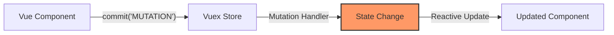

# Vue.js Vuex Mutations

## Introduction

In Vuex, **mutations** are the only way to actually change state in a Vuex store. Think of mutations as events: each mutation has a string **type** and a **handler**. The handler function is where we perform actual state modifications, and it will receive the state as the first argument.

Mutations follow a simple yet powerful principle: **state changes should be explicit and traceable**. This makes your application more predictable and easier to debug, as every state change can be logged and tracked.

In this tutorial, we'll explore how mutations work in Vuex and how to use them effectively to manage state in your Vue.js applications.

## What Are Vuex Mutations?

Mutations are functions that directly modify the state in your Vuex store. They have the following characteristics:

1. They are synchronous operations
2. They are committed using the `commit` method
3. They receive the current state as their first argument
4. They can accept an optional payload as the second argument

Let's see the basic structure of a mutation:

```js
// Inside your Vuex store
const store = new Vuex.Store({
  state: {
    count: 0
  },
  mutations: {
    // Mutation
    increment(state) {
      // Mutating the state
      state.count++
    }
  }
})
```

## Committing Mutations

To invoke a mutation, you need to call the `commit` method on the store:

```js
// Committing a mutation
store.commit('increment')
```

This will trigger the `increment` mutation, which increments the `count` state.

### Passing Payload to Mutations

Often, you'll need to pass additional data to a mutation. You can pass a payload as the second argument to `commit`:

```js
// In your store definition
mutations: {
  incrementBy(state, payload) {
    state.count += payload.amount
  }
}

// When committing
store.commit('incrementBy', { amount: 10 })
```

Alternatively, you can use the object-style commit:

```js
store.commit({
  type: 'incrementBy',
  amount: 10
})
```

With the object-style commit, the entire object will be passed as the payload to the mutation handler.

## Mutations Follow Vue's Reactivity Rules

Since Vuex's state is reactive, when we mutate the state, Vue components observing this state will update automatically. This means that mutations need to follow the same reactivity rules as Vue:

1. Prefer to initialize your store's state with all desired fields upfront
2. When adding new properties to an Object, you should either:
   - Use `Vue.set(obj, 'newProperty', value)` or
   - Replace the object with a new one that includes the existing properties

Here's an example:

```js
mutations: {
  // BAD: This new property will not be reactive
  addUserProperty(state) {
    state.user.favoriteColor = 'blue'
  },
  
  // GOOD: This will be reactive
  addUserPropertyCorrect(state) {
    Vue.set(state.user, 'favoriteColor', 'blue')
    
    // Alternative approach
    state.user = { ...state.user, favoriteColor: 'blue' }
  }
}
```

## Using Constants for Mutation Types

In large applications, it's a common pattern to use constants for mutation types. This has several benefits:
- Allows linting tools to catch typos
- Makes code more readable
- Provides a single place to see all possible mutations

Here's how you might implement it:

```js
// mutation-types.js
export const INCREMENT = 'INCREMENT'
export const INCREMENT_BY = 'INCREMENT_BY'
```

```js
// store.js
import * as types from './mutation-types'

const store = new Vuex.Store({
  state: {
    count: 0
  },
  mutations: {
    [types.INCREMENT](state) {
      state.count++
    },
    [types.INCREMENT_BY](state, payload) {
      state.count += payload.amount
    }
  }
})
```

```js
// In a component
import * as types from './mutation-types'

this.$store.commit(types.INCREMENT)
this.$store.commit(types.INCREMENT_BY, { amount: 10 })
```

## Practical Example: Shopping Cart

Let's implement a simple shopping cart using Vuex mutations:

```js
// store.js
const store = new Vuex.Store({
  state: {
    cart: [],
    loading: false
  },
  mutations: {
    ADD_TO_CART(state, product) {
      // Check if the product is already in the cart
      const existingProduct = state.cart.find(item => item.id === product.id)
      
      if (existingProduct) {
        // If it exists, increase quantity
        existingProduct.quantity++
      } else {
        // Otherwise add it to cart with quantity 1
        state.cart.push({
          ...product,
          quantity: 1
        })
      }
    },
    
    REMOVE_FROM_CART(state, productId) {
      const index = state.cart.findIndex(item => item.id === productId)
      if (index !== -1) {
        state.cart.splice(index, 1)
      }
    },
    
    UPDATE_QUANTITY(state, { productId, quantity }) {
      const product = state.cart.find(item => item.id === productId)
      if (product) {
        product.quantity = Math.max(1, quantity) // Ensure quantity is at least 1
      }
    },
    
    SET_LOADING(state, isLoading) {
      state.loading = isLoading
    }
  }
})
```

Now let's use these mutations in a Vue component:

```html
<template>
  <div>
    <div v-if="loading">Loading...</div>
    <div v-else>
      <h2>Shopping Cart</h2>
      <div v-if="cart.length === 0">Your cart is empty</div>
      <ul v-else>
        <li v-for="item in cart" :key="item.id">
          {{ item.name }} - ${{ item.price }} x 
          <input 
            type="number" 
            :value="item.quantity" 
            min="1" 
            @change="updateQuantity(item.id, $event.target.value)" 
          />
          <button @click="removeFromCart(item.id)">Remove</button>
        </li>
      </ul>
      <p><strong>Total: ${{ cartTotal }}</strong></p>
    </div>
  </div>
</template>

<script>
export default {
  computed: {
    cart() {
      return this.$store.state.cart
    },
    loading() {
      return this.$store.state.loading
    },
    cartTotal() {
      return this.cart.reduce(
        (total, item) => total + (item.price * item.quantity), 
        0
      ).toFixed(2)
    }
  },
  methods: {
    addToCart(product) {
      this.$store.commit('ADD_TO_CART', product)
    },
    removeFromCart(productId) {
      this.$store.commit('REMOVE_FROM_CART', productId)
    },
    updateQuantity(productId, quantity) {
      this.$store.commit('UPDATE_QUANTITY', { 
        productId, 
        quantity: parseInt(quantity, 10) 
      })
    },
    fetchProducts() {
      this.$store.commit('SET_LOADING', true)
      // Simulate API call
      setTimeout(() => {
        // Fetch products logic here...
        this.$store.commit('SET_LOADING', false)
      }, 1000)
    }
  },
  created() {
    this.fetchProducts()
  }
}
</script>
```

## Best Practices for Mutations

To get the most out of Vuex mutations, follow these best practices:

1. **Keep mutations synchronous**: Mutations should be synchronous - use actions for asynchronous operations.

2. **Make mutations atomic**: Each mutation should perform a single logical operation.

3. **Use descriptive names**: Mutation names should clearly indicate what they do, often using uppercase by convention.

4. **Keep mutation handlers focused**: They should just modify state and not contain complex logic.

5. **Avoid directly committing mutations in components**: Prefer to dispatch actions that commit mutations, especially for complex state changes.

Here's an example of what not to do:

```js
// BAD: Asynchronous mutation
mutations: {
  async fetchUserData(state) {
    const response = await fetch('/api/user')
    const userData = await response.json()
    state.user = userData // This happens after async operation, making debugging difficult
  }
}
```

The correct approach would be:

```js
// GOOD: Split into action and mutation
actions: {
  async fetchUserData({ commit }) {
    const response = await fetch('/api/user')
    const userData = await response.json()
    commit('SET_USER_DATA', userData)
  }
},
mutations: {
  SET_USER_DATA(state, userData) {
    state.user = userData
  }
}
```

## Visualizing Mutation Flow

Let's visualize the flow of data when using mutations:



This shows how state changes flow in one direction, making it easier to track and debug state changes in your application.

## Summary

Vuex mutations provide a reliable way to modify the state in your Vue.js applications:

- Mutations are synchronous functions that directly modify state
- They are committed using the `store.commit()` method
- They can receive a payload to provide additional data
- They follow Vue's reactivity rules
- Using constants for mutation types can improve maintainability
- Mutations should be simple and focused on state changes

By adhering to these principles, your Vue application's state management will be more predictable, maintainable, and easier to debug.

## Exercises

To reinforce your understanding of Vuex mutations, try these exercises:

1. Create a todo list app using Vuex with mutations to add, remove, and toggle todos.
2. Implement a "time travel" feature that logs all mutations and allows you to revert to previous states.
3. Refactor an existing Vue application to use Vuex and mutations for state management.
4. Create a shopping cart with features like adding items, removing items, and updating quantities.

## Additional Resources

- [Vuex Mutations Official Documentation](https://vuex.vuejs.org/guide/mutations.html)
- [Vuex GitHub Repository](https://github.com/vuejs/vuex)
- [Vue.js Devtools](https://github.com/vuejs/vue-devtools) - For debugging Vuex mutations
- [Vuex Pathify](https://github.com/davestewart/vuex-pathify) - A Vuex plugin that simplifies working with mutations

By mastering mutations, you're one step closer to building robust Vue applications with predictable state management.