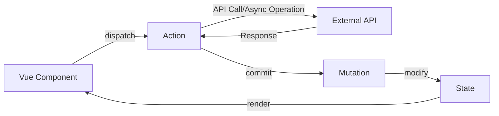

# Vue.js Vuex Actions

## Introduction

When managing state in Vue.js applications, Vuex provides a structured way to handle data flow. While mutations are responsible for synchronous state changes, **Vuex actions** handle asynchronous operations before committing mutations. Actions are a crucial part of the Vuex architecture that allow you to perform complex logic, API calls, and other asynchronous tasks while maintaining a predictable state management pattern.

In this guide, we'll explore how actions work within Vuex, why they're important, and how to implement them effectively in your Vue.js applications.

## Understanding Vuex Actions

### What Are Actions?

Actions are methods defined in the Vuex store that:

1. Can perform asynchronous operations
2. Commit mutations when those operations complete
3. Can access the store context (state, getters, and other actions)
4. Can be triggered from components using `this.$store.dispatch()`

Unlike mutations, actions don't directly change the state. Instead, they coordinate asynchronous operations and commit mutations when those operations complete.



### Why Use Actions?

Actions are essential because:

1. **Separation of concerns**: They separate asynchronous logic from state mutations
2. **Error handling**: Provide a centralized place to manage API errors
3. **Reusability**: Can be reused across multiple components
4. **Testability**: Make it easier to test asynchronous processes

## Defining Actions in Vuex

Let's create a basic Vuex store with actions:

```javascript
import Vue from 'vue'
import Vuex from 'vuex'

Vue.use(Vuex)

export default new Vuex.Store({
  state: {
    todos: [],
    loading: false,
    error: null
  },
  
  mutations: {
    SET_TODOS(state, todos) {
      state.todos = todos
    },
    SET_LOADING(state, status) {
      state.loading = status
    },
    SET_ERROR(state, error) {
      state.error = error
    }
  },
  
  actions: {
    // Basic action with context object
    fetchTodos({ commit }) {
      // Set loading state
      commit('SET_LOADING', true)
      
      // Perform API call
      fetch('https://jsonplaceholder.typicode.com/todos')
        .then(response => response.json())
        .then(todos => {
          // Commit mutation to update state
          commit('SET_TODOS', todos)
          commit('SET_LOADING', false)
        })
        .catch(error => {
          commit('SET_ERROR', error)
          commit('SET_LOADING', false)
        })
    }
  }
})
```

In this example:
- We defined a `fetchTodos` action that retrieves a list of todos from an API
- The action commits mutations to update the loading state and store the fetched data
- Error handling is included to update the error state if something goes wrong

## The Action Context Object

When defining actions, the first parameter is the **context object**, which provides access to the same set of methods/properties on the store instance:

```javascript
actions: {
  exampleAction(context) {
    // context object provides access to:
    context.state      // -> same as store.state
    context.getters    // -> same as store.getters
    context.commit     // -> same as store.commit
    context.dispatch   // -> same as store.dispatch
  }
}
```

Most commonly, you'll use ES6 destructuring to simplify the code:

```javascript
actions: {
  exampleAction({ state, getters, commit, dispatch }) {
    // Now you can use these methods directly
    commit('SOME_MUTATION')
  }
}
```

## Using Actions in Vue Components

There are several ways to dispatch actions from your components:

### 1. Using `$store.dispatch`

```html
<template>
  <div>
    <button @click="loadTodos">Load Todos</button>
    <div v-if="loading">Loading...</div>
    <ul v-else>
      <li v-for="todo in todos" :key="todo.id">{{ todo.title }}</li>
    </ul>
  </div>
</template>

<script>
export default {
  computed: {
    todos() {
      return this.$store.state.todos
    },
    loading() {
      return this.$store.state.loading
    }
  },
  methods: {
    loadTodos() {
      this.$store.dispatch('fetchTodos')
    }
  }
}
</script>
```

### 2. Using `mapActions` Helper

The `mapActions` helper makes it easier to access multiple actions:

```html
<template>
  <div>
    <button @click="fetchTodos">Load Todos</button>
    <button @click="addTodo(newTodo)">Add Todo</button>
    <!-- ... -->
  </div>
</template>

<script>
import { mapActions, mapState } from 'vuex'

export default {
  data() {
    return {
      newTodo: { title: 'New task', completed: false }
    }
  },
  computed: {
    ...mapState(['todos', 'loading'])
  },
  methods: {
    ...mapActions(['fetchTodos', 'addTodo'])
  }
}
</script>
```

## Actions with Payloads

Actions can accept additional arguments (payloads) when dispatched:

```javascript
// In the store
actions: {
  addTodo({ commit }, todoItem) {
    commit('SET_LOADING', true)
    
    return fetch('https://jsonplaceholder.typicode.com/todos', {
      method: 'POST',
      body: JSON.stringify(todoItem),
      headers: {
        'Content-type': 'application/json; charset=UTF-8',
      },
    })
      .then(response => response.json())
      .then(newTodo => {
        commit('ADD_TODO', newTodo)
        commit('SET_LOADING', false)
        return newTodo // Returning for promise chaining
      })
      .catch(error => {
        commit('SET_ERROR', error)
        commit('SET_LOADING', false)
        throw error // Rethrow for promise chaining
      })
  }
}

// In a component
methods: {
  createTodo() {
    this.$store.dispatch('addTodo', { 
      title: this.newTodoText,
      completed: false
    }).then(() => {
      this.newTodoText = '' // Clear input on success
    }).catch(err => {
      this.errorMessage = 'Failed to add todo'
    })
  }
}
```

## Returning Promises from Actions

Actions can return Promises, which is useful for knowing when an action has completed:

```javascript
actions: {
  fetchTodos({ commit }) {
    commit('SET_LOADING', true)
    
    // Return the promise
    return fetch('https://jsonplaceholder.typicode.com/todos')
      .then(response => response.json())
      .then(todos => {
        commit('SET_TODOS', todos)
        commit('SET_LOADING', false)
        return todos // Return for promise chaining
      })
      .catch(error => {
        commit('SET_ERROR', error)
        commit('SET_LOADING', false)
        throw error // Rethrow for promise chaining
      })
  }
}
```

Now in your component, you can chain `.then()` and `.catch()`:

```javascript
methods: {
  loadTodos() {
    this.$store.dispatch('fetchTodos')
      .then(todos => {
        console.log('Todos loaded successfully:', todos.length)
        this.showNotification('Todos loaded!')
      })
      .catch(error => {
        console.error('Failed to load todos:', error)
      })
  }
}
```

## Composing Actions

Actions can call other actions using the `dispatch` method, allowing you to compose complex behavior:

```javascript
actions: {
  async loadDashboard({ dispatch }) {
    // Dispatch multiple actions in parallel
    const [userData, statsData, notificationsData] = await Promise.all([
      dispatch('fetchUserProfile'),
      dispatch('fetchStats'),
      dispatch('fetchNotifications')
    ])
    
    // Process combined results
    return {
      user: userData,
      stats: statsData,
      notifications: notificationsData
    }
  },
  
  async fetchUserProfile({ commit }) {
    // Action implementation...
  },
  
  async fetchStats({ commit }) {
    // Action implementation...
  },
  
  async fetchNotifications({ commit }) {
    // Action implementation...
  }
}
```

## Using Async/Await with Actions

Modern JavaScript provides the `async/await` syntax, making asynchronous code easier to read and write:

```javascript
actions: {
  // Using async/await for cleaner asynchronous code
  async fetchTodos({ commit }) {
    commit('SET_LOADING', true)
    
    try {
      const response = await fetch('https://jsonplaceholder.typicode.com/todos')
      const todos = await response.json()
      
      commit('SET_TODOS', todos)
      return todos
    } catch (error) {
      commit('SET_ERROR', error.message)
      throw error
    } finally {
      commit('SET_LOADING', false)
    }
  }
}
```

## Real-World Example: Authentication Flow

Let's implement a more complex real-world example of Vuex actions for user authentication:

```javascript
// store/modules/auth.js
import authApi from '@/api/auth'

const state = {
  token: localStorage.getItem('token') || null,
  user: JSON.parse(localStorage.getItem('user') || 'null'),
  loading: false,
  error: null
}

const mutations = {
  AUTH_REQUEST(state) {
    state.loading = true
    state.error = null
  },
  AUTH_SUCCESS(state, { token, user }) {
    state.token = token
    state.user = user
    state.loading = false
  },
  AUTH_ERROR(state, error) {
    state.error = error
    state.loading = false
  },
  LOGOUT(state) {
    state.token = null
    state.user = null
  }
}

const actions = {
  // Login action
  async login({ commit, dispatch }, credentials) {
    try {
      commit('AUTH_REQUEST')
      
      const { token, user } = await authApi.login(credentials)
      
      // Store the token in localStorage
      localStorage.setItem('token', token)
      localStorage.setItem('user', JSON.stringify(user))
      
      // Set the auth header for future requests
      authApi.setAuthHeader(token)
      
      commit('AUTH_SUCCESS', { token, user })
      
      // Fetch user data after successful login
      dispatch('fetchUserData')
      
      return { token, user }
    } catch (error) {
      commit('AUTH_ERROR', error.message)
      localStorage.removeItem('token')
      localStorage.removeItem('user')
      throw error
    }
  },
  
  // Logout action
  logout({ commit }) {
    return new Promise(resolve => {
      commit('LOGOUT')
      localStorage.removeItem('token')
      localStorage.removeItem('user')
      authApi.clearAuthHeader()
      resolve()
    })
  },
  
  // Check if token is still valid
  async checkAuth({ commit, state }) {
    if (!state.token) return Promise.reject('No token found')
    
    try {
      commit('AUTH_REQUEST')
      const user = await authApi.verifyToken(state.token)
      commit('AUTH_SUCCESS', { token: state.token, user })
      return user
    } catch (error) {
      commit('AUTH_ERROR', error.message)
      commit('LOGOUT')
      localStorage.removeItem('token')
      localStorage.removeItem('user')
      throw error
    }
  },
  
  // Fetch user data action
  async fetchUserData({ commit, state }) {
    try {
      const userData = await authApi.getUserData(state.user.id)
      commit('UPDATE_USER_DATA', userData)
      return userData
    } catch (error) {
      console.error('Failed to fetch user data:', error)
      throw error
    }
  }
}

export default {
  namespaced: true,
  state,
  mutations,
  actions
}
```

Using these actions in a Login component:

```html
<template>
  <form @submit.prevent="handleLogin">
    <div class="form-group">
      <label>Email</label>
      <input type="email" v-model="email" required />
    </div>
    <div class="form-group">
      <label>Password</label>
      <input type="password" v-model="password" required />
    </div>
    <div v-if="error" class="error">{{ error }}</div>
    <button type="submit" :disabled="loading">
      {{ loading ? 'Logging in...' : 'Log In' }}
    </button>
  </form>
</template>

<script>
import { mapState, mapActions } from 'vuex'

export default {
  data() {
    return {
      email: '',
      password: ''
    }
  },
  computed: {
    ...mapState('auth', ['loading', 'error'])
  },
  methods: {
    ...mapActions('auth', ['login']),
    async handleLogin() {
      try {
        await this.login({
          email: this.email,
          password: this.password
        })
        this.$router.push('/dashboard')
      } catch (error) {
        // Error is already handled in the store
        console.error('Login failed')
      }
    }
  }
}
</script>
```

## Best Practices for Vuex Actions

1. **Keep actions focused**: Each action should serve a specific purpose.

2. **Handle errors consistently**: Implement a standard pattern for error handling.

3. **Use async/await for readability**: Modern JavaScript makes asynchronous code more readable.

4. **Return promises**: Allow components to react to action completion or failure.

5. **Consider using modules**: For larger applications, organize actions into Vuex modules.

6. **Use action composition**: Break down complex workflows into smaller, reusable actions.

7. **Separate API logic**: Consider creating a separate API service layer that your actions can call.

```javascript
// api/todos.js - API service layer
export default {
  async fetchTodos() {
    const response = await fetch('https://jsonplaceholder.typicode.com/todos')
    if (!response.ok) throw new Error('Failed to fetch todos')
    return response.json()
  },
  
  async addTodo(todo) {
    const response = await fetch('https://jsonplaceholder.typicode.com/todos', {
      method: 'POST',
      body: JSON.stringify(todo),
      headers: {
        'Content-type': 'application/json'
      }
    })
    if (!response.ok) throw new Error('Failed to add todo')
    return response.json()
  }
}

// store/todos.js - Vuex module using the API service
import todosApi from '@/api/todos'

const actions = {
  async fetchTodos({ commit }) {
    commit('SET_LOADING', true)
    try {
      const todos = await todosApi.fetchTodos()
      commit('SET_TODOS', todos)
      return todos
    } catch (error) {
      commit('SET_ERROR', error.message)
      throw error
    } finally {
      commit('SET_LOADING', false)
    }
  }
}
```

## Summary

Vuex actions are a powerful mechanism for handling asynchronous operations in your Vue.js applications. They provide a structured way to perform complex logic, API calls, and other side effects while maintaining the predictability of your state management.

Key points to remember:

- Actions handle asynchronous operations; mutations handle synchronous state changes
- Actions are dispatched from components using `this.$store.dispatch()`
- Actions can return promises for handling success and error cases
- Modern JavaScript features like async/await make actions more readable
- Actions can be composed by dispatching other actions
- For larger applications, organize actions into Vuex modules

By following the patterns and practices outlined in this guide, you'll be able to implement robust and maintainable state management in your Vue.js applications.

## Additional Resources and Exercises

### Resources
- [Official Vuex Actions Documentation](https://vuex.vuejs.org/guide/actions.html)
- [Vue.js Style Guide](https://vuejs.org/style-guide/)

### Exercises

1. **Todo App with API**:
   Create a Todo application that uses Vuex actions to fetch, create, update, and delete todos from a remote API.

2. **Authentication System**:
   Implement a complete authentication system with login, logout, and registration using Vuex actions.

3. **Shopping Cart**:
   Build a shopping cart that loads products from an API and manages the cart state through Vuex actions.

4. **Action Refactoring Challenge**:
   Take an existing application with API calls directly in components and refactor it to use Vuex actions.

5. **Error Handling System**:
   Create a centralized error handling system using Vuex actions that can display appropriate error messages to users.