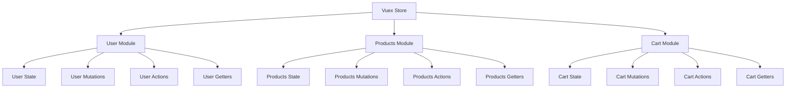

# Vue.js Vuex Modules

In large-scale Vue.js applications, your state management can quickly become complex and unwieldy. As your application grows, having all your state, mutations, actions, and getters in a single file can lead to maintenance challenges and code that's difficult to understand. This is where **Vuex modules** come to the rescue.

## Introduction to Vuex Modules

Vuex modules allow you to divide your store into smaller, manageable pieces. Each module can have its own:

- State
- Mutations
- Actions
- Getters

Think of modules like components for your Vuex store. Just as components help organize your UI, modules help organize your state management logic.



## Basic Module Structure

Let's start with a simple example of how to structure a Vuex store using modules:

```js
// store/index.js
import Vue from 'vue'
import Vuex from 'vuex'
import userModule from './modules/user'
import productsModule from './modules/products'
import cartModule from './modules/cart'

Vue.use(Vuex)

export default new Vuex.Store({
  modules: {
    user: userModule,
    products: productsModule,
    cart: cartModule
  }
})
```

Here's what a basic module might look like:

```js
// store/modules/user.js
const state = {
  user: null,
  isAuthenticated: false,
  preferences: {}
}

const mutations = {
  SET_USER(state, user) {
    state.user = user
    state.isAuthenticated = !!user
  },
  SET_PREFERENCES(state, preferences) {
    state.preferences = preferences
  }
}

const actions = {
  login({ commit }, credentials) {
    // Simulate API call
    return new Promise((resolve) => {
      setTimeout(() => {
        const user = { 
          id: 1, 
          username: 'john_doe', 
          name: 'John Doe' 
        }
        commit('SET_USER', user)
        resolve(user)
      }, 1000)
    })
  },
  logout({ commit }) {
    commit('SET_USER', null)
  }
}

const getters = {
  isAuthenticated: state => state.isAuthenticated,
  currentUser: state => state.user,
  username: state => state.user ? state.user.username : null
}

export default {
  state,
  mutations,
  actions,
  getters
}
```

## Accessing Module State

Once you've created your modules, accessing their state requires using the module name:

```js
// In a Vue component
export default {
  computed: {
    user() {
      return this.$store.state.user.user
    },
    isLoggedIn() {
      return this.$store.state.user.isAuthenticated
    },
    cartItems() {
      return this.$store.state.cart.items
    }
  }
}
```

## Using Namespaced Modules

By default, actions, mutations, and getters inside modules are registered under the global namespace. This means that multiple modules can react to the same mutation or action type. While this can be useful in some scenarios, it often leads to confusion.

To make your modules more self-contained, you can add the `namespaced: true` property:

```js
// store/modules/products.js
const state = {
  all: [],
  loading: false
}

const mutations = {
  SET_PRODUCTS(state, products) {
    state.all = products
  },
  SET_LOADING(state, isLoading) {
    state.loading = isLoading
  }
}

const actions = {
  fetchProducts({ commit }) {
    commit('SET_LOADING', true)
    // Simulate API call
    return fetch('https://api.example.com/products')
      .then(response => response.json())
      .then(products => {
        commit('SET_PRODUCTS', products)
        commit('SET_LOADING', false)
      })
  }
}

const getters = {
  availableProducts: state => state.all.filter(product => product.inStock)
}

export default {
  namespaced: true,
  state,
  mutations,
  actions,
  getters
}
```

With namespaced modules, you access actions, mutations, and getters with the module name as a prefix:

```js
// In a Vue component
export default {
  methods: {
    loadProducts() {
      // For namespaced modules, include the namespace
      this.$store.dispatch('products/fetchProducts')
    },
    addToCart(product) {
      this.$store.dispatch('cart/addItem', product)
    }
  },
  computed: {
    products() {
      return this.$store.state.products.all
    },
    isLoading() {
      return this.$store.state.products.loading
    },
    availableProducts() {
      return this.$store.getters['products/availableProducts']
    }
  }
}
```

## Helper Functions with Modules

Vuex provides helper functions like `mapState`, `mapGetters`, `mapActions`, and `mapMutations` to make working with the store easier. With modules, you can use them like this:

```js
import { mapState, mapGetters, mapActions } from 'vuex'

export default {
  computed: {
    // For non-namespaced modules
    ...mapState({
      user: state => state.user.user,
      isAuthenticated: state => state.user.isAuthenticated
    }),
    
    // For namespaced modules
    ...mapState('products', [
      'all',
      'loading'
    ]),
    
    ...mapGetters('products', [
      'availableProducts'
    ])
  },
  
  methods: {
    ...mapActions('products', [
      'fetchProducts'
    ]),
    
    ...mapActions('cart', [
      'addItem',
      'removeItem'
    ])
  }
}
```

## Nested Modules

Modules can also be nested inside other modules, allowing for a deeper organization:

```js
// store/modules/shop.js
import productsModule from './shop/products'
import cartModule from './shop/cart'

const state = {
  shopName: 'My Awesome Shop'
}

export default {
  namespaced: true,
  state,
  modules: {
    products: productsModule,
    cart: cartModule
  }
}
```

With this setup, to access state in the products module, you would use:

```js
$store.state.shop.products.all
```

And to dispatch an action:

```js
$store.dispatch('shop/products/fetchProducts')
```

## Dynamic Module Registration

Vuex also allows you to register modules after the store has been created:

```js
// Somewhere in your code after store initialization
store.registerModule('dynamic', {
  namespaced: true,
  state: { 
    items: [] 
  },
  mutations: {
    ADD_ITEM(state, item) {
      state.items.push(item)
    }
  }
})

// Later, if needed
store.unregisterModule('dynamic')
```

This is particularly useful for code-splitting and lazy-loading parts of your store.

## Practical Example: E-commerce Store

Let's put everything together with a more complete e-commerce store example:

```js
// store/index.js
import Vue from 'vue'
import Vuex from 'vuex'
import auth from './modules/auth'
import products from './modules/products'
import cart from './modules/cart'
import orders from './modules/orders'

Vue.use(Vuex)

export default new Vuex.Store({
  state: {
    appName: 'Vue E-Shop',
    appVersion: '1.0.0'
  },
  modules: {
    auth,
    products,
    cart,
    orders
  }
})
```

In a component, we might use it like this:

```html
<template>
  <div>
    <div v-if="isLoading" class="loading-spinner">Loading products...</div>
    
    <div v-else class="products-grid">
      <div v-for="product in availableProducts" :key="product.id" class="product-card">
        <h3>{{ product.name }}</h3>
        <p>{{ product.description }}</p>
        <div class="price">${{ product.price.toFixed(2) }}</div>
        <button 
          @click="addToCart(product)"
          :disabled="!product.inStock"
        >
          Add to Cart
        </button>
      </div>
    </div>
    
    <div class="cart-summary">
      <h3>Cart ({{ cartItemCount }} items)</h3>
      <p>Total: ${{ cartTotal.toFixed(2) }}</p>
      <button @click="checkout" :disabled="cartItemCount === 0">
        Checkout
      </button>
    </div>
  </div>
</template>

<script>
import { mapState, mapGetters, mapActions } from 'vuex'

export default {
  created() {
    this.fetchProducts()
  },
  
  computed: {
    ...mapState('products', ['loading']),
    ...mapGetters('products', ['availableProducts']),
    ...mapGetters('cart', ['cartItemCount', 'cartTotal'])
  },
  
  methods: {
    ...mapActions('products', ['fetchProducts']),
    ...mapActions('cart', ['addToCart']),
    ...mapActions('orders', ['checkout'])
  }
}
</script>
```

## Module Reusability

One of the biggest advantages of Vuex modules is their reusability. You can create generic modules that can be used across different projects:

```js
// A reusable pagination module
export default {
  namespaced: true,
  state: {
    currentPage: 1,
    itemsPerPage: 10,
    totalItems: 0
  },
  mutations: {
    SET_CURRENT_PAGE(state, page) {
      state.currentPage = page
    },
    SET_ITEMS_PER_PAGE(state, count) {
      state.itemsPerPage = count
    },
    SET_TOTAL_ITEMS(state, count) {
      state.totalItems = count
    }
  },
  getters: {
    totalPages: state => Math.ceil(state.totalItems / state.itemsPerPage),
    hasPrevPage: state => state.currentPage > 1,
    hasNextPage: (state, getters) => state.currentPage < getters.totalPages
  }
}
```

## Summary

Vuex modules are a powerful way to organize your state management code in larger Vue.js applications. They help maintain a clean, modular structure as your application grows, making your code more maintainable and easier to reason about.

Key takeaways:
- Modules help organize your Vuex store by dividing it into manageable pieces
- Each module can have its own state, mutations, actions, and getters
- Namespaced modules prevent naming conflicts and make your code more explicit
- Helper functions like `mapState` and `mapActions` work with modules too
- Modules can be nested for deeper organization
- Dynamic module registration allows for code-splitting and lazy loading

## Additional Resources

To further your understanding of Vuex modules, consider exploring:

1. The [official Vuex modules documentation](https://vuex.vuejs.org/guide/modules.html)
2. Practice by converting a simple Vuex store to a modular one
3. Try implementing dynamic module registration in a real application

## Exercises

1. Convert a simple Vuex store to use modules
2. Create a namespaced module for handling user authentication
3. Implement a module system for a shopping cart that includes products, cart, and orders modules
4. Create a reusable pagination module that can be used across different parts of your application
5. Challenge: Build a dynamic module registration system that loads modules based on the current route