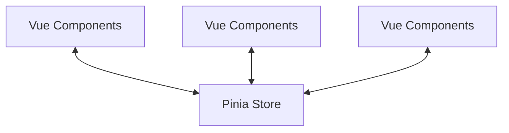

# Vue.js Pinia Introduction

## What is Pinia?

Pinia is the officially recommended state management library for Vue.js applications. It was created by Eduardo San Martin Morote, a member of the Vue.js core team, and has been designed as a more modern alternative to Vuex (the previous official state management solution).

Think of Pinia as a centralized store that holds all the data your application needs across multiple components. Instead of passing data through props or using complex event systems, Pinia provides a straightforward way to share state across your entire application.



## Why Pinia over Vuex?

Pinia offers several advantages over Vuex:

1. **TypeScript Support**: Pinia was built with TypeScript in mind, providing excellent type inference.
2. **Simplified API**: No more mutations, modules are flat by default.
3. **Lighter Package**: Smaller bundle size improves performance.
4. **Devtools Support**: Great integration with Vue devtools.
5. **Modular by Design**: Stores can be imported and used only where needed.
6. **No Namespaced Modules**: Simplified store organization.

## Getting Started with Pinia

### Installation

Let's start by adding Pinia to your Vue.js project:

```bash
# Using npm
npm install pinia

# Using yarn
yarn add pinia
```

### Setting Up Pinia in Your Vue Application

After installation, you need to create a Pinia instance and provide it to your Vue application:

```js
// main.js
import { createApp } from 'vue'
import { createPinia } from 'pinia'
import App from './App.vue'

const app = createApp(App)
const pinia = createPinia()

app.use(pinia)
app.mount('#app')
```

## Creating Your First Store

With Pinia, stores are defined using the `defineStore` function. Let's create a simple counter store:

```js
// stores/counter.js
import { defineStore } from 'pinia'

export const useCounterStore = defineStore('counter', {
  // state is like data in a component
  state: () => ({
    count: 0,
    name: 'Counter'
  }),
  
  // getters are like computed properties
  getters: {
    doubleCount: (state) => state.count * 2,
    
    // you can also use this to access other getters
    doubleCountPlusOne() {
      return this.doubleCount + 1
    }
  },
  
  // actions are like methods
  actions: {
    increment() {
      this.count++
    },
    decrement() {
      this.count--
    },
    reset() {
      this.count = 0
    },
    incrementBy(amount) {
      this.count += amount
    }
  }
})
```

### Using the Setup Syntax (Composition API)

Pinia also supports a more concise setup-style syntax using the Composition API:

```js
// stores/counter.js (using setup style)
import { defineStore } from 'pinia'
import { ref, computed } from 'vue'

export const useCounterStore = defineStore('counter', () => {
  // state
  const count = ref(0)
  const name = ref('Counter')
  
  // getters
  const doubleCount = computed(() => count.value * 2)
  const doubleCountPlusOne = computed(() => doubleCount.value + 1)
  
  // actions
  function increment() {
    count.value++
  }
  
  function decrement() {
    count.value--
  }
  
  function reset() {
    count.value = 0
  }
  
  function incrementBy(amount) {
    count.value += amount
  }
  
  return { 
    count, 
    name, 
    doubleCount, 
    doubleCountPlusOne, 
    increment, 
    decrement, 
    reset, 
    incrementBy 
  }
})
```

## Using Stores in Components

Now that we've created a store, let's use it in a component:

```html
<template>
  <div>
    <h2>{{ store.name }}</h2>
    <p>Count: {{ store.count }}</p>
    <p>Double Count: {{ store.doubleCount }}</p>
    <p>Double Count + 1: {{ store.doubleCountPlusOne }}</p>
    
    <button @click="store.increment()">Increment</button>
    <button @click="store.decrement()">Decrement</button>
    <button @click="store.reset()">Reset</button>
    <button @click="store.incrementBy(10)">Add 10</button>
  </div>
</template>

<script setup>
import { useCounterStore } from '../stores/counter'

const store = useCounterStore()
</script>
```

### Destructuring Store Properties

You can destructure store properties, but you need to use `storeToRefs` to maintain reactivity:

```html
<template>
  <div>
    <h2>{{ name }}</h2>
    <p>Count: {{ count }}</p>
    <p>Double Count: {{ doubleCount }}</p>
    
    <button @click="increment()">Increment</button>
    <button @click="decrement()">Decrement</button>
    <button @click="reset()">Reset</button>
  </div>
</template>

<script setup>
import { useCounterStore } from '../stores/counter'
import { storeToRefs } from 'pinia'

const store = useCounterStore()
// Extract state and getters (reactive properties)
const { count, name, doubleCount } = storeToRefs(store)
// Extract actions (methods)
const { increment, decrement, reset } = store
</script>
```

## Real-World Example: Shopping Cart

Let's create a more practical example – a shopping cart store:

```js
// stores/cart.js
import { defineStore } from 'pinia'

export const useCartStore = defineStore('cart', {
  state: () => ({
    items: [],
  }),
  
  getters: {
    totalItems: (state) => state.items.length,
    
    totalPrice: (state) => {
      return state.items.reduce((total, item) => {
        return total + (item.price * item.quantity)
      }, 0)
    },
    
    isEmpty: (state) => state.items.length === 0
  },
  
  actions: {
    addItem(item) {
      const existingItem = this.items.find(i => i.id === item.id)
      
      if (existingItem) {
        existingItem.quantity++
      } else {
        this.items.push({ ...item, quantity: 1 })
      }
    },
    
    removeItem(itemId) {
      const index = this.items.findIndex(item => item.id === itemId)
      if (index !== -1) {
        this.items.splice(index, 1)
      }
    },
    
    updateQuantity(itemId, quantity) {
      const item = this.items.find(item => item.id === itemId)
      if (item) {
        item.quantity = quantity
      }
    },
    
    clearCart() {
      this.items = []
    }
  }
})
```

Now, let's use this cart store in a component:

```html
<template>
  <div class="shopping-cart">
    <h2>Shopping Cart</h2>
    
    <div v-if="cart.isEmpty" class="empty-cart">
      Your cart is empty!
    </div>
    
    <div v-else>
      <ul class="cart-items">
        <li v-for="item in cart.items" :key="item.id" class="cart-item">
          <div class="item-details">
            <h3>{{ item.name }}</h3>
            <p>${{ item.price.toFixed(2) }} each</p>
          </div>
          
          <div class="item-quantity">
            <button @click="decreaseQuantity(item)" :disabled="item.quantity <= 1">-</button>
            <span>{{ item.quantity }}</span>
            <button @click="cart.updateQuantity(item.id, item.quantity + 1)">+</button>
          </div>
          
          <div class="item-total">
            ${{ (item.price * item.quantity).toFixed(2) }}
          </div>
          
          <button class="remove-button" @click="cart.removeItem(item.id)">
            Remove
          </button>
        </li>
      </ul>
      
      <div class="cart-summary">
        <p>Total Items: {{ cart.totalItems }}</p>
        <p>Total Price: ${{ cart.totalPrice.toFixed(2) }}</p>
        <button class="clear-button" @click="cart.clearCart()">Clear Cart</button>
      </div>
    </div>
  </div>
</template>

<script setup>
import { useCartStore } from '../stores/cart'

const cart = useCartStore()

function decreaseQuantity(item) {
  if (item.quantity > 1) {
    cart.updateQuantity(item.id, item.quantity - 1)
  }
}
</script>
```

## Persisting State with Plugins

Pinia supports plugins for adding functionality. A common need is persisting state to localStorage. Here's how to create a simple persistence plugin:

```js
// plugins/persistedState.js
export function createPersistedState({ key = 'pinia', storage = localStorage } = {}) {
  return function({ store }) {
    // Restore state from storage when the store is initialized
    const savedState = storage.getItem(key + '-' + store.$id)
    
    if (savedState) {
      store.$patch(JSON.parse(savedState))
    }
    
    // Save state to storage whenever it changes
    store.$subscribe((mutation, state) => {
      storage.setItem(key + '-' + store.$id, JSON.stringify(state))
    })
  }
}
```

Use the plugin in your main.js:

```js
// main.js
import { createApp } from 'vue'
import { createPinia } from 'pinia'
import { createPersistedState } from './plugins/persistedState'
import App from './App.vue'

const pinia = createPinia()
pinia.use(createPersistedState())

const app = createApp(App)
app.use(pinia)
app.mount('#app')
```

## Summary

In this introduction to Pinia, we've covered:

- What Pinia is and why it's the recommended state management library for Vue.js
- How to set up Pinia in a Vue application
- Creating stores with state, getters, and actions
- Using stores in components with and without destructuring
- A practical shopping cart implementation using Pinia
- How to persist state with a simple plugin

Pinia provides a simple, intuitive API for state management in Vue applications while maintaining compatibility with Vue's reactivity system. Its TypeScript support and developer tools make it a powerful choice for modern Vue projects.

## Additional Resources and Exercises

### Resources:
- [Official Pinia Documentation](https://pinia.vuejs.org/)
- [Vue.js Documentation](https://vuejs.org/)

### Exercises:

1. **Basic Counter**: Create a counter store with increment, decrement, and reset functionality.

2. **Todo App**: Build a todo application using Pinia to manage the state of todos (add, remove, toggle completion).

3. **Authentication Store**: Create a store to manage user authentication state (logged in status, user information).

4. **Multiple Stores**: Create a project that uses multiple interconnected stores and demonstrate how they can interact.

5. **Plugin Enhancement**: Extend the persistence plugin to allow selective persistence of specific parts of the state.

By practicing with these exercises, you'll gain practical experience with Pinia and state management patterns in Vue applications.