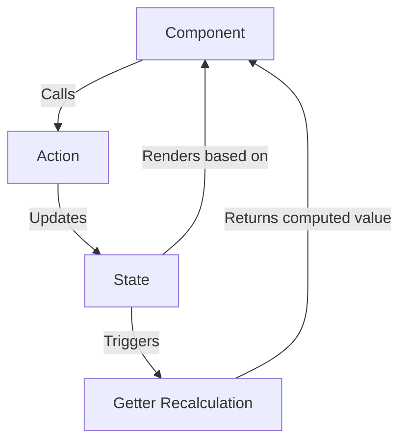

# Vue.js Pinia Store

## Introduction

State management is one of the crucial aspects of building scalable applications in Vue.js. As your application grows, handling shared state across components becomes challenging. This is where Pinia comes in.

Pinia is the officially recommended state management library for Vue.js applications. It was designed as the successor to Vuex and provides a more intuitive and type-safe API while maintaining similar concepts. Pinia works with both Vue 2 and Vue 3, making it a versatile choice for all Vue projects.

In this guide, we'll explore how Pinia works, how to set it up, and how to use it effectively in your Vue applications.

## What is Pinia?

Pinia is a state management store library for Vue that allows you to share state across components and pages. It offers several advantages over previous solutions like Vuex:

- **Devtools support**: Time-travel debugging, store inspection
- **TypeScript support**: Great type inference out of the box
- **Modular by design**: Build multiple stores and let bundlers automatically code-split them
- **Extremely lightweight**: ~1kb minified and zipped
- **Intuitive API**: Similar to Vue's Composition API
- **No mutations**: Uses simple actions for state changes

## Getting Started with Pinia

### Installation

Let's start by installing Pinia in your Vue.js project:

```bash
# Using npm
npm install pinia

# Using yarn
yarn add pinia
```

### Setting up Pinia in your Vue app

To use Pinia in your application, you need to create a Pinia instance and install it as a plugin in your Vue app.

For Vue 3:

```js
// main.js
import { createApp } from 'vue'
import { createPinia } from 'pinia'
import App from './App.vue'

const app = createApp(App)
const pinia = createPinia()

app.use(pinia)
app.mount('#app')
```

For Vue 2 (with Vue 2 plugin):

```js
// main.js
import Vue from 'vue'
import { createPinia, PiniaVuePlugin } from 'pinia'
import App from './App.vue'

Vue.use(PiniaVuePlugin)
const pinia = createPinia()

new Vue({
  pinia,
  render: h => h(App)
}).$mount('#app')
```

## Creating Your First Pinia Store

Pinia stores are defined using the `defineStore()` function. Each store has a unique id which is used to connect to the devtools and for references.

### Basic Store Structure

```js
// stores/counter.js
import { defineStore } from 'pinia'

export const useCounterStore = defineStore('counter', {
  // State (like data in Vue components)
  state: () => ({
    count: 0,
    name: 'Counter'
  }),
  
  // Getters (like computed properties)
  getters: {
    doubleCount: (state) => state.count * 2,
    // You can also access other getters
    doubleCountPlusOne() {
      return this.doubleCount + 1
    }
  },
  
  // Actions (like methods)
  actions: {
    increment() {
      this.count++
    },
    async fetchAndAdd() {
      // You can perform async operations in actions
      const result = await api.getRandomNumber()
      this.count += result
    }
  }
})
```

### Using the Setup Syntax (Composition API Style)

Pinia also offers a more concise way to define stores using the Composition API style:

```js
// stores/counter.js
import { defineStore } from 'pinia'
import { ref, computed } from 'vue'

export const useCounterStore = defineStore('counter', () => {
  // State properties as refs
  const count = ref(0)
  const name = ref('Counter')
  
  // Getters as computed
  const doubleCount = computed(() => count.value * 2)
  
  // Actions as functions
  function increment() {
    count.value++
  }
  
  async function fetchAndAdd() {
    const result = await api.getRandomNumber()
    count.value += result
  }
  
  // Return everything that should be exposed
  return { count, name, doubleCount, increment, fetchAndAdd }
})
```

## Using Pinia in Components

Once you've created a store, you can use it in any component:

```html
<template>
  <div>
    <p>Count: {{ counterStore.count }}</p>
    <p>Double count: {{ counterStore.doubleCount }}</p>
    <button @click="counterStore.increment()">Increment</button>
  </div>
</template>

<script setup>
import { useCounterStore } from '../stores/counter'

// Access the store in the component
const counterStore = useCounterStore()
</script>
```

### Accessing and Modifying State

There are several ways to access and modify state in a Pinia store:

#### Direct Access

You can directly access and modify state properties:

```js
const store = useCounterStore()

// Access state
console.log(store.count) // 0

// Modify state (only do this in actions for better maintainability)
store.count++
```

#### Using Actions

The recommended way to modify state is through actions:

```js
// In a component
const store = useCounterStore()
store.increment()
```

#### Using $patch for Multiple Changes

When you need to update multiple state properties at once, use `$patch`:

```js
store.$patch({
  count: store.count + 1,
  name: 'New Name'
})
```

Or use a function for more complex updates:

```js
store.$patch((state) => {
  state.count++
  state.name = 'New Name'
})
```

## Advanced Pinia Features

### Accessing Other Stores

Stores can interact with each other. Inside one store, you can import and use another store:

```js
import { defineStore } from 'pinia'
import { useUserStore } from './user'

export const useCartStore = defineStore('cart', {
  state: () => ({
    items: []
  }),
  actions: {
    checkout() {
      const userStore = useUserStore()
      
      if (userStore.isLoggedIn) {
        // process checkout
      } else {
        userStore.redirectToLogin()
      }
    }
  }
})
```

### Plugins

Pinia supports plugins to extend its functionality:

```js
import { createPinia } from 'pinia'

// Create a plugin that adds a property to all stores
function myPiniaPlugin({ pinia, app, store, options }) {
  store.router = router // inject router to all stores
  
  // Add a property to every store
  store.$onAction(() => {
    console.log(`Action performed in ${store.$id}`)
  })
}

const pinia = createPinia()
pinia.use(myPiniaPlugin)
```

### Persisting State

A common use case is persisting state to localStorage. Here's how to implement it using a plugin:

```js
// piniaPlugins.js
export function persistStatePlugin({ store }) {
  // Load saved state from localStorage when store is initialized
  const savedState = localStorage.getItem(`pinia-${store.$id}`)
  
  if (savedState) {
    store.$patch(JSON.parse(savedState))
  }
  
  // Save state to localStorage whenever it changes
  store.$subscribe((mutation, state) => {
    localStorage.setItem(`pinia-${store.$id}`, JSON.stringify(state))
  })
}
```

Then use it:

```js
// main.js
import { createPinia } from 'pinia'
import { persistStatePlugin } from './piniaPlugins'

const pinia = createPinia()
pinia.use(persistStatePlugin)
```

## Practical Example: Todo Application

Let's build a simple todo application to demonstrate Pinia in a real-world scenario.

### Create the Todo Store

```js
// stores/todo.js
import { defineStore } from 'pinia'

export const useTodoStore = defineStore('todo', {
  state: () => ({
    todos: [],
    filter: 'all' // all, completed, active
  }),
  
  getters: {
    filteredTodos() {
      if (this.filter === 'completed') {
        return this.todos.filter(todo => todo.completed)
      }
      if (this.filter === 'active') {
        return this.todos.filter(todo => !todo.completed)
      }
      return this.todos
    },
    
    completedCount() {
      return this.todos.filter(todo => todo.completed).length
    },
    
    totalCount() {
      return this.todos.length
    }
  },
  
  actions: {
    addTodo(text) {
      if (!text.trim()) return
      
      this.todos.push({
        id: Date.now(),
        text,
        completed: false
      })
    },
    
    removeTodo(id) {
      const index = this.todos.findIndex(todo => todo.id === id)
      if (index !== -1) {
        this.todos.splice(index, 1)
      }
    },
    
    toggleTodo(id) {
      const todo = this.todos.find(todo => todo.id === id)
      if (todo) {
        todo.completed = !todo.completed
      }
    },
    
    setFilter(filter) {
      this.filter = filter
    },
    
    clearCompleted() {
      this.todos = this.todos.filter(todo => !todo.completed)
    }
  }
})
```

### Todo App Component

```html
<template>
  <div class="todo-app">
    <h1>Todo App with Pinia</h1>
    
    <div class="add-todo">
      <input 
        v-model="newTodo" 
        @keyup.enter="addTodo"
        placeholder="What needs to be done?"
      />
      <button @click="addTodo">Add</button>
    </div>
    
    <div class="filters">
      <button 
        :class="{ active: todoStore.filter === 'all' }"
        @click="todoStore.setFilter('all')"
      >
        All ({{ todoStore.totalCount }})
      </button>
      <button 
        :class="{ active: todoStore.filter === 'active' }"
        @click="todoStore.setFilter('active')"
      >
        Active ({{ todoStore.totalCount - todoStore.completedCount }})
      </button>
      <button 
        :class="{ active: todoStore.filter === 'completed' }"
        @click="todoStore.setFilter('completed')"
      >
        Completed ({{ todoStore.completedCount }})
      </button>
    </div>
    
    <ul class="todo-list">
      <li v-for="todo in todoStore.filteredTodos" :key="todo.id">
        <input 
          type="checkbox"
          :checked="todo.completed"
          @change="todoStore.toggleTodo(todo.id)"
        />
        <span :class="{ completed: todo.completed }">{{ todo.text }}</span>
        <button @click="todoStore.removeTodo(todo.id)">Delete</button>
      </li>
    </ul>
    
    <div v-if="todoStore.completedCount > 0" class="clear-completed">
      <button @click="todoStore.clearCompleted">
        Clear completed ({{ todoStore.completedCount }})
      </button>
    </div>
  </div>
</template>

<script setup>
import { ref } from 'vue'
import { useTodoStore } from '../stores/todo'

const todoStore = useTodoStore()
const newTodo = ref('')

function addTodo() {
  todoStore.addTodo(newTodo.value)
  newTodo.value = ''
}
</script>

<style scoped>
.todo-app {
  max-width: 500px;
  margin: 0 auto;
  padding: 20px;
}

.completed {
  text-decoration: line-through;
  color: #999;
}

.filters button.active {
  font-weight: bold;
}

/* Additional styling omitted for brevity */
</style>
```

## Debugging with Vue DevTools

One of the great features of Pinia is its integration with Vue DevTools. When using Pinia with Vue DevTools, you can:

1. Inspect the state of each store
2. Track actions and state changes
3. Use time-travel debugging to go back to previous states
4. Manually edit state for testing purposes

When you open Vue DevTools with a Pinia application, you'll see a "Pinia" tab where you can access all these features.

## Understanding State Flow in Pinia

Here's a visualization of how state flows in a Pinia application:



## Best Practices

1. **Use actions for state changes**: While you can modify state directly, using actions makes your code more maintainable and easier to debug.

2. **Structure your stores by domain**: Create separate stores for different parts of your application (e.g., user, products, cart).

3. **Minimize store dependencies**: Try to keep stores independent to avoid circular dependencies.

4. **Use getters for derived state**: Instead of computing values in components, use getters in your stores.

5. **Subscribe to changes when needed**: Use `$subscribe` to react to state changes.

6. **Use TypeScript for better type safety**: Pinia works great with TypeScript out of the box.

7. **Keep UI logic in components**: Stores should focus on state management, not UI logic.

## Common Gotchas and Solutions

### Store not updating the UI

If your store updates but the UI doesn't reflect the changes, check if you're mutating objects or arrays directly. Vue's reactivity system might not detect these changes. Use Vue's reactive methods instead:

```js
// Instead of this
this.todos[0].completed = true

// Do this
this.todos = this.todos.map((todo, index) => {
  if (index === 0) {
    return { ...todo, completed: true }
  }
  return todo
})

// Or use $patch
this.$patch({
  todos: this.todos.map((todo, index) => {
    if (index === 0) {
      return { ...todo, completed: true }
    }
    return todo
  })
})
```

### Destructuring loses reactivity

Don't destructure the store properties directly, as they will lose reactivity:

```js
// Don't do this
const { count } = useCounterStore() // loses reactivity!

// Do this instead
const store = useCounterStore()
// Use store.count in your template

// Or use storeToRefs if you need to destructure
import { storeToRefs } from 'pinia'
const store = useCounterStore()
const { count } = storeToRefs(store) // keeps reactivity
```

## Summary

Pinia is a powerful state management solution for Vue.js applications that offers:

- Simple and intuitive API
- TypeScript support
- Great developer experience with Vue DevTools
- Excellent performance with automatic code splitting
- Composable and modular design

By centralizing your application state in Pinia stores, you can build more maintainable, scalable, and testable Vue applications. The combination of state, getters, and actions provides a clean structure for managing data flow throughout your application.

## Additional Resources and Exercises

### Resources

- [Official Pinia Documentation](https://pinia.vuejs.org/)
- [Vue.js Official Guide on State Management](https://vuejs.org/guide/scaling-up/state-management.html)

### Exercises

1. **Basic Counter**: Create a counter store with increment, decrement, and reset actions.

2. **Shopping Cart**: Implement a shopping cart store with products, adding/removing items, and calculating totals.

3. **Authentication System**: Build a user authentication store that handles login, logout, and user profile data.

4. **Multi-Store Interaction**: Create two stores that interact with each other (e.g., a user store and a preferences store).

5. **Persistent Store**: Implement a Pinia plugin that persists specific stores to localStorage and restores them when the app loads.

By mastering Pinia, you'll have a powerful tool in your Vue.js development toolkit that will help you manage application state effectively as your projects grow in complexity.