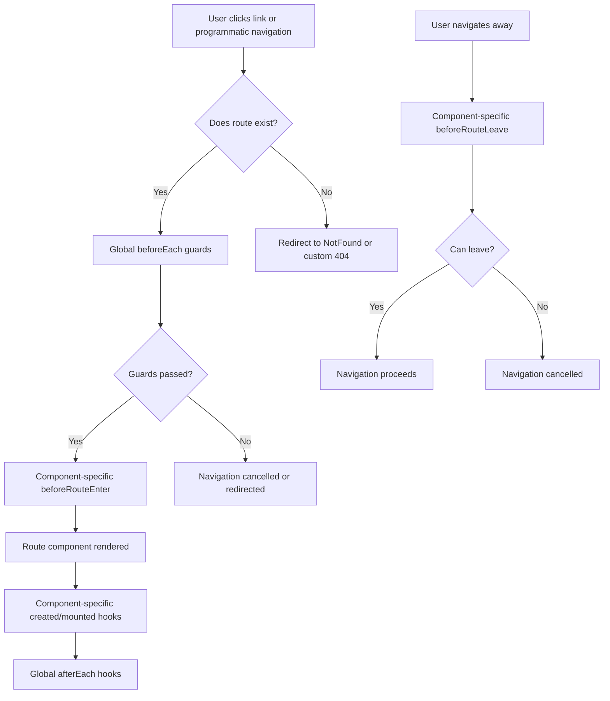

# Vue.js Router Introduction

## What is Vue Router?

Vue Router is the official routing library for Vue.js applications. It allows you to create Single-Page Applications (SPAs) by mapping components to different routes, enabling navigation between pages without reloading the entire application. This results in a smoother, faster user experience that feels more like a native application.

## Why Do We Need a Router?

Traditional websites load a new HTML page from the server whenever a user navigates to a new URL. In contrast, Single-Page Applications load a single HTML page and dynamically update the content as users navigate through the application.

A router helps manage this dynamic content swapping by:

1. Matching URLs to components
2. Handling navigation
3. Managing application state during navigation
4. Providing features like route parameters and nested routes

## Setting up Vue Router

### Installation

For a new Vue.js project using Vue CLI, you can select the router option during project creation. For an existing project, install Vue Router with npm or yarn:

```bash
# Using npm
npm install vue-router

# Using yarn
yarn add vue-router
```

### Basic Configuration

To set up Vue Router in your Vue.js application, you need to:

1. Create a router instance
2. Define routes
3. Link the router to your Vue application

Here's a basic example:

```js
// src/router/index.js
import { createRouter, createWebHistory } from 'vue-router'
import Home from '../views/Home.vue'
import About from '../views/About.vue'

const routes = [
  {
    path: '/',
    name: 'Home',
    component: Home
  },
  {
    path: '/about',
    name: 'About',
    component: About
  }
]

const router = createRouter({
  history: createWebHistory(),
  routes
})

export default router
```

Then, in your main.js file:

```js
// src/main.js
import { createApp } from 'vue'
import App from './App.vue'
import router from './router'

const app = createApp(App)
app.use(router)
app.mount('#app')
```

## Using Vue Router in Templates

Once your router is set up, you can use the router-specific components in your templates.

### The `<router-view>` Component

The `<router-view>` component is a placeholder where the component matching the current route will be rendered:

```html
<template>
  <div id="app">
    <header>
      <!-- Navigation links -->
    </header>
    
    <!-- The component matching the current route will be rendered here -->
    <router-view></router-view>
    
    <footer>
      <!-- Footer content -->
    </footer>
  </div>
</template>
```

### The `<router-link>` Component

The `<router-link>` component is used for navigation in your application. It renders as an `<a>` tag but prevents the browser from reloading the page:

```html
<template>
  <div id="app">
    <nav>
      <router-link to="/">Home</router-link> |
      <router-link to="/about">About</router-link>
    </nav>
    <router-view></router-view>
  </div>
</template>
```

## Understanding Route Objects

Each route object in the `routes` array can have several properties:

```js
{
  path: '/user/:id',       // URL pattern
  name: 'User',            // Named route for programmatic navigation
  component: User,         // Component to render
  props: true,             // Pass route params as props to the component
  meta: { requiresAuth: true }  // Custom metadata
}
```

## Dynamic Routes

You can create dynamic routes using path parameters:

```js
const routes = [
  {
    path: '/user/:id',
    name: 'User',
    component: User,
    props: true
  }
]
```

In the User component, you can access the `id` parameter:

```html
<template>
  <div>
    <h2>User Profile</h2>
    <p>User ID: {{ id }}</p>
  </div>
</template>

<script>
export default {
  props: ['id'], // When props:true is used in the route, params become props
  
  // Alternative approach using $route
  computed: {
    userId() {
      return this.$route.params.id
    }
  }
}
</script>
```

## Programmatic Navigation

Besides using `<router-link>`, you can navigate programmatically using the router instance:

```js
// Navigate to a specific path
this.$router.push('/about')

// Navigate using route name and params
this.$router.push({ name: 'User', params: { id: '123' } })

// Navigate with query parameters
this.$router.push({ path: '/search', query: { q: 'vue router' } })

// Go back in history
this.$router.back()

// Go forward in history
this.$router.forward()
```

## Nested Routes

Vue Router supports nested routes, which are especially useful for complex layouts:

```js
const routes = [
  {
    path: '/user/:id',
    name: 'User',
    component: User,
    children: [
      {
        path: 'profile',
        name: 'UserProfile',
        component: UserProfile
      },
      {
        path: 'posts',
        name: 'UserPosts',
        component: UserPosts
      }
    ]
  }
]
```

In the User component, you need to include another `<router-view>` to render nested routes:

```html
<template>
  <div>
    <h2>User {{ id }}</h2>
    <nav>
      <router-link :to="`/user/${id}/profile`">Profile</router-link> |
      <router-link :to="`/user/${id}/posts`">Posts</router-link>
    </nav>
    <router-view></router-view>
  </div>
</template>
```

## Route Guards

Vue Router provides navigation guards to control navigation. These guards can be global, per-route, or in-component:

### Global Guards

```js
// Global before guard
router.beforeEach((to, from, next) => {
  // Check if route requires authentication
  if (to.meta.requiresAuth && !isAuthenticated) {
    next('/login')
  } else {
    next() // Allow navigation
  }
})

// Global after guard
router.afterEach((to, from) => {
  document.title = to.meta.title || 'My Vue App'
})
```

### Route-Specific Guards

```js
const routes = [
  {
    path: '/admin',
    component: Admin,
    beforeEnter: (to, from, next) => {
      if (isAdmin) {
        next()
      } else {
        next('/unauthorized')
      }
    }
  }
]
```

### In-Component Guards

```js
export default {
  name: 'User',
  beforeRouteEnter(to, from, next) {
    // Called before the component is created
    // "this" is not available here
    fetchUser(to.params.id, (user) => {
      next(vm => {
        vm.userData = user
      })
    })
  },
  beforeRouteUpdate(to, from, next) {
    // Called when route changes but component is reused
    // "this" is available
    this.userData = null
    fetchUser(to.params.id, (user) => {
      this.userData = user
      next()
    })
  },
  beforeRouteLeave(to, from, next) {
    // Called when navigating away from this component
    // "this" is available
    if (this.hasUnsavedChanges) {
      if (!confirm('You have unsaved changes. Are you sure you want to leave?')) {
        return next(false)
      }
    }
    next()
  }
}
```

## Real-World Example: Building a Blog

Let's create a simple blog application with Vue Router:

```js
// src/router/index.js
import { createRouter, createWebHistory } from 'vue-router'
import Home from '../views/Home.vue'
import BlogList from '../views/BlogList.vue'
import BlogPost from '../views/BlogPost.vue'
import NotFound from '../views/NotFound.vue'

const routes = [
  {
    path: '/',
    name: 'Home',
    component: Home
  },
  {
    path: '/blog',
    name: 'BlogList',
    component: BlogList
  },
  {
    path: '/blog/:id',
    name: 'BlogPost',
    component: BlogPost,
    props: true
  },
  {
    path: '/:pathMatch(.*)*',
    name: 'NotFound',
    component: NotFound
  }
]

const router = createRouter({
  history: createWebHistory(),
  routes
})

export default router
```

Our BlogList component:

```html
<!-- src/views/BlogList.vue -->
<template>
  <div>
    <h1>Blog Posts</h1>
    <div v-if="loading">Loading...</div>
    <div v-else>
      <article v-for="post in posts" :key="post.id">
        <h2>
          <router-link :to="`/blog/${post.id}`">{{ post.title }}</router-link>
        </h2>
        <p>{{ post.excerpt }}</p>
      </article>
    </div>
  </div>
</template>

<script>
export default {
  name: 'BlogList',
  data() {
    return {
      loading: true,
      posts: []
    }
  },
  created() {
    // Simulating API call
    setTimeout(() => {
      this.posts = [
        { id: 1, title: 'Getting Started with Vue Router', excerpt: 'Learn the basics of Vue Router...' },
        { id: 2, title: 'Vue.js Components', excerpt: 'Understanding Vue components...' },
        { id: 3, title: 'State Management with Vuex', excerpt: 'Managing application state...' }
      ]
      this.loading = false
    }, 1000)
  }
}
</script>
```

Our BlogPost component:

```html
<!-- src/views/BlogPost.vue -->
<template>
  <div>
    <div v-if="loading">Loading post...</div>
    <div v-else-if="error">{{ error }}</div>
    <article v-else>
      <h1>{{ post.title }}</h1>
      <p class="meta">Posted on {{ post.date }}</p>
      <div class="content">{{ post.content }}</div>
      <router-link to="/blog">&larr; Back to all posts</router-link>
    </article>
  </div>
</template>

<script>
export default {
  name: 'BlogPost',
  props: ['id'],
  data() {
    return {
      loading: true,
      error: null,
      post: null
    }
  },
  created() {
    this.fetchData()
  },
  methods: {
    fetchData() {
      this.loading = true
      this.error = null
      
      // Simulating API call
      setTimeout(() => {
        // In a real app, fetch from an API using this.id
        if (this.id === '1') {
          this.post = {
            id: 1,
            title: 'Getting Started with Vue Router',
            date: 'January 15, 2023',
            content: 'Vue Router is the official router for Vue.js. It deeply integrates with Vue.js core to make building Single Page Applications with Vue.js a breeze...'
          }
          this.loading = false
        } else if (this.id === '2') {
          this.post = {
            id: 2,
            title: 'Vue.js Components',
            date: 'January 20, 2023',
            content: 'Components are one of the most powerful features of Vue.js...'
          }
          this.loading = false
        } else if (this.id === '3') {
          this.post = {
            id: 3,
            title: 'State Management with Vuex',
            date: 'January 25, 2023',
            content: 'Vuex is a state management pattern + library for Vue.js applications...'
          }
          this.loading = false
        } else {
          this.error = 'Post not found!'
          this.loading = false
        }
      }, 1000)
    }
  },
  // Re-fetch data when params change
  beforeRouteUpdate(to, from, next) {
    this.id = to.params.id
    this.fetchData()
    next()
  }
}
</script>
```

## Navigation Flow with Vue Router

To better understand how Vue Router handles navigation, here's a diagram showing the flow:



## Summary

Vue Router is a powerful and flexible routing solution for Vue.js applications. In this introduction, we've covered:

- Setting up Vue Router in a Vue.js application
- Creating and configuring routes
- Using `<router-view>` to render components
- Creating navigation links with `<router-link>`
- Working with dynamic routes and parameters
- Implementing programmatic navigation
- Creating nested routes for complex UIs
- Using navigation guards to control access
- Building a simple blog application with Vue Router

Vue Router offers much more than what we've covered here, including lazy-loading routes, scroll behavior customization, and transition effects. As you build more complex Vue applications, Vue Router will be an essential tool for creating intuitive user experiences.

## Additional Resources

- [Vue Router Official Documentation](https://router.vuejs.org/)
- [Vue.js Official Guide - Routing](https://vuejs.org/guide/scaling-up/routing.html)
- [Vue Router Examples](https://github.com/vuejs/vue-router/tree/dev/examples)

## Practice Exercises

1. **Basic Navigation**: Create a simple Vue application with three routes: Home, About, and Contact.

2. **Dynamic Routes**: Extend the application by adding a Products section with dynamic routes for individual products.

3. **Route Guards**: Add authentication to your application. Create a login page and protect certain routes so only authenticated users can access them.

4. **Nested Routes**: Create a user dashboard with nested routes for profile, settings, and activity.

5. **404 Page**: Add a catch-all route to handle 404 errors when users navigate to non-existent routes.