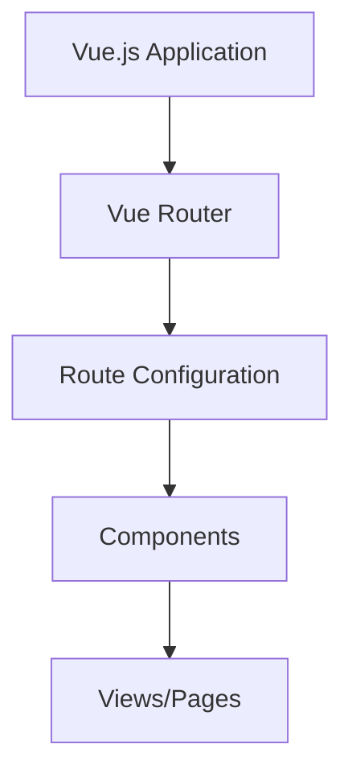

# Vue.js Router Installation

## Introduction

Navigation is a fundamental aspect of any web application. In traditional websites, moving between pages requires full-page reloads, which can lead to slower user experiences. Vue Router solves this problem by enabling navigation between views in your Vue.js applications without page refreshes, creating a smooth single-page application (SPA) experience.

In this tutorial, we'll learn how to install Vue Router and set it up in a Vue.js application. Vue Router is the official routing library for Vue.js and integrates deeply with its core to make building SPAs with Vue.js a breeze.

## What is Vue Router?

Vue Router is a navigation library that lets you map components to different URL paths, allowing users to navigate your application with:

- Nested route/view mapping
- Modular, component-based router configuration
- Route params, query, wildcards
- View transition effects powered by Vue.js' transition system
- Fine-grained navigation control
- Links with automatic active CSS classes
- HTML5 history mode or hash mode

Before we dive into the installation process, let's understand where Vue Router fits in the application architecture:



## Installation Methods

There are several ways to install Vue Router. Let's explore each option:

### Method 1: Using Vue CLI (Recommended for New Projects)

The easiest way to add Vue Router to a new project is to use Vue CLI, which offers an interactive project setup.

```bash
# Install Vue CLI if you haven't already
npm install -g @vue/cli

# Create a new project
vue create my-router-app

# Navigate into your project directory
cd my-router-app

# Add Vue Router using the Vue CLI plugin
vue add router
```

During this process, Vue CLI will ask if you want to use history mode (which we'll explain shortly) and will set up the project structure for you.

**Output:** After installation, Vue CLI will:
1. Add Vue Router as a dependency in your `package.json`
2. Create a `router` folder with configuration
3. Update your `main.js` file to use the router
4. Create example view components

### Method 2: Manual Installation (For Existing Projects)

If you're adding Vue Router to an existing project, you can install it via npm or yarn.

```bash
# Using npm
npm install vue-router@4

# Using yarn
yarn add vue-router@4
```

> **Note:** Vue Router 4 is for Vue.js 3, while Vue Router 3 is for Vue.js 2. Make sure to install the version compatible with your Vue.js version.

## Basic Setup

After installing Vue Router, you need to set it up in your application. Let's walk through the process:

### Creating the Router Instance

First, create a router configuration file (typically in `src/router/index.js`):

```js
// src/router/index.js
import { createRouter, createWebHistory } from 'vue-router'
import HomeView from '../views/HomeView.vue'
import AboutView from '../views/AboutView.vue'

const routes = [
  {
    path: '/',
    name: 'home',
    component: HomeView
  },
  {
    path: '/about',
    name: 'about',
    component: AboutView
  }
]

const router = createRouter({
  history: createWebHistory(process.env.BASE_URL),
  routes
})

export default router
```

### Integrating the Router with Vue App

Next, you need to connect the router to your Vue application instance in the main file (typically `src/main.js`):

```js
// src/main.js
import { createApp } from 'vue'
import App from './App.vue'
import router from './router'

const app = createApp(App)
app.use(router)
app.mount('#app')
```

### Adding Router View and Links

In your main `App.vue` component, you need to add two key elements:
1. `<router-view>`: A component that displays the matched component for the current route
2. `<router-link>`: A component for navigation without full page reloads

```html
<!-- App.vue -->
<template>
  <div id="app">
    <nav>
      <router-link to="/">Home</router-link> |
      <router-link to="/about">About</router-link>
    </nav>
    <router-view/>
  </div>
</template>

<style>
nav {
  padding: 30px;
}

nav a {
  font-weight: bold;
  color: #2c3e50;
}

nav a.router-link-exact-active {
  color: #42b983;
}
</style>
```

## Router Modes

Vue Router supports two navigation modes:

### Hash Mode (Default in Vue 2)

In hash mode, the URL includes a hash character (`#`) which prevents the page from being reloaded when the URL changes:

```
https://example.com/#/about
```

To explicitly use hash mode:

```js
const router = createRouter({
  history: createWebHashHistory(),
  routes
})
```

### HTML5 History Mode (Default in Vue 3)

History mode uses the HTML5 History API to achieve URL navigation without a page reload:

```
https://example.com/about
```

This mode requires server configuration to properly handle URLs. For example, with Node.js/Express:

```js
const express = require('express')
const history = require('connect-history-api-fallback')
const app = express()

app.use(history())
app.use(express.static('dist'))
app.listen(3000)
```

## Real-World Example: Multi-Page Application

Let's build a simple blog with multiple pages to see Vue Router in action:

1. First, set up our router configuration:

```js
// src/router/index.js
import { createRouter, createWebHistory } from 'vue-router'
import Home from '../views/Home.vue'
import BlogList from '../views/BlogList.vue'
import BlogPost from '../views/BlogPost.vue'
import NotFound from '../views/NotFound.vue'

const routes = [
  {
    path: '/',
    name: 'home',
    component: Home
  },
  {
    path: '/blog',
    name: 'blog',
    component: BlogList
  },
  {
    path: '/blog/:id',
    name: 'blog-post',
    component: BlogPost,
    props: true // Pass route.params to the component as props
  },
  {
    // 404 page
    path: '/:pathMatch(.*)*',
    name: 'not-found',
    component: NotFound
  }
]

const router = createRouter({
  history: createWebHistory(),
  routes
})

export default router
```

2. Create a blog list view:

```html
<!-- src/views/BlogList.vue -->
<template>
  <div class="blog-list">
    <h1>Blog Posts</h1>
    <ul>
      <li v-for="post in posts" :key="post.id">
        <router-link :to="{ name: 'blog-post', params: { id: post.id } }">
          {{ post.title }}
        </router-link>
      </li>
    </ul>
  </div>
</template>

<script>
export default {
  data() {
    return {
      posts: [
        { id: 1, title: 'Getting Started with Vue 3' },
        { id: 2, title: 'Vue Router Fundamentals' },
        { id: 3, title: 'State Management with Pinia' }
      ]
    }
  }
}
</script>
```

3. Create a blog post detail view:

```html
<!-- src/views/BlogPost.vue -->
<template>
  <div v-if="post" class="blog-post">
    <h1>{{ post.title }}</h1>
    <p>{{ post.content }}</p>
    <router-link to="/blog">Back to Blog List</router-link>
  </div>
  <div v-else>
    <h1>Post not found</h1>
    <router-link to="/blog">Back to Blog List</router-link>
  </div>
</template>

<script>
export default {
  props: ['id'],
  data() {
    return {
      posts: [
        { 
          id: 1, 
          title: 'Getting Started with Vue 3',
          content: 'Vue 3 is the latest version of the popular JavaScript framework...'
        },
        { 
          id: 2, 
          title: 'Vue Router Fundamentals',
          content: 'Routing is essential for creating single-page applications...'
        },
        { 
          id: 3, 
          title: 'State Management with Pinia',
          content: 'Pinia is the new recommended state management library for Vue...'
        }
      ]
    }
  },
  computed: {
    post() {
      return this.posts.find(post => post.id === parseInt(this.id))
    }
  }
}
</script>
```

This example demonstrates:
- Dynamic routes with parameters (`/blog/:id`)
- Using props for better component decoupling
- Navigation between routes using `<router-link>`
- 404 handling with wildcard routes

## Troubleshooting Common Installation Issues

### "Vue Router is not a constructor"

This error typically occurs when mixing Vue 2 with Vue Router 4 or Vue 3 with Vue Router 3. Ensure you're using compatible versions:
- Vue 2.x → Vue Router 3.x
- Vue 3.x → Vue Router 4.x

### Navigation Guards Not Working

If navigation guards aren't working, ensure they are placed in the correct location in your router configuration:

```js
const router = createRouter({
  // ...options
})

// Add navigation guards AFTER creating the router
router.beforeEach((to, from, next) => {
  // Your guard logic
  next()
})

export default router
```

### History Mode 404 Errors

If you're getting 404 errors with history mode, it's likely a server configuration issue. You need to configure your server to redirect all requests to `index.html`.

## Summary

In this tutorial, we've learned:

1. What Vue Router is and why it's essential for SPAs
2. How to install Vue Router using Vue CLI or manually
3. How to set up basic routing with a router configuration file
4. The difference between hash mode and history mode
5. How to create dynamic routes with parameters
6. A real-world example of a blog application with multiple pages

Vue Router is a powerful library that enhances your Vue.js applications by providing seamless navigation. With the foundation you've built in this tutorial, you're now ready to create more complex routing scenarios in your Vue applications.

## Further Learning

To continue building your Vue Router skills, try these exercises:

1. **Exercise:** Create a dashboard layout with nested routes.
2. **Exercise:** Implement route guards to create a protected admin area that requires authentication.
3. **Exercise:** Add route transitions to make page changes more visually appealing.

## Additional Resources

- [Official Vue Router Documentation](https://router.vuejs.org/)
- [Vue Router GitHub Repository](https://github.com/vuejs/router)
- [Vue Router Examples](https://github.com/vuejs/vue-router/tree/dev/examples)

Happy routing!