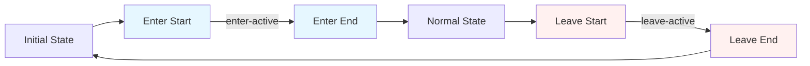

# Vue.js Route Transitions

## Introduction

When building single-page applications (SPAs) with Vue.js and Vue Router, one way to enhance the user experience is by adding smooth transitions between routes. Vue.js makes this easy with its built-in `<transition>` component, which can be combined with Vue Router to create fluid page transitions.

In this lesson, you'll learn how to:

- Apply basic transitions between route changes
- Create different transitions for different routes
- Use JavaScript hooks for more complex animations
- Implement practical transition patterns used in real applications

## Prerequisites

Before diving into route transitions, make sure you have:

- Basic understanding of Vue.js
- Vue Router installed in your project
- Familiarity with CSS transitions and animations

## Basic Route Transitions

### Setting Up a Basic Transition

To add a transition between routes, you need to wrap your `<router-view>` component with a `<transition>` component. Here's a simple example:

```jsx
<template>
  <div id="app">
    <nav>
      <router-link to="/">Home</router-link> |
      <router-link to="/about">About</router-link>
    </nav>
    <transition name="fade">
      <router-view />
    </transition>
  </div>
</template>

<style>
.fade-enter-active, .fade-leave-active {
  transition: opacity 0.5s;
}
.fade-enter, .fade-leave-to {
  opacity: 0;
}
</style>
```

In this example:

1. We wrap `<router-view>` with the `<transition>` component
2. We give it a name ("fade"), which Vue uses to generate transition class names
3. We define CSS rules for those transition classes

When you navigate between routes, the current page will fade out and the new page will fade in.

### How Vue.js Transitions Work

Vue's transition system applies classes to elements during different phases of a transition:

1. `v-enter`/`name-enter`: Applied at the start of the entering phase
2. `v-enter-active`/`name-enter-active`: Applied during the entire entering phase
3. `v-enter-to`/`name-enter-to`: Applied at the end of entering phase
4. `v-leave`/`name-leave`: Applied at the start of the leaving phase
5. `v-leave-active`/`name-leave-active`: Applied during the entire leaving phase
6. `v-leave-to`/`name-leave-to`: Applied at the end of leaving phase



## Advanced Route Transitions

### Different Transitions for Different Routes

You might want to apply different transitions based on the route being navigated to or from. You can achieve this by using dynamic transition names:

```jsx
<template>
  <div id="app">
    <nav>
      <router-link to="/">Home</router-link> |
      <router-link to="/about">About</router-link> |
      <router-link to="/contact">Contact</router-link>
    </nav>
    <transition :name="transitionName">
      <router-view />
    </transition>
  </div>
</template>

<script>
export default {
  data() {
    return {
      transitionName: 'fade'
    };
  },
  watch: {
    '$route'(to, from) {
      const toDepth = to.path.split('/').length;
      const fromDepth = from.path.split('/').length;
      this.transitionName = toDepth < fromDepth ? 'slide-right' : 'slide-left';
    }
  }
};
</script>

<style>
.fade-enter-active, .fade-leave-active {
  transition: opacity 0.5s;
}
.fade-enter, .fade-leave-to {
  opacity: 0;
}

.slide-left-enter-active,
.slide-left-leave-active,
.slide-right-enter-active,
.slide-right-leave-active {
  transition: transform 0.5s;
}

.slide-left-enter, .slide-right-leave-to {
  transform: translateX(100%);
}

.slide-left-leave-to, .slide-right-enter {
  transform: translateX(-100%);
}
</style>
```

In this example:
- We use a data property `transitionName` to dynamically set the transition
- We watch route changes and determine which transition to use based on path depth
- If navigating deeper into the route hierarchy, we slide left, otherwise right

### Using JavaScript Hooks for Complex Animations

For more complex animations, Vue's transition component provides JavaScript hooks:

```jsx
<template>
  <div id="app">
    <nav>
      <router-link to="/">Home</router-link> |
      <router-link to="/about">About</router-link>
    </nav>
    <transition
      @before-enter="beforeEnter"
      @enter="enter"
      @after-enter="afterEnter"
      @enter-cancelled="enterCancelled"
      @before-leave="beforeLeave"
      @leave="leave"
      @after-leave="afterLeave"
      @leave-cancelled="leaveCancelled"
    >
      <router-view />
    </transition>
  </div>
</template>

<script>
export default {
  methods: {
    beforeEnter(el) {
      console.log('Before enter');
      el.style.opacity = 0;
      el.style.transform = 'translateY(20px)';
    },
    enter(el, done) {
      console.log('Enter');
      setTimeout(() => {
        el.style.transition = 'all 0.3s ease';
        el.style.opacity = 1;
        el.style.transform = 'translateY(0)';
        done();
      }, 100);
    },
    afterEnter(el) {
      console.log('After enter');
    },
    enterCancelled(el) {
      // Handle cancelled enter
    },
    beforeLeave(el) {
      console.log('Before leave');
      el.style.opacity = 1;
    },
    leave(el, done) {
      console.log('Leave');
      el.style.transition = 'all 0.3s ease';
      el.style.opacity = 0;
      el.style.transform = 'translateY(-20px)';
      setTimeout(() => done(), 300);
    },
    afterLeave(el) {
      console.log('After leave');
    },
    leaveCancelled(el) {
      // Handle cancelled leave
    }
  }
};
</script>
```

These hooks provide complete control over the transition process and can be used with JavaScript animation libraries like GSAP or Anime.js.

## Practical Examples

### Page Transition with Loader

Here's a practical example showing a loading state between route transitions:

```jsx
<template>
  <div id="app">
    <nav>
      <router-link to="/">Home</router-link> |
      <router-link to="/about">About</router-link>
    </nav>
    
    <div class="page-container">
      <transition name="fade" mode="out-in">
        <div v-if="isLoading" key="loading" class="loading">
          Loading...
        </div>
        <router-view v-else key="content" />
      </transition>
    </div>
  </div>
</template>

<script>
export default {
  data() {
    return {
      isLoading: false
    };
  },
  watch: {
    '$route'() {
      this.isLoading = true;
      // Simulate API call or data loading
      setTimeout(() => {
        this.isLoading = false;
      }, 800);
    }
  }
};
</script>

<style>
.fade-enter-active, .fade-leave-active {
  transition: opacity 0.3s;
}
.fade-enter, .fade-leave-to {
  opacity: 0;
}

.loading {
  display: flex;
  justify-content: center;
  align-items: center;
  height: 300px;
  font-size: 24px;
  color: #42b983;
}

.page-container {
  min-height: 300px;
}
</style>
```

Notice we're using the `mode="out-in"` attribute on the transition component. This ensures the current route leaves completely before the new one enters, creating a cleaner transition.

### Shared Element Transitions

One advanced technique is to create the illusion of elements moving from one page to another. This is a simplified example:

```jsx
<template>
  <div id="app">
    <!-- Routes.vue -->
    <router-link to="/">Home</router-link> |
    <router-link to="/detail/1">Detail</router-link>
    
    <transition name="fade" mode="out-in" @before-leave="beforeLeave" @enter="enter">
      <router-view :key="$route.fullPath" />
    </transition>
  </div>
</template>

<script>
export default {
  data() {
    return {
      prevHeight: 0,
      sharedElements: {}
    };
  },
  methods: {
    beforeLeave(el) {
      // Store the previous page height to prevent content jumps
      this.prevHeight = getComputedStyle(el).height;
      
      // Find and record positions of shared elements
      const sharedElements = el.querySelectorAll('[data-shared-element]');
      sharedElements.forEach(element => {
        const id = element.dataset.sharedElement;
        const rect = element.getBoundingClientRect();
        this.sharedElements[id] = {
          top: rect.top,
          left: rect.left,
          width: rect.width,
          height: rect.height
        };
      });
    },
    enter(el) {
      // Set the height to prevent content jumps
      el.style.height = this.prevHeight;
      
      // Find shared elements in the new page and animate them
      const sharedElements = el.querySelectorAll('[data-shared-element]');
      sharedElements.forEach(element => {
        const id = element.dataset.sharedElement;
        if (this.sharedElements[id]) {
          const rect = element.getBoundingClientRect();
          const prevRect = this.sharedElements[id];
          
          // Calculate transformations
          const deltaX = prevRect.left - rect.left;
          const deltaY = prevRect.top - rect.top;
          const scaleX = prevRect.width / rect.width;
          const scaleY = prevRect.height / rect.height;
          
          // Apply animation
          element.style.transform = `translate(${deltaX}px, ${deltaY}px) scale(${scaleX}, ${scaleY})`;
          element.style.transition = 'none';
          
          // Force reflow
          element.offsetHeight;
          
          // Start animation
          element.style.transition = 'all 0.3s ease-out';
          element.style.transform = 'none';
        }
      });
      
      // Reset height after animation
      setTimeout(() => {
        el.style.height = '';
      }, 300);
    }
  }
};
</script>

<style>
.fade-enter-active, .fade-leave-active {
  transition: opacity 0.3s;
}
.fade-enter, .fade-leave-to {
  opacity: 0;
}
</style>
```

Then in your page components, you would mark shared elements:

```jsx
<!-- HomePage.vue -->
<template>
  <div class="home">
    <h1>Home Page</h1>
    <div class="item" data-shared-element="logo">
      
    </div>
  </div>
</template>

<!-- DetailPage.vue -->
<template>
  <div class="detail">
    <h1>Detail Page</h1>
    <div class="detail-logo" data-shared-element="logo">
      
    </div>
    <p>Additional details here...</p>
  </div>
</template>
```

This creates the illusion that the logo is moving from one position to another during page transitions.

## Using Third-Party Animation Libraries

You can enhance your route transitions by integrating third-party animation libraries. Here's an example using GSAP (GreenSock Animation Platform):

```jsx
<template>
  <div id="app">
    <nav>
      <router-link to="/">Home</router-link> |
      <router-link to="/about">About</router-link>
    </nav>
    <transition
      @enter="enterWithGsap"
      @leave="leaveWithGsap"
      :css="false"
    >
      <router-view :key="$route.fullPath" />
    </transition>
  </div>
</template>

<script>
// Import gsap at the top of your script
// import { gsap } from 'gsap'

export default {
  methods: {
    enterWithGsap(el, done) {
      gsap.set(el, {
        opacity: 0,
        x: 100
      });
      
      gsap.to(el, {
        duration: 0.5,
        opacity: 1,
        x: 0,
        ease: 'power2.out',
        onComplete: done
      });
    },
    leaveWithGsap(el, done) {
      gsap.to(el, {
        duration: 0.5,
        opacity: 0,
        x: -100,
        ease: 'power2.in',
        onComplete: done
      });
    }
  }
};
</script>
```

Note that we've set `:css="false"` to tell Vue not to apply any CSS transitions and let GSAP handle all animations.

## Performance Considerations

When implementing route transitions, keep these performance tips in mind:

1. **Animate only transform and opacity properties** when possible, as they're handled by the GPU and perform better than animating other CSS properties.

2. **Keep animations short** (usually under 500ms) to maintain a responsive feel.

3. **Use `will-change` sparingly** to hint the browser about elements that will animate:

```css
.will-animate {
  will-change: transform, opacity;
}
```

4. **Disable transitions on mobile** if they cause performance issues:

```jsx
<script>
export default {
  data() {
    return {
      isMobile: window.innerWidth < 768
    }
  },
  computed: {
    transitionName() {
      return this.isMobile ? '' : 'fade';
    }
  }
}
</script>

<template>
  <transition :name="transitionName">
    <router-view />
  </transition>
</template>
```

## Summary

Route transitions in Vue.js can significantly improve the user experience of your application by providing visual cues during navigation. In this lesson, we covered:

- Basic route transitions using Vue's transition component
- How to apply different transitions based on route direction
- Using JavaScript hooks for more control over animations
- Practical examples including loading states and shared element transitions
- Integration with third-party animation libraries
- Performance considerations

By implementing these techniques, you can create more engaging and polished Vue applications.

## Additional Resources

To deepen your understanding of Vue.js route transitions, consider exploring:

- Vue.js official documentation on [transitions](https://vuejs.org/guide/built-ins/transition.html)
- GSAP (GreenSock Animation Platform) for more advanced animations
- [Vue Router documentation](https://router.vuejs.org/) for more information on routing

## Exercises

1. Create a simple Vue application with three routes and apply a fade transition between them.
2. Modify your application to use different transitions based on navigation direction.
3. Implement a shared element transition where an image in a list view animates to a larger version in a detail view.
4. Add a loading indicator that appears between route changes, especially when your routes might need to fetch data.
5. Experiment with different timing functions and durations to find what feels most natural for your application.