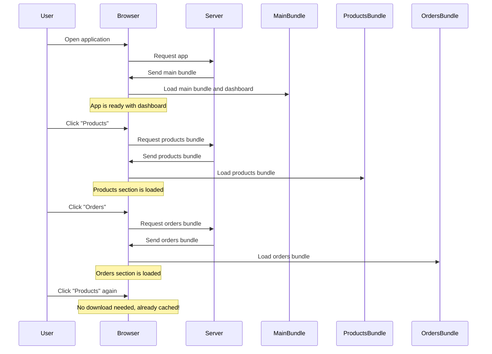

# Vue.js Lazy Loading

## Introduction

As your Vue.js application grows in size and complexity, you might notice that the initial loading time increases, affecting user experience. By default, when you build your Vue application, all your components are bundled into a single file, which the browser must download entirely before your users can start using the application.

This is where **lazy loading** comes in. Lazy loading is a technique that allows you to load parts of your application only when they're needed, which can significantly reduce the initial load time and improve overall performance.

In this tutorial, we'll explore how to implement lazy loading in Vue.js applications, particularly when working with Vue Router.

## What is Lazy Loading?

Lazy loading is a design pattern where we defer the loading of resources (in this case, components) until they're actually needed. In the context of a Vue.js application with routing, this means loading a component only when a user navigates to its route.

The benefits include:

1. Faster initial page load
2. Less bandwidth consumption
3. Better resource management
4. Improved performance on mobile devices

## Basic Lazy Loading with Vue Router

Vue Router makes it easy to implement lazy loading using dynamic imports.

### Standard Importing vs. Lazy Loading

**Standard Import (Eager Loading):**

```javascript
// Everything is loaded at once
import HomeView from '@/views/HomeView.vue'
import AboutView from '@/views/AboutView.vue'
import UserProfile from '@/views/UserProfile.vue'

const routes = [
  { path: '/', component: HomeView },
  { path: '/about', component: AboutView },
  { path: '/user', component: UserProfile }
]
```

**Lazy Loading:**

```javascript
// Components are loaded only when their routes are visited
const routes = [
  { path: '/', component: () => import('@/views/HomeView.vue') },
  { path: '/about', component: () => import('@/views/AboutView.vue') },
  { path: '/user', component: () => import('@/views/UserProfile.vue') }
]
```

In the lazy loading approach, we're using the dynamic `import()` function, which returns a Promise that resolves to the imported module. Vue Router automatically handles these promises and loads the component when needed.

## Step-by-Step Implementation

Let's implement lazy loading in a Vue.js application step-by-step:

### 1. Setting up the router

Create or modify your router configuration file (typically `router/index.js`):

```javascript
import { createRouter, createWebHistory } from 'vue-router'

const routes = [
  {
    path: '/',
    name: 'Home',
    component: () => import('../views/HomeView.vue')
  },
  {
    path: '/about',
    name: 'About',
    // This component will be loaded only when the user navigates to /about
    component: () => import('../views/AboutView.vue')
  },
  {
    path: '/user/:id',
    name: 'User',
    component: () => import('../views/UserView.vue')
  }
]

const router = createRouter({
  history: createWebHistory(),
  routes
})

export default router
```

### 2. Using the router in your main.js file

```javascript
import { createApp } from 'vue'
import App from './App.vue'
import router from './router'

createApp(App)
  .use(router)
  .mount('#app')
```

### 3. Setting up navigation in your App.vue

```html
<template>
  <div id="app">
    <nav>
      <router-link to="/">Home</router-link> |
      <router-link to="/about">About</router-link> |
      <router-link to="/user/1">User</router-link>
    </nav>
    <router-view/>
  </div>
</template>
```

With this setup, each component will be loaded only when its route is visited, reducing the initial bundle size.

## Named Chunk Loading

You can also give names to your chunks to better organize them:

```javascript
const routes = [
  {
    path: '/user/:id',
    component: () => import(/* webpackChunkName: "user" */ '../views/UserView.vue')
  },
  {
    path: '/settings',
    component: () => import(/* webpackChunkName: "settings" */ '../views/SettingsView.vue')
  }
]
```

This comment syntax works with webpack and will group these files into chunks with the specified names. This makes it easier to track which files are being loaded in the network tab.

## Grouping Related Components

Sometimes it makes sense to group related components into a single chunk:

```javascript
const routes = [
  {
    path: '/user',
    component: () => import(/* webpackChunkName: "user" */ '../views/User/Layout.vue'),
    children: [
      {
        path: 'profile',
        component: () => import(/* webpackChunkName: "user" */ '../views/User/Profile.vue')
      },
      {
        path: 'posts',
        component: () => import(/* webpackChunkName: "user" */ '../views/User/Posts.vue')
      }
    ]
  }
]
```

This way, all user-related components will be in the same chunk, loading together when any user route is accessed.

## Loading Indicator

When lazy loading components, there might be a noticeable delay when accessing a route for the first time. It's a good practice to add a loading indicator:

```html
<template>
  <div>
    <router-view v-slot="{ Component }">
      <template v-if="Component">
        <Suspense>
          <component :is="Component" />
          
          <template #fallback>
            <div class="loading">
              Loading...
            </div>
          </template>
        </Suspense>
      </template>
    </router-view>
  </div>
</template>

<style scoped>
.loading {
  display: flex;
  justify-content: center;
  align-items: center;
  height: 100vh;
  font-size: 1.5rem;
}
</style>
```

## Real-World Example: E-commerce Dashboard

Let's consider a practical example of an e-commerce admin dashboard:

```javascript
// router/index.js
import { createRouter, createWebHistory } from 'vue-router'

const routes = [
  {
    path: '/',
    name: 'Dashboard',
    component: () => import(/* webpackChunkName: "dashboard" */ '../views/Dashboard.vue'),
  },
  {
    path: '/products',
    component: () => import(/* webpackChunkName: "products" */ '../views/products/ProductLayout.vue'),
    children: [
      {
        path: '',
        name: 'ProductList',
        component: () => import(/* webpackChunkName: "products" */ '../views/products/ProductList.vue'),
      },
      {
        path: 'new',
        name: 'ProductCreate',
        component: () => import(/* webpackChunkName: "products" */ '../views/products/ProductCreate.vue'),
      },
      {
        path: ':id',
        name: 'ProductEdit',
        component: () => import(/* webpackChunkName: "products" */ '../views/products/ProductEdit.vue'),
      }
    ]
  },
  {
    path: '/orders',
    component: () => import(/* webpackChunkName: "orders" */ '../views/orders/OrderLayout.vue'),
    children: [
      {
        path: '',
        name: 'OrderList',
        component: () => import(/* webpackChunkName: "orders" */ '../views/orders/OrderList.vue'),
      },
      {
        path: ':id',
        name: 'OrderDetails',
        component: () => import(/* webpackChunkName: "orders" */ '../views/orders/OrderDetails.vue'),
      }
    ]
  },
  {
    path: '/analytics',
    name: 'Analytics',
    component: () => import(/* webpackChunkName: "analytics" */ '../views/Analytics.vue'),
  },
  {
    path: '/settings',
    name: 'Settings',
    component: () => import(/* webpackChunkName: "settings" */ '../views/Settings.vue'),
  }
]

const router = createRouter({
  history: createWebHistory(),
  routes
})

export default router
```

In this example, we've organized our routes into logical groups:
- The dashboard loads initially as the main page
- Product management components are bundled together
- Order management components are bundled together
- Analytics and settings are separate bundles

This approach ensures that users only download the code they need. For instance, if they're only working with products, they won't need to download the orders or analytics code.

## Visualizing the Lazy Loading Process



## Common Pitfalls and Tips

### 1. Over-chunking

Creating too many small chunks can lead to many HTTP requests, which can actually slow down loading. Find a balance between bundle size and number of requests.

### 2. Preloading Important Routes

For routes you expect users to visit soon, consider preloading:

```javascript
// Somewhere in your component where you know the user might go to "settings" next
const prefetchSettings = () => import(/* webpackPrefetch: true */ '../views/Settings.vue')
```

This adds a `<link rel="prefetch">` for the chunk, telling the browser to download it during idle time.

### 3. Testing Performance

Always test the performance impact of your lazy loading strategy:

- Use Chrome DevTools Network tab to see how chunks are loading
- Try the application on slower connections
- Use Lighthouse to measure performance improvements

## Summary

Lazy loading is a powerful technique for improving the performance of your Vue.js applications. By splitting your application into smaller chunks and loading components only when they're needed, you can significantly reduce initial load times and improve user experience.

In this tutorial, we've covered:
- The concept of lazy loading and its benefits
- How to implement basic lazy loading with Vue Router
- Naming and grouping chunks for better organization
- Adding loading indicators for better user experience
- A practical e-commerce dashboard example
- Common pitfalls and best practices

## Additional Resources and Exercises

### Resources
- [Vue Router Lazy Loading Official Documentation](https://router.vuejs.org/guide/advanced/lazy-loading.html)
- [Webpack Code Splitting Guide](https://webpack.js.org/guides/code-splitting/)
- [Vue Performance Optimization](https://vuejs.org/guide/best-practices/performance.html)

### Exercises

1. **Basic Implementation**: Convert an existing Vue application to use lazy loading for routes.
2. **Loading States**: Add beautiful loading transitions between route changes.
3. **Advanced**: Implement a strategy that preloads components when a user hovers over a link.
4. **Performance Testing**: Use Chrome DevTools to measure the performance difference before and after implementing lazy loading.
5. **Bundle Analysis**: Use the webpack-bundle-analyzer plugin to visualize the size of your bundles and identify opportunities for further optimization.

By mastering lazy loading in Vue.js, you'll be able to create applications that not only offer rich functionality but also load quickly and provide an excellent user experience.