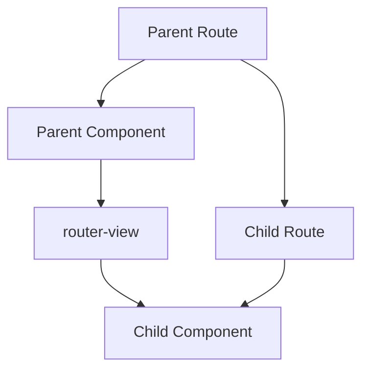

# Vue.js Nested Routes

## Introduction

In real-world applications, user interfaces often consist of nested components that are several levels deep. Similarly, URL paths often have multiple segments that correspond to a certain hierarchy of resources or UI views. Vue Router provides powerful nested route capabilities that allow you to map these nested URL paths to nested components, creating a seamless and intuitive user experience.

Nested routes let you create complex layouts where parts of your page remain constant while other sections change based on URL parameters. This tutorial will guide you through implementing nested routes in Vue.js applications using Vue Router.

## Prerequisites

Before diving into nested routes, you should have:
- Basic knowledge of Vue.js
- Vue Router installed in your project
- Understanding of basic Vue Router concepts (routes, router-view, etc.)

## Understanding Nested Routes

Nested routes in Vue Router allow you to create a hierarchy of routes and components, where child routes are rendered inside parent components. This is particularly useful for complex UIs with multiple levels of navigation.

### Basic Concept

In Vue Router, nested routes are defined by nesting route configurations within each other using the `children` property. When a nested route is matched, its component will be rendered inside the parent component's `<router-view>`.



## Creating Your First Nested Route

Let's start with a simple example of a user management section with users list and individual user profiles.

### Step 1: Define Your Route Configuration

```js
import { createRouter, createWebHistory } from 'vue-router'
import UserLayout from './components/UserLayout.vue'
import UserList from './components/UserList.vue'
import UserProfile from './components/UserProfile.vue'
import UserPosts from './components/UserPosts.vue'

const routes = [
  {
    path: '/users',
    component: UserLayout,
    children: [
      { 
        path: '', // empty path means this is the default child route
        component: UserList 
      },
      { 
        path: ':id', 
        component: UserProfile,
        children: [
          {
            path: 'posts',
            component: UserPosts
          }
        ]
      }
    ]
  }
]

const router = createRouter({
  history: createWebHistory(),
  routes
})

export default router
```

### Step 2: Create the Layout Component

The parent component needs to include a `<router-view>` to render the matched child component.

```html
<!-- UserLayout.vue -->
<template>
  <div class="user-container">
    <h1>User Management</h1>
    <div class="sidebar">
      <h3>Quick Navigation</h3>
      <ul>
        <li><router-link to="/users">All Users</router-link></li>
        <li><router-link to="/users/1">User #1</router-link></li>
        <li><router-link to="/users/2">User #2</router-link></li>
      </ul>
    </div>
    
    <div class="content">
      <!-- This is where child routes will be rendered -->
      <router-view></router-view>
    </div>
  </div>
</template>

<style scoped>
.user-container {
  display: flex;
  flex-wrap: wrap;
}
.sidebar {
  width: 200px;
  padding: 10px;
  border-right: 1px solid #ccc;
}
.content {
  flex: 1;
  padding: 20px;
}
</style>
```

### Step 3: Create Child Components

```html
<!-- UserList.vue -->
<template>
  <div>
    <h2>Users List</h2>
    <ul class="user-list">
      <li v-for="user in users" :key="user.id">
        <router-link :to="`/users/${user.id}`">{{ user.name }}</router-link>
      </li>
    </ul>
  </div>
</template>

<script>
export default {
  data() {
    return {
      users: [
        { id: 1, name: 'Alice Johnson' },
        { id: 2, name: 'Bob Smith' },
        { id: 3, name: 'Charlie Brown' }
      ]
    }
  }
}
</script>
```

```html
<!-- UserProfile.vue -->
<template>
  <div>
    <h2>User Profile: {{ userId }}</h2>
    <div class="user-details">
      <p><strong>User ID:</strong> {{ userId }}</p>
      <p><strong>Name:</strong> {{ userName }}</p>
      <p><strong>Email:</strong> {{ userEmail }}</p>
    </div>
    
    <div class="user-actions">
      <router-link :to="`/users/${userId}/posts`">View User Posts</router-link>
    </div>
    
    <!-- Nested router view for deeper nesting -->
    <router-view></router-view>
  </div>
</template>

<script>
export default {
  computed: {
    userId() {
      return this.$route.params.id
    },
    userName() {
      // In real app, get from API
      const names = ['Alice Johnson', 'Bob Smith', 'Charlie Brown']
      return names[this.userId - 1] || 'Unknown User'
    },
    userEmail() {
      // In real app, get from API
      return `user${this.userId}@example.com`
    }
  }
}
</script>
```

```html
<!-- UserPosts.vue -->
<template>
  <div class="posts-container">
    <h3>Posts by User {{ $route.params.id }}</h3>
    <div v-if="posts.length" class="posts-list">
      <div v-for="post in posts" :key="post.id" class="post">
        <h4>{{ post.title }}</h4>
        <p>{{ post.content }}</p>
      </div>
    </div>
    <div v-else>
      <p>This user has no posts yet.</p>
    </div>
  </div>
</template>

<script>
export default {
  data() {
    return {
      posts: [
        { id: 1, title: 'First Post', content: 'This is my first post!' },
        { id: 2, title: 'About Vue.js', content: 'Vue.js is an amazing framework.' }
      ]
    }
  },
  created() {
    // In a real app, you would fetch posts from an API
    console.log(`Fetching posts for user ${this.$route.params.id}`)
  }
}
</script>

<style scoped>
.posts-container {
  margin-top: 20px;
  padding-top: 20px;
  border-top: 1px dashed #ccc;
}
.post {
  margin-bottom: 15px;
  padding: 10px;
  background-color: #f9f9f9;
  border-radius: 5px;
}
</style>
```

## URL Structure with Nested Routes

With the configuration above, our application now supports these URL patterns:

- `/users` - Displays the UserLayout with UserList
- `/users/1` - Displays the UserLayout with UserProfile for user with ID 1
- `/users/1/posts` - Displays the UserLayout with UserProfile and UserPosts for user with ID 1

## Named Routes and Named Views with Nested Routes

You can combine named routes with nested routes for more complex scenarios.

### Named Routes Example

```js
const routes = [
  {
    path: '/users',
    component: UserLayout,
    children: [
      { 
        path: '', 
        name: 'users-list',
        component: UserList 
      },
      { 
        path: ':id', 
        name: 'user-profile',
        component: UserProfile,
        children: [
          {
            path: 'posts',
            name: 'user-posts',
            component: UserPosts
          }
        ]
      }
    ]
  }
]
```

Then, you can navigate using the route name:

```html
<router-link :to="{ name: 'user-posts', params: { id: 1 }}">View User 1 Posts</router-link>
```

### Named Views with Nested Routes

You can also use named views within nested routes to create even more complex layouts.

```js
const routes = [
  {
    path: '/users/:id',
    component: UserLayout,
    children: [
      {
        path: 'profile',
        components: {
          default: UserProfile,
          sidebar: UserSidebar,
          header: UserHeader
        }
      }
    ]
  }
]
```

In your template:

```html
<template>
  <div>
    <router-view name="header"></router-view>
    <div class="main-content">
      <router-view name="sidebar"></router-view>
      <router-view></router-view>
    </div>
  </div>
</template>
```

## Passing Props to Route Components

When working with nested routes, passing props makes your components more reusable and testable.

```js
const routes = [
  {
    path: '/users',
    component: UserLayout,
    children: [
      { 
        path: ':id', 
        component: UserProfile,
        props: true,  // Pass route.params to component as props
        children: [
          {
            path: 'posts',
            component: UserPosts,
            props: true  // Also works for child routes
          }
        ]
      }
    ]
  }
]
```

Then in your component:

```html
<script>
export default {
  props: ['id'],  // Now you can use this.id directly instead of this.$route.params.id
  created() {
    console.log(`User ID from props: ${this.id}`)
  }
}
</script>
```

## Handling Navigation Guards with Nested Routes

Navigation guards work with nested routes too. You can apply guards at the parent or child route levels.

```js
const routes = [
  {
    path: '/users',
    component: UserLayout,
    beforeEnter: (to, from, next) => {
      // Check if user is authenticated
      const isAuthenticated = checkAuthStatus()
      if (isAuthenticated) next()
      else next('/login')
    },
    children: [
      { 
        path: ':id', 
        component: UserProfile,
        beforeEnter: (to, from, next) => {
          // Check if user has permission to view this specific user
          const canViewUser = checkPermission(to.params.id)
          if (canViewUser) next()
          else next('/unauthorized')
        }
      }
    ]
  }
]
```

## Real-World Example: Dashboard Application

Let's create a more comprehensive example of nested routes in a dashboard application:

### Dashboard Routes Configuration

```js
const routes = [
  {
    path: '/dashboard',
    component: DashboardLayout,
    children: [
      {
        path: '',
        name: 'dashboard-home',
        component: DashboardHome
      },
      {
        path: 'projects',
        component: ProjectsLayout,
        children: [
          {
            path: '',
            name: 'projects-list',
            component: ProjectsList
          },
          {
            path: ':id',
            name: 'project-details',
            component: ProjectDetails,
            props: true,
            children: [
              {
                path: 'tasks',
                name: 'project-tasks',
                component: ProjectTasks,
                props: true
              },
              {
                path: 'team',
                name: 'project-team',
                component: ProjectTeam,
                props: true
              }
            ]
          }
        ]
      },
      {
        path: 'settings',
        name: 'dashboard-settings',
        component: DashboardSettings
      }
    ]
  }
]
```

This setup provides a dashboard with the following structure:
- `/dashboard` - Main dashboard home
- `/dashboard/projects` - List of all projects
- `/dashboard/projects/123` - Details of project with ID 123
- `/dashboard/projects/123/tasks` - Tasks for project 123
- `/dashboard/projects/123/team` - Team members for project 123
- `/dashboard/settings` - Dashboard settings

## Best Practices for Nested Routes

1. **Keep Nesting Shallow**: Avoid nesting routes too deeply (more than 3 levels) to keep URLs and code manageable.

2. **Use Props**: Pass route parameters as props to make components more reusable.

3. **Lazy Loading**: Use lazy loading for route components, especially for nested routes that aren't immediately needed:

```js
const ProjectDetails = () => import('./components/ProjectDetails.vue')
```

4. **Maintain Clear Route Names**: Use consistent naming conventions for your routes, especially when using named routes.

5. **Consider UX**: Ensure that the UI clearly reflects the hierarchical nature of your nested routes through breadcrumbs or navigation indicators.

## Troubleshooting Common Issues

### Child Route Not Rendering

If your child routes aren't rendering, check:
- That you have a `<router-view>` in the parent component
- That the path nesting in your route configuration is correct
- That the URL matches the expected pattern

### Params Not Available in Child Routes

In some cases, you might need to propagate params from parent to child routes:

```js
{
  path: ':id',
  component: UserProfile,
  props: true,
  children: [
    {
      path: 'posts',
      component: UserPosts,
      // Make parent params available to child
      props: route => ({ id: route.params.id })
    }
  ]
}
```

## Summary

Nested routes in Vue.js are a powerful feature that allows you to create complex UI hierarchies that match your URL structure. By nesting route configurations and strategically placing `<router-view>` components in your layouts, you can build intuitive and organized navigation paths for your users.

Key takeaways:
- Use the `children` property to define nested routes
- Each parent component needs a `<router-view>` to render children
- Named routes and props make working with nested routes easier
- Navigation guards can be applied at any level of nesting
- Keep your route structure organized and logical

## Exercises

1. Create a blog application with nested routes for categories and posts, where posts can have comments as a third-level nested route.

2. Implement a product catalog with categories, subcategories, and product details using nested routes.

3. Build an email client interface with nested routes for inbox, sent items, and email viewing.

## Additional Resources

- [Vue Router Official Documentation on Nested Routes](https://router.vuejs.org/guide/essentials/nested-routes.html)
- [Vue Router API Reference](https://router.vuejs.org/api/)
- [Vue School's Vue Router Course](https://vueschool.io/courses/vue-router-4-for-everyone)

Happy coding with Vue Router nested routes!