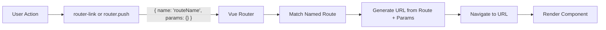

# Vue.js Named Routes

## Introduction

When building Vue.js applications with multiple pages, routing becomes an essential part of your development process. Vue Router provides a powerful routing system, and one of its most useful features is **named routes**. Named routes allow you to navigate to specific routes using names instead of hardcoded paths, making your code more maintainable and easier to refactor.

In this tutorial, we'll explore Vue.js named routes - what they are, how to implement them, and why they're beneficial for your applications.

## Prerequisites

Before diving into named routes, make sure you have:

- Basic knowledge of Vue.js
- Vue Router installed in your project
- Understanding of basic routing concepts

## What Are Named Routes?

Named routes are exactly what they sound like: routes that have specific names assigned to them. Instead of referring to routes by their path (like `/users/profile`), you can refer to them by their name (like `userProfile`). This provides several advantages:

1. **Maintainability**: If you change a route's path, you won't need to update every link in your application
2. **Readability**: Names are often more descriptive than paths
3. **Dynamic parameters**: Easier handling of routes with parameters

## Setting Up Named Routes

Let's start by setting up a basic Vue Router configuration with named routes:

```javascript
// router/index.js
import { createRouter, createWebHistory } from 'vue-router'
import Home from '../views/Home.vue'
import About from '../views/About.vue'
import UserProfile from '../views/UserProfile.vue'
import NotFound from '../views/NotFound.vue'

const routes = [
  {
    path: '/',
    name: 'home',
    component: Home
  },
  {
    path: '/about',
    name: 'about',
    component: About
  },
  {
    path: '/users/:id',
    name: 'userProfile',
    component: UserProfile
  },
  {
    path: '/:catchAll(.*)',
    name: 'notFound',
    component: NotFound
  }
]

const router = createRouter({
  history: createWebHistory(),
  routes
})

export default router
```

In the configuration above, we've assigned names to each route using the `name` property. Notice how the `userProfile` route has a dynamic parameter `:id` in its path.

## Navigating Using Named Routes

### Using `router-link`

Once your routes have names, you can navigate to them using the `router-link` component with the `to` property as an object:

```html
<template>
  <nav>
    <router-link :to="{ name: 'home' }">Home</router-link> |
    <router-link :to="{ name: 'about' }">About</router-link> |
    <router-link :to="{ name: 'userProfile', params: { id: 123 } }">
      User Profile
    </router-link>
  </nav>
</template>
```

For routes with parameters (like our `userProfile` route), we provide the required parameters in the `params` object.

### Programmatic Navigation

You can also navigate programmatically using the `router.push()` or `router.replace()` methods:

```javascript
// Navigate to the home page
this.$router.push({ name: 'home' })

// Navigate to a user profile with ID 123
this.$router.push({ name: 'userProfile', params: { id: 123 } })

// With query parameters
this.$router.push({
  name: 'userProfile',
  params: { id: 123 },
  query: { tab: 'posts' }
})
```

The resulting URL for the last example would be `/users/123?tab=posts`.

## Named Routes with Query Parameters

You can include query parameters with your named routes:

```html
<template>
  <router-link
    :to="{
      name: 'userProfile',
      params: { id: userId },
      query: { view: 'detailed', section: 'activity' }
    }"
  >
    View Detailed Profile
  </router-link>
</template>

<script>
export default {
  data() {
    return {
      userId: 123
    }
  }
}
</script>
```

This will generate a link to something like `/users/123?view=detailed&section=activity`.

## Real-World Example: E-commerce Product Navigation

Let's look at a practical example for an e-commerce application with categories and products:

```javascript
// router/index.js (excerpt)
const routes = [
  // ... other routes
  {
    path: '/products',
    name: 'productList',
    component: ProductList
  },
  {
    path: '/products/:categoryId',
    name: 'productCategory',
    component: ProductCategory
  },
  {
    path: '/products/:categoryId/:productId',
    name: 'productDetail',
    component: ProductDetail
  }
]
```

Now in your components, you can implement navigation like this:

```html
<!-- ProductList.vue -->
<template>
  <div>
    <h1>Product Categories</h1>
    <ul>
      <li v-for="category in categories" :key="category.id">
        <router-link :to="{ name: 'productCategory', params: { categoryId: category.id } }">
          {{ category.name }}
        </router-link>
      </li>
    </ul>
  </div>
</template>

<script>
export default {
  data() {
    return {
      categories: [
        { id: 'electronics', name: 'Electronics' },
        { id: 'books', name: 'Books' },
        { id: 'clothing', name: 'Clothing' }
      ]
    }
  }
}
</script>
```

```html
<!-- ProductCategory.vue -->
<template>
  <div>
    <h1>Products in {{ currentCategory }}</h1>
    <ul>
      <li v-for="product in products" :key="product.id">
        <router-link 
          :to="{ 
            name: 'productDetail', 
            params: { 
              categoryId: $route.params.categoryId, 
              productId: product.id 
            } 
          }"
        >
          {{ product.name }}
        </router-link>
      </li>
    </ul>
    <router-link :to="{ name: 'productList' }">Back to categories</router-link>
  </div>
</template>

<script>
export default {
  computed: {
    currentCategory() {
      return this.$route.params.categoryId
    }
  },
  data() {
    // In a real app, this would likely be from an API based on categoryId
    return {
      products: [
        { id: 'p1', name: 'Product 1' },
        { id: 'p2', name: 'Product 2' },
        { id: 'p3', name: 'Product 3' }
      ]
    }
  }
}
</script>
```

## Best Practices for Named Routes

1. **Use meaningful names** that describe the purpose of the route, not its path
2. **Be consistent** with naming conventions (camelCase or kebab-case)
3. **Document your routes** especially in larger applications
4. **Group related routes** to make them easier to manage
5. **Never hardcode URLs** in your application; use named routes instead

## Debugging Named Routes

If you're having issues with named routes, you can always check the available routes in your Vue Router instance:

```javascript
// In your browser console
console.log(router.getRoutes()) // Lists all routes with their names and paths
```

## When to Use Path vs. Named Routes

While named routes are generally preferred, there are situations where using a path directly might be more appropriate:

- When linking to external routes outside your application
- For very simple, unchanging routes where the overhead of named routes isn't necessary
- When dynamically generating routes based on external data where you don't have predefined names

## Route Name Organization in Larger Applications

For larger applications with many routes, consider organizing route names hierarchically:

```javascript
const routes = [
  {
    path: '/dashboard',
    name: 'dashboard',
    component: Dashboard
  },
  {
    path: '/dashboard/analytics',
    name: 'dashboard.analytics',
    component: DashboardAnalytics
  },
  {
    path: '/dashboard/settings',
    name: 'dashboard.settings',
    component: DashboardSettings
  }
]
```

This naming pattern makes it easier to understand the relationship between routes.

## Router Flow Visualization

Here's how named routes work in the routing flow:



## Summary

Named routes in Vue Router provide a powerful abstraction for managing navigation in your Vue.js applications. By using names instead of hardcoded paths, your application becomes more maintainable and easier to refactor.

Key takeaways from this tutorial:

- Named routes allow you to refer to routes by name instead of path
- You can navigate using named routes both declaratively (`router-link`) and programmatically (`router.push`)
- Parameters and query strings are easily managed with named routes
- Named routes make your application more maintainable when paths change

## Exercises

1. Convert an existing router configuration to use named routes
2. Create a navigation menu that uses named routes with parameters
3. Build a breadcrumb component using named routes
4. Implement a "return to previous page" function that preserves query parameters using named routes

## Additional Resources

- [Vue Router Official Documentation on Named Routes](https://router.vuejs.org/guide/essentials/named-routes.html)
- [Vue Router API Reference](https://router.vuejs.org/api/#router-link)
- [Advanced Vue Router Navigation Guards](https://router.vuejs.org/guide/advanced/navigation-guards.html)

With named routes, you're now ready to build more maintainable and robust navigation in your Vue.js applications!