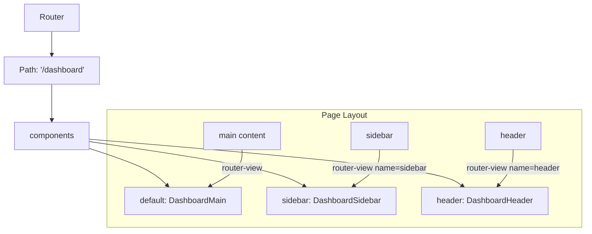

# Vue.js Named Views

## Introduction

When building complex web applications with Vue.js, you often need to display multiple components simultaneously in different sections of your layout. Vue Router's **named views** feature allows you to achieve this by rendering multiple components at the same time within different router-view outlets on the same route.

Think of named views like a dashboard layout where you might have a sidebar, a main content area, and perhaps a header section - all displayed at once but containing different components. Instead of nesting components or using complex template logic, named views provide a clean solution through routing.

## Understanding Named Views

By default, when you use a single `<router-view>` component without any name, it's given the name "default". To use multiple views, you can add multiple `<router-view>` components with different names:

```html
<template>
  <div class="app-layout">
    <router-view name="header"></router-view>
    <router-view name="sidebar"></router-view>
    <router-view></router-view> <!-- This is the "default" view -->
  </div>
</template>
```

Then in your route configuration, you specify which component should be rendered in each named view using the `components` property (notice the plural form) instead of the singular `component`:

```js
const routes = [
  {
    path: '/',
    components: {
      default: HomeComponent,
      header: HeaderComponent,
      sidebar: SidebarComponent
    }
  }
]
```

## Setting Up Named Views

Let's walk through setting up named views in a Vue.js application step by step:

### Step 1: Install Vue Router

First, make sure Vue Router is installed in your project:

```bash
npm install vue-router@4
```

### Step 2: Create Your Components

Create the components you want to display in different views. For example:

```html
// Header.vue
<template>
  <header class="app-header">
    <h1>My Application</h1>
    <nav>
      <router-link to="/">Home</router-link> |
      <router-link to="/about">About</router-link>
    </nav>
  </header>
</template>

<script>
export default {
  name: 'HeaderComponent'
}
</script>
```

```html
// Sidebar.vue
<template>
  <aside class="sidebar">
    <h3>Navigation</h3>
    <ul>
      <li><router-link to="/dashboard">Dashboard</router-link></li>
      <li><router-link to="/profile">Profile</router-link></li>
      <li><router-link to="/settings">Settings</router-link></li>
    </ul>
  </aside>
</template>

<script>
export default {
  name: 'SidebarComponent'
}
</script>
```

```html
// MainContent.vue
<template>
  <main class="main-content">
    <h2>Welcome to the Dashboard</h2>
    <p>This is the main content area of your application.</p>
  </main>
</template>

<script>
export default {
  name: 'MainContentComponent'
}
</script>
```

### Step 3: Configure Your Router

Set up your router configuration to use these components in named views:

```js
// router/index.js
import { createRouter, createWebHistory } from 'vue-router'
import HeaderComponent from '../components/Header.vue'
import SidebarComponent from '../components/Sidebar.vue'
import MainContentComponent from '../components/MainContent.vue'
import AboutMainComponent from '../components/AboutMain.vue'

const routes = [
  {
    path: '/',
    components: {
      default: MainContentComponent,
      header: HeaderComponent,
      sidebar: SidebarComponent
    }
  },
  {
    path: '/about',
    components: {
      default: AboutMainComponent,
      header: HeaderComponent // Notice we can reuse the header component
      // No sidebar on the about page!
    }
  }
]

const router = createRouter({
  history: createWebHistory(),
  routes
})

export default router
```

### Step 4: Set Up App Layout with Named Views

In your App.vue or layout component, define the structure using named router views:

```html
<!-- App.vue -->
<template>
  <div class="app-container">
    <router-view name="header" class="header-section"></router-view>
    
    <div class="content-wrapper">
      <router-view name="sidebar" class="sidebar-section"></router-view>
      <router-view class="main-section"></router-view>
    </div>
  </div>
</template>

<style>
.app-container {
  display: flex;
  flex-direction: column;
  min-height: 100vh;
}

.header-section {
  height: 60px;
  background-color: #f5f5f5;
}

.content-wrapper {
  display: flex;
  flex: 1;
}

.sidebar-section {
  width: 200px;
  background-color: #e9e9e9;
}

.main-section {
  flex: 1;
  padding: 20px;
}
</style>
```

## Named Views with Nested Routes

Named views can also be combined with nested routes for even more layout flexibility. This is particularly useful for complex UIs where sections of the page might have their own navigation.

Let's see an example of a dashboard with nested routes:

```js
const routes = [
  {
    path: '/dashboard',
    components: {
      default: DashboardMain,
      header: DashboardHeader,
      sidebar: DashboardSidebar
    },
    children: [
      {
        path: 'analytics', // Will be /dashboard/analytics
        components: {
          default: AnalyticsComponent,
          charts: AnalyticsChartsComponent
        }
      },
      {
        path: 'settings',
        components: {
          default: SettingsComponent,
          helper: SettingsHelperComponent
        }
      }
    ]
  }
]
```

To support this nested structure, you need to include another set of router-view components in your dashboard component:

```html
<!-- DashboardMain.vue -->
<template>
  <div class="dashboard">
    <h2>Dashboard</h2>
    <div class="dashboard-content">
      <router-view></router-view>
      <router-view name="charts" class="charts-section"></router-view>
      <router-view name="helper" class="helper-section"></router-view>
    </div>
  </div>
</template>
```

## Practical Example: Admin Dashboard

Let's create a more complete example of an admin dashboard using named views:

```html
<!-- AdminLayout.vue -->
<template>
  <div class="admin-layout">
    <router-view name="adminHeader"></router-view>
    <div class="admin-content">
      <router-view name="adminSidebar"></router-view>
      <div class="main-content">
        <router-view name="adminBreadcrumb"></router-view>
        <router-view></router-view>
      </div>
    </div>
  </div>
</template>

<style scoped>
.admin-layout {
  display: flex;
  flex-direction: column;
  height: 100vh;
}

.admin-content {
  display: flex;
  flex: 1;
  overflow: hidden;
}

.main-content {
  flex: 1;
  padding: 20px;
  overflow: auto;
  display: flex;
  flex-direction: column;
}
</style>
```

Router configuration:

```js
const adminRoutes = [
  {
    path: '/admin',
    component: AdminLayout,
    children: [
      {
        path: '',
        components: {
          default: AdminDashboard,
          adminHeader: AdminHeader,
          adminSidebar: AdminSidebar,
          adminBreadcrumb: AdminBreadcrumb
        }
      },
      {
        path: 'users',
        components: {
          default: UserManagement,
          adminHeader: AdminHeader,
          adminSidebar: AdminSidebar,
          adminBreadcrumb: UsersBreadcrumb
        }
      },
      {
        path: 'settings',
        components: {
          default: AdminSettings,
          adminHeader: AdminHeader,
          adminSidebar: AdminSidebar,
          adminBreadcrumb: SettingsBreadcrumb
        }
      }
    ]
  }
]
```

## Using Named Views with Route Transitions

You can enhance your named views with transitions to create a smoother user experience:

```html
<!-- App.vue -->
<template>
  <div class="app-container">
    <transition name="fade">
      <router-view name="header" class="header-section"></router-view>
    </transition>
    
    <div class="content-wrapper">
      <transition name="slide">
        <router-view name="sidebar" class="sidebar-section"></router-view>
      </transition>
      
      <transition name="fade">
        <router-view class="main-section"></router-view>
      </transition>
    </div>
  </div>
</template>

<style>
/* Basic transition styles */
.fade-enter-active, .fade-leave-active {
  transition: opacity 0.3s;
}
.fade-enter-from, .fade-leave-to {
  opacity: 0;
}

.slide-enter-active, .slide-leave-active {
  transition: transform 0.3s;
}
.slide-enter-from, .slide-leave-to {
  transform: translateX(-100%);
}
</style>
```

## When to Use Named Views

Named views are particularly useful in these scenarios:

1. **Dashboard layouts**: Where you need to display multiple components simultaneously.
2. **Master-detail interfaces**: Where you want to show a list and details side by side.
3. **Complex forms**: Where you might have form navigation in one view and form content in another.
4. **Admin interfaces**: With persistent navigation components and changing content areas.

## Best Practices for Named Views

1. **Keep naming consistent**: Use a clear naming convention for your views to avoid confusion.
2. **Don't overuse**: Not every page needs multiple views. Use them when they genuinely improve your UI structure.
3. **Consider mobile layouts**: Your named views might need different layouts on mobile devices, so plan for responsive behavior.
4. **Use with lazy-loading**: For better performance, you can lazy-load components in named views.

```js
const routes = [
  {
    path: '/dashboard',
    components: {
      default: () => import('../views/Dashboard.vue'),
      sidebar: () => import('../components/DashboardSidebar.vue'),
      header: () => import('../components/DashboardHeader.vue')
    }
  }
]
```

## Visualizing Named Views Structure

Here's a visual representation of how named views work in a typical layout:



## Summary

Vue Router's named views provide a powerful way to create complex layouts with multiple components displayed simultaneously. By specifying different components for different named router-view outlets, you can create flexible, modular interfaces without complex component nesting.

Key points to remember:
- Use the `components` property (plural) in your route configuration to specify components for different views.
- The unnamed `<router-view>` is equivalent to `<router-view name="default">`.
- Named views can be combined with nested routes for complex layouts.
- Named views are perfect for dashboard layouts, admin interfaces, and master-detail views.

## Additional Resources

To deepen your understanding of Vue Router and named views:

1. Practice by creating a dashboard application with multiple named views.
2. Experiment with combining named views with route transitions.
3. Try implementing a responsive layout that changes how named views are displayed on mobile devices.

## Exercises

1. Create a simple email client interface with a list of emails in a sidebar view and the selected email content in the main view.
2. Implement a product management dashboard with a header, sidebar navigation, and different main content areas based on the route.
3. Build a settings page where changing a section in the sidebar updates the main content while keeping the header and navigation consistent.

By mastering named views, you'll be able to create more sophisticated layouts in your Vue applications while keeping your component structure clean and maintainable.