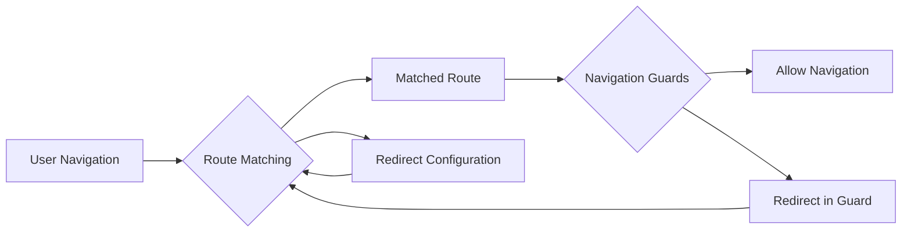

# Vue.js Redirect Navigation

## Introduction

Redirecting users between routes is a fundamental aspect of modern web applications. Whether you need to guide users to a default page, handle deprecated URLs, or implement authentication-based access control, Vue.js provides powerful tools for managing redirects through its Vue Router library.

In this lesson, we'll explore how to implement redirects in Vue.js applications, examine different redirection scenarios, and learn best practices for creating a smooth navigation experience.

## Understanding Redirects in Vue Router

A redirect in Vue Router is a route configuration that automatically navigates users from one URL to another. Instead of rendering a component, the router changes the URL to a different path and matches that new path against its routes.

### Basic Redirect Configuration

Redirects are defined in your router configuration using the `redirect` property:

```js
import { createRouter, createWebHistory } from 'vue-router'
import HomePage from './components/HomePage.vue'
import AboutPage from './components/AboutPage.vue'
import DashboardPage from './components/DashboardPage.vue'

const routes = [
  { path: '/', component: HomePage },
  { path: '/about', component: AboutPage },
  { path: '/dashboard', component: DashboardPage },
  // Basic redirect
  { path: '/home', redirect: '/' }
]

const router = createRouter({
  history: createWebHistory(),
  routes
})

export default router
```

In this example, any time a user navigates to `/home`, they will be automatically redirected to the root path (`/`).

## Types of Redirects

Vue Router supports several ways to specify redirects:

### 1. String Path Redirects

The simplest form is redirecting to a specific path:

```js
// Redirect to a specific path
{ path: '/old-page', redirect: '/new-page' }
```

### 2. Named Route Redirects

You can redirect to a named route:

```js
const routes = [
  { path: '/dashboard', name: 'dashboard', component: DashboardPage },
  // Redirect to a named route
  { path: '/admin', redirect: { name: 'dashboard' } }
]
```

### 3. Function Redirects

For dynamic redirects based on conditions, use a function:

```js
{
  path: '/dynamic-redirect',
  redirect: to => {
    // The "to" object represents the route that is being navigated to
    const { hash, params, query } = to
    
    if (query.redirectTo) {
      return { path: query.redirectTo }
    } else {
      return '/default-path'
    }
  }
}
```

## Practical Examples

Let's explore some common use cases for redirects:

### Example 1: Default Subroute

When a user visits a parent route, automatically redirect to a default child route:

```js
const routes = [
  { 
    path: '/user', 
    component: UserLayout,
    children: [
      // Default child route
      { path: '', redirect: 'profile' },
      { path: 'profile', component: UserProfile },
      { path: 'settings', component: UserSettings }
    ]
  }
]
```

In this example, visiting `/user` will redirect to `/user/profile`.

### Example 2: Authentication Guard with Redirect

Redirecting unauthenticated users to the login page:

```js
// router.js
import { createRouter, createWebHistory } from 'vue-router'
import store from './store'

const routes = [
  { path: '/', component: HomePage },
  { path: '/login', component: LoginPage },
  { 
    path: '/dashboard', 
    component: DashboardPage,
    meta: { requiresAuth: true }
  }
]

const router = createRouter({
  history: createWebHistory(),
  routes
})

router.beforeEach((to, from, next) => {
  // Check if the route requires authentication
  if (to.meta.requiresAuth && !store.state.isAuthenticated) {
    // Redirect to login page with a return path
    next({ 
      path: '/login', 
      query: { redirect: to.fullPath } 
    })
  } else {
    next()
  }
})

export default router
```

And in your login component:

```html
<template>
  <div>
    <h1>Login</h1>
    <form @submit.prevent="login">
      <!-- Form fields -->
      <button type="submit">Login</button>
    </form>
  </div>
</template>

<script>
export default {
  methods: {
    login() {
      // Authenticate user
      this.$store.commit('setAuthenticated', true)
      
      // Redirect to the original requested page or default
      const redirectPath = this.$route.query.redirect || '/dashboard'
      this.$router.push(redirectPath)
    }
  }
}
</script>
```

### Example 3: Handling Deprecated URLs

Managing URL changes for a website redesign:

```js
const routes = [
  // Current routes
  { path: '/products', component: ProductsPage },
  { path: '/products/:id', component: ProductDetailPage },
  
  // Old URLs redirecting to new structure
  { path: '/catalog', redirect: '/products' },
  { 
    path: '/item/:id', 
    redirect: to => {
      return `/products/${to.params.id}`
    }
  }
]
```

## Programmatic Redirects

Besides configuring redirects in routes, you can also perform redirects programmatically:

```html
<template>
  <div>
    <button @click="redirectToHome">Go Home</button>
  </div>
</template>

<script>
export default {
  methods: {
    redirectToHome() {
      this.$router.push('/')
      
      // Or using named routes
      // this.$router.push({ name: 'home' })
      
      // With query parameters
      // this.$router.push({ path: '/', query: { source: 'button' } })
    }
  }
}
</script>
```

## Redirects vs Navigation Guards

While both can control navigation flow, they serve different purposes:



- **Redirects**: Simple URL transformations defined in route configuration
- **Navigation Guards**: More complex logic with full access to the Vue instance and route information

Choose the right approach based on the complexity of your redirection needs.

## Common Pitfalls and Solutions

### Avoiding Redirect Loops

Be careful not to create redirect loops:

```js
// This creates an infinite loop!
const routes = [
  { path: '/a', redirect: '/b' },
  { path: '/b', redirect: '/a' }
]

// Fix: Ensure one-way redirection
const routes = [
  { path: '/a', redirect: '/c' },
  { path: '/b', redirect: '/c' },
  { path: '/c', component: SomeComponent }
]
```

### Preserving Query Parameters

When redirecting, you might want to preserve query parameters:

```js
{
  path: '/old-search',
  redirect: to => {
    return { path: '/new-search', query: to.query }
  }
}
```

## Summary

Redirects in Vue.js routing provide a powerful way to manage navigation in your application. They allow you to:

- Guide users to the correct pages
- Handle URL structure changes
- Implement access control
- Create intuitive navigation patterns

By understanding the different types of redirects and when to use them, you can create more robust and user-friendly Vue applications.

## Additional Resources

- Explore the [Vue Router documentation](https://router.vuejs.org/guide/essentials/redirect-and-alias.html) for more details on redirects
- Learn about advanced routing patterns with nested routes and named views
- Investigate Vue Router's navigation guards for more complex routing control

## Exercises

1. Create a route configuration that redirects users from `/products` to `/shop`
2. Implement a dynamic redirect that preserves the ID parameter (e.g., `/article/123` to `/post/123`)
3. Build an authentication system that redirects unauthenticated users trying to access protected routes
4. Create a multi-level nested route structure with appropriate default route redirects