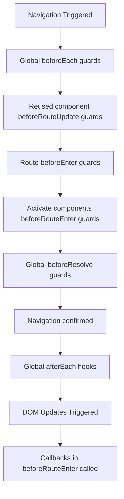

# Vue.js Navigation Guards

Navigation guards are a powerful feature in Vue Router that allow you to control the navigation flow in your Vue.js applications. They act as gatekeepers to routes, enabling you to perform actions before, during, or after a navigation event occurs.

## Introduction to Navigation Guards

In many applications, you'll need to verify certain conditions before allowing a user to navigate to a specific page. For example:

- Checking if a user is authenticated before accessing a protected page
- Preventing unsaved form data from being lost when navigating away
- Redirecting users to different pages based on their roles or permissions
- Loading necessary data before showing a component

Vue Router provides several types of navigation guards to handle these scenarios, each serving different purposes and having different scopes.

## Types of Navigation Guards

Vue Router offers three main types of navigation guards:

1. **Global Guards**: Applied to all route navigations
2. **Per-Route Guards**: Attached to specific routes
3. **In-Component Guards**: Defined within components

Let's explore each type in detail.

## Global Navigation Guards

Global navigation guards affect all route navigations in your application.

### Global Before Guards (`beforeEach`)

The `beforeEach` guard runs before any navigation. It's commonly used for authentication checks.

```js
const router = createRouter({
  // router configuration
})

router.beforeEach((to, from, next) => {
  // ...
  // Must call next()
  next()
})
```

Each guard function receives three arguments:

- `to`: Route object for the target route
- `from`: Route object from the current route
- `next`: Function that must be called to resolve the hook

Here's a practical example of checking authentication:

```js
router.beforeEach((to, from, next) => {
  // Check if the route requires authentication
  if (to.meta.requiresAuth) {
    // Check if the user is logged in
    if (!isAuthenticated()) {
      // Redirect to login page if not authenticated
      next({ name: 'Login', query: { redirect: to.fullPath } })
    } else {
      // Continue navigation
      next()
    }
  } else {
    // For routes that don't require authentication
    next()
  }
})
```

In the example above, routes with `meta.requiresAuth` set to `true` will check if the user is authenticated before allowing navigation.

### Global Resolution Guards (`beforeResolve`)

Similar to `beforeEach`, the `beforeResolve` guard runs right before navigation is confirmed, but after all in-component and async route component hooks are resolved.

```js
router.beforeResolve(async (to, from, next) => {
  try {
    // Load necessary data before navigation completes
    await loadDataForRoute(to)
    next()
  } catch (error) {
    // Handle error, maybe prevent navigation or redirect
    next(false)
  }
})
```

This guard is useful for performing last-minute checks or data loading before navigation completes.

### Global After Hooks (`afterEach`)

The `afterEach` hook runs after navigation is complete, so it doesn't affect the navigation itself. It doesn't receive a `next` function since the navigation has already been confirmed.

```js
router.afterEach((to, from) => {
  // Update document title
  document.title = to.meta.title || 'My Vue App'
  
  // Log navigation for analytics
  logNavigation(to.path)
})
```

Common use cases include changing document title, logging for analytics, or announcing page changes for accessibility.

## Per-Route Guards

Per-route guards are attached to specific routes in your route configuration.

### `beforeEnter` Guard

This guard is defined directly on a route definition and runs only when entering that specific route.

```js
const routes = [
  {
    path: '/admin',
    component: AdminDashboard,
    beforeEnter: (to, from, next) => {
      // Check if user is an admin
      if (isAdmin()) {
        next() // Allow admin access
      } else {
        next('/unauthorized') // Redirect non-admin users
      }
    }
  },
  {
    path: '/profile',
    component: UserProfile,
    // You can also use an array of guards
    beforeEnter: [checkAuth, loadUserData]
  }
]
```

This approach is ideal when you need to protect specific routes rather than applying the same logic globally.

## In-Component Guards

In-component guards are defined inside component options. They're useful for component-specific logic.

### `beforeRouteEnter`

This guard is called before the component is created. Since the component instance doesn't exist yet, you cannot access `this` directly.

```js
export default {
  beforeRouteEnter(to, from, next) {
    // Cannot access component instance with `this`
    next(vm => {
      // Access component instance through `vm`
      vm.loadData()
    })
  }
}
```

This is the only guard that receives the component instance through the `next` callback.

### `beforeRouteUpdate`

Called when the route changes, but the component is reused (e.g., routes with dynamic parameters).

```js
export default {
  beforeRouteUpdate(to, from, next) {
    // React to route changes
    this.userData = null
    this.loadUserData(to.params.id)
    next()
  }
}
```

This guard is particularly useful when your component is used for multiple routes with different parameters.

### `beforeRouteLeave`

Called when navigating away from the route. Commonly used to prevent accidental navigation away from unsaved changes.

```js
export default {
  data() {
    return {
      formChanged: false
    }
  },
  beforeRouteLeave(to, from, next) {
    if (this.formChanged) {
      const confirm = window.confirm('You have unsaved changes! Are you sure you want to leave?')
      if (confirm) {
        next()
      } else {
        next(false)
      }
    } else {
      next()
    }
  }
}
```

## The Navigation Resolution Flow

Understanding how navigation guards execute in sequence is important:



## Advanced Usage: Route Meta Fields

Meta fields provide a flexible way to attach custom information to routes, which can then be accessed in navigation guards.

```js
const routes = [
  {
    path: '/admin',
    component: AdminDashboard,
    meta: { 
      requiresAuth: true,
      role: 'admin',
      title: 'Admin Dashboard'
    }
  }
]
```

Then in your navigation guards:

```js
router.beforeEach((to, from, next) => {
  // Access meta fields from matched routes
  const requiresAuth = to.matched.some(record => record.meta.requiresAuth)
  
  if (requiresAuth && !isAuthenticated()) {
    next('/login')
  } else {
    next()
  }
})
```

## Practical Example: Complete Authentication Flow

Let's build a complete authentication flow with navigation guards:

```js
// router.js
import { createRouter, createWebHistory } from 'vue-router'
import { getAuthStatus } from './auth-service'

const router = createRouter({
  history: createWebHistory(),
  routes: [
    {
      path: '/',
      name: 'Home',
      component: Home
    },
    {
      path: '/login',
      name: 'Login',
      component: Login,
      meta: { guestOnly: true }
    },
    {
      path: '/dashboard',
      name: 'Dashboard',
      component: Dashboard,
      meta: { requiresAuth: true }
    },
    {
      path: '/admin',
      name: 'Admin',
      component: AdminPanel,
      meta: { requiresAuth: true, role: 'admin' }
    }
  ]
})

router.beforeEach(async (to, from, next) => {
  // Get current authentication status
  const { isAuthenticated, userRole } = await getAuthStatus()
  
  // Redirect authenticated users away from guest-only pages
  if (to.meta.guestOnly && isAuthenticated) {
    return next({ name: 'Dashboard' })
  }
  
  // Check if route requires authentication
  if (to.meta.requiresAuth) {
    // Redirect to login if not authenticated
    if (!isAuthenticated) {
      return next({ name: 'Login', query: { redirect: to.fullPath } })
    }
    
    // Check role requirements
    if (to.meta.role && to.meta.role !== userRole) {
      return next({ name: 'Dashboard' })
    }
  }
  
  // Allow navigation
  next()
})

export default router
```

With this setup:
- Unauthenticated users trying to access protected routes are redirected to the login page
- Authenticated users are prevented from accessing guest-only pages like login
- Only users with the appropriate role can access role-specific pages
- After login, users can be redirected to their originally requested page

## Summary

Navigation guards are a powerful feature in Vue Router that give you precise control over the navigation flow in your Vue.js applications. They allow you to:

- Protect routes based on authentication status
- Implement permission-based access control
- Prevent data loss during navigation
- Load necessary data before showing components
- Create consistent user experiences during navigation

By understanding the different types of navigation guards and their execution order, you can create sophisticated routing behavior that enhances both security and user experience.

## Additional Resources

- [Vue Router Official Documentation](https://router.vuejs.org/guide/advanced/navigation-guards.html)
- [Vue Router Meta Fields](https://router.vuejs.org/guide/advanced/meta.html)

## Exercises

1. Implement a navigation guard that prevents users from leaving a form with unsaved changes.
2. Create a role-based navigation system with different accessible routes for different user roles.
3. Build a guard that loads necessary data before showing a component and displays a loading indicator.
4. Create a global guard that tracks user navigation patterns for analytics purposes.
5. Implement a complete authentication flow with login, logout, and protected routes.