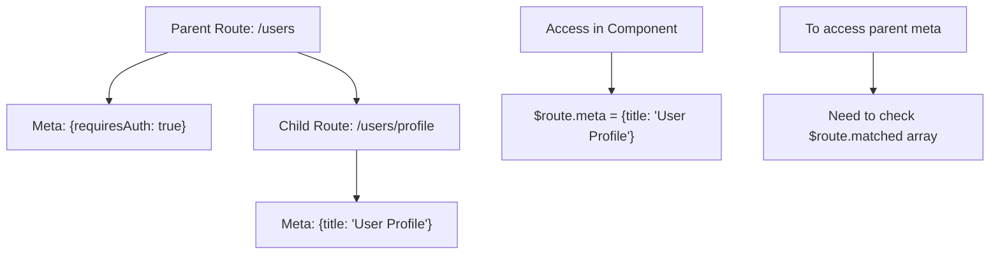

# Vue.js Route Meta Fields

## Introduction

When building Vue.js applications with multiple routes, you often need to attach additional data to routes that isn't part of the path or component definition. This is where **route meta fields** become incredibly useful. Meta fields allow you to attach arbitrary data to route definitions that you can later access throughout your application.

Meta fields can help you implement features like:
- Route-level authentication requirements
- Page titles for browser tabs
- Transition effects between specific routes
- Layout templates per route
- Breadcrumb generation

In this tutorial, we'll explore how to define and use meta fields in Vue Router to enhance your Vue.js application's routing system.

## Defining Meta Fields

Meta fields are defined on routes using the `meta` property in your route configuration. They can contain any type of data: strings, numbers, booleans, objects, or even functions.

### Basic Syntax

```js
const routes = [
  {
    path: '/dashboard',
    component: Dashboard,
    meta: {
      requiresAuth: true,
      title: 'User Dashboard',
      transitionName: 'fade'
    }
  }
]
```

In this example, we've attached three meta fields to the `/dashboard` route:
- `requiresAuth`: Indicates this route requires authentication
- `title`: Provides a title for the page
- `transitionName`: Specifies which transition effect to use

## Accessing Meta Fields

You can access meta fields in several ways throughout your Vue application.

### In Navigation Guards

One common use case is to check meta fields in navigation guards:

```js
// In router setup
const router = createRouter({
  // ... other options
  routes
})

router.beforeEach((to, from, next) => {
  // Access meta field from the destination route
  if (to.meta.requiresAuth) {
    // Check if user is authenticated
    if (!isAuthenticated()) {
      // Redirect to login page if not authenticated
      next('/login')
    } else {
      // Allow navigation
      next()
    }
  } else {
    // For routes that don't require auth, proceed
    next()
  }
})
```

### In Components

You can access route meta fields in any component using the `$route` object:

```html
<template>
  <div>
    <h1>{{ $route.meta.title }}</h1>
    <div class="content">
      <!-- Page content -->
    </div>
  </div>
</template>

<script>
export default {
  mounted() {
    // You can use route meta to set page title
    document.title = this.$route.meta.title || 'My Vue App'
  }
}
</script>
```

### Using Composition API

If you're using Vue 3 and the Composition API, you can access meta fields using the `useRoute` hook:

```html
<template>
  <div>
    <h1>{{ pageTitle }}</h1>
  </div>
</template>

<script setup>
import { computed } from 'vue'
import { useRoute } from 'vue-router'

const route = useRoute()
const pageTitle = computed(() => route.meta.title || 'Default Title')
</script>
```

## Practical Examples

Let's explore some practical examples of how to use route meta fields in real-world applications.

### Example 1: Dynamic Page Titles

```js
// Router configuration
const routes = [
  {
    path: '/',
    component: Home,
    meta: { title: 'Home' }
  },
  {
    path: '/about',
    component: About,
    meta: { title: 'About Us' }
  },
  {
    path: '/products',
    component: Products,
    meta: { title: 'Our Products' }
  }
]

const router = createRouter({
  history: createWebHistory(),
  routes
})

// Update page title on route change
router.afterEach((to) => {
  // Set default title or use the one from meta fields
  document.title = to.meta.title ? `${to.meta.title} - My App` : 'My App'
})
```

### Example 2: Role-Based Access Control

```js
const routes = [
  {
    path: '/admin',
    component: AdminDashboard,
    meta: { 
      requiresAuth: true,
      requiredRole: 'admin'
    }
  },
  {
    path: '/editor',
    component: EditorPanel,
    meta: { 
      requiresAuth: true,
      requiredRole: 'editor'
    }
  }
]

router.beforeEach((to, from, next) => {
  const user = getCurrentUser() // Your authentication function
  
  if (to.meta.requiresAuth) {
    // Check if user is logged in
    if (!user) {
      next('/login')
      return
    }
    
    // Check if user has the required role
    if (to.meta.requiredRole && user.role !== to.meta.requiredRole) {
      next('/unauthorized')
      return
    }
  }
  
  next() // Allow navigation
})
```

### Example 3: Layout Selection

You can use meta fields to specify different layouts for different sections of your application:

```js
const routes = [
  {
    path: '/',
    component: Home,
    meta: { layout: 'default' }
  },
  {
    path: '/admin',
    component: AdminDashboard,
    meta: { layout: 'admin' }
  },
  {
    path: '/auth',
    component: Login,
    meta: { layout: 'blank' }
  }
]
```

In your App.vue:

```html
<template>
  <component :is="layout">
    <router-view />
  </component>
</template>

<script>
import DefaultLayout from '@/layouts/DefaultLayout.vue'
import AdminLayout from '@/layouts/AdminLayout.vue'
import BlankLayout from '@/layouts/BlankLayout.vue'

export default {
  components: {
    DefaultLayout,
    AdminLayout,
    BlankLayout,
  },
  computed: {
    layout() {
      // Get layout from route meta, or default to 'default'
      const layout = this.$route.meta.layout || 'default'
      return layout + 'Layout'
    }
  }
}
</script>
```

### Example 4: Transition Effects

```js
const routes = [
  {
    path: '/product/:id',
    component: ProductDetail,
    meta: { transition: 'slide-left' }
  },
  {
    path: '/categories',
    component: Categories,
    meta: { transition: 'fade' }
  }
]
```

In your App.vue:

```html
<template>
  <transition :name="transitionName">
    <router-view />
  </transition>
</template>

<script>
export default {
  data() {
    return {
      transitionName: 'fade'
    }
  },
  watch: {
    '$route'(to) {
      // Set the transition based on route meta
      this.transitionName = to.meta.transition || 'fade'
    }
  }
}
</script>

<style>
.fade-enter-active,
.fade-leave-active {
  transition: opacity 0.3s;
}
.fade-enter-from,
.fade-leave-to {
  opacity: 0;
}

.slide-left-enter-active,
.slide-left-leave-active {
  transition: transform 0.3s;
}
.slide-left-enter-from,
.slide-left-leave-to {
  transform: translateX(30px);
  opacity: 0;
}
</style>
```

## Nested Routes and Meta Inheritance

With nested routes, child routes don't automatically inherit meta fields from their parent routes. If you want to access parent meta fields, you need to merge them manually.

Here's a visualization of how meta fields work with nested routes:



Example of how to access parent route meta fields:

```js
// In a component
computed: {
  // Combine meta from all matched route segments
  allMetaFields() {
    return this.$route.matched.reduce((meta, record) => {
      return Object.assign(meta, record.meta)
    }, {})
  },
  
  requiresAuth() {
    return this.allMetaFields.requiresAuth
  },
  
  pageTitle() {
    return this.allMetaFields.title
  }
}
```

## Best Practices for Using Meta Fields

1. **Keep it structured**: Maintain a consistent structure for meta fields across your routes.
2. **Don't overuse**: Only put data that's related to routing in meta fields. For component-specific data, use props or other state management options.
3. **Document your meta fields**: Create documentation for your team that explains what meta fields are being used and their purpose.
4. **Be consistent with naming**: Use consistent naming conventions for your meta fields.
5. **Consider type safety**: If using TypeScript, define interfaces for your meta fields to ensure type safety.

## Summary

Route meta fields provide a powerful way to attach additional data to your Vue.js routes. They can be used for a variety of purposes:

- Authentication and authorization requirements
- Page titles and SEO information
- Transition effects between routes
- Layout selection
- Breadcrumb generation
- And many more custom use cases

By effectively using meta fields, you can create more dynamic and feature-rich routing systems in your Vue.js applications. They give you the flexibility to implement complex routing logic without cluttering your components with routing-specific code.

## Additional Resources

- [Vue Router Official Documentation on Meta Fields](https://router.vuejs.org/guide/advanced/meta.html)
- [Vue Router Navigation Guards](https://router.vuejs.org/guide/advanced/navigation-guards.html)

## Exercises

1. Create a simple Vue application with routes that use meta fields to control whether a sidebar should be shown on specific pages.
2. Implement breadcrumb navigation that uses meta fields to define breadcrumb text for each route.
3. Build a permission-based routing system where certain routes are only accessible to users with specific roles (admin, user, guest).
4. Create a route configuration where different sections of your app use different animations controlled by meta fields.