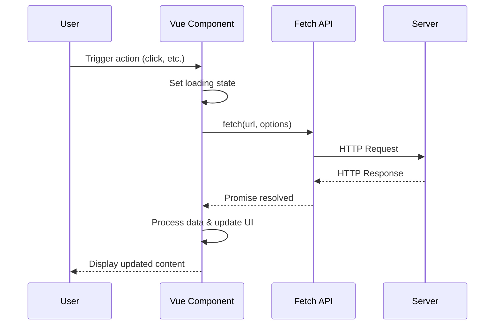

# Vue.js Fetch API

## Introduction

When building modern web applications with Vue.js, communicating with servers and APIs is essential. The Fetch API provides a powerful and flexible way to make HTTP requests directly from your Vue applications. Unlike older techniques like XMLHttpRequest, Fetch uses Promises, making it easier to write asynchronous code that's both readable and maintainable.

In this tutorial, we'll explore how to integrate the Fetch API with Vue.js, manage HTTP requests, handle responses, and implement error handling. By the end, you'll be able to confidently use Fetch API in your Vue projects to communicate with backend services.

## What is the Fetch API?

The Fetch API is a modern browser API for making HTTP requests. It provides a more powerful and flexible feature set than XMLHttpRequest, and returns Promises that make handling asynchronous operations more straightforward.

Key benefits of using Fetch API in Vue.js applications:

- Modern Promise-based approach
- Cleaner syntax for request/response handling
- Built-in JSON parsing capabilities
- Streamlined error handling
- No external dependencies required

## Basic Fetch Request in Vue.js

Let's start with a simple example of using Fetch in a Vue component:

```html
<template>
  <div>
    <h1>Users List</h1>
    <div v-if="loading">Loading...</div>
    <ul v-else>
      <li v-for="user in users" :key="user.id">
        {{ user.name }}
      </li>
    </ul>
  </div>
</template>

<script>
export default {
  data() {
    return {
      users: [],
      loading: true
    }
  },
  mounted() {
    this.fetchUsers();
  },
  methods: {
    fetchUsers() {
      fetch('https://jsonplaceholder.typicode.com/users')
        .then(response => response.json())
        .then(data => {
          this.users = data;
          this.loading = false;
        })
        .catch(error => {
          console.error('Error fetching users:', error);
          this.loading = false;
        });
    }
  }
}
</script>
```

In this example:

1. We define a Vue component with `users` array and `loading` state
2. When the component is mounted, we call the `fetchUsers` method
3. The `fetchUsers` method uses `fetch()` to request data from an API endpoint
4. We convert the response to JSON with `response.json()`
5. We update our component's state with the retrieved data
6. We handle any errors that might occur during the request

## Handling Different HTTP Methods

The Fetch API isn't limited to GET requests. Let's see how to implement different HTTP methods:

### POST Request

```javascript
postNewUser() {
  fetch('https://jsonplaceholder.typicode.com/users', {
    method: 'POST',
    headers: {
      'Content-Type': 'application/json'
    },
    body: JSON.stringify({
      name: 'John Doe',
      email: 'john@example.com'
    })
  })
  .then(response => response.json())
  .then(data => {
    console.log('Success:', data);
    this.users.push(data);
  })
  .catch(error => {
    console.error('Error posting new user:', error);
  });
}
```

### PUT Request

```javascript
updateUser(userId, userData) {
  fetch(`https://jsonplaceholder.typicode.com/users/${userId}`, {
    method: 'PUT',
    headers: {
      'Content-Type': 'application/json'
    },
    body: JSON.stringify(userData)
  })
  .then(response => response.json())
  .then(data => {
    console.log('User updated:', data);
    // Update user in the local array
    const index = this.users.findIndex(user => user.id === userId);
    if (index !== -1) {
      this.users[index] = data;
    }
  })
  .catch(error => {
    console.error('Error updating user:', error);
  });
}
```

### DELETE Request

```javascript
deleteUser(userId) {
  fetch(`https://jsonplaceholder.typicode.com/users/${userId}`, {
    method: 'DELETE'
  })
  .then(response => {
    if (response.ok) {
      // Remove user from the local array
      this.users = this.users.filter(user => user.id !== userId);
      console.log('User deleted successfully');
    } else {
      throw new Error('Failed to delete user');
    }
  })
  .catch(error => {
    console.error('Error deleting user:', error);
  });
}
```

## Error Handling with Fetch API

Proper error handling is crucial when working with HTTP requests. The Fetch API has specific behavior regarding errors that's important to understand:

- The `fetch()` promise only rejects when a network error occurs
- HTTP error status codes (like 404 or 500) don't cause the promise to reject
- You need to check `response.ok` to detect HTTP error status codes

Here's a more robust error handling approach:

```javascript
fetchData() {
  this.loading = true;
  this.error = null;
  
  fetch('https://api.example.com/data')
    .then(response => {
      if (!response.ok) {
        throw new Error(`HTTP error! Status: ${response.status}`);
      }
      return response.json();
    })
    .then(data => {
      this.data = data;
      this.loading = false;
    })
    .catch(error => {
      this.error = error.message;
      this.loading = false;
      console.error('Error fetching data:', error);
    });
}
```

## Using Async/Await with Fetch

For even cleaner code, you can use the `async/await` syntax with Fetch API:

```html
<template>
  <div>
    <h2>Products</h2>
    <div v-if="loading">Loading products...</div>
    <div v-else-if="error">{{ error }}</div>
    <ul v-else>
      <li v-for="product in products" :key="product.id">
        {{ product.name }} - ${{ product.price }}
      </li>
    </ul>
    <button @click="loadProducts">Load Products</button>
  </div>
</template>

<script>
export default {
  data() {
    return {
      products: [],
      loading: false,
      error: null
    }
  },
  methods: {
    async loadProducts() {
      this.loading = true;
      this.error = null;
      
      try {
        const response = await fetch('https://api.example.com/products');
        if (!response.ok) {
          throw new Error(`HTTP error! Status: ${response.status}`);
        }
        
        const data = await response.json();
        this.products = data;
      } catch (error) {
        this.error = `Failed to load products: ${error.message}`;
        console.error('Error loading products:', error);
      } finally {
        this.loading = false;
      }
    }
  }
}
</script>
```

The `async/await` approach makes asynchronous code read more like synchronous code, improving readability.

## Creating a Reusable Fetch Service

As your Vue application grows, it's a good practice to centralize your API calls in a service. This promotes code reuse and makes it easier to maintain your HTTP requests:

```javascript
// src/services/api.js
export default {
  async fetchData(url, options = {}) {
    try {
      const response = await fetch(url, options);
      
      if (!response.ok) {
        throw new Error(`HTTP error! Status: ${response.status}`);
      }
      
      return await response.json();
    } catch (error) {
      console.error('API call error:', error);
      throw error;
    }
  },
  
  get(url) {
    return this.fetchData(url);
  },
  
  post(url, data) {
    return this.fetchData(url, {
      method: 'POST',
      headers: {
        'Content-Type': 'application/json'
      },
      body: JSON.stringify(data)
    });
  },
  
  put(url, data) {
    return this.fetchData(url, {
      method: 'PUT',
      headers: {
        'Content-Type': 'application/json'
      },
      body: JSON.stringify(data)
    });
  },
  
  delete(url) {
    return this.fetchData(url, {
      method: 'DELETE'
    });
  }
};
```

Then in your Vue component:

```html
<script>
import api from '@/services/api';

export default {
  data() {
    return {
      users: [],
      loading: false,
      error: null
    }
  },
  methods: {
    async fetchUsers() {
      this.loading = true;
      
      try {
        this.users = await api.get('https://jsonplaceholder.typicode.com/users');
      } catch (error) {
        this.error = error.message;
      } finally {
        this.loading = false;
      }
    },
    
    async addUser(userData) {
      try {
        const newUser = await api.post('https://jsonplaceholder.typicode.com/users', userData);
        this.users.push(newUser);
      } catch (error) {
        this.error = error.message;
      }
    }
  },
  mounted() {
    this.fetchUsers();
  }
}
</script>
```

## Handling Authentication and Headers

Many APIs require authentication tokens in the request headers. Here's how to include headers in your Fetch requests:

```javascript
async fetchSecureData() {
  const token = localStorage.getItem('auth_token');
  
  try {
    const response = await fetch('https://api.example.com/secure-data', {
      headers: {
        'Authorization': `Bearer ${token}`,
        'Content-Type': 'application/json'
      }
    });
    
    if (!response.ok) {
      if (response.status === 401) {
        // Handle unauthorized access
        this.$router.push('/login');
        return;
      }
      throw new Error(`HTTP error! Status: ${response.status}`);
    }
    
    const data = await response.json();
    return data;
  } catch (error) {
    console.error('Error fetching secure data:', error);
    throw error;
  }
}
```

## Real-World Example: Todo List App

Let's put everything together in a practical example - a Todo list application:

```html
<template>
  <div class="todo-app">
    <h1>Todo List</h1>
    
    <div v-if="loading" class="loading">Loading todos...</div>
    <div v-if="error" class="error">{{ error }}</div>
    
    <div class="add-todo">
      <input 
        v-model="newTodo" 
        @keyup.enter="addTodo"
        placeholder="Add new todo..." 
      />
      <button @click="addTodo">Add</button>
    </div>
    
    <ul class="todo-list">
      <li v-for="todo in todos" :key="todo.id" :class="{ completed: todo.completed }">
        <input 
          type="checkbox" 
          :checked="todo.completed"
          @change="toggleTodo(todo)"
        />
        <span>{{ todo.title }}</span>
        <button @click="deleteTodo(todo.id)">Delete</button>
      </li>
    </ul>
  </div>
</template>

<script>
export default {
  data() {
    return {
      todos: [],
      newTodo: '',
      loading: false,
      error: null
    }
  },
  mounted() {
    this.fetchTodos();
  },
  methods: {
    async fetchTodos() {
      this.loading = true;
      this.error = null;
      
      try {
        const response = await fetch('https://jsonplaceholder.typicode.com/todos?_limit=10');
        if (!response.ok) {
          throw new Error(`HTTP error! Status: ${response.status}`);
        }
        
        this.todos = await response.json();
      } catch (error) {
        this.error = `Failed to load todos: ${error.message}`;
      } finally {
        this.loading = false;
      }
    },
    
    async addTodo() {
      if (!this.newTodo.trim()) return;
      
      try {
        const response = await fetch('https://jsonplaceholder.typicode.com/todos', {
          method: 'POST',
          headers: {
            'Content-Type': 'application/json'
          },
          body: JSON.stringify({
            title: this.newTodo,
            completed: false,
            userId: 1
          })
        });
        
        if (!response.ok) {
          throw new Error(`HTTP error! Status: ${response.status}`);
        }
        
        const newTodo = await response.json();
        
        // For JSONPlaceholder, we'll add the locally created todo to our list
        // In a real API, the server would assign the ID
        this.todos.unshift(newTodo);
        this.newTodo = '';
      } catch (error) {
        this.error = `Failed to add todo: ${error.message}`;
      }
    },
    
    async toggleTodo(todo) {
      try {
        const response = await fetch(`https://jsonplaceholder.typicode.com/todos/${todo.id}`, {
          method: 'PUT',
          headers: {
            'Content-Type': 'application/json'
          },
          body: JSON.stringify({
            ...todo,
            completed: !todo.completed
          })
        });
        
        if (!response.ok) {
          throw new Error(`HTTP error! Status: ${response.status}`);
        }
        
        // Update local state
        todo.completed = !todo.completed;
      } catch (error) {
        this.error = `Failed to update todo: ${error.message}`;
      }
    },
    
    async deleteTodo(id) {
      try {
        const response = await fetch(`https://jsonplaceholder.typicode.com/todos/${id}`, {
          method: 'DELETE'
        });
        
        if (!response.ok) {
          throw new Error(`HTTP error! Status: ${response.status}`);
        }
        
        // Remove from local list
        this.todos = this.todos.filter(todo => todo.id !== id);
      } catch (error) {
        this.error = `Failed to delete todo: ${error.message}`;
      }
    }
  }
}
</script>

<style scoped>
.todo-app {
  max-width: 500px;
  margin: 0 auto;
}

.loading, .error {
  padding: 10px;
  margin: 10px 0;
}

.error {
  color: red;
  border: 1px solid red;
}

.add-todo {
  display: flex;
  margin-bottom: 20px;
}

.add-todo input {
  flex: 1;
  padding: 8px;
}

.todo-list {
  list-style-type: none;
  padding: 0;
}

.todo-list li {
  display: flex;
  align-items: center;
  padding: 10px;
  margin: 5px 0;
  background-color: #f5f5f5;
}

.completed span {
  text-decoration: line-through;
  color: #888;
}

button {
  margin-left: 10px;
  padding: 5px 10px;
  cursor: pointer;
}
</style>
```

## Handling File Uploads with Fetch

The Fetch API can also handle file uploads. Here's an example of uploading an image in a Vue component:

```html
<template>
  <div class="upload-component">
    <h2>Upload Image</h2>
    
    <input type="file" @change="handleFileChange" accept="image/*" />
    <button :disabled="!selectedFile || uploading" @click="uploadFile">
      {{ uploading ? 'Uploading...' : 'Upload' }}
    </button>
    
    <div v-if="uploadError" class="error">{{ uploadError }}</div>
    <div v-if="uploadSuccess" class="success">File uploaded successfully!</div>
  </div>
</template>

<script>
export default {
  data() {
    return {
      selectedFile: null,
      uploading: false,
      uploadError: null,
      uploadSuccess: false
    };
  },
  methods: {
    handleFileChange(event) {
      this.selectedFile = event.target.files[0];
      this.uploadError = null;
      this.uploadSuccess = false;
    },
    
    async uploadFile() {
      if (!this.selectedFile) return;
      
      this.uploading = true;
      this.uploadError = null;
      this.uploadSuccess = false;
      
      const formData = new FormData();
      formData.append('image', this.selectedFile);
      
      try {
        const response = await fetch('https://api.example.com/upload', {
          method: 'POST',
          body: formData,
          // Note: Don't set Content-Type header when using FormData
          // The browser will set it automatically with the correct boundary
        });
        
        if (!response.ok) {
          throw new Error(`HTTP error! Status: ${response.status}`);
        }
        
        const result = await response.json();
        console.log('Upload successful:', result);
        this.uploadSuccess = true;
        this.selectedFile = null;
        
        // Reset file input
        event.target.value = '';
      } catch (error) {
        this.uploadError = `Upload failed: ${error.message}`;
        console.error('Error uploading file:', error);
      } finally {
        this.uploading = false;
      }
    }
  }
};
</script>

<style scoped>
.error {
  color: red;
  margin-top: 10px;
}

.success {
  color: green;
  margin-top: 10px;
}
</style>
```

## Flow of HTTP Requests with Fetch API

Here's a diagram showing the flow of HTTP requests using Fetch API in a Vue.js application:



## Summary

In this tutorial, we've covered:

- The basics of using the Fetch API in Vue.js applications
- Making different types of HTTP requests (GET, POST, PUT, DELETE)
- Handling responses and errors properly
- Creating a reusable API service
- Implementing authentication with headers
- Building a practical Todo application
- Uploading files with FormData
- Understanding the flow of HTTP communication

The Fetch API provides a modern and powerful way to handle HTTP requests in your Vue.js applications. By following the patterns and practices outlined in this tutorial, you'll be well-equipped to build robust, data-driven applications that communicate effectively with backend services.

## Additional Resources

To deepen your understanding of the Fetch API and HTTP communication in Vue.js:

- [MDN Web Docs: Fetch API](https://developer.mozilla.org/en-US/docs/Web/API/Fetch_API)
- [Vue.js Documentation](https://vuejs.org/guide/best-practices/production-deployment.html)
- [JSONPlaceholder](https://jsonplaceholder.typicode.com/) - A free fake API for testing
- [HTTP Status Codes](https://developer.mozilla.org/en-US/docs/Web/HTTP/Status)

## Practice Exercises

1. Create a Vue component that fetches and displays a list of blog posts from an API
2. Add functionality to create, update, and delete blog posts
3. Implement error handling and loading states
4. Add form validation before submitting data
5. Create a reusable API service with interceptors that handle authentication and refresh tokens
6. Build a paginated data table component that fetches data from an API

By completing these exercises, you'll gain practical experience applying the Fetch API in real-world Vue.js applications.