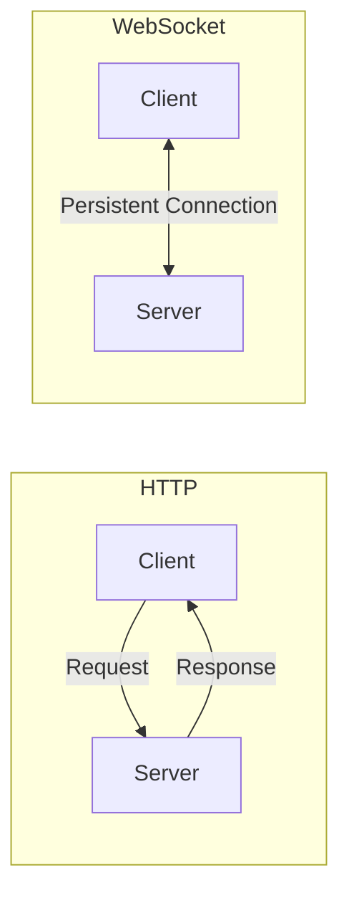

# Vue.js WebSockets

## Introduction

WebSockets provide a persistent connection between a client and server, allowing for real-time, bidirectional communication. Unlike traditional HTTP requests that follow a request-response pattern, WebSockets maintain an open connection that enables servers to push data to clients without being explicitly requested.

In this tutorial, we'll explore how to implement WebSockets in Vue.js applications to create dynamic, real-time experiences such as:

- Live chat applications
- Real-time dashboards
- Collaborative editing tools
- Live notifications
- Gaming applications

## Understanding WebSockets vs. HTTP

Before diving into implementation, let's understand the key differences between traditional HTTP communication and WebSockets:



**HTTP Communication:**
- Stateless: Each request-response cycle is independent
- Connection opens and closes for each request
- Client always initiates communication
- Higher overhead for frequent updates

**WebSocket Communication:**
- Persistent connection stays open
- Low latency real-time updates
- Bidirectional: Server can send data without client request
- More efficient for frequent small messages

## Setting Up WebSockets in Vue.js

There are several ways to implement WebSockets in Vue.js:

1. Native WebSocket API
2. Socket.io (full-featured library)
3. Libraries like vue-socket.io or vue-native-websocket

Let's explore each approach:

### 1. Using the Native WebSocket API

The browser's native WebSocket API provides a straightforward way to implement WebSockets.

#### Basic Implementation

```js
// In your Vue component or Vuex store
export default {
  data() {
    return {
      socket: null,
      messages: []
    };
  },
  methods: {
    initializeWebSocket() {
      // Create WebSocket connection
      this.socket = new WebSocket('ws://your-websocket-server-url');
      
      // Connection opened
      this.socket.addEventListener('open', (event) => {
        console.log('WebSocket connection established');
        this.sendMessage('Hello Server!');
      });
      
      // Listen for messages
      this.socket.addEventListener('message', (event) => {
        console.log('Message from server:', event.data);
        this.messages.push(JSON.parse(event.data));
      });
      
      // Handle errors
      this.socket.addEventListener('error', (event) => {
        console.error('WebSocket error:', event);
      });
      
      // Connection closed
      this.socket.addEventListener('close', (event) => {
        console.log('WebSocket connection closed');
        // Potentially reconnect after delay
      });
    },
    sendMessage(message) {
      // Check if connection is established
      if (this.socket && this.socket.readyState === WebSocket.OPEN) {
        this.socket.send(JSON.stringify({ message }));
      } else {
        console.warn('WebSocket is not connected');
      }
    }
  },
  mounted() {
    this.initializeWebSocket();
  },
  beforeUnmount() {
    // Clean up WebSocket connection
    if (this.socket) {
      this.socket.close();
    }
  }
};
```

### 2. Using Socket.io with Vue.js

Socket.io provides additional features like automatic reconnection, rooms, and broadcasting.

First, install the required packages:

```bash
npm install socket.io-client
```

Then implement it in your Vue component:

```js
import { io } from 'socket.io-client';

export default {
  data() {
    return {
      socket: null,
      messages: []
    };
  },
  methods: {
    initializeSocketIO() {
      this.socket = io('http://your-socketio-server-url');
      
      this.socket.on('connect', () => {
        console.log('Socket.IO connection established');
      });
      
      this.socket.on('chat-message', (data) => {
        console.log('Received message:', data);
        this.messages.push(data);
      });
      
      this.socket.on('disconnect', () => {
        console.log('Socket.IO disconnected');
      });
      
      this.socket.on('reconnect', (attemptNumber) => {
        console.log('Socket.IO reconnected after ' + attemptNumber + ' attempts');
      });
    },
    sendMessage(message) {
      this.socket.emit('send-message', { text: message, user: this.username });
    }
  },
  mounted() {
    this.initializeSocketIO();
  },
  beforeUnmount() {
    if (this.socket) {
      this.socket.disconnect();
    }
  }
};
```

### 3. Using vue-socket.io Library

For a more Vue-integrated approach, you can use the `vue-socket.io` library.

```bash
npm install vue-socket.io
```

In your main.js file:

```js
import { createApp } from 'vue';
import App from './App.vue';
import VueSocketIO from 'vue-socket.io';
import SocketIO from 'socket.io-client';

const socketConnection = SocketIO('http://your-socketio-server-url');

const app = createApp(App);

app.use(new VueSocketIO({
  debug: true,
  connection: socketConnection,
  vuex: {
    actionPrefix: 'SOCKET_',
    mutationPrefix: 'SOCKET_'
  }
}));

app.mount('#app');
```

Then in your component:

```js
export default {
  data() {
    return {
      message: '',
      messages: []
    };
  },
  methods: {
    sendMessage() {
      this.$socket.emit('send-message', {
        text: this.message,
        username: this.username
      });
      this.message = '';
    }
  },
  // Socket.IO event listeners as component properties
  sockets: {
    connect() {
      console.log('Socket connected');
    },
    'chat-message'(data) {
      this.messages.push(data);
    }
  }
};
```

## Real-world Example: Building a Live Chat Application

Let's build a simple chat application using WebSockets and Vue.js:

### Chat Component

```html
<template>
  <div class="chat-container">
    <div class="messages-container">
      <div v-for="(msg, index) in messages" 
           :key="index" 
           :class="['message', msg.user === username ? 'own-message' : 'other-message']">
        <strong>{{ msg.user }}:</strong> {{ msg.text }}
      </div>
    </div>
    
    <div class="input-container">
      <input 
        v-model="newMessage" 
        @keyup.enter="sendMessage" 
        placeholder="Type a message..." 
      />
      <button @click="sendMessage">Send</button>
    </div>
    
    <div class="status-indicator">
      <span :class="['indicator', isConnected ? 'connected' : 'disconnected']"></span>
      {{ connectionStatus }}
    </div>
  </div>
</template>

<script>
import { io } from 'socket.io-client';

export default {
  name: 'ChatComponent',
  data() {
    return {
      socket: null,
      username: 'User_' + Math.floor(Math.random() * 1000),
      newMessage: '',
      messages: [],
      isConnected: false,
      connectionStatus: 'Connecting...'
    };
  },
  mounted() {
    this.connectToSocket();
  },
  methods: {
    connectToSocket() {
      // Connect to our socket server
      this.socket = io('http://localhost:3000');
      
      this.socket.on('connect', () => {
        this.isConnected = true;
        this.connectionStatus = 'Connected';
        
        // Join the chat room
        this.socket.emit('join', { username: this.username });
      });
      
      this.socket.on('chat-message', (message) => {
        this.messages.push(message);
        // Auto-scroll to the latest message
        this.$nextTick(() => {
          const container = this.$el.querySelector('.messages-container');
          container.scrollTop = container.scrollHeight;
        });
      });
      
      this.socket.on('user-joined', (data) => {
        this.messages.push({
          user: 'System',
          text: `${data.username} has joined the chat.`
        });
      });
      
      this.socket.on('disconnect', () => {
        this.isConnected = false;
        this.connectionStatus = 'Disconnected. Trying to reconnect...';
      });
    },
    sendMessage() {
      if (!this.newMessage.trim() || !this.isConnected) return;
      
      const message = {
        user: this.username,
        text: this.newMessage.trim()
      };
      
      this.socket.emit('send-message', message);
      this.newMessage = '';
    }
  },
  beforeUnmount() {
    if (this.socket) {
      this.socket.disconnect();
    }
  }
};
</script>

<style scoped>
.chat-container {
  display: flex;
  flex-direction: column;
  height: 500px;
  border: 1px solid #ccc;
  border-radius: 8px;
}

.messages-container {
  flex: 1;
  overflow-y: auto;
  padding: 15px;
  display: flex;
  flex-direction: column;
}

.message {
  margin-bottom: 10px;
  padding: 8px 12px;
  border-radius: 18px;
  max-width: 80%;
  word-break: break-word;
}

.own-message {
  align-self: flex-end;
  background-color: #dcf8c6;
}

.other-message {
  align-self: flex-start;
  background-color: #f2f2f2;
}

.input-container {
  display: flex;
  padding: 10px;
  border-top: 1px solid #eee;
}

input {
  flex: 1;
  padding: 10px;
  border: 1px solid #ddd;
  border-radius: 20px;
  margin-right: 10px;
}

button {
  padding: 10px 20px;
  background-color: #4caf50;
  color: white;
  border: none;
  border-radius: 20px;
  cursor: pointer;
}

.status-indicator {
  padding: 5px 10px;
  font-size: 12px;
  display: flex;
  align-items: center;
  background-color: #f8f8f8;
}

.indicator {
  height: 10px;
  width: 10px;
  border-radius: 50%;
  display: inline-block;
  margin-right: 5px;
}

.connected {
  background-color: #4caf50;
}

.disconnected {
  background-color: #f44336;
}
</style>
```

### Server-side Implementation (Node.js with Socket.IO)

For completeness, here's a simple server implementation using Node.js and Socket.IO:

```js
const express = require('express');
const http = require('http');
const { Server } = require('socket.io');

const app = express();
const server = http.createServer(app);
const io = new Server(server, {
  cors: {
    origin: "*", // In production, specify your Vue app's domain
    methods: ["GET", "POST"]
  }
});

io.on('connection', (socket) => {
  console.log('A user connected:', socket.id);
  
  socket.on('join', (data) => {
    console.log(`${data.username} joined the chat`);
    socket.username = data.username;
    io.emit('user-joined', { username: data.username });
  });
  
  socket.on('send-message', (message) => {
    console.log(`Message from ${message.user}: ${message.text}`);
    io.emit('chat-message', message);
  });
  
  socket.on('disconnect', () => {
    console.log('User disconnected:', socket.id);
    if (socket.username) {
      io.emit('chat-message', {
        user: 'System',
        text: `${socket.username} has left the chat.`
      });
    }
  });
});

const PORT = process.env.PORT || 3000;
server.listen(PORT, () => {
  console.log(`Server is running on port ${PORT}`);
});
```

## Best Practices for WebSockets in Vue.js

1. **Connection Management**:
   - Handle reconnection logic
   - Provide feedback to users about connection status
   - Properly close connections when components are unmounted

2. **Error Handling**:
   - Implement robust error handling for both connection and messaging issues
   - Provide fallback mechanisms when WebSockets aren't available

3. **State Management**:
   - Consider using Vuex for managing WebSocket state across components
   - Create dedicated Vuex modules for WebSocket functionality

4. **Security Considerations**:
   - Implement authentication for WebSocket connections
   - Validate all incoming messages on the server
   - Use secure WebSocket connections (wss://) in production

5. **Performance**:
   - Be mindful of payload sizes
   - Throttle high-frequency events
   - Consider using binary formats for large data transfers

## Implementing WebSockets with Vuex

For larger applications, it's often better to manage WebSocket connections and state through Vuex:

```js
// store/modules/socket.js
import { io } from 'socket.io-client';

const state = {
  socket: null,
  isConnected: false,
  messages: []
};

const mutations = {
  SOCKET_CONNECT(state, socket) {
    state.socket = socket;
    state.isConnected = true;
  },
  SOCKET_DISCONNECT(state) {
    state.isConnected = false;
  },
  NEW_MESSAGE(state, message) {
    state.messages.push(message);
  }
};

const actions = {
  connect({ commit, dispatch }) {
    const socket = io('http://localhost:3000');
    
    socket.on('connect', () => {
      commit('SOCKET_CONNECT', socket);
    });
    
    socket.on('disconnect', () => {
      commit('SOCKET_DISCONNECT');
    });
    
    socket.on('chat-message', (message) => {
      commit('NEW_MESSAGE', message);
    });
    
    // Store socket instance in state
    commit('SOCKET_CONNECT', socket);
  },
  
  sendMessage({ state }, message) {
    if (state.socket && state.isConnected) {
      state.socket.emit('send-message', message);
    }
  },
  
  disconnect({ state }) {
    if (state.socket) {
      state.socket.disconnect();
    }
  }
};

const getters = {
  isConnected: state => state.isConnected,
  messages: state => state.messages
};

export default {
  namespaced: true,
  state,
  mutations,
  actions,
  getters
};
```

Then use it in a component:

```html
<template>
  <div>
    <div v-for="(message, index) in messages" :key="index">
      <strong>{{ message.user }}:</strong> {{ message.text }}
    </div>
    
    <div>
      <input v-model="newMessage" @keyup.enter="send" />
      <button @click="send" :disabled="!isConnected">Send</button>
    </div>
    
    <div>Connection Status: {{ isConnected ? 'Connected' : 'Disconnected' }}</div>
  </div>
</template>

<script>
import { mapActions, mapGetters } from 'vuex';

export default {
  data() {
    return {
      newMessage: '',
      username: 'User_' + Math.floor(Math.random() * 1000)
    };
  },
  computed: {
    ...mapGetters('socket', ['isConnected', 'messages'])
  },
  methods: {
    ...mapActions('socket', ['connect', 'sendMessage', 'disconnect']),
    send() {
      if (!this.newMessage.trim() || !this.isConnected) return;
      
      this.sendMessage({
        user: this.username,
        text: this.newMessage
      });
      
      this.newMessage = '';
    }
  },
  mounted() {
    this.connect();
  },
  beforeUnmount() {
    this.disconnect();
  }
};
</script>
```

## Advanced Topics

### Heartbeat Mechanism

Implementing a heartbeat keeps the connection alive and detects disconnections:

```js
// Inside your WebSocket initialization
startHeartbeat() {
  this.heartbeatInterval = setInterval(() => {
    if (this.socket.readyState === WebSocket.OPEN) {
      this.socket.send(JSON.stringify({ type: 'ping' }));
    }
  }, 30000); // Send a ping every 30 seconds
},

stopHeartbeat() {
  clearInterval(this.heartbeatInterval);
}
```

### Handling Binary Data

WebSockets can transmit binary data like images or audio:

```js
// Sending binary data
sendBinaryData(arrayBuffer) {
  if (this.socket.readyState === WebSocket.OPEN) {
    this.socket.send(arrayBuffer);
  }
},

// Receiving binary data
this.socket.binaryType = 'arraybuffer';
this.socket.addEventListener('message', (event) => {
  if (event.data instanceof ArrayBuffer) {
    // Handle binary data
    const view = new DataView(event.data);
    // Process binary data...
  } else {
    // Handle text data
    const message = JSON.parse(event.data);
    // Process JSON message...
  }
});
```

### Scaling WebSockets

For large applications, consider:

1. **Horizontal scaling**: Use Redis or other pub/sub mechanisms to share WebSocket events across multiple server instances
2. **Connection limiting**: Implement rate limiting for connections and messages
3. **Message queuing**: Handle high throughput with message queues

## Summary

WebSockets provide a powerful way to implement real-time features in Vue.js applications:

- They offer bidirectional communication with low latency
- Native WebSocket API provides basic functionality
- Socket.io adds features like automatic reconnection and rooms
- Integration with Vuex helps manage WebSocket state in larger applications
- Proper connection management and error handling are essential

By mastering WebSockets in Vue.js, you can create interactive, real-time applications that provide dynamic user experiences.

## Additional Resources and Exercises

### Resources
- [MDN WebSocket API Documentation](https://developer.mozilla.org/en-US/docs/Web/API/WebSockets_API)
- [Socket.io Documentation](https://socket.io/docs/v4/)
- [Vue 3 Composition API with WebSockets](https://v3.vuejs.org/guide/composition-api-introduction.html)

### Exercises

1. **Basic Chat Application**
   - Implement the chat example from this tutorial
   - Add features like typing indicators and read receipts

2. **Real-time Dashboard**
   - Create a dashboard that displays real-time data updates
   - Include charts that update in real-time

3. **Collaborative Drawing App**
   - Build a simple canvas where multiple users can draw together
   - Synchronize drawing actions via WebSockets

4. **WebSocket Reconnection Logic**
   - Implement exponential backoff for reconnection attempts
   - Add user feedback about connection status

5. **Integration with REST**
   - Create an application that uses REST for initial data loading
   - Switch to WebSockets for real-time updates

By completing these exercises, you'll gain practical experience in implementing WebSockets in Vue.js applications and be ready to add real-time capabilities to your projects.