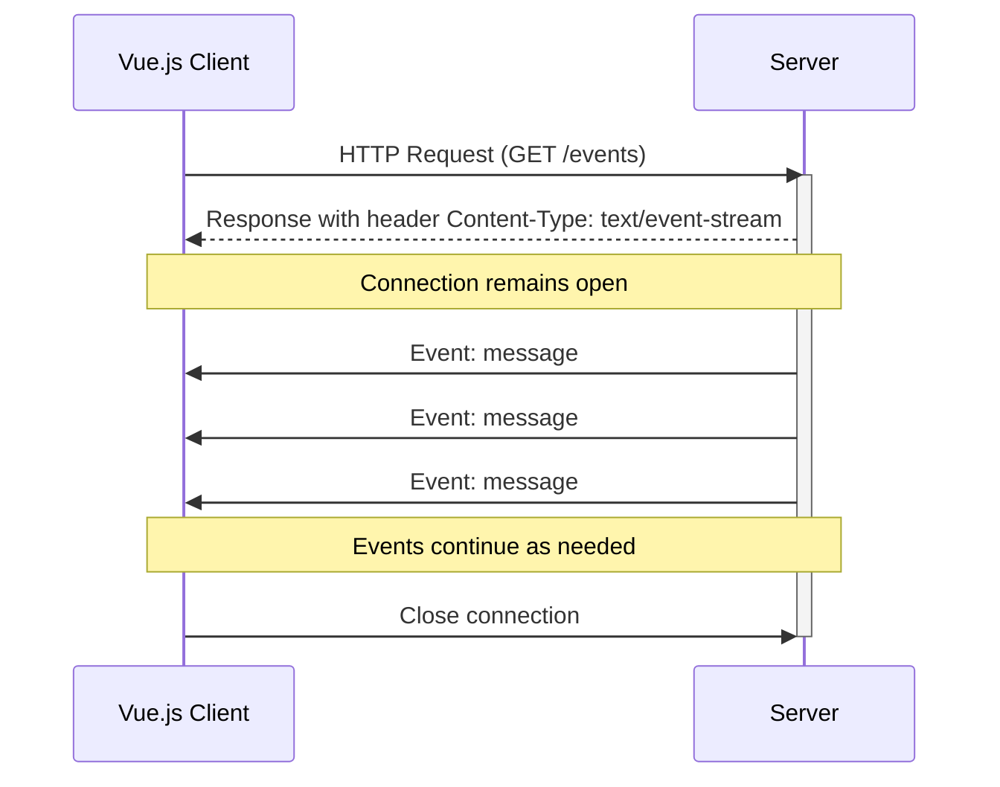

# Vue.js Server-Sent Events

## Introduction

Server-Sent Events (SSE) is a technology that enables servers to push real-time updates to clients over HTTP connections. Unlike WebSockets, which provide two-way communication, SSE offers a simpler, unidirectional approach where the server can send data to the client without the client explicitly requesting it.

In Vue.js applications, SSE can be particularly useful for scenarios like:

- Live notifications
- Real-time dashboards
- Activity feeds
- Stock market updates
- Live sports scores
- Chat applications (for incoming messages)

This guide will walk you through implementing Server-Sent Events in Vue.js applications, from basic concepts to practical examples.

## How Server-Sent Events Work

Server-Sent Events establish a persistent connection between the client and server, allowing the server to push data whenever it has new information available. This connection remains open until explicitly closed by either party.



## Setting Up SSE in a Vue.js Application

### Basic Implementation

Let's create a simple Vue.js component that establishes an SSE connection:

```html
<template>
  <div>
    <h2>Server-Sent Events Example</h2>
    <div v-if="loading">Connecting to server...</div>
    <div v-else>
      <div>Connection status: {{ connectionStatus }}</div>
      <div>
        <h3>Messages:</h3>
        <ul>
          <li v-for="(message, index) in messages" :key="index">
            {{ message }}
          </li>
        </ul>
      </div>
    </div>
  </div>
</template>

<script>
export default {
  name: 'ServerSentEventsDemo',
  data() {
    return {
      loading: true,
      connectionStatus: 'Disconnected',
      eventSource: null,
      messages: []
    }
  },
  mounted() {
    this.connectToSSE();
  },
  methods: {
    connectToSSE() {
      // Create a new EventSource object that connects to our SSE endpoint
      this.eventSource = new EventSource('https://api.example.com/events');
      
      // Event fired when connection is established
      this.eventSource.onopen = () => {
        this.loading = false;
        this.connectionStatus = 'Connected';
      };
      
      // Event fired when a message is received
      this.eventSource.onmessage = event => {
        const data = JSON.parse(event.data);
        this.messages.push(data.message);
      };
      
      // Event fired when an error occurs
      this.eventSource.onerror = () => {
        this.connectionStatus = 'Error - Disconnected';
        this.eventSource.close();
      };
    }
  },
  beforeUnmount() {
    // Close the connection when component is destroyed
    if (this.eventSource) {
      this.eventSource.close();
    }
  }
}
</script>
```

In this example:
1. We create an `EventSource` object when the component mounts
2. Set up event handlers for connection, messages, and errors
3. Store received messages in our data
4. Properly clean up the connection when the component is unmounted

### Server Implementation (Example in Node.js/Express)

For reference, here's how a simple SSE server implementation might look using Express:

```javascript
const express = require('express');
const app = express();

app.get('/events', (req, res) => {
  // Set headers for SSE
  res.setHeader('Content-Type', 'text/event-stream');
  res.setHeader('Cache-Control', 'no-cache');
  res.setHeader('Connection', 'keep-alive');
  
  // Send a message every 2 seconds
  const intervalId = setInterval(() => {
    const data = {
      message: `Server update at ${new Date().toLocaleTimeString()}`
    };
    res.write(`data: ${JSON.stringify(data)}\n\n`);
  }, 2000);
  
  // Clean up on client disconnect
  req.on('close', () => {
    clearInterval(intervalId);
  });
});

app.listen(3000, () => {
  console.log('SSE server running on port 3000');
});
```

## Advanced SSE Features

### Named Events

SSE allows you to send different types of events from the server, which you can listen for specifically in your Vue application:

```html
<template>
  <div>
    <h2>Advanced SSE Example</h2>
    <div>
      <h3>Notifications:</h3>
      <ul>
        <li v-for="(notification, index) in notifications" :key="index">
          {{ notification }}
        </li>
      </ul>
    </div>
    <div>
      <h3>Updates:</h3>
      <ul>
        <li v-for="(update, index) in updates" :key="index">
          {{ update }}
        </li>
      </ul>
    </div>
  </div>
</template>

<script>
export default {
  data() {
    return {
      eventSource: null,
      notifications: [],
      updates: []
    }
  },
  mounted() {
    this.connectToSSE();
  },
  methods: {
    connectToSSE() {
      this.eventSource = new EventSource('https://api.example.com/events');
      
      // Listen for specific event types
      this.eventSource.addEventListener('notification', event => {
        const data = JSON.parse(event.data);
        this.notifications.push(data.message);
      });
      
      this.eventSource.addEventListener('update', event => {
        const data = JSON.parse(event.data);
        this.updates.push(data.message);
      });
    }
  },
  beforeUnmount() {
    if (this.eventSource) {
      this.eventSource.close();
    }
  }
}
</script>
```

The server would send named events like this:

```javascript
// For a notification event
res.write(`event: notification\n`);
res.write(`data: ${JSON.stringify({message: "New notification!"})}\n\n`);

// For an update event
res.write(`event: update\n`);
res.write(`data: ${JSON.stringify({message: "System updated!"})}\n\n`);
```

### Reconnection

SSE clients automatically attempt to reconnect if the connection is lost. You can control the reconnection time with the `retry` field:

```javascript
// On the server
res.write(`retry: 10000\n`); // Reconnect after 10 seconds
res.write(`data: ${JSON.stringify(data)}\n\n`);
```

### Custom ID for Event Tracking

Using IDs allows clients to resume where they left off if the connection is interrupted:

```javascript
// On the server
let eventId = 1;
setInterval(() => {
  res.write(`id: ${eventId}\n`);
  res.write(`data: ${JSON.stringify({message: "Update " + eventId})}\n\n`);
  eventId++;
}, 1000);
```

The client will automatically send the last event ID when reconnecting, allowing the server to send only missed events.

## Practical Example: Real-time Dashboard

Let's build a simple dashboard that displays real-time data using SSE:

```html
<template>
  <div class="dashboard">
    <h1>Real-time System Dashboard</h1>
    <div class="status-indicator" :class="{ online: isConnected, offline: !isConnected }">
      {{ isConnected ? 'LIVE' : 'DISCONNECTED' }}
    </div>
    
    <div class="dashboard-grid">
      <div class="metric-card">
        <h3>CPU Usage</h3>
        <div class="metric-value">{{ cpuUsage }}%</div>
        <div class="metric-chart">
          <div class="chart-bar" :style="{ width: cpuUsage + '%' }"></div>
        </div>
      </div>
      
      <div class="metric-card">
        <h3>Memory Usage</h3>
        <div class="metric-value">{{ memoryUsage }}%</div>
        <div class="metric-chart">
          <div class="chart-bar" :style="{ width: memoryUsage + '%' }"></div>
        </div>
      </div>
      
      <div class="metric-card">
        <h3>Active Users</h3>
        <div class="metric-value">{{ activeUsers }}</div>
      </div>
      
      <div class="metric-card">
        <h3>Recent Alerts</h3>
        <ul class="alert-list">
          <li v-for="(alert, index) in recentAlerts" :key="index" :class="alert.type">
            {{ alert.message }}
          </li>
        </ul>
      </div>
    </div>
  </div>
</template>

<script>
export default {
  data() {
    return {
      isConnected: false,
      cpuUsage: 0,
      memoryUsage: 0,
      activeUsers: 0,
      recentAlerts: [],
      eventSource: null
    }
  },
  mounted() {
    this.initializeSSE();
  },
  methods: {
    initializeSSE() {
      this.eventSource = new EventSource('https://api.example.com/dashboard/events');
      
      this.eventSource.onopen = () => {
        this.isConnected = true;
      };
      
      this.eventSource.addEventListener('system-metrics', event => {
        const data = JSON.parse(event.data);
        this.cpuUsage = data.cpu;
        this.memoryUsage = data.memory;
      });
      
      this.eventSource.addEventListener('user-metrics', event => {
        const data = JSON.parse(event.data);
        this.activeUsers = data.activeUsers;
      });
      
      this.eventSource.addEventListener('alert', event => {
        const data = JSON.parse(event.data);
        this.recentAlerts.unshift(data);
        
        // Keep only the 5 most recent alerts
        if (this.recentAlerts.length > 5) {
          this.recentAlerts.pop();
        }
      });
      
      this.eventSource.onerror = () => {
        this.isConnected = false;
      };
    }
  },
  beforeUnmount() {
    if (this.eventSource) {
      this.eventSource.close();
    }
  }
}
</script>

<style scoped>
.dashboard {
  padding: 20px;
}

.status-indicator {
  padding: 5px 10px;
  border-radius: 4px;
  display: inline-block;
  font-weight: bold;
  margin-bottom: 20px;
}

.online {
  background-color: #4caf50;
  color: white;
}

.offline {
  background-color: #f44336;
  color: white;
}

.dashboard-grid {
  display: grid;
  grid-template-columns: repeat(auto-fill, minmax(300px, 1fr));
  gap: 20px;
}

.metric-card {
  border: 1px solid #ddd;
  border-radius: 8px;
  padding: 15px;
  background-color: #f9f9f9;
}

.metric-value {
  font-size: 32px;
  font-weight: bold;
  margin: 10px 0;
}

.metric-chart {
  height: 20px;
  background-color: #eee;
  border-radius: 4px;
  overflow: hidden;
}

.chart-bar {
  height: 100%;
  background-color: #2196f3;
  transition: width 0.5s ease;
}

.alert-list {
  list-style-type: none;
  padding: 0;
}

.alert-list li {
  padding: 8px;
  margin-bottom: 5px;
  border-radius: 4px;
}

.error {
  background-color: #ffebee;
}

.warning {
  background-color: #fff8e1;
}

.info {
  background-color: #e3f2fd;
}
</style>
```

## Integrating SSE with Vuex Store

For larger applications, you might want to centralize your SSE handling in a Vuex store:

```javascript
// store/modules/sse.js
export default {
  state: {
    connected: false,
    messages: [],
    eventSource: null
  },
  
  mutations: {
    SET_CONNECTION_STATUS(state, status) {
      state.connected = status;
    },
    ADD_MESSAGE(state, message) {
      state.messages.push(message);
    },
    SET_EVENT_SOURCE(state, eventSource) {
      state.eventSource = eventSource;
    },
    CLEAR_MESSAGES(state) {
      state.messages = [];
    }
  },
  
  actions: {
    initSSEConnection({ commit, dispatch }) {
      const eventSource = new EventSource('https://api.example.com/events');
      
      eventSource.onopen = () => {
        commit('SET_CONNECTION_STATUS', true);
      };
      
      eventSource.onmessage = event => {
        const data = JSON.parse(event.data);
        commit('ADD_MESSAGE', data);
      };
      
      eventSource.onerror = () => {
        commit('SET_CONNECTION_STATUS', false);
      };
      
      commit('SET_EVENT_SOURCE', eventSource);
    },
    
    closeSSEConnection({ commit, state }) {
      if (state.eventSource) {
        state.eventSource.close();
        commit('SET_EVENT_SOURCE', null);
        commit('SET_CONNECTION_STATUS', false);
        commit('CLEAR_MESSAGES');
      }
    }
  },
  
  getters: {
    isConnected: state => state.connected,
    allMessages: state => state.messages
  }
};
```

Using the Vuex store in a component:

```html
<template>
  <div>
    <h2>SSE with Vuex</h2>
    <div>Status: {{ connectionStatus }}</div>
    <button @click="startConnection">Connect</button>
    <button @click="stopConnection">Disconnect</button>
    
    <h3>Messages:</h3>
    <ul>
      <li v-for="(message, index) in messages" :key="index">
        {{ message.text }}
      </li>
    </ul>
  </div>
</template>

<script>
import { mapActions, mapGetters } from 'vuex';

export default {
  computed: {
    ...mapGetters({
      isConnected: 'sse/isConnected',
      messages: 'sse/allMessages'
    }),
    connectionStatus() {
      return this.isConnected ? 'Connected' : 'Disconnected';
    }
  },
  methods: {
    ...mapActions({
      initConnection: 'sse/initSSEConnection',
      closeConnection: 'sse/closeSSEConnection'
    }),
    startConnection() {
      this.initConnection();
    },
    stopConnection() {
      this.closeConnection();
    }
  },
  beforeUnmount() {
    this.closeConnection();
  }
}
</script>
```

## Considerations and Best Practices

### Browser Compatibility

SSE is supported in all major modern browsers. For older browsers, you might need a polyfill or fallback mechanism.

### Error Handling

Always implement robust error handling for your SSE connections:

```javascript
this.eventSource.onerror = (error) => {
  console.error('SSE connection error:', error);
  this.connectionStatus = 'Error - Reconnecting...';
  
  // Implement custom reconnection logic if needed
  if (this.eventSource.readyState === EventSource.CLOSED) {
    setTimeout(() => this.connectToSSE(), 5000);
  }
};
```

### Connection Limits

Browsers typically limit the number of concurrent SSE connections (usually 6 per domain). Consider this when designing your application architecture.

### Performance

While SSE connections are lightweight, they're still persistent connections. For very large-scale applications, you might want to:

- Only establish connections when needed
- Close connections when not actively viewing real-time data
- Consider using shared connections for multiple components when appropriate

## Summary

Server-Sent Events provide a straightforward way to implement real-time data streaming in Vue.js applications. They're well-suited for scenarios where you need one-way communication from the server to the client.

Key points to remember:

1. SSE provides a unidirectional connection from server to client
2. Native browser support makes implementation simple
3. Automatic reconnection handling is built-in
4. Named events allow for organized message handling
5. They work over regular HTTP, simplifying server setup

When deciding between SSE and alternatives like WebSockets, consider your application's specific needs. SSE is ideal for simple real-time updates, while WebSockets might be better for complex bi-directional communication.

## Additional Resources

- [MDN Web Docs on Server-Sent Events](https://developer.mozilla.org/en-US/docs/Web/API/Server-sent_events)
- [HTML Living Standard specification for SSE](https://html.spec.whatwg.org/multipage/server-sent-events.html)

## Exercises

1. Create a simple SSE server using Node.js and Express, then build a Vue component that displays real-time updates from this server.

2. Implement a notification system in a Vue application that uses SSE to show real-time alerts from the server.

3. Build a real-time chat application where messages from other users come through SSE, but sending messages uses standard HTTP requests.

4. Create a stock market dashboard that displays live price updates using SSE, with appropriate error handling and reconnection logic.

5. Extend the Vuex integration example to handle multiple types of events, dispatching different actions based on the event type.