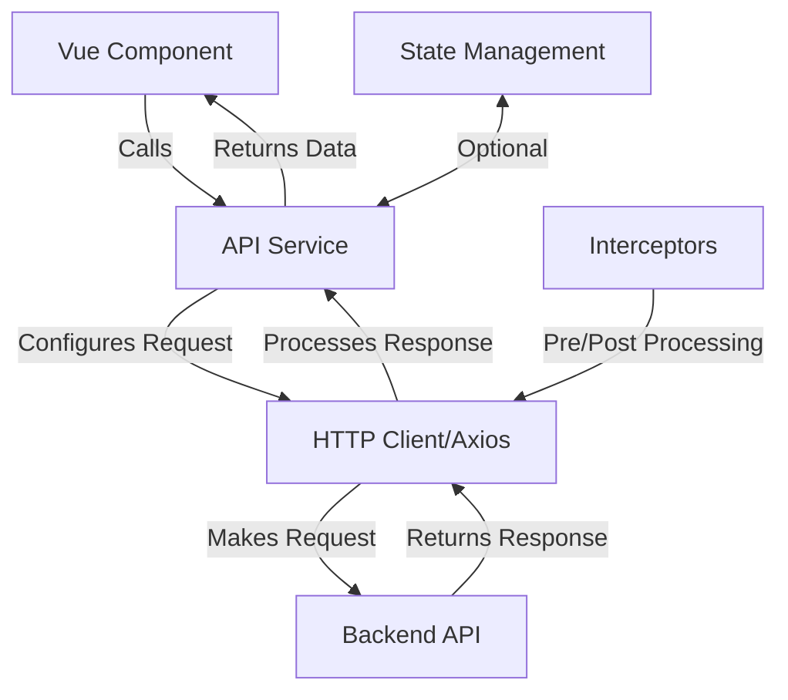

# Vue.js API Services

In modern web applications, communicating with back-end services through APIs is a fundamental requirement. While making direct HTTP requests from your Vue components is possible, creating dedicated API services offers a more organized, maintainable, and reusable approach to handling API communication.

## Introduction to API Services

API services in Vue.js are specialized modules that encapsulate all the logic related to communicating with specific backend endpoints. They abstract the HTTP implementation details away from your components, making your codebase cleaner and easier to maintain.

Key benefits of using API services include:

- **Separation of concerns**: Components focus on UI, services focus on data fetching
- **Code reusability**: API calls can be reused across multiple components
- **Centralized configuration**: Base URLs, headers, and authentication can be managed in one place
- **Easier testing**: Services can be mocked during component tests
- **Simpler maintenance**: API changes only need to be updated in one location

## Setting Up an API Service Structure

Let's create a practical API service structure for a Vue.js application. We'll use Axios as our HTTP client, but the same principles apply with fetch or other libraries.

### 1. Installing Axios

First, install Axios in your Vue project:

```bash
npm install axios
```

### 2. Creating a Base API Service

Start by creating an API client with common configuration that will be shared across all service instances:

```javascript
// src/services/api.js
import axios from 'axios';

// Create a base API instance
const apiClient = axios.create({
  baseURL: 'https://api.example.com',
  timeout: 10000,
  headers: {
    'Content-Type': 'application/json',
    'Accept': 'application/json'
  }
});

// Add request interceptor for authentication
apiClient.interceptors.request.use(config => {
  // Get token from local storage or Vuex store
  const token = localStorage.getItem('token');
  
  if (token) {
    config.headers.Authorization = `Bearer ${token}`;
  }
  
  return config;
});

// Add response interceptor for error handling
apiClient.interceptors.response.use(
  response => response,
  error => {
    // Handle common errors
    if (error.response && error.response.status === 401) {
      // Redirect to login or refresh token
      console.log('Unauthorized, redirecting to login');
      // router.push('/login');
    }
    return Promise.reject(error);
  }
);

export default apiClient;
```

### 3. Creating Specific API Services

Now, let's create service modules for specific API resources. For example, a users API service:

```javascript
// src/services/UserService.js
import apiClient from './api';

const resource = '/users';

export default {
  // Get all users
  getAll() {
    return apiClient.get(resource);
  },
  
  // Get a single user by ID
  get(id) {
    return apiClient.get(`${resource}/${id}`);
  },
  
  // Create a new user
  create(data) {
    return apiClient.post(resource, data);
  },
  
  // Update a user
  update(id, data) {
    return apiClient.put(`${resource}/${id}`, data);
  },
  
  // Delete a user
  delete(id) {
    return apiClient.delete(`${resource}/${id}`);
  }
};
```

Similar services can be created for other resources like products, orders, etc.

## Using API Services in Components

Now that we have our API services set up, let's look at how to use them in Vue components:

### Using API Services with Options API

```html
<template>
  <div>
    <h1>User List</h1>
    <div v-if="loading">Loading users...</div>
    <div v-else-if="error">Error: {{ error }}</div>
    <ul v-else>
      <li v-for="user in users" :key="user.id">
        {{ user.name }} ({{ user.email }})
        <button @click="deleteUser(user.id)">Delete</button>
      </li>
    </ul>
    <button @click="refreshUsers">Refresh</button>
  </div>
</template>

<script>
import UserService from '@/services/UserService';

export default {
  data() {
    return {
      users: [],
      loading: true,
      error: null
    };
  },
  
  created() {
    this.fetchUsers();
  },
  
  methods: {
    async fetchUsers() {
      this.loading = true;
      this.error = null;
      
      try {
        const response = await UserService.getAll();
        this.users = response.data;
      } catch (error) {
        this.error = error.message || 'Failed to fetch users';
        console.error('Error fetching users:', error);
      } finally {
        this.loading = false;
      }
    },
    
    async deleteUser(id) {
      try {
        await UserService.delete(id);
        // Remove user from the list
        this.users = this.users.filter(user => user.id !== id);
      } catch (error) {
        console.error('Error deleting user:', error);
        alert('Failed to delete user');
      }
    },
    
    refreshUsers() {
      this.fetchUsers();
    }
  }
};
</script>
```

### Using API Services with Composition API

```html
<template>
  <div>
    <h1>User List</h1>
    <div v-if="loading">Loading users...</div>
    <div v-else-if="error">Error: {{ error }}</div>
    <ul v-else>
      <li v-for="user in users" :key="user.id">
        {{ user.name }} ({{ user.email }})
        <button @click="deleteUser(user.id)">Delete</button>
      </li>
    </ul>
    <button @click="fetchUsers">Refresh</button>
  </div>
</template>

<script setup>
import { ref, onMounted } from 'vue';
import UserService from '@/services/UserService';

const users = ref([]);
const loading = ref(true);
const error = ref(null);

const fetchUsers = async () => {
  loading.value = true;
  error.value = null;
  
  try {
    const response = await UserService.getAll();
    users.value = response.data;
  } catch (err) {
    error.value = err.message || 'Failed to fetch users';
    console.error('Error fetching users:', err);
  } finally {
    loading.value = false;
  }
};

const deleteUser = async (id) => {
  try {
    await UserService.delete(id);
    users.value = users.value.filter(user => user.id !== id);
  } catch (err) {
    console.error('Error deleting user:', err);
    alert('Failed to delete user');
  }
};

onMounted(fetchUsers);
</script>
```

## Advanced API Service Patterns

Let's explore some more advanced patterns for API services:

### 1. Using TypeScript with API Services

If you're using TypeScript with Vue, you can add type safety to your API services:

```typescript
// src/types/User.ts
export interface User {
  id: number;
  name: string;
  email: string;
  role: string;
}

// src/services/UserService.ts
import apiClient from './api';
import { User } from '@/types/User';

const resource = '/users';

export default {
  getAll() {
    return apiClient.get<User[]>(resource);
  },
  
  get(id: number) {
    return apiClient.get<User>(`${resource}/${id}`);
  },
  
  create(data: Omit<User, 'id'>) {
    return apiClient.post<User>(resource, data);
  },
  
  update(id: number, data: Partial<User>) {
    return apiClient.put<User>(`${resource}/${id}`, data);
  },
  
  delete(id: number) {
    return apiClient.delete(`${resource}/${id}`);
  }
};
```

### 2. Creating a Service Factory

For larger applications with many similar services, you might want to create a service factory:

```javascript
// src/services/createApiService.js
import apiClient from './api';

export default function createApiService(resource) {
  return {
    getAll() {
      return apiClient.get(`/${resource}`);
    },
    
    get(id) {
      return apiClient.get(`/${resource}/${id}`);
    },
    
    create(data) {
      return apiClient.post(`/${resource}`, data);
    },
    
    update(id, data) {
      return apiClient.put(`/${resource}/${id}`, data);
    },
    
    delete(id) {
      return apiClient.delete(`/${resource}/${id}`);
    }
  };
}
```

Now you can quickly create consistent services:

```javascript
// src/services/UserService.js
import createApiService from './createApiService';

const UserService = createApiService('users');

// Add custom methods
UserService.getUserPosts = function(userId) {
  return apiClient.get(`/users/${userId}/posts`);
};

export default UserService;
```

### 3. Handling Caching and State Management

For more advanced applications, you might want to integrate your API services with state management like Pinia or Vuex:

```javascript
// src/stores/users.js
import { defineStore } from 'pinia';
import UserService from '@/services/UserService';

export const useUsersStore = defineStore('users', {
  state: () => ({
    users: [],
    loading: false,
    error: null,
    cachedAt: null
  }),
  
  getters: {
    getById: (state) => (id) => {
      return state.users.find(user => user.id === id);
    },
    cacheExpired: (state) => {
      if (!state.cachedAt) return true;
      // Cache expires after 5 minutes
      return Date.now() - state.cachedAt > 5 * 60 * 1000;
    }
  },
  
  actions: {
    async fetchUsers(force = false) {
      // Return cached data if available and not expired
      if (!force && this.users.length > 0 && !this.cacheExpired) {
        return this.users;
      }
      
      this.loading = true;
      this.error = null;
      
      try {
        const response = await UserService.getAll();
        this.users = response.data;
        this.cachedAt = Date.now();
        return this.users;
      } catch (error) {
        this.error = error.message;
        throw error;
      } finally {
        this.loading = false;
      }
    },
    
    async addUser(userData) {
      try {
        const response = await UserService.create(userData);
        this.users.push(response.data);
        return response.data;
      } catch (error) {
        this.error = error.message;
        throw error;
      }
    }
    // Other actions...
  }
});
```

## Error Handling Strategies

Proper error handling is crucial for a good user experience. Here are some strategies:

### Global Error Handler

```javascript
// src/services/api.js (additional code for global error handling)
import { useNotificationStore } from '@/stores/notification';

apiClient.interceptors.response.use(
  response => response,
  error => {
    const notificationStore = useNotificationStore();
    
    // Get error details
    const statusCode = error.response ? error.response.status : null;
    const message = error.response?.data?.message || error.message;
    
    // Handle different error types
    switch (statusCode) {
      case 400:
        notificationStore.showError('Bad request: ' + message);
        break;
      case 401:
        notificationStore.showError('Authentication error');
        // Handle unauthorized
        break;
      case 403:
        notificationStore.showError('You don\'t have permission to access this resource');
        break;
      case 404:
        notificationStore.showError('Resource not found');
        break;
      case 500:
        notificationStore.showError('Server error. Please try again later.');
        break;
      default:
        if (!window.navigator.onLine) {
          notificationStore.showError('Network connection lost');
        } else {
          notificationStore.showError('An unexpected error occurred');
        }
    }
    
    return Promise.reject(error);
  }
);
```

### Component-Level Error Handling

In components, use try/catch blocks with async/await as shown in previous examples, or handle errors in promise chains:

```javascript
UserService.get(userId)
  .then(response => {
    this.user = response.data;
  })
  .catch(error => {
    if (error.response?.status === 404) {
      this.notFound = true;
    } else {
      this.error = 'Failed to load user data';
    }
  })
  .finally(() => {
    this.loading = false;
  });
```

## API Service Testing

Testing API services is important to ensure they work correctly. Here's an example using Jest:

```javascript
// src/services/__tests__/UserService.spec.js
import UserService from '@/services/UserService';
import apiClient from '@/services/api';

// Mock the apiClient
jest.mock('@/services/api');

describe('UserService', () => {
  afterEach(() => {
    jest.clearAllMocks();
  });
  
  test('getAll should fetch all users', async () => {
    const mockUsers = [{ id: 1, name: 'Alice' }, { id: 2, name: 'Bob' }];
    apiClient.get.mockResolvedValue({ data: mockUsers });
    
    const result = await UserService.getAll();
    
    expect(apiClient.get).toHaveBeenCalledWith('/users');
    expect(result.data).toEqual(mockUsers);
  });
  
  test('get should fetch a single user', async () => {
    const mockUser = { id: 1, name: 'Alice' };
    apiClient.get.mockResolvedValue({ data: mockUser });
    
    const result = await UserService.get(1);
    
    expect(apiClient.get).toHaveBeenCalledWith('/users/1');
    expect(result.data).toEqual(mockUser);
  });
  
  test('create should post user data', async () => {
    const newUser = { name: 'Charlie' };
    const createdUser = { id: 3, name: 'Charlie' };
    apiClient.post.mockResolvedValue({ data: createdUser });
    
    const result = await UserService.create(newUser);
    
    expect(apiClient.post).toHaveBeenCalledWith('/users', newUser);
    expect(result.data).toEqual(createdUser);
  });
});
```

## API Services Workflow Diagram

Here's a high-level overview of how API services integrate into a Vue application:



## Summary

Creating dedicated API services in Vue.js applications provides a clean, maintainable approach to handling HTTP communication. Key takeaways include:

1. API services separate data fetching logic from UI components
2. A base API client with Axios provides shared configuration
3. Individual service modules make resource-specific API calls
4. Error handling can be centralized in interceptors
5. Services can be integrated with state management
6. Testing becomes easier with separated API logic

By implementing API services, you'll create more maintainable, testable code that's easier to reason about and extend over time.

## Additional Resources

For further learning about API services in Vue:

- Explore the [Axios documentation](https://axios-http.com/docs/intro)
- Learn about [Vue's reactivity system](https://vuejs.org/guide/extras/reactivity-in-depth.html)
- Practice building CRUD services with various backend APIs
- Study state management patterns with [Pinia](https://pinia.vuejs.org/) or [Vuex](https://vuex.vuejs.org/)

## Exercises

1. Create a complete CRUD service for a "products" resource
2. Add request caching to an API service to prevent redundant network requests
3. Implement a retry mechanism for failed API calls
4. Create a service that handles file uploads with progress tracking
5. Build a service that works with a paginated API, handling parameters for pagination, sorting, and filtering